# 产品简介 

## 什么是WISE-PaaS/Config Mgmt. 
WISE-PaaS/Config Mgmt.
（WISE-PaaS/Configuration Management）是基于Golang语言开发的高可用配置中心,它使您能够集中管理应用程序配置，并在分布式环境中实现实时配置推送。

WISE-PaaS/Config Mgmt.在分布式系统中充当配置中心。提供了配置修改、配置推送、历史版本管理、灰色发布等一系列功能。  

通过这些特性，WISE-PaaS/Config Mgmt.可以帮助您集中管理每个应用程序中的配置，降低分布式系统中的配置管理成本，并降低由不正确的配置更改导致的可用性问题甚至失败的风险。使用WISE-PaaS/Config Mgmt.，您可以极大地减少配置管理的工作量，并增强微服务、DevOps和大数据场景中的服务能力。

## 产品优势

使用WISE-PaaS/Config Mgmt.可以对配置进行添加、删除、编辑、查看、灰度发布等管理操作，还可以查看配置推送历史版本信息，进行版本回滚。

主要功能：

1.	配置的发布、删除、查询操作；
2.	配置变更实时响应，秒级配置自动推送；
3.	配置历史版本管理；
4.	配置版本回滚；
5.	基于服务后端实例的配置灰度发布；
7.	配置标签，方便控制配置版本；
8.	配置的导入导出，方便用户在不同环境间同步配置；
9.	配置描述，方便使用者理解配置用途；
9.	提供配置监听查询，支持以配置的维度查询监听此配置的多个后端实例和以后端实例的维度查询监听的配置列表两种维度查询；
10.	提供json, yaml, toml等文件格式，支持语法校验，提升在线编辑效率，减少编辑错误；
11.	服务注册和发现，管理服务的端口服务和后端实例；
12.	服务健康检查，服务后端实例掉线提醒。

稳定性和安全性：
1. 多级缓存设计，保证客户端容灾能力，服务中断不影响业务；
2. 控制面高可用，可部署多个控制面副本，保证配置一致性推送；
3. 提供用户权限管理，保证数据独立，不会被其他用户随意修改。

## 产品架构

WISE-PaaS/Config Mgmt.包括四个主要部分：客户端、控制面，数据面和ECM agent.

WISE-PaaS/Config Mgmt.架构图
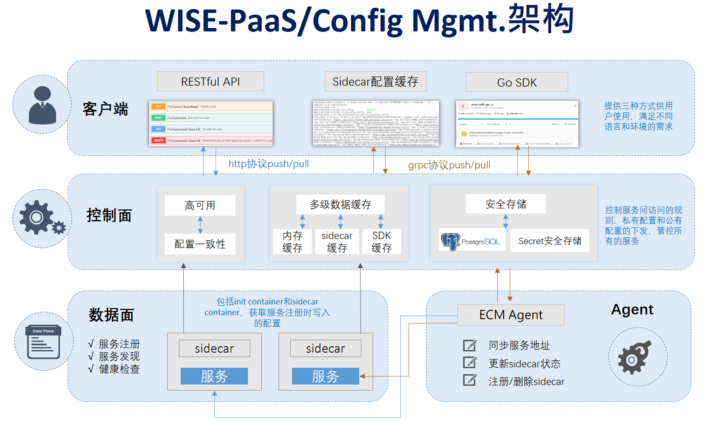

- 控制面提供应用配置管理功能，保证高可用情况下配置的一致性，保存配置到数据库中并将最新的配置下发到sdk中等功能。应用配置是一个多级缓存的设计，包括控制面内存缓存，数据面配置文件缓存，sdk缓存文件等多级缓存设计。
- 数据面包括服务container，sidecar的init container和sidecar container, sidecar container有四个功能：服务注册，服务发现，服务的健康检查和从控制面拿配置到sidecar配置缓存文件中。
- ECM Agent的主要功能为自动注入、删除sidecar。ECM Agent识别到K8s工作负载的注解中有ensaas.k8s.io/accesstoken的话，ECM Agent给工作负载注入sidecar，将WISE-PaaS/Config Mgmt.中的init container和sidecar container注入服务的工作负载中；当k8s工作负载删除注解ensaas.k8s.io/access token的时候，ECM Agent会自动删除工作负载中的sidecar注入信息。ECM Agent还有其他两个功能：实时监听服务地址的变化，并将服务地址更新到控制面中；实时监测工作负载的sidecar注入状态，将sidecar注入状态同步更新到控制面中。
- 客户端提供应用服务使用，比如读取配置，修改配置，监听配置等。

客户端有三种方式可以操作：RESTful API, sidecar配置缓存和Go SDK三种方式。

WISE-PaaS/Config Mgmt.采用sidecar的好处为sidecar控制面的地址信息，控制面与数据面通信验证部分都在sidecar中做了处理，服务可以不用再去做与控制面的权限认证部分。如果服务不需要动态监听配置热更新的话，可以直接采用sidecar配置缓存文件方式，使用起来非常简便。

## 背景分析

在微服务架构中存在众多的平台环境和应用，应用之间存在复杂的依赖关系。在应用系统部署过程中，往往会有一些变量配置，这些配置都有一些共有的特性，那就是和业务的服务逻辑无关，只和当前的环境和特定场景有关。比如：在开发、测试和生产的环境中，我们使用了不同的数据库；在服务治理中，在开发环境使用直连模式，直连开关为true，在生产环境使用路由模式，直连开关为false；不同的分组和实例中，使用的其他依赖服务注册地址和端口也不同；运营业务配置参数需要紧急修改参数并实时线上生效等。

对于以上应用场景，在开发中给我们带来了诸多痛点：

1. 一般是静态化配置，修改配置工序繁琐，需要重新上线部署或者重启应用；
2. 配置过于分散，修改配置需要登录到各个应用服务器去修改，配置管理混乱；
3. 配置修改无法追溯，因为采用的静态配置文件方式，所以当配置进行修改之后，不容易形成记录，更无法追溯是谁修改的、修改时间是什么、修改前是什么内容。既然无法追溯，那么当配置出错时，更没办法回滚配；
4. 安全不可控，配置存放在环境变量或者配置文件中，敏感信息易泄露；
5. 管理成本上升，手动维护不同的环境，配置容易出错，管理成本上升。

为了解决以上问题，实现一次打包多地部署需求，减少项目管理及安全风险，我们需要将可变变量外移并通过页面统一可视化管理，基于此我们统一建设了WISE-PaaS/Config Mgmt.配置中心。

## 应用场景

WISE-PaaS/Config Mgmt.产品已经被大量应用于EnSaaS内部服务的配置管理。WISE-PaaS/Config Mgmt. 不仅适用于微服务分布式架构下的应用配置管理、服务治理，在业务场景动态推送和大数据等场景下也可灵活运营。

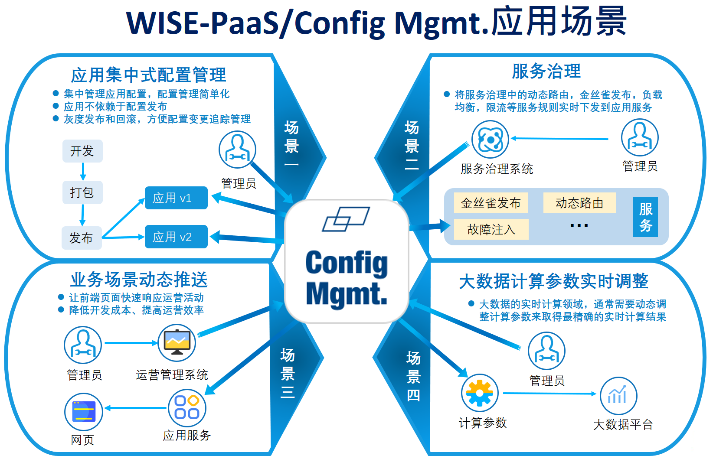

## 名词解释

WISE-PaaS/Config Mgmt.中的基本概念介绍如下：
1. **应用组（Application Group）**  
   应用组为一组应用或者服务的集合，一组应用组内可以创建多个配置，并且该应用组内的服务可以共享组内的一个或多个配置。

2. **配置（Config）**  
   服务配置，服务中需要外部传入的参数可以记录在配置中，由配置传入服务中。

3. **服务（Service）**  
   任何一个微服务都可以作为一个服务注册到WISE-PaaS/Config Mgmt.中，同样地K8s中的工作负载比如Deployment，Daemonset或者Statefulset都可以注册为一个服务。

4. **服务名称（Service Name）**  
   使用WISE-PaaS/Config Mgmt.需要提前注册服务， 服务名称做为注册服务的标识，整个WISE-PaaS/Config Mgmt.中不能有重名的服务名称。

5. **端口服务（Port Service）**  
   K8s中的每个服务中对应的端口，每个端口代表了一个端口服务。

6. **后端实例（后端实例）**   
   服务对应的后端实例，可以是K8s中的pod，也可以是一个vm。

7. **控制面（EnSaaS Control Plane，简称EnSaaS CP）**  
   控制服务间访问的规则，私有配置和公有配置的下发，管控所有的服务。

8. **数据面（EnSaaS Data Plane，简称EnSaaS DP)**  
   数据面包括init container, sidecar container和服务的container。Init container的作用是将服务注册到控制面；sidecar container的作用是服务实例健康检查和获取服务注册时写入的配置；服务container中是服务提供者，即服务本身。

9. **公共服务地址（Public Serivce Address）**  
   EnSaaS平台的微服务地址信息，包括External Address, Internal Address, svc Address, port和Target Port, 服务地址信息为EnSaaS 服务注册时候选择暴露服务地址，WISE-PaaS/Config Mgmt.会将服务地址信息更新到公共的服务地址部分，这也是WISE-PaaS/Config Mgmt.服务发现的部分功能。  

10. **公有配置（Public Config）**   
      WISE-PaaS/Config Mgmt.的公有配置，由EnSaaS Global Admin和DataCenter Admin，或者WISE-PaaS/Config Mgmt. Admin去管理更新配置，拥有WISE-PaaS/Config Mgmt.权限的用户都可查看Public配置。  

11.  **私有配置（Private Config）**  
      私有配置属于某一个应用组，该应用组内的服务都可以访问应用组内的私有配置。私有配置为一组配置项的集合，类似于一个配置文件的概念。每个服务在注册时候可以选择应用组内的一个或多个私有配置，也可以设定访问私有配置的可写权限（默认只有可读的权限）。

12. **Sidecar**  
    Sidecar模式是一种将应用功能从应用本身剥离出来作为单独进程的方式。该模式允许我们向应用无侵入添加多种功能，避免了为满足第三方组件需求而向应用添加额外的配置代码。WISE-PaaS/Config Mgmt.中sidecar的主要用途为服务注册，服务健康检查和将服务注册时候选择的配置拉取到sidecar配置缓存文件中。比如有些服务不需要支持配置热更新，获取服务配置可以不用整合SDK或者调用HTTP API，只需读取配置缓存文件即可。

## 配置更新原理 ##

WISE-PaaS/Config Mgmt.配置更新过程：

1. 服务后端实例使用SDK，隔段时间主动拉取和控制面自动推送两种方式获取最新配置，主动拉取方式是为了保证自动推送方式失效之后还可以获取最新配置；

2. 用户在配置中心对配置进行修改并发布；

3. 配置中心更新EnSaaS控制面缓存和存储中的配置，通过SDK更新本地文件中缓存配置并通知到后端实例。

   **Note**： sidecar文件缓存只在sidecar启动时候拉取一次配置，不会实时更新最新的配置。

   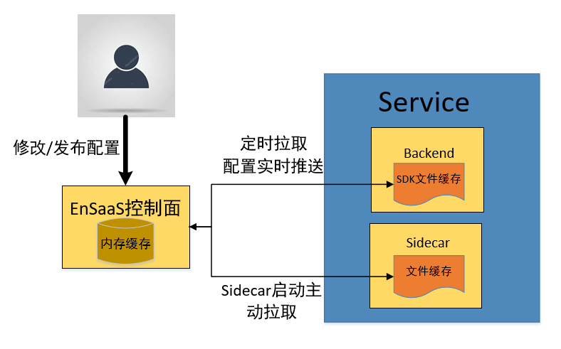

# 快速入门 #  

## 使用前准备

1. 申请SSO账户

   WISE-PaaS/Config Mgmt.的用户管理依赖于SSO的用户管理，首先得先申请一个SSO账户。

2. 购买一个dedicated cluster

   WISE-PaaS/Config Mgmt.需要给K8s中的工作负载注入sidecar，所以首先需要用SSO账户购买一个dedicated cluster。

## 配置使用流程

**1. 登录**

请输入平台的SSO帐户，然后单击"登录"按钮登录。为了能成功登录，确保您有当前WISE-PaaS/Config Mgmt.应用组权限访问权限。

初次登录可以使用WISE-PaaS/Config Mgmt.的默认账密登录，默认账密拥有WISE-PaaS/Config Mgmt.的admin权限。

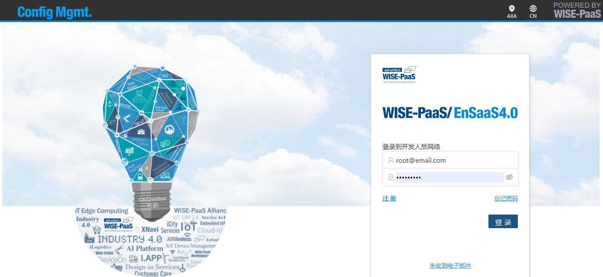

**2. 创建应用组**

用WISE-PaaS/Config Mgmt.的默认账密权限创建一个应用组，共享某些配置或者功能类似的应用合集为一个应用组。

应用组的创建方式如下：
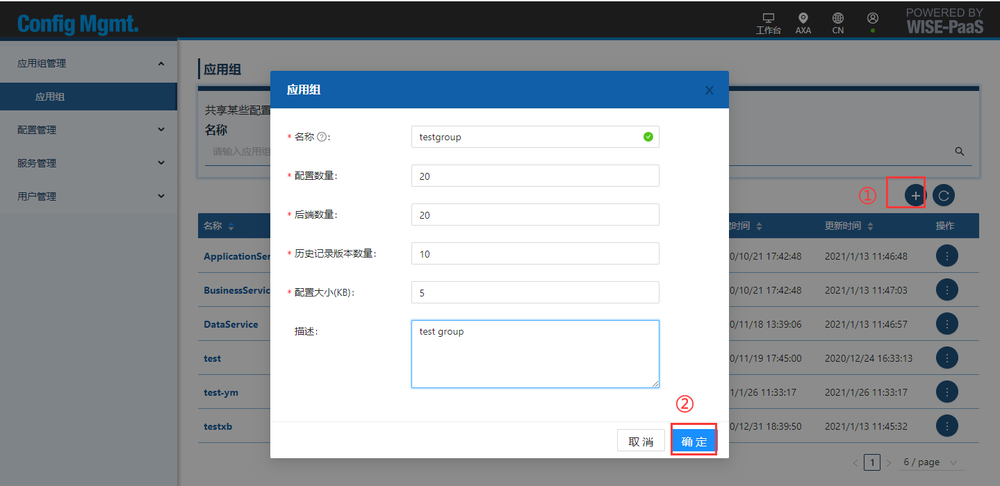 

**3.  分配应用组权限**

用户权限页面的添加按钮，邀请拥有dedicated cluster集群权限（包括cluster, workspace, namespace权限）的SSO账户加入其应用组权限。

编辑按钮可以修改列表中用户的权限。  
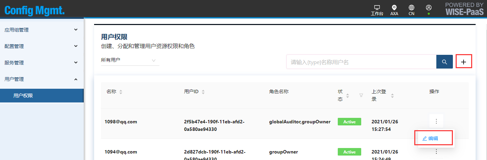   

**4. 创建私有配置**

创建应用组内的私有配置，应用组可创建多个私有配置。

选择好需要配置所在的应用组，再点击添加按钮，可以执行添加配置的操作。
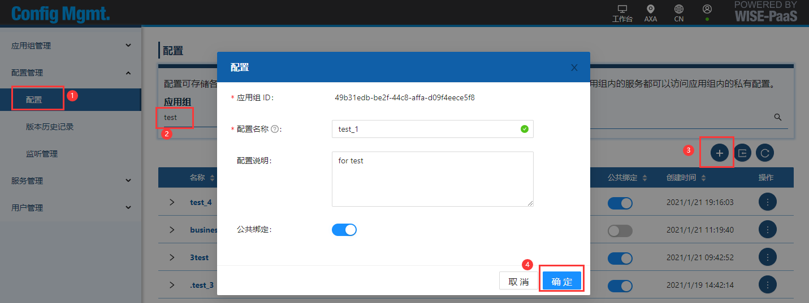

配置页面中可以指定配置名字，描述，以及是否要和公有配置绑定。  

**5. 服务使用配置**

WISE-PaaS/Config Mgmt. 提供给客户端三种方式去整合，一是sidecar配置缓存方式；二是Go SDK方式，三是Restful API的方式，具体分别参考**sidecar配置缓存使用**，**Go SDK使用**和**Restful API使用**章节。

**6. 服务注册**

将服务注册到应用组中，注册服务时候可以选择应用组内的多个私有配置。

 1）  要注册的服务已经被部署的场景

进入服务页面，选择+添加按钮，会跳转到工作负载页面，选择需要注册的工作负载名字，进入创建sidecar页面（此操作需要登录用户同时拥有mp对应的资源权限）；
  

 服务注册页面编辑内容如下：
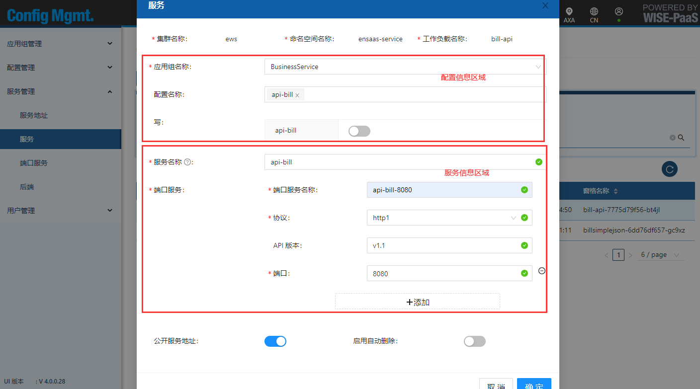

2） 要注册的服务还未被部署的场景

在应用组页面，选中需要注册服务所在的应用组，点击右侧“生成令牌”；  
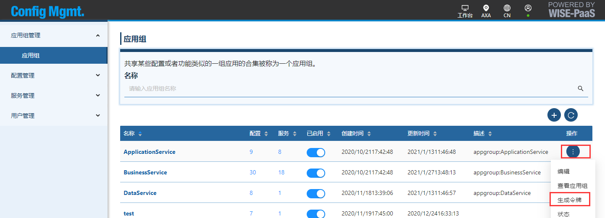 

编辑创建accesstoken所需的配置信息，点击生成，会在同样页面显示Token值（即accesstoken)；
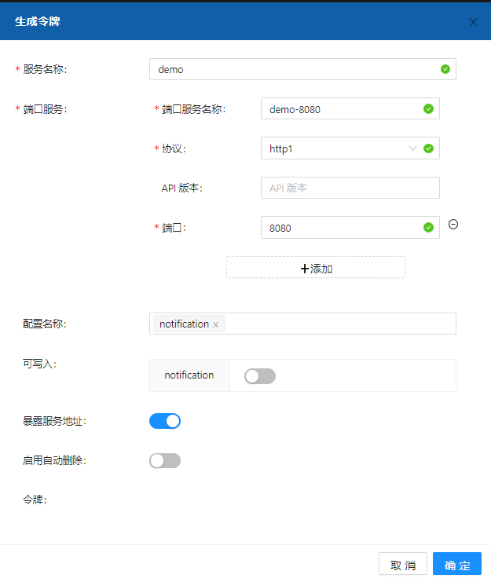 

复制上一步生成的accesstoken值，填入需要部署服务的部署文件中；
部署文件deployment中accesstoken的填写方式如下：  
 

服务部署好之后会自动注入sidecar，并注册到WISE-PaaS/Config Mgmt.中。

**7. 服务状态查询**

完成服务注册动作之后，返回服务页面，点击刷新按钮，短暂等待之后会在服务页面看到注册的服务名称；    
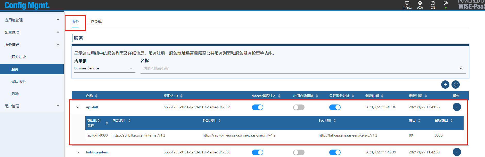

## 用户权限管理

WISE-PaaS/Config Mgmt.中拥有三种用户权限：admin，groupOwner和globalAuditor。  

| 角色          | 配置管理                                                     | 服务管理                                                     | 用户管理                                                     |
| ------------- | ------------------------------------------------------------ | ------------------------------------------------------------ | ------------------------------------------------------------ |
| admin         | 可以看到并能够编辑包括公有配置在内的所有配置                 | 可以看到并编辑服务信息（操作服务时需要用户同时具有该服务所在的MP资源的相关权限） | 可以查看所有加入WISE-PaaS/Config Mgmt.权限的用户，可以添加和删除其他用户的groupOwner和globalAuditor权限。  |
| groupOwner    | 一个用户可以拥有一个或者多个应用组权限，可以编辑和查看属于自己应用组的私有配置 | 可以编辑和查看属于自己应用组的s服务信息（操作服务时需要用户同时具有该服务所在的MP资源的相关权限） | 只可以看到和编辑与自身处于同一个应用组内的其他groupOwner用户 |
| globalAuditor | 只可以查看公有配置以及所有私有配置信息，无法编辑             | 只可以查看所有应用组下的所有服务信息，无法编辑               | 没有权限查看其他用户                                         |

在用户管理页面可以看到登录用户权限内可查看到的用户列表。  
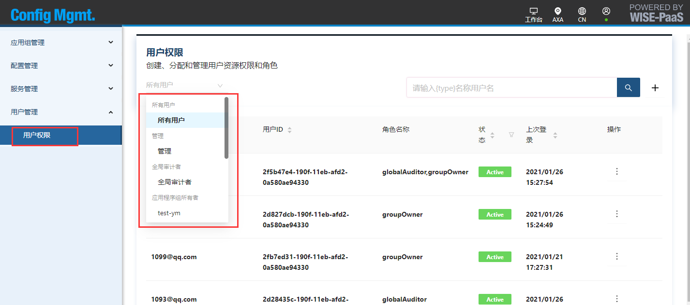 

用户权限页面的添加按钮，可以创建用户并将其加入某个（登录者所在的）应用组，也可以邀请已经存在的用户加入自身群组。  
编辑按钮可以修改列表中用户的权限。  
 

在用户信息页面，管理员可以添加或删除任意groupOwner权限，groupOwner用户只可以添加或删除同组的groupOwner权限。  

用户信息页面可做添加和删除权限操作：  
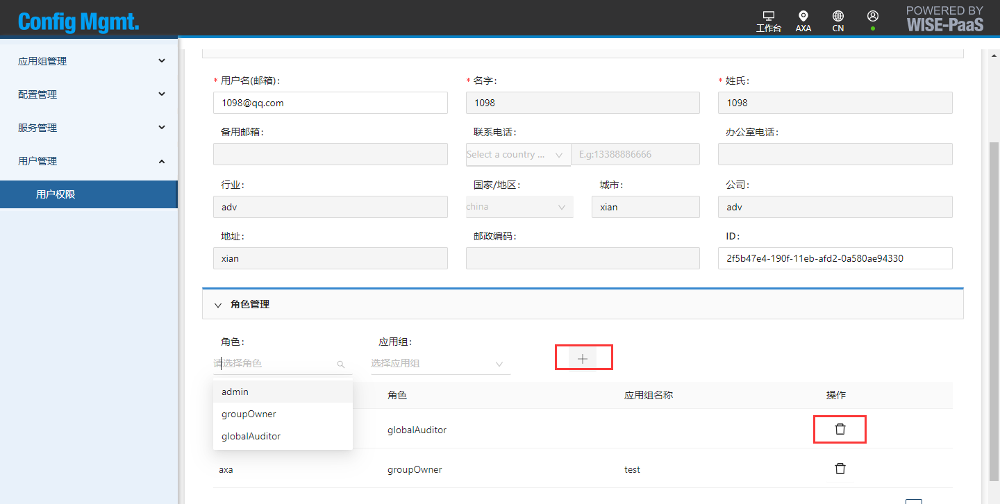

# 新功能发布记录

---

### Config Mgmt. v-1.0.3- (2021-01-29)

#### New Features:

- 添加global auditor权限
- 发布公有配置和私有配置时候检查tag name是否存在
- 公有云增加basic plan
- 应用组页面增加配置个数，点击配置个数跳转到配置管理页面
- 应用组页面增加服务个数，点击服务个数跳转到服务管理页面

#### Updates:

- 优化/healthz API，增加检查postgres状态
- MP crash的情况下，除了workload相关API都可正常工作

#### Fixes:

  - 修复控制面未更新服务后端实例地址的问题
  - 修复中文页面显示的错误
  - 修复默认账密操作workload相关API提示401的问题

#### Component

- API v-1.1.0.3
- Portal v-1.1.0.3
- ECM agent v-1.1.0.3
- iptable v-1.1.0.1
- ensaasdp v-1.1.0.1

---

### Config Mgmt. v-1.0.1- (2020-12-30)

#### Fixes:

  - 修复ecm agent crash的bug

#### Component

- API v-1.1.0.1
- Portal v-1.1.0.1
- ECM agent v-1.1.0.2
- iptable v-1.1.0.1
- ensaasdp v-1.1.0.1

---

### Config Mgmt. v-1.0.0- (2020-12-25)

#### New Features

  - 应用组管理，每个应用组内可以创建多种配置和注册多个服务
  - 配置管理，公有配置和应用组内私有配置，包括配置发布，配置实时推送，配置回滚，历史版本管理，灰度发布，配置监听查询等功能
  - 服务管理，包括服务注册，服务删除，服务地址暴露，服务健康检查等功能

  - 用户管理，包括admin权限和group owner两种权限。admin为Config Mgmt.的最高权限，group owner为应用组权限，可以对应用组进行增删改查

#### Component

- API v-1.1.0.1
- Portal v-1.1.0.1
- ECM agent v-1.1.0.1
- iptable v-1.1.0.1
- ensaasdp v-1.1.0.1

# 用户指南

## 应用组说明和创建

应用组为WISE-PaaS/Config Mgmt.的集中管理单元，每个被WISE-PaaS/Config Mgmt.监控的服务和私有配置都必定属于某个应用组，拥有唯一的应用组ID。  
用户权限将以应用组作为划分，作为某个或某几个应用组的owner用户只能查看和编辑属于自身群组下的配置和服务信息。

应用组创建方式如下：
 

## 配置格式说明

WISE-PaaS/Config Mgmt.配置文件内容支持YAML, JSON和TOML格式。

json格式参照：
```
{
  "version":"v1",  
  "type":"json"
}
```
yaml格式参照： 

```
version: v1
type: yaml
```
toml格式参照： 
```
[owner]
名称 = "Tom"
```

yaml格式示例：  
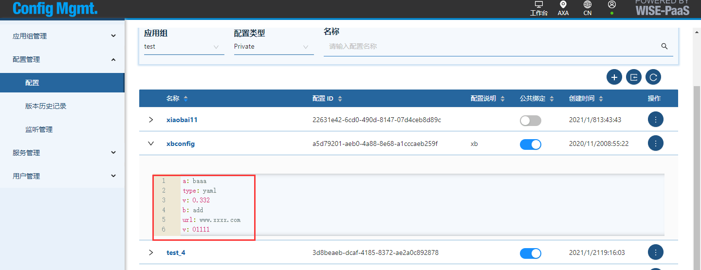 

## 公有配置

公有配置为整个WISE-PaaS/Config Mgmt.的公有配置，所有注册的服务都可以去获取公有配置，但是注册服务自身无权修改公有配置。  
只有globalAdmin(SSO管理员权限), datacenterAdmin(MP管理员权限)及WISE-PaaS/Config Mgmt.自身的admin等管理员权限才可以去修改公有配置。


### 公共配置发布（仅管理员可用）

GlobalAdmin和datacenterAdmin及WISE-PaaS/Config Mgmt. admin等管理员可以编辑公共配置。
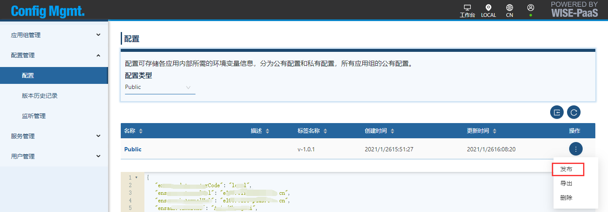 

修改配置时，需要指定配置格式是json, yaml还是toml，以下为json格式的配置发布。 

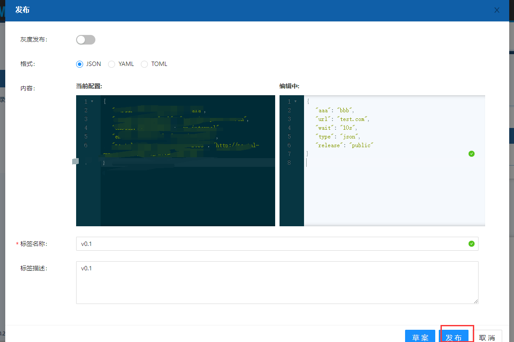 


## 私有配置

创建应用组之后，可以为这个应用组中的每个应用创建一个私有配置，也可以为应用组中的多个应用创建一个公有的配置（仍然属于应用组的私有配置）

### 私有配置的创建、编辑、发布、删除

在配置管理页面，可以做创建、编辑、发布配置的动作。  
配置创建：指定配置的名字，描述，以及是否要绑定公有配置。  
配置编辑：修改配置描述，以及是否绑定公有配置的状态。  
配置发布：更新配置内容，为更新指定tag版本，发布更新的配置供关联的应用调用。

#### 配置创建

选择好需要配置所在的应用组，再点击添加按钮，可以执行添加配置的操作。


配置页面中可以指定配置名字，描述，以及是否要和公共配置绑定。  

#### 配置发布
发布配置的区域中需要选择配置的格式是json, yaml还是toml，然后在内容区域填入用户服务需要的配置内容，tag 名称可以填写本次发布的版本信息（版本号用户可以自定义)，最后选择发布按钮。  

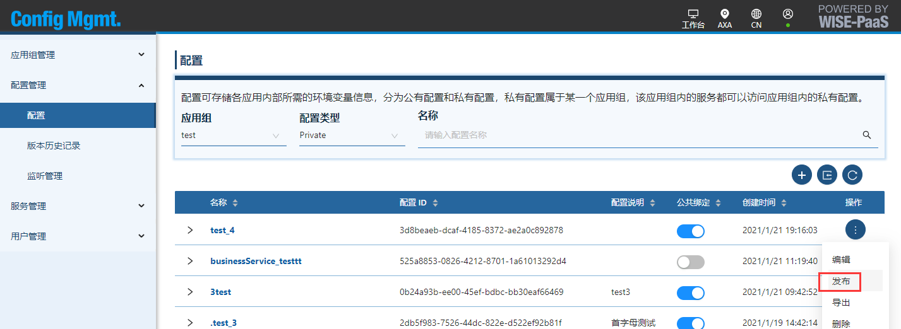  

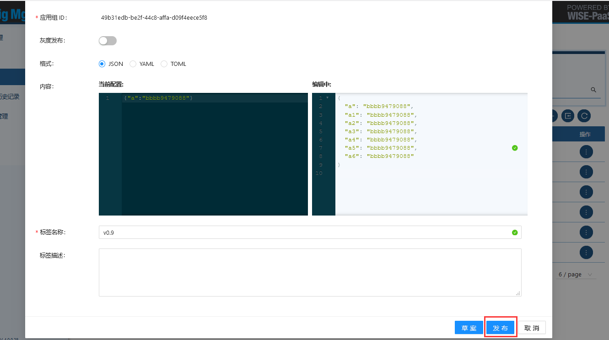  


## 历史配置查看 ##

在配置管理的版本历史记录中可以看到公有配置和私有配置的所有修改过的版本记录。  
选择某一条历史记录的查看历史记录，可以看到该历史版本的详细信息。  

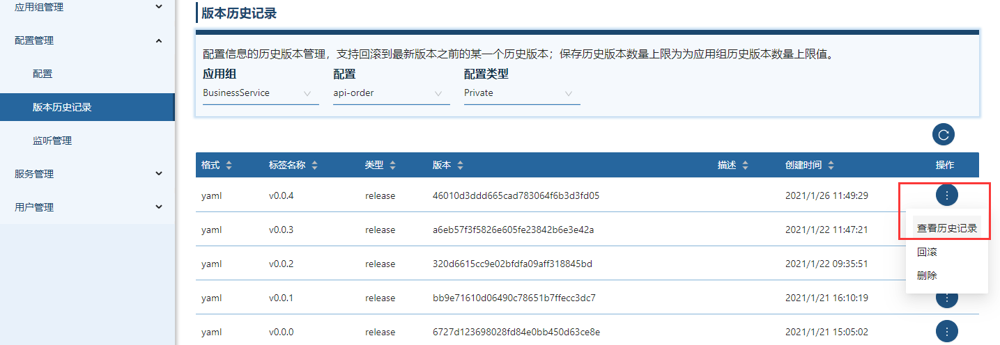 

## 配置回滚 ##
选择某一条历史记录，可以选择操作->回滚将配置回滚到旧的某个历史版本（当前最新版本不可回滚）。  
 

# 服务管理说明

## 服务注册

进入“服务管理”->“服务”页面，选择+添加按钮，会跳转到工作负载页面，选择需要注册的工作负载名字，进入服务注册页面（此操作需要登录用户同时拥有mp对应的资源权限）；
  

服务注册页面编辑内容如下：
 

服务注册参数说明： 
|参数|说明|
|:---|:------------------|
|应用组名称|需要注册到的应用组名称|
|配置名称|需要关联的配置信息，配置列表属于所选择的应用组|
|服务名称|要注册的服务名称，自定义|
|端口服务->端口服务名称|要注册服务的端口服务名称，自定义，此项必填是为了某些应用拥有多个端口的状况，指定端口名称以作区分|
|端口服务->协议|http1/http2, 通常选择http1|
|端口服务->api版本|该端口服务拥有的api版本。举例：某个服务的api版本是v1，访问该服务时均要添加v1标识如GET www.test.com/v1/服务，则可以在此添加v1，如此则会在产生公开的服务地址中为其默认带上v1的标识，不需要用户在调用时手动再添加版本标识|
|端口服务->端口|该端口服务的目标端口（target端口）地址|
|公开服务地址|选中则会在服务地址页面公开该服务的地址信息|
|启用自动删除|选中则会自动删除已经处在offline状态的后端（后端实例)实例|

完成创建sidecar动作之后，返回服务页面，点击刷新按钮，等短暂等待之后会在服务页面看到注册的服务名称；    


## 服务地址管理

### 查看公共服务地址

在服务管理->服务地址页面中，可以看到公共的服务地址。如果用户在注册服务时，选择了“公开服务地址”，则会在服务地址栏位看到对应的地址信息。

### 注册服务时选择公开服务地址
在**服务注册**页面选择“公开服务地址”：
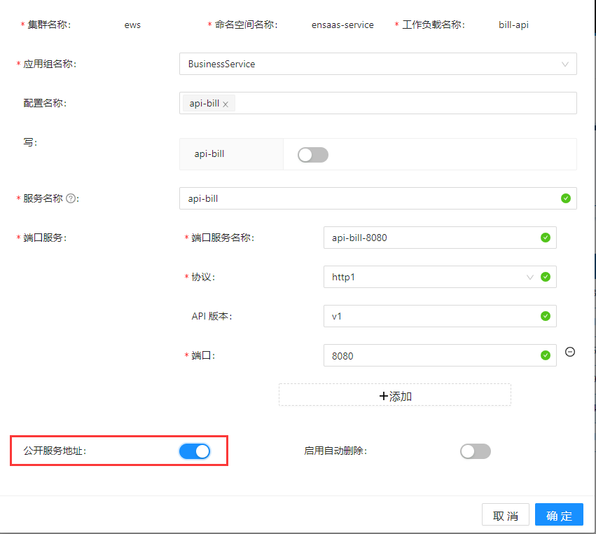 


在服务地址页面查看被公开的服务地址：
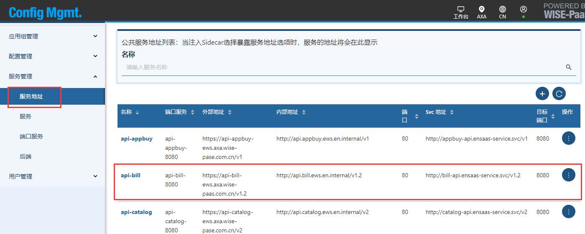 

### 手动公开和删除服务地址

管理员（Global admin或者datacenter admin,以及WISE-PaaS/Config Mgmt.的admin）可以使用在服务地址页面手动公开某一个服务地址到公共的服务地址列表中，前提是该服务必须已经注册到WISE-PaaS/Config Mgmt.。

在服务管理->服务地址页面按下+号添加按钮，在弹出页面选择应用组名称和服务名称:  
 


同样管理员可以使用API从公共服务地址列表中手动删除某一个服务地址。

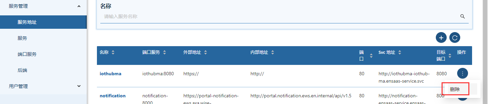 

# 开发指南
## 客户端选择

客户端支持以下三种方式：

- Go SDK，可实时监听配置更新

- Sidecar配置缓存文件

- Restful API，提供了一种跨语言的配置监听方式，无论开发语言为c，go，java，python或是其他开发语言，都可实时监听配置变化。

三种方式功能特性如下：

  | 功能                  | Go SDK | API    | Sidecar配置缓存文件 |
  | --------------------- | ------ | ------ | ------------------- |
  | 多配置文件获取        | 支持   | 支持   | 支持                |
  | 监听配置              | 支持   | 支持   | 不支持              |
  | 写入配置              | 支持   | 支持   | 不支持              |
  | 配置key/value格式转换 | 支持   | 支持   | 支持                |
  | 支持本地缓存备份      | 支持   | 不支持 | 支持                |

## Sidecar配置缓存参考

将服务注册中的config name列表中配置写到缓存文件”/config/cache/{appGroupName}_{configName}_config”和”/config/cache/{appGroupName}_{configName}_keyvalue_config”中。用户可以根据自己需求决定使用源格式配置文件或者key value格式配置文件。

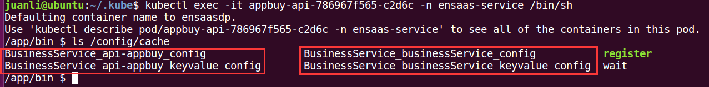

Sidecar中的配置缓存文件只在启动时候读一次，控制面配置更新后，不会将最新配置更新到缓存文件中，如果需要实时感知控制面配置更新，请整合SDK或者使用Restful API.

## Go SDK参考

Go SDK提供获取源格式配置，key value配置，监听配置更新，发布配置等功能。如果注册服务时候选择的配置绑定了公有配置，通过Go SDK同样可以获取到公有配置和公共服务地址。

### 使用前准备

下载Go SDK: https://github.com/ensaas/ecm-go-sdk

### 请求参数描述

| 参数         | 参数类型 | 描述                                                         |
| ------------ | -------- | ------------------------------------------------------------ |
| appGroupName | string   | 注册服务时选择的应用组，通过Go SDK提供的函数GetDefaultAppGroupName去自动获取 |
| configName   | string   | 注册服务时选择的配置名称，通过Go SDK提供的函数GetDefaultConfigNames自动去获取注册服务选择的多个配置名称，选择其中之一即可 |

获取appGroupName和configName的示例代码：

```
package main

import (
  "ecm-sdk-go/utils"
  "fmt"
)

func main() {

  // get app group name
  appGroupName, err := utils.GetDefaultAppGroupName()
  if err != nil {
	fmt.Println(fmt.Sprintf("[global.init] Get app group name failed, errMessage = %s", err.Error()))
	return
  }
  fmt.Println(appGroupName)

  // get config names
  configNames, err := utils.GetDefaultConfigNames()
  if err != nil {
	fmt.Println(fmt.Sprintf("[global.init] Get config names failed, errMessage = %s", err.Error()))
	return
  }
  fmt.Println(configNames)
}
```

### GetConfig

获取源格式配置文件：

```go
GetConfig(appGroupName, configName string) (*types.Config, error)
```

请求参数参考**请求参数描述**章节。

### GetKeyValueConfig

获取key, value格式配置文件：

```go
GetKeyValueConfig(appGroupName, configName string) (*types.KeyValueConfig, error)
```

### ListenConfig

监听配置更新：

```go
ListenConfig(param config.ListenConfigParam) error
```

### PublishConfig

发布新配置：

```go
PublishConfig(publishConfigRequest *configproto.PublishConfigRequest) error
```

### 示例代码

```go
package main

import (
	"ecm-sdk-go/client"
	"ecm-sdk-go/config"
	"ecm-sdk-go/constants"
	configproto "ecm-sdk-go/proto"
	"ecm-sdk-go/utils"
	"encoding/json"
	"fmt"
	"os"
	"strings"
	"sync"
	"time"
)

func createConfigClientTest() client.ConfigClient {
	var clientConfigTest = config.ClientConfig{
		CachePath:            "cache",
		ListenInterval:       10,
		UpdateEnvWhenChanged: true,
		EcmServerAddr:        os.Getenv(constants.EcmServerAddrEnvVar),
	}

	conf := config.Config{}
	conf.SetClientConfig(clientConfigTest)

	client, err := client.NewConfigClient(&conf)
	if err != nil {
		fmt.Println("Create grpc failed. errMessage = " + err.Error())
	}
	return client
}

func main() {
	c := createConfigClientTest()
	defer c.DeleteConfigClient()

	// get client config
	appGroupName, err := utils.GetDefaultAppGroupName()
	if err != nil {
		fmt.Println(fmt.Sprintf("[global.init] Get app group name failed, errMessage = %s", err.Error()))
		return
	}
	configNames, err := utils.GetDefaultConfigNames()
	if err != nil {
		fmt.Println(fmt.Sprintf("[global.init] Get config names failed, errMessage = %s", err.Error()))
		return
	}

	wg := sync.WaitGroup{}
	for _, configNameTmp := range configNames {
		wg.Add(1)

		configName := strings.Trim(configNameTmp, " ")
		content, err := c.GetConfig(appGroupName, configName)
		if err != nil {
			fmt.Println(fmt.Sprintf("get raw config of config '%s' fail. errMessage = %s", configName, err.Error()))
		}
		configBytes, err := json.Marshal(content)
		if err != nil {
			fmt.Println(fmt.Sprintf("json marshal of config '%s' fail. errMessage = %s ", configName, err.Error()))
		}
		fmt.Println(fmt.Sprintf("raw config of config '%s' is:", configName))
		fmt.Println(string(configBytes))

		keyValueContent, err := c.GetKeyValueConfig(appGroupName, configName)
		if err != nil {
			fmt.Println(fmt.Sprintf("get key value config of '%s' fail. errMessage = %s", configName, err.Error()))
		}
		keyValueBytes, err := json.Marshal(keyValueContent)
		if err != nil {
			fmt.Println(fmt.Sprintf("json marshal of config '%s' fail. errMessage = %s ", configName, err.Error()))
		}
		fmt.Println(fmt.Sprintf("key value config of config '%s' is:", configName))
		fmt.Println(string(keyValueBytes))

		if err := c.ListenConfig(config.ListenConfigParam{
			AppGroupName: appGroupName,
			ConfigName:   configName,
			OnChange: func(object, key, value string) {
				fmt.Println(fmt.Sprintf("config '%s' changed object: %s, key: %s, value: %s", configName, object, key, value))
			},
		}); err != nil {
			wg.Done()
		}

		// publish config
		publishConfig := &configproto.PublishConfigRequest{
			AppGroupName: appGroupName,
			ConfigName:   configName,
			Private:      "key1: val1\nfield:\n  key2: val2\n  key3: val3\nkey4: val4\n",
			TagName:      fmt.Sprintf("v0.0.1-sdk-%s", time.Now().Format("2006/01/02/15:04:05")),
			Format:       "yaml",
			Description:  "test",
		}

		err = c.PublishConfig(publishConfig)
		if err != nil {
			fmt.Println(fmt.Sprintf("publish config '%s' fail. errMessage = %s", configName, err.Error()))
		}
	}

	wg.Wait()
}
```

## Resful API参考

### Restful API概览

Restful API支持获取公有配置，公共服务地址，私有配置，发布私有配置，监听配置更新等API。除了获取公有配置和公共服务地址外，其他的API都需要有权限才可操作，权限为API请求包括两个请求头backendName和token。

Restful API提供了一种跨语言的配置监听方式，无论开发语言为c，go，java，python或是其他开发语言，都可实时监听配置变化。

| Restful API                                              | 方法 | 是否需要请求头<br />（backendName和token） | 描述                 |
| -------------------------------------------------------- | ---- | ------------------------------------------ | -------------------- |
| /v1/services                                             | GET  | 否                                         | 获取所有的服务地址   |
| /v1/services/{serviceName}/ServiceAddress                | GET  | 否                                         | 获取某一个服务的地址 |
| /v1/public/config                                        | GET  | 否                                         | 获取公有配置         |
| /v1/appGroups/{appGroupName}/configs/{configName}/config | GET  | 是                                         | 获取私有配置         |
| /v1/appGroups/{appGroupName}/configs/{configName}/config | POST | 是                                         | 发布私有配置         |
| /v1/appGroups/{appGroupName}/configs/{configName}/listen | POST | 是                                         | 监听私有配置更新     |

### 请求头描述

| 请求头      | 请求头类型 | 描述                                                         |
| ----------- | ---------- | ------------------------------------------------------------ |
| backendName | string     | 后端服务实例名称， 为sidecar自动生成的后端服务实例名称。     |
| token       | string     | 后端服务实例获取配置的令牌。token为sidecar将服务注册到控制面，控制面授权的token。 |

获取请求头的方式为：进入后端服务实例，/mosn/register文件中包括backendName和token。 以k8s pod为例，如下图：

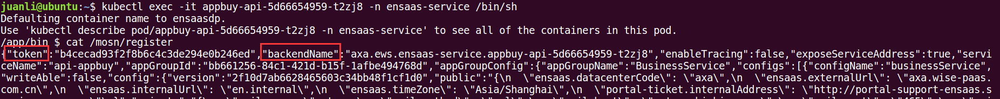

### 服务地址

Restful API支持获取所有服务地址和获取某一个服务地址两支API，这两支API为公开的API，不需要任何权限。

#### 所有服务地址获取

##### HTTP Request

```
GET API  /v1/services
```

##### Response Body

```
{
  "totalCount": 0,
  "items": [
    {
      "serviceName": {
        "portServiceName": {
          "port": 0,
          "targetPort": 0,
          "internalAddress": "string",
          "externalAddress": "string",
          "svcAddress": "string"
        }
      }
    }
  ]
}
```

Response body描述：

| 参数            | 类型    | 描述                            |
| --------------- | ------- | ------------------------------- |
| totalCount      | integer | 服务的总数                      |
| items           | array   | 服务的具体内容                  |
| serviceName     | string  | 服务名称                        |
| portServiceName | string  | 服务对应的端口服务名称          |
| port            | integer | 端口服务暴露给外部地址的端口    |
| targetPort      | integer | 端口服务在pod或者vm上对应的端口 |
| internalAddress | string  | 服务的内部地址                  |
| externalAddress | string  | 服务的外部地址                  |
| svcAddress      | string  | 服务的svc address               |

#### 某个服务地址获取

##### HTTP Request

```
GET API  /v1/services/{serviceName}/serviceAddress
```

##### Response Body

```
{
  "portServiceName": {
    "port": 0,
    "targetPort": 0,
    "internalAddress": "string",
    "externalAddress": "string",
    "svcAddress": "string"
  }
}
```

| 参数            | 类型    | 描述                            |
| --------------- | ------- | ------------------------------- |
| portServiceName | string  | 服务对应的端口服务名称          |
| port            | integer | 端口服务暴露给外部地址的端口    |
| targetPort      | integer | 端口服务在pod或者vm上对应的端口 |
| externalAddress | string  | 服务的外部地址                  |
| internalAddress | string  | 服务的内部地址                  |
| svcAddress      | string  | 服务的svc address               |

### 公有配置获取

##### HTTP Request

```
GET API  /v1/public/config
```

##### Response Body

```
{
  "format": "string",
  "configs": "string",
  "tagName": "string",
  "description": "string",
  "type": "string",
  "version": "string",
  "createdTime": "string",
  "betaBackends": [
    "string"
  ]
}
```

Response body描述：

| 参数         | 类型   | 描述                                                         |
| ------------ | ------ | ------------------------------------------------------------ |
| format       | string | 公有配置的格式，支持yaml, json, toml                         |
| configs      | string | 公有配置的内容，yaml, json, toml的字符串格式                 |
| tagName      | string | 公有配置标签，配置内容的唯一标记                             |
| description  | string | 公有配置内容的自定义描述                                     |
| type         | string | 公有配置的release类型，支持四种类型：release, rollback, betaRelease， stopBetaRelease |
| version      | string | 公有配置内容的md5值                                          |
| createdTime  | string | 公有配置的创建时间                                           |
| betaBackends | array  | 此项不为空，表示公有配置为灰度发布                           |

### 私有配置获取

这支API主要是获取私有配置，如果私有配置在创建时候绑定了公有配置，那么这支API也可以获取到公有配置和公共服务地址。此API需要有请求头，请求头获取方式参考**请求头描述**章节。

##### HTTP Request

```
GET API  /v1/appGroups/{appGroupName}/configs/{configName}/config
```

##### Response Body

```
{
  "private": "string",
  "version": "string",
  "format": "string",
  "public": "string",
  "publicVersion": "string",
  "publicFormat": "string",
  "services": {}
}
```

Response body描述：

| 参数          | 类型   | 描述                                         |
| ------------- | ------ | -------------------------------------------- |
| private       | string | 私有配置的内容，yaml, json, toml的字符串格式 |
| version       | string | 私有配置内容的md5值                          |
| format        | string | 私有配置的格式，支持yaml, json, toml         |
| public        | string | 公有配置的内容，yaml, json, toml的字符串格式 |
| publicVersion | string | 公有配置内容的md5值                          |
| publicFormat  | string | 公有配置的内容，yaml, json, toml的字符串格式 |
| services      | object | 公共服务地址列表                             |

### 私有配置发布

此API需要有请求头，请求头获取方式参考**请求头描述**章节。

##### HTTP Request

```
POST API  /v1/appGroups/{appGroupName}/configs/{configName}/config
```

##### Request Body

```
{
  "format": "string",
  "configs": "string",
  "tagName": "string",
  "description": "string",
  "betaBackends": [
    "string"
  ]
}
```

Request Body描述：

| 参数         | 类型   | 是否必须 | 描述                                                       |
| ------------ | ------ | -------- | ---------------------------------------------------------- |
| format       | string | 是       | 私有配置的格式，支持yaml, json, toml                       |
| configs      | string | 是       | 私有配置的内容，需要将yaml, json, toml转化为字符串         |
| tagName      | string | 是       | 私有配置标签，配置内容的唯一标记，同一个配置不能有同名标签 |
| description  | string | 否       | 私有配置内容的自定义描述                                   |
| betaBackends | array  | 否       | 灰度发布生效的后端实例，此项不为空即为灰度发布。           |

### 配置更新监听

监听配置更新的listen API，此API经常是循环不断调用，使用方法为：用户第一次调用version和publicVersion为空字符串，此时如果私有配置存在的话会立刻返回最新的配置信息；用户拿到的上次调用结果中私有配置的version和公有配置的publicVersion，再去调用listen API监听配置变化，如果给定时间间隔内一旦配置有更新的话会立即返回最新的配置信息，如果给定时间间隔内配置没有更新的话，会返回304；用户再拿到的上次调用结果中最新私有配置的version和最新公有配置的publicVersion，再去调用listen API监听配置变化，以此类推，不断重复调用此 listen API。

此API需要有请求头，请求头获取方式参考**请求头描述**章节。

##### HTTP Request

```
POST API  /v1/appGroups/{appGroupName}/configs/{configName}/listen
```

##### Request Body

```
{
  "version": "string",
  "publicVersion": "string",
  "listenIntervalMs": 30000
}
```

Request Body描述：

| 参数             | 类型    | 是否必须           | 描述                                                         |
| ---------------- | ------- | ------------------ | ------------------------------------------------------------ |
| version          | string  | 是，可以为空字符串 | 私有配置的md5值                                              |
| publicVersion    | string  | 是，可以为空字符串 | 公有配置的md5值                                              |
| listenIntervalMs | integer | 是                 | listenIntervalMs为监听config变化的时间间隔（单位为ms，默认时间间隔为30s）。给定时间间隔内一旦配置有更新的话会立即返回最新的私有配置信息，如果私有配置绑定公有配置的话，返回结果中也包括公有配置和services信息；假如给定时间间隔内配置没有更新的话，会返回304。 |

##### Query参数

| 参数          | 类型    | 是否必须 | 描述                                                         |
| ------------- | ------- | -------- | ------------------------------------------------------------ |
| format        | string  | 否       | format为空表示监听的配置格式为源配置文件格式，如果为“Key-Value”，表示监听的配置格式为key, value格式。 |
| isFullContent | boolean | 否       | isFullContent为true，一旦配置改变返回完整的配置信息包括private, version, public, publicVersion和services； isFullContent为false只返回改变的私有配置信息或者公有配置信息，比如只有私有配置信息更新了，只返回私有配置信息，不返回未改变的公有配置信息。 |

# 最佳实践

## 统一管理配置
使用WISE-PaaS/Config Mgmt.，可以统一管理所有应用的配置信息。  
**传统部署对比**：需要分散的helm chart或者其他部署文件中各自保存环境变量。

## 创建便捷

在WISE-PaaS/Config Mgmt.页面中，可便捷创建配置，仅需要三步：
1. 选定所属的应用组；
2. 创建指定配置名称和描述；
3. 发布配置。  

**传统部署对比**：需要手动编辑每个应用的部署文件。

## 快速导入

若希望在不同环境中部署相同的应用，则可以使用导出导入功能，快速创建同名配置，仅需要更改少部分的环境信息即可完成配置的搬移工作。  
**传统部署对比**：需要复制其他环境的部署文件，并修改众多变量信息来满足新环境需要。

## 配置版本管理

历史配置查看页面，可查看每个配置的每次修改记录，如果应用的更新版本出错需要回退，则可选中对应的配置版本同步回滚。  
**传统部署对比**：运营人员需要手动记录多个版本信息以作备份，管理繁琐。

## 统一管理服务地址
每部署一个应用，在WISE-PaaS/Config Mgmt.做服务注册之后，都可以指定是否要暴露服务地址。如果选择公开地址，则该应用的地址都会展示在公共服务地址列表区域。  
其他需要依赖此服务地址的应用可以在代码中根据服务名称和端口服务名称去定位地址信息。  
**传统部署对比**：需要在应用的部署文件中单独指定依赖的服务地址，如果环境不同，则修改的工作量加倍。

# 常见问题

## 客户端支持哪些语言

目前客户端支持以下三种方式：

- Go SDK，可实时监听配置更新

- Sidecar配置缓存文件

- Restful API，提供了一种跨语言的配置监听方式，无论开发语言为c，go，java，python或是其他开发语言，都可实时监听配置变化。

  Java spring cloud SDK正在开发中。

## 客户端/数据面与控制面的如何做权限认证

客户端/数据面与控制面的权限都是通过后端实例名称backendName和令牌token验证实现的。

- backendName， 后端服务实例名称， 为sidecar自动生成的后端服务实例名称
- token， 后端服务实例获取配置的令牌。token为sidecar将服务注册到控制面，控制面授权的token。

获取backendName和token的方式：进入后端服务实例，/mosn/register文件中包括backendName和token。 以k8s pod为例，如下图：


## 服务名称可以重名吗

服务名称为唯一的，整个WISE-PaaS/Config Mgmt. 的服务名称不能重名。需要注意的是， 服务注册后服务的位置就被记录下来了，服务的位置为datacenter+.+cluster+.+namespace+.+workload，如果后端实例的位置与服务的位置不相符，后端实例将会提示冲突而注册失败。

## Sidecar配置缓存支持配置更新吗

Sidecar配置缓存文件只是sidecar启动时候从控制面读取一次，如果控制面配置更新之后，sidecar缓存文件不会更新。如果有用inotify等技术监听缓存文件更新的需求，后续可以考虑sidecar支持配置缓存文件更新。

