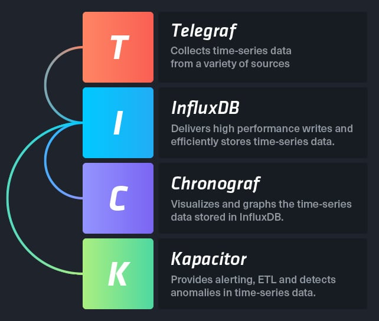

# 产品简介

　　本文为您简单介绍WISE-PaaS时间序列数据库服务及主要功能。

## WISE-PaaS 時間序列資料庫服務

　　WISE-PaaS提供[时间序列数据库服务](https://en.wikipedia.org/wiki/Temporal_database) (Time Series Database, TSDB)，让使用者储存大量与时间有相依性的数据。而TSDB在储存与管理时间序列数据上，比一般数据库更省空间，且效能更佳。当云平台应用服务需要进行与时间相依的讯息储存时，可透过时间序列数据库服务达成。例如由IoT Hub服务传送到WISE-PaaS上的信息可以用此服务储存管理，并介接平台提供的可视化工具了解数据趋势，以及利用平台的分析服务进行进阶加值应用。WISE-PaaS的时间序列数据库是基于InfluxDB建构的数据储存服务，若想更了解[InfluxDB](https://zh.wikipedia.org/wiki/InfluxDB)，详细介绍可以参考[InfluxDB官网](https://www.influxdata.com/)。

## WISE-PaaS 時間序列資料庫服務主要功能

* 支援專屬型服務，確保效能控管與資料隱密性。
* 支援SSL加密安全傳輸連線，確保資料傳輸過程安全性。
* 提供Web介面讓使用者操作。
* 包含Telegraf、Chronograf和Kapacitor等附加元件。

<td align="center">時間序列資料庫服務 [示意圖</td>]
