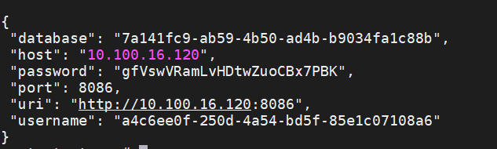
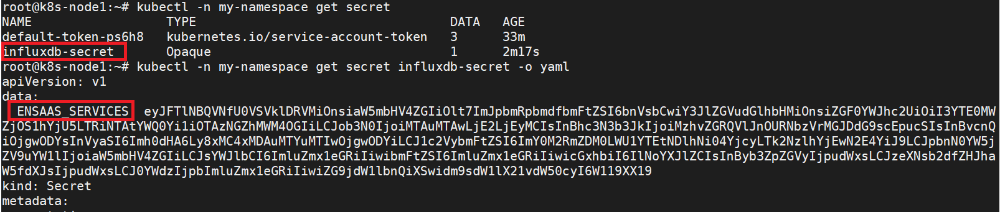
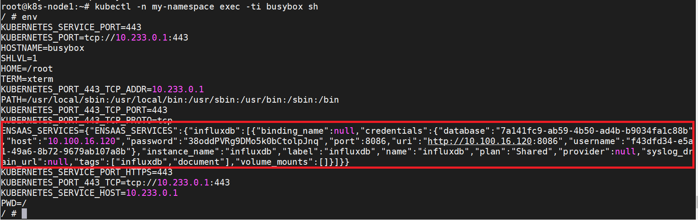

## 如何创建Secret
---------------------------------------

### 步驟一：購買專屬型InfluxDB服務 
---------------------------------------
InfluxDB僅提供單節點專屬型服務，服務規格如下，如有需要，請至[研華商城](https://wise-paas.advantech.com/zh-tw/marketplace)訂閱購買

|方案                 | 規格*                          |
| -------------------- | --------------------------------- |
| Single Node - Small  | 2 vCPU, 8GB RAM, 128GB SSD Disk   |
| Single Node - Medium | 4 vCPU, 16GB RAM, 512GB SSD Disk  |
| Single Node - Large  | 8 vCPU, 32GB RAM, 1024GB SSD Disk |

※ 規格可能依站點而有不同，實際規格依各站點公告為主


### 步驟二：創建Secret並取得連線憑證 (Service Credential)

---------------------------------------
連線至InfluxDB服務前請確定您擁有以下資訊：

* 已成功購買InfluxDB

* <span style="color:red;">Service Portal</span>的登入網址

* 您的帳號擁有登入<span style="color:red;">Service Portal</span>的權限，並能看到所購買的實例

  

各站點Service Portal連結如下

 站點代碼 | 所在地點          | Service Portal連結                             |
 | -------- | ----------------- | ---------------------------------------------- |
 | SA       | Azure Singapore   | https://portal-service-ensaas.sa.wise-paas.com |
 | HZ       | Alibaba  Hangzhou | https://portal-service-ensaas.hz.wise-paas.com |
 | JE       | Japan East        | https://portal-service-ensaas.jp.wise-paas.com |

 建立InfluxDB的Secret步驟簡述如下，更多建立細節請參考此[Service Portal使用者操作手冊](../../ServicePortal/userguide.md):
 1. 登入Service Portal之後選擇您的時間序列資料庫服務實例
 2. 點選右方操作選項，進入Secret管理頁面
 3. 點選 "+" 號，將influxdb的連線憑證以Secret的方式建立到所選的Namespace中
 4. 或是點選"檢視"，也可以查看當前建出來的連線憑證

 連線憑證是一組包含時間序列資料庫連線位址、連線帳號、連線密碼等資訊的JSON格式文檔，用來驗證使用時間序列資料庫服務對象的身分。

 

 * database：字串型態，標準[UUID格式][9]
 * host：字串型態，時間序列資料庫所在位址，只提供內部網路存取位址，IP格式
 * password：字串型態，由小寫英文字母與數字隨機組成，長度為25字元
 * port：數值型態，時間序列資料庫通訊埠
 * uri：字串型態，http://\<host\>:\<port\>
 * username：字串型態，標準[UUID格式][9]


### 步驟三：將Secret的資訊注入到Kubernetes Pods中

------

完成上一步驟在Namespace創建Secret後，可以在namespace裡看到一個同名的Secret。查看Secret內容後，會看到一個Key值為ENSAAS_SERVICES的內容，從kubctl指令看到的是base64編碼後的內容，可將其base64解碼後，或是注入到環境變數後取得原本得Credential內容。

```shell
$ kubectl -n my-namespace get secret
$ kubectl -n my-namespace get secret influxdb-secret -o yaml
```




創建一個Pod(以busybox為例)，並將Secret注入到Pod環境變數中，並從環境變數中取得Credential內容

- spec.cotainers.env.name: 注入到Pod的環境變數名稱
- spec.cotainers.env.valueFrom.secretKeyRef.name: 注入的來源為同Namespace底下，名為influxdb-secret的Secret
- pec.cotainers.env.valueFrom.secretKeyRef.key: Secret中的Key值，EnSaaS創建出來的Key名稱固定為"ENSAAS_SERVICES"

```yaml
apiVersion: v1
kind: Pod
metadata:
  name: busybox
  namespace: my-namespace
spec:
  containers:
  - name: busybox
    image: busybox:latest
    env:
    - name: ENSAAS_SERVICES
      valueFrom:
        secretKeyRef:
          name: influxdb-secret
          key: ENSAAS_SERVICES
    command:
      - sleep
      - "3600"
    imagePullPolicy: IfNotPresent
  restartPolicy: Always
```

進入到Pod裡面執行env的指令，就可以取得JSON格式的influxdb credential了

```shell
$ kubectl -n my-namespace exec -ti busybox sh
$ env
```



### 步驟四：程式在環境變數中獲取連線憑證，並與InfluxDB進行連線

---------------------------------------
當您有連線憑證後，您就可以搭配您所熟悉的客戶端應用來使用InfluxDB的服務。

* <a class="false-class" href="#!documents/Database/InfluxDb/userguide__zh-TW.md#Java開發者">Java開發者</a>
* <a class="false-class" href="#!documents/Database/InfluxDb/userguide__zh-TW.md#Python開發者">Python開發者</a>
* <a class="false-class" href="#!documents/Database/InfluxDb/userguide__zh-TW.md#NodeJs開發者">NodeJs開發者</a>
