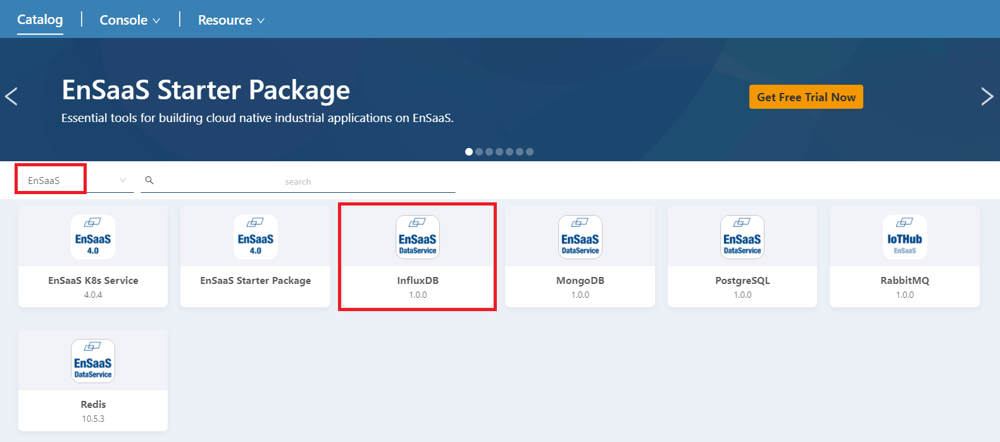
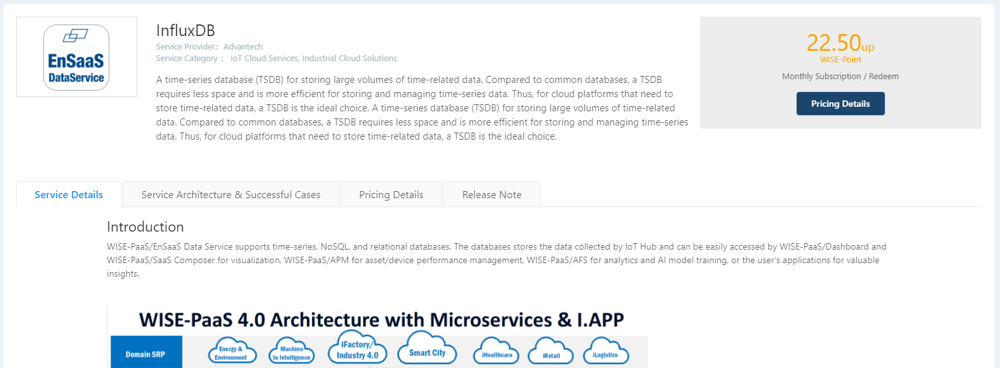
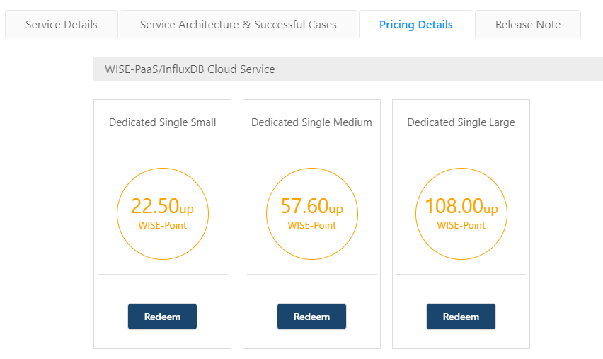
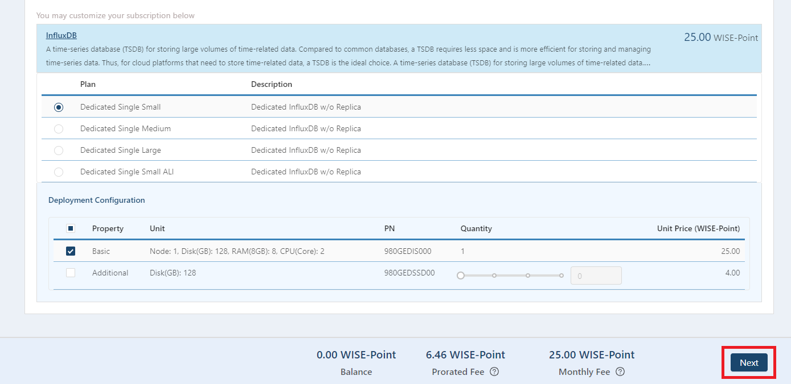
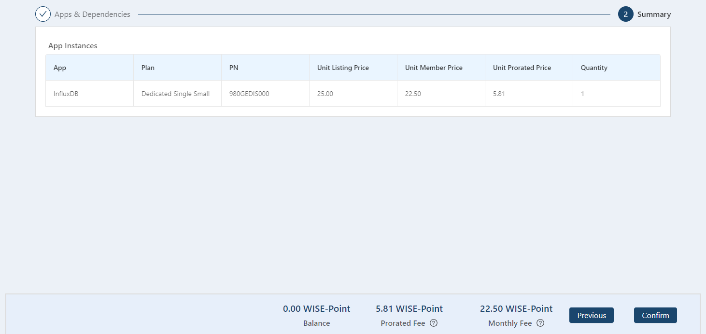
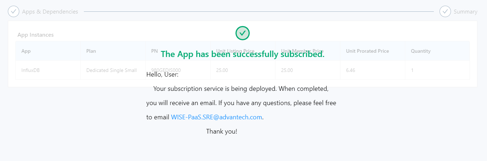

## 如何創建實例

InfluxDB僅提供單節點獨享型服務，如有需要，請至Catalog購買。

各站點Catalog連結如下：

 站點代碼 | 所在地點          | Catalog連結                             |
 | -------- | ----------------- | ---------------------------------------------- |
 | SA       | Azure Singapore   | https://portal-catalog-ensaas.sa.wise-paas.com |
 | HZ       | Alibaba Hangzhou | https://portal-catalog-ensaas.hz.wise-paas.com.cn |
 | JE       | Japan East        | https://portal-catalog-ensaas.jp.wise-paas.com |

### 步驟一

前往Catalog頁面，下拉式選單選擇EnsaaS，再選擇InfluxDB服務。

### 步驟二

點選Pricing Details。

### 步驟三

選擇想要購買的方案，點選Redeem。

### 步驟四

選擇是否要加購硬碟，確認後請按Next。

### 步驟五

再次確認購買資訊是否正確，正確無誤請按Confirm。

### 步驟六

當您見到以下畫面即表示購買成功，請前往Service Portal查看您購買的實例。

各站點Service Portal連結如下：

 站點代碼 | 所在地點          | Service Portal連結                             |
 | -------- | ----------------- | ---------------------------------------------- |
 | SA       | Azure Singapore   | https://portal-service-ensaas.sa.wise-paas.com |
 | HZ       | Alibaba  Hangzhou | https://portal-service-ensaas.hz.wise-paas.com |
 | JE       | Japan East        | https://portal-service-ensaas.jp.wise-paas.com |
