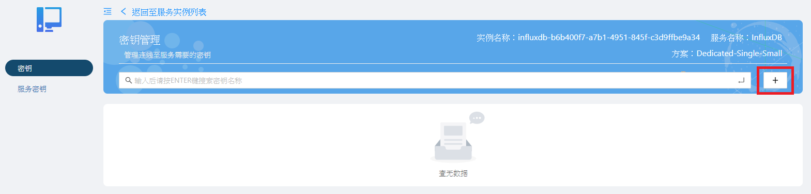
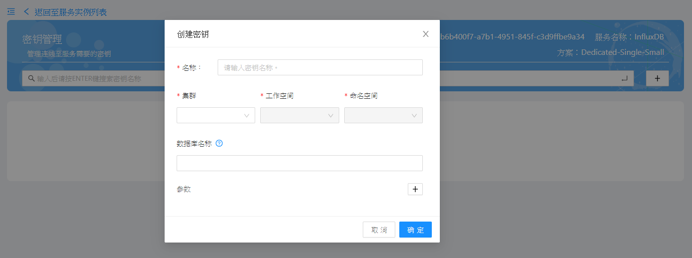

# 创建密钥

创建InfluxDB密钥前請確定您符合以下狀況：

* 您的訂閱號已成功購買InfluxDB實例

* 您的帳號擁有登入<span style="color:red;">Service Portal</span>的權限，並能看到所購買的實例

各站點Service Portal連結如下：

 站點代碼 | 所在地點          | Service Portal連結                             |
 | -------- | ----------------- | ---------------------------------------------- |
 | SA       | Azure Singapore   | https://portal-service-ensaas.sa.wise-paas.com |
 | HZ       | Alibaba Hangzhou | https://portal-service-ensaas.hz.wise-paas.com.cn |
 | JE       | Japan East        | https://portal-service-ensaas.jp.wise-paas.com |

### 步驟一

登入Service Portal，並點選您的InfluxDB實例的操作按鈕，並選擇密鑰管理。


### 步驟二

進入密鑰管理頁面後，請點選右上方的「+」按鈕創建密钥。



### 步驟三

請輸入欲創建的密钥名稱，以及要將密钥創建在哪一個集群、工作空間以及命名空間之下。<br>
數據庫名稱若不填寫，則會自動建立一個亂數名稱的數據庫。<br>
所有資訊都輸入完成後請按下確定。



### 步驟四

若密鑰創建成功，將在清單上看到所創建的密鑰，您可以點選操作 > 查看以檢視密鑰內容。


### 步驟五

您會看到如下圖的連線證書，連線證書是一組包含數據庫連線位址、連線帳號、連線密碼等資訊的JSON格式文檔。


 * database：字串型態，若是自動產生的名稱，則是標準UUID格式
 * externalHosts：字串型態，數據庫的外網地址
 * host：字串型態，數據庫的所在位址，為內部網路存取位址，IP格式
 * internalHost：字串型態，數據庫的內網地址
 * password：字串型態，由小寫英文字母與數字隨機組成，長度為25字元
 * port：數值型態，數據庫通訊埠
 * uri：字串型態，格式為http://\<host\>:\<port\>
 * username：字串型態，是標準UUID格式

### 步驟六

完成上述步驟後，您也可以在命名空間裡看到一個同名的密鑰。<br>
查看密鑰內容後，會看到一個Key值為ENSAAS_SERVICES的內容，從kubctl指令看到的是base64編碼後的內容，可將其base64解碼後取得原本的憑證內容。

```shell
$ kubectl -n <namespace> get secret
$ kubectl -n <namespace> get secret <secret_name> -o yaml
```


