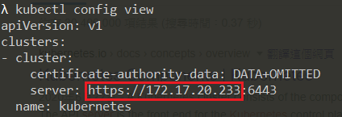
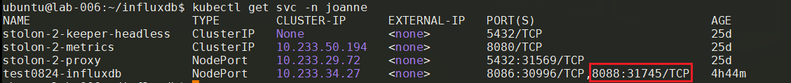
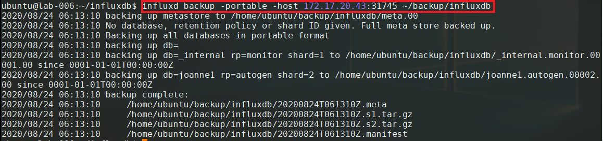
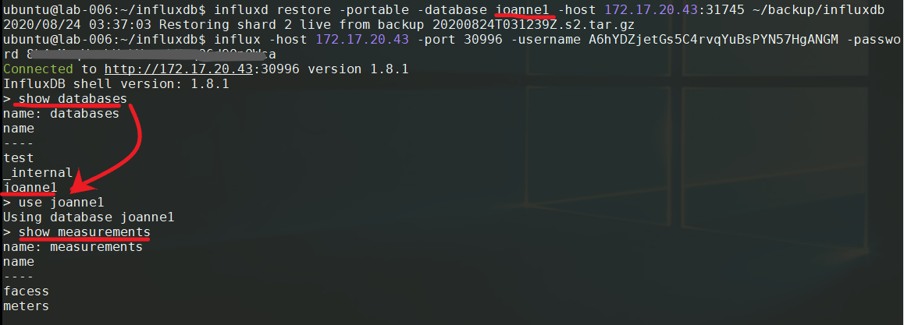

# 备份还原

本文将为您介绍如何备份还原InfluxDB数据。

## 前提条件

1. 从管理员获取InfluxDB的Admin账号。

2. 需要打开InfluxDB的远程备份端口8088。

## 限制

1. 公有云环境不提供远程备份InfluxDB的功能，如果有需要，请发工单给平台运维人员协助备份。

## 获取远程备份外部IP和Port（Container InfluxDB）

如果是Container InfluxDB，需要先获取服务的外部IP，才可以通过远程备份的方式将数据备份出来。

有两种方式可以获取Container InfluxDB的远程备份外部IP和Port：

1. 使用NodePort的方式

- Node IP:

```
kubectl get node -o wide
```




- 查询service port

```
kubectl get svc -n <your-namespace>
```



- 以上图为例，influxdb的http port是30996，rpc port为31745，灾备需使用rpc port。
- 灾备相关指令中使用的连线地址<cluster-server>:<rpc-port>，上图例子中为172.17.20.233:31745。

2. 使用LoadBalancer的方式

- 查询service ip和port

```
kubectl get svc -n <your-namespace>
```


- 以上图为例，influxdb的external ip是61.219.26.X，http port是8086/31299，rpc port为8088/31031，灾备需使用rpc port。
- 灾备相关指令中使用的连线地址<external-ip>:<rpc-port>，上图例子中为61.219.26.X:8088。

## BackUp

使用备份用port备份数据至本地(linux为例)

- 备份全部:
```
influxd backup -portable -host <your-influxdb-backup-address> <path-to-backup>
```


- 备份其中一个数据库
```
influxd backup -portable -db <your-influxdb-database> -host <your-influxdb-backup-address> <path-to-backup>
```

- 备份特定时间区段
```
influxd backup -portable -start 2017-04-28T06:49:00Z -end 2017-04-28T06:50:00Z -host <your-influxdb-backup-address> <path-to-backup>
```

## Restore

- 还原全部数据库

```
influxd restore -portable -host <your-influxdb-backup-address> <path-to-backup>
```

- 还原其中一个数据库

```
influxd restore -portable -db <your-influxdb-database> -host <your-influxdb-backup-address> <path-to-backup>
```

- 还原至新数据库

```
influxd restore -portable -db <your-influxdb-database> -newdb <new-influxdb-database> -host <your-influxdb-backup-address> <path-to-backup>
```

- 还原成功



