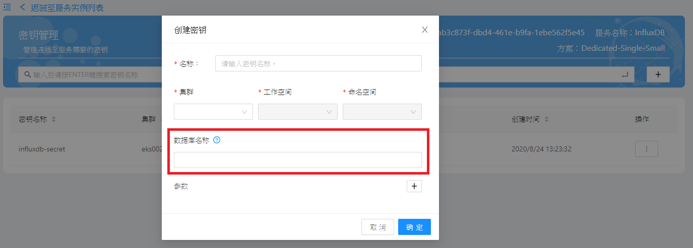
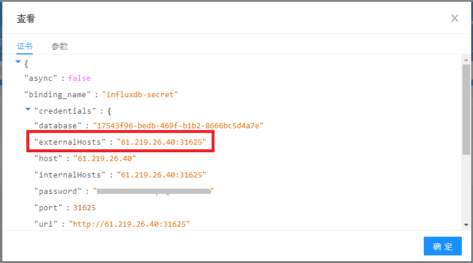

# 常见问题

**一、創建密鑰或服務密鑰時，可以自行指定要使用的數據庫吗？**

創建密鑰或服務密鑰時可以自行輸入數據庫名稱。 
但是數據庫名稱有使用字元以及字數上的限制，請點擊畫面上的「？」圖示取得更詳細的資訊。

**二、如何获取数据库的外部连接地址？**

外部连线信息可以从密鑰的證書中获取，其中的externalHosts即为外部连接地址。

**三、可以在創建出的數據庫上套用Retention Policy嗎？**

因為一些安全性的考量，我們暫時不提供此功能。

**四、能夠将App的資料从原本的數據庫實例迁移到另一个數據庫實例嗎？** 

如果订购了多个數據庫实例，想将App的資料從原本的數據庫實例迁移到另一个數據庫實例，步骤如下：

1. 请先联系SRE迁移数据：WISE-PaaS.SRE@advantech.com.cn

2. 登录Service Portal，将DB Instance1中创建的dashboard Secret删掉（WISE-PaaS平台提供的App使用的Secret名称有一定规范，格式为：ServiceName-NamespaceName-secret，所以根据App名称可以找到其对应的Secret），删掉之前记录下Secret的名称和参数，参数从View Secret页面查看；

   

   

3. 在DB Instance2中创建同名的Secret，并指定相同的参数；

4. 重启App；
