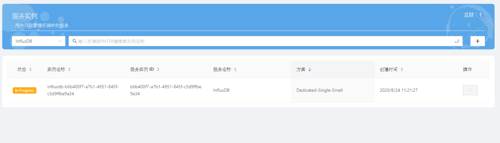
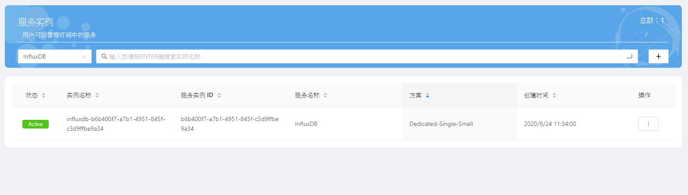
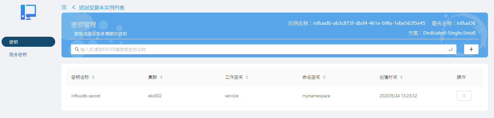

# 快速入門

快速入门旨在介绍如何创建InfluxDB实例、获取密鑰以及连接数据库实例，使用户能够了解从购买InfluxDB实例到开始使用实例的流程。<br><br>
从购买实例到开始使用实例，您需要完成以下操作：

* <a class="false-class" href="#创建实例">创建实例</a>
* <a class="false-class" href="#创建密钥">创建密钥</a>
* <a class="false-class" href="#查看密钥">查看密钥</a>
* <a class="false-class" href="#使用密钥连接实例">使用密钥连接实例</a>

## 创建实例

InfluxDB仅提供单节点独享型服务，若要取得InfluxDB实例，请先至Catalog页面购买。

在购买实例前，请确认您符合以下状况：

- 已注册研华会员。
- 已绑定EnSaaS账户。
- 账号余额大于要购买的服务价格。

各站点Catalog连结如下：

  | 站点代码 | 所在地点          | Catalog连结                             |
  | -------- | ----------------- | ---------------------------------------------- |
  | SA       | Azure Singapore   | https://portal-catalog-ensaas.sa.wise-paas.com |
  | HZ       | Alibaba Hangzhou | https://portal-catalog-ensaas.hz.wise-paas.com.cn |
  | JE       | Japan East        | https://portal-catalog-ensaas.jp.wise-paas.com |


1. 请前往Catalog页面，如果您的账号有多个订阅号，请先选择订阅号，并于下拉式选单选择EnSaaS，再选择InfluxDB服务。

   


2. 点击InfluxDB服务后，会转到服务详情页面，請点选Pricing Details。

   

3. 选择想要购买的方案，点选Redeem。

   

4. 点击Redeem后，会转到订购页面，可选择的项目如下：

   | 项目名称               | 说明                                                         |
   | ---------------------- | ------------------------------------------------------------ |
   | Pricing Plan           | 支付方式，目前仅支持月付                                     |
   | Data Center            | 数据中心，不需要选择，仅确认数据中心是否正确                 |
   | Service to be Deployed | Plan：请参考实例规格<br>Deployment Configuration<br>- Basic：基础类型<br>- Additional：加购类型，数据库服务可以加购磁盘的大小 |
   | Available Days         | 本月可用天数，根据当前日期计算本月剩余天数，即为本月可用天数 |
   | Total Price            | 月付总价格                                                   |
   | Prorated Price         | 根据本月可用天数计算本月需要支付的费用                       |

   确认后请按Next。

   

5. 再次确认购买信息是否正确，正确无误请按Confirm。

   

6. 当您见到以下画面即表示购买成功，请前往Service Portal查看您购买的实例。（目前仅有订阅号管理员和订阅号用户可以查看）

   

   各站点Service Portal连结如下：

   | 站点代码 | 所在地点          | Service Portal连结                             |
   | -------- | ----------------- | ---------------------------------------------- |
   | SA       | Azure Singapore   | https://portal-service-ensaas.sa.wise-paas.com |
   | HZ       | Alibaba  Hangzhou | https://portal-service-ensaas.hz.wise-paas.com.cn |
   | JE       | Japan East        | https://portal-service-ensaas.jp.wise-paas.com |
 
7. 开启Service Portal的服务实例页面，刚购买的实例会呈现In Progress的状态，请等待SRE人员启用您的实例。
 
   
 
8. 若实例已被启用成功，状态会变更为Active，即可开始使用您购买的实例。
 
   
 
## 创建密钥

创建InfluxDB密钥前请确定您符合以下状况：

* 您的订阅号已成功购买InfluxDB实例

* 您的账号拥有登入<span style="color:red;">Service Portal</span>的权限，并能看到所购买的实例（目前仅有订阅号管理员和订阅号用户可以查看）

各站点Service Portal连结如下：

  | 站点代码 | 所在地点          | Service Portal连结                             |
  | -------- | ----------------- | ---------------------------------------------- |
  | SA       | Azure Singapore   | https://portal-service-ensaas.sa.wise-paas.com |
  | HZ       | Alibaba Hangzhou | https://portal-service-ensaas.hz.wise-paas.com.cn |
  | JE       | Japan East        | https://portal-service-ensaas.jp.wise-paas.com |

1. 登入Service Portal，並點選您的InfluxDB實例的操作按鈕，並選擇密鑰管理。

   

2. 進入密鑰管理頁面後，請點選右上方的「+」按鈕創建密钥。

   

3. 請輸入欲創建的密钥名稱，以及要將密钥創建在哪一個集群、工作空間以及命名空間之下。<br>
   數據庫名稱若不填寫，則會自動建立一個亂數名稱的數據庫。<br>
   所有資訊都輸入完成後請按下確定。

   

4. 若密鑰創建成功，您會在密鑰清單上看到您創建的密鑰。

   

## 查看密钥

本文介绍如何查看创建出来的密钥，您可以在Service Portal或于K8s集群中检视创建出的密钥。

* <a class="false-class" href="#在service-portal查看密钥">在Service Portal查看密钥</a>
* <a class="false-class" href="#在K8s集群查看密钥">在K8s集群查看密钥</a>

### 在Service Portal查看密钥

请在登入Service Portal后，点选您的InfluxDB实例的操作按钮，并选择密钥管理。


您会在清单上看到已创建的密钥，请点选操作 > 查看以检视密钥内容。


页面会显示连接证书内容，连接证书是一组包含数据库连接地址、连接账号、连接密码等信息的JSON格式文档。


 * database：字符串型态，若是自动产生的名称，则是标准UUID格式
 * externalHosts：字符串型态，数据库外网地址
 * host：字符串型态，数据库所在地址，为内部网络存取地址，IP格式
 * internalHosts：字符串型态，数据库外网地址
 * password：字符串型态，由小写英文字母与数字随机组成，长度为25字符
 * port：数值型态，数据库通讯端口
 * uri：字符串型态，格式为http://\<host\>:\<port\>
 * username：字符串型态，是标准UUID格式

### 在K8s集群查看密钥

请连接至您所在的K8s集群，您也可以在指定的命名空间里看到一个同名的密钥。<br>
请参照以下指令查看密钥内容，您会看到一个Key值为ENSAAS_SERVICES的内容，这是经由base64编码后的结果，可将其base64译码取得原本的证书内容。

```shell
$ kubectl -n <namespace> get secret
$ kubectl -n <namespace> get secret <secret_name> -o yaml
```


## 使用密钥连接实例

当您取得连接证书后，您可以搭配您熟悉的客户端应用来使用InfluxDB服务。

* <a class="false-class" href="#Java开发者">Java开发者</a>
* <a class="false-class" href="#Python开发者">Python开发者</a>
* <a class="false-class" href="#Nodejs开发者">Node.js开发者</a>

## Java开发者
在Java中您可以使用JSON来对证书JSON进行解析，以下为使用Maven引入json lib的范例：

```
<repositories>
    <dependency>
        <groupId>org.json</groupId>
        <artifactId>json</artifactId>
        <version>20160810</version>
    </dependency>
</repositories>
```

取得InfluxDB服务联机账号/密码范例如下：
```
import org.json.JSONObject;

JSONObject ensaasServices = new JSONObject(System.getenv("ENSAAS_SERVICES"));

String InfluxDBURI = ensaasServices.getJSONArray("influxdb").getJSONObject(0).getJSONObject("credentials").getJSONObject("uri");
String InfluxDBDatabase = ensaasServices.getJSONArray("influxdb").getJSONObject(0).getJSONObject("credentials").getJSONObject("database");
String InfluxDBHost = ensaasServices.getJSONArray("influxdb").getJSONObject(0).getJSONObject("credentials").getJSONObject("host");
String InfluxDBPort = ensaasServices.getJSONArray("influxdb").getJSONObject(0).getJSONObject("credentials").getJSONObject("port");
String InfluxDBUser = ensaasServices.getJSONArray("influxdb").getJSONObject(0).getJSONObject("credentials").getJSONObject("username");
String InfluxDBPasssword = ensaasServices.getJSONArray("influxdb").getJSONObject(0).getJSONObject("credentials").getJSONObject("password");
```
---------------------------------------
## Python开发者
取得InfluxDB服务连接账号/密码范例如下：

```
import os
import json

# Load 'ENSAAS_SERVICES' from enviroment variable and parse the URI
ensaas_services = os.getenv('ENSAAS_SERVICES')
ensaas_services = json.loads(ensaas_services)
influx_uri = ensaas_services['influxdb'][0]['credentials']['uri']
influx_database = ensaas_services['influxdb'][0]['credentials']['database']
influx_host = ensaas_services['influxdb'][0]['credentials']['host']
influx_port = ensaas_services['influxdb'][0]['credentials']['port']
influx_user = ensaas_services['influxdb'][0]['credentials']['username']
influx_password = ensaas_services['influxdb'][0]['credentials']['password']
```
---------------------------------------
## Node.js开发者
取得InfluxDB服务连接账号/密码范例如下：

```
ensaas_services = process.env.ENSAAS_SERVICES
influx_uri = ensaas_services.influxdb[0].credentials.uri
influx_database = ensaas_services.influxdb[0].credentials.database
influx_host = ensaas_services.influxdb[0].credentials.host
influx_port = ensaas_services.influxdb[0].credentials.port
influx_user = ensaas_services.influxdb[0].credentials.username
influx_password = ensaas_services.influxdb[0].credentials.password
```
