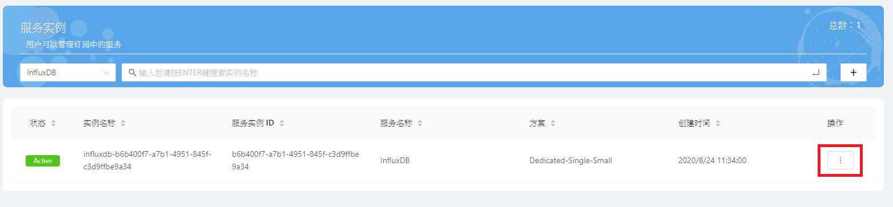
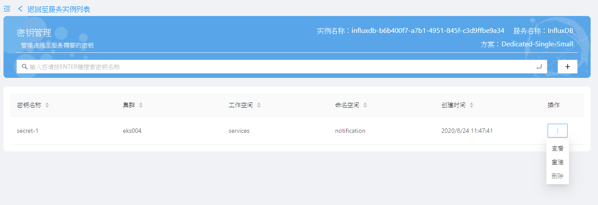
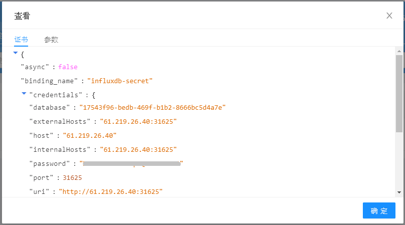
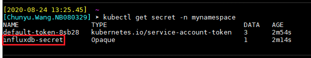
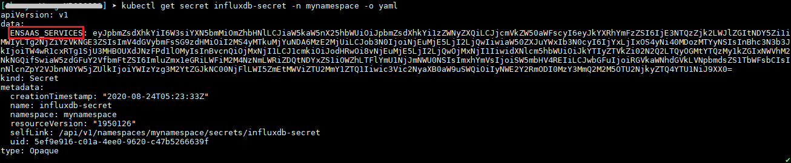

# 查看密钥

本文介紹如何查看創建出來的密鑰，您可以在Service Portal或於K8s集群中檢視創建出的密鑰。

### 於Service Portal查看密鑰

請在登入Service Portal後，點選您的InfluxDB實例的操作按鈕，並選擇密鑰管理。



您會在清單上看到曾經創建的密鑰，請點選操作 > 查看以檢視密鑰內容。



頁面會顯示連線證書內容，連線證書是一組包含數據庫連線位址、連線帳號、連線密碼等資訊的JSON格式文檔。



 * database：字串型態，若是自動產生的名稱，則是標準UUID格式
 * host：字串型態，數據庫所在位址，為內部網路存取位址，IP格式
 * password：字串型態，由小寫英文字母與數字隨機組成，長度為25字元
 * port：數值型態，表示數據庫通訊埠
 * uri：字串型態，格式為http://\<host\>:\<port\>
 * username：字串型態，是標準UUID格式

### 於K8s查看密鑰

完成上述步驟後，您也可以在命名空間裡看到一個同名的密鑰。<br>
查看密鑰內容後，會看到一個Key值為ENSAAS_SERVICES的內容，從kubctl指令看到的是base64編碼後的內容，可將其base64解碼後取得原本的憑證內容。

```shell
$ kubectl -n <namespace> get secret
$ kubectl -n <namespace> get secret <secret_name> -o yaml
```




