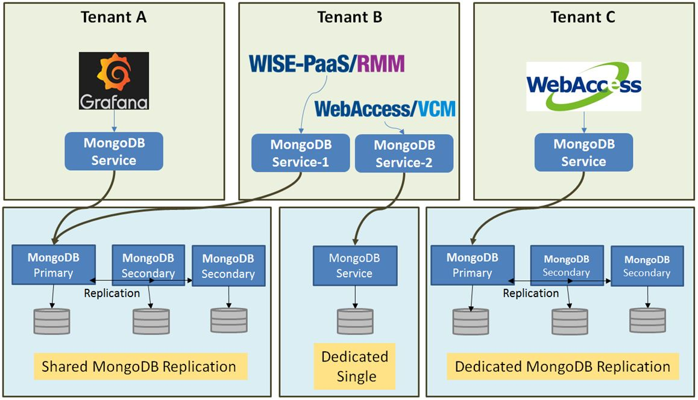
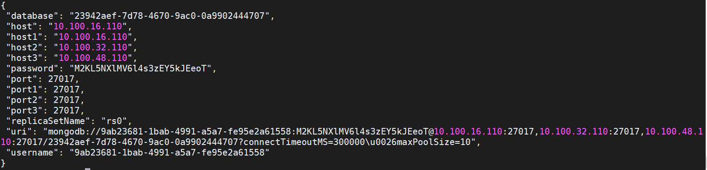

<!-- Document Revision History

2020.02.19

1. Update content for EnSaaS 4.0

-->


# WISE-PaaS NoSQL非關聯式資料庫服務

WISE-PaaS[非關聯式資料庫][2]服務較一般SQL資料庫相比較有彈性，強調Key-Value 文本的方式儲存，儲存方式與[JSON格式][3]完全相同，對於高流量的網站服務、巨量資料的建立索引有著較高的效能，當雲平台應用服務需要進行這類型的訊息儲存時，可透過非關聯式資料庫服務來達成。例如由IoT Hub服務傳送到WISE-PaaS上的資訊可以用此服務儲存管理，介接平台提供的可視化工具了解資料趨勢，以及利用平台的分析服務進行進階加值應用。WISE-PaaS 上非關聯式資料庫是基於[MongoDB][1]建構的資料儲存服務，若想更了解 MongoDB詳細的相關介紹可以參考[Mongo官網][4]。

WISE-PaaS 的非關聯式資料庫服務主要功能包括：
1. 提供多服務層級選擇，使用者可依實際使用需求選擇單節點或是三節點複製模式確保資料高可用性
2. 支援<span style="color:red;">多租戶管理</span>及權限控管，確保<span style="color:red;">資料隔離</span>
3. 提供共享型與專屬型服務，在共享型中您將與其他用戶共用伺服器群的運算資源，專屬型服務則提供您獨立的服務叢集的運算資源。
4. 支援TLS加密安全傳輸連線，確保資料傳輸過程安全性




<center>非關聯式資料庫服務 示意圖</>

## 如何使用非關聯式資料庫服務
-------------------------------------------------------------

### 使用者可透過下列步驟使用非關聯式資料庫服務
1. 購買共享型(Shared)或是專屬型(Dedicated) MongoDB服務
2. 建立Secret並取得連線憑證 Service Credential
3. 將Secret的資訊注入到Kubernetes Pods中
4. 程式在環境變數中獲取連線憑證，並與MonoDB進行連線

### 步驟一：購買共享型或是專屬型MongoDB服務
-------------------------------------------------------------
MongoDB提供共享型及專屬型服務，服務規格如下，如有需要，請至[研華商城](https://wise-paas.advantech.com/zh-tw/marketplace)訂閱購買

- 共享型(Shared DB)：Shared DB搭建在一套運算資源強大且具備高可用的集群上，用戶在集群上共享運算及存儲資源，效能會受到其他用戶的影響，不建議生產環境使用，僅適合開發場景使用。每個服務實例具有空間及訪問次數的限制，容量上限為10GB，超過將會停止寫入權限，僅能查詢或刪除數據，直到空間低於10GB，始能恢復寫入權限；訪問次數限制在每五分鐘1,000次，包含更新、查詢及寫入操作，超過次數將會被限制訪問權限，五分鐘後方能恢復操作。Shared DB無法透過擴容或Pay As You Go方式增加服務容量，每個服務實例容量各別計算，或訂購Dedicated DB。

- 專屬型(Dedicated DB)：Dedicated DB具有獨立的運算及存儲資源，不受其他用戶行為影響，適合生產環境使用。每種服務規格都有固定的運算和存儲資源，若存儲空間不足，用戶可依實際需求在每種規格的基本配置上加購存儲空間。

共享型和專屬型服務規格如下：

|                   | 共享型服務              | 專屬型服務   |
| ------------------ | ----------------------- | ------------ |
| 建議用途            | 開發和測試使用          | 生產環境使用 |
| RAM                | 共享                    | 8GB ~ 32GB   |
| 存儲空間            | 10GB                    | 100GB ~ 2TB  |
| DB數量             | 1                       | 不限         |
| 操作限制           | 每5分鐘 1,000次操作次數 | 不限         |
| 工單支持           | V                       | V            |
| 資料備分           | V                       | V            |
| 外網連線           | X                       | V            |
| 高可用服務等級協議 | X                       | 99.95%       |

用戶可選購的規格如下：

| 方案                 | 規格*                          | 擴容選項            |
| -------------------- | --------------------------------- | ------------------- |
| Shared               | Storage: 10GB, Operation: 1,000   | X                   |
| Single Node - Small  | 2 vCPU, 8GB RAM, 128GB SSD Disk   | 最大支持256GB Disk  |
| Single Node - Medium | 4 vCPU, 16GB RAM, 512GB SSD Disk  | 最大支持1024GB Disk |
| Single Node - Large  | 8 vCPU, 32GB RAM, 1024GB SSD Disk | 最大支持2048GB Disk |
| 3 Nodes HA - Small   | 2 vCPU, 8GB RAM, 128GB SSD Disk   | 最大支持256GB Disk  |
| 3 Nodes HA - Medium  | 4 vCPU, 16GB RAM, 512GB SSD Disk  | 最大支持1024GB Disk |
| 3 Nodes HA - Large   | 8 vCPU, 32GB RAM, 1024GB SSD Disk | 最大支持2048GB Disk |

*: 規格可能依站點而有不同，實際規格依各站點公告為主


### 步驟二：建立Secret並取得連線憑證 Service Credential
---------------------------------------
連線至MongoDB服務前首先確定您擁有下列資訊：

* 已成功購買MongoDB

* <span style="color:red;">Service Portal</span>的登入網址及登入權限

* 您的帳號擁有登入<span style="color:red;">Service Portal</span>的權限

  

各站點Service Portal連結如下

 | 站點代碼  | 所在地點           | Service Portal連結                             |
 | -------- | ----------------- | ---------------------------------------------- |
 | SA       | Azure Singapore   | https://portal-service-ensaas.sa.wise-paas.com |
 | HZ       | Alibaba  Hangzhou | https://portal-service-ensaas.hz.wise-paas.com |
 | JE       | Japan East        | https://portal-service-ensaas.jp.wise-paas.com |

 建立MongoDB的Secret步驟簡述如下，更多建立細節請參考此[Service Portal使用者操作手冊](../../ServicePortal/userguide.md):
 1. 登入Service Portal之後選擇您的MongoDB服務實例
 2. 點選右方操作選項，進入Secret管理頁面
 3. 點選 "+" 號，將mongodb的連線憑證以Secret的方式建立到所選的Namespace中
 4. 或是點選"檢視"，也可以查看當前建出來的連線憑證

 連線憑證是一組包含時間序列資料庫連線位址、連線帳號、連線密碼等資訊的JSON格式文檔，用來驗證使用時間序列資料庫服務對象的身分。

 

 * uri：字串型態，mongodb://\<host1\>:\<port1\>,\<host2\>:\<port2\>,\<host3\>:\<port3\>/\<UUID\>
 * username：字串型態，標準[UUID格式][9]
 * password：字串型態，由小寫英文字母與數字隨機組成，長度為25字元
 * host：字串型態，資料庫所在位址，只提供內部網路存取位址，IP格式
 * port：數值型態，資料庫通訊埠
 * database：字串型態，標準[UUID格式][9]


### 步驟三：將Secret的資訊注入到Kubernetes Pods中
-------------------------------------------------------------

完成上一步驟在Namespace創建Secret後，可以在namespace裡看到一個同名的Secret。查看Secret內容後，會看到一個Key值為ENSAAS_SERVICES的內容，從kubctl指令看到的是base64編碼後的內容，可將其base64解碼後，或是注入到環境變數後取得原本得Credential內容。

```shell
$ kubectl -n my-namespace get secret
$ kubectl -n my-namespace get secret mongodb-secret -o yaml
```


創建一個Pod(以busybox為例)，並將Secret注入到Pod環境變數中，並從環境變數中取得Credential內容

- spec.cotainers.env.name: 注入到Pod的環境變數名稱
- spec.cotainers.env.valueFrom.secretKeyRef.name: 注入的來源為同Namespace底下，名為mongodb-secret的Secret
- pec.cotainers.env.valueFrom.secretKeyRef.key: Secret中的Key值，EnSaaS創建出來的Key名稱固定為"ENSAAS_SERVICES"

```yaml
apiVersion: v1
kind: Pod
metadata:
  name: busybox
  namespace: my-namespace
spec:
  containers:
  - name: busybox
    image: busybox:latest
    env:
    - name: ENSAAS_SERVICES
      valueFrom:
        secretKeyRef:
          name: mongodb-secret
          key: ENSAAS_SERVICES
    command:
      - sleep
      - "3600"
    imagePullPolicy: IfNotPresent
  restartPolicy: Always
```

進入到Pod裡面執行env的指令，就可以取得JSON格式的mongodb credential了

```shell
$ kubectl -n my-namespace exec -ti busybox sh
$ env
```


### 步驟四：程式在環境變數中獲取連線憑證，並與MongoDB進行連線
-------------------------------------------------------------
當您有連線憑證後，您就可以搭配您所熟悉的客戶端應用來使用MongoDB的服務。

* <a class="false-class" href="#!documents/Database/MongoDB/userguide__zh-TW.md#Java開發者">Java開發者</a>
* <a class="false-class" href="#!documents/Database/MongoDB/userguide__zh-TW.md#Python開發者">Python開發者</a>
* <a class="false-class" href="#!documents/Database/MongoDB/userguide__zh-TW.md#NodeJs開發者">NodeJs開發者</a>

## Java開發者

在Java中您可以使用JSON來對Credential JSON進行解析，以下為使用Maven引入JSON lib的範例：

```
<repositories>
    <dependency>
        <groupId>org.json</groupId>
        <artifactId>json</artifactId>
        <version>20160810</version>
    </dependency>
</repositories>

```

取得MongoDB服務連線帳號/密碼範例如下:

```
import org.json.JSONObject;

JSONObject ensaasServices = new JSONObject(System.getenv("ENSAAS_SERVICES"));

String mongoUri = ensaasServices.getJSONArray("mongodb").getJSONObject(0).getJSONObject("credentials").getJSONObject("uri");
String mongoDatabase = ensaasServices.getJSONArray("mongodb").getJSONObject(0).getJSONObject("credentials").getJSONObject("database");
String mongoHost1 = ensaasServices.getJSONArray("mongodb").getJSONObject(0).getJSONObject("credentials").getJSONObject("host1");
String mongoPort1 = ensaasServices.getJSONArray("mongodb").getJSONObject(0).getJSONObject("credentials").getJSONObject("port1");
String mongoUsername = ensaasServices.getJSONArray("mongodb").getJSONObject(0).getJSONObject("credentials").getJSONObject("username");
String mongoPassword = ensaasServices.getJSONArray("mongodb").getJSONObject(0).getJSONObject("credentials").getJSONObject("password");
```
---------------------------------------

## Python開發者

取得MongoDB服務連線帳號/密碼範例如下:

```
import os
import json

#Load 'ENSAAS_SERVICES' from enviroment variable and parse the URI
ensaas_services = os.getenv('ENSAAS_SERVICES')
ensaas_services = json.loads(ensaas_services)
mongo_uri = ensaas_services['mongodb'][0]['credentials']['uri']
mongo_database = ensaas_services['mongodb'][0]['credentials']['database']
mongo_host1 = ensaas_services['mongodb'][0]['credentials']['host1']
mongo_port1 = ensaas_services['mongodb'][0]['credentials']['port1']
mongo_user = ensaas_services['mongodb'][0]['credentials']['username']
mongo_password = ensaas_services['mongodb'][0]['credentials']['password']
```

---------------------------------------

## NodeJs開發者

取得MongoDB服務連線帳號/密碼範例如下:

```
ensaas_services = process.env.ENSAAS_SERVICES
mongo_uri = ensaas_services.mongodb[0].credentials.uri
mongo_database = ensaas_services.mongodb[0].credentials.database
mongo_host1 = ensaas_services.mongodb[0].credentials.host1
mongo_port1 = ensaas_services.mongodb[0].credentials.port1
mongo_user = ensaas_services.mongodb[0].credentials.username
mongo_password = ensaas_services.mongodb[0].credentials.password
```
---------------------------------------
[1]:https://zh.wikipedia.org/zh-tw/MongoDB "MongoDB"
[2]:https://zh.wikipedia.org/wiki/NoSQL "NoSQL"
[3]:https://zh.wikipedia.org/wiki/JSON "JSON"
[4]:https://www.mongodb.com/ "MongoDB 官方網站"
[5]:https://docs.mongodb.com/manual/ "MongoDB Manual"
[6]:https://docs.mongodb.com/manual/tutorial/install-mongodb-on-ubuntu "MongoDB Client install"
[7]:https://robomongo.org/ "MongoDB UI "
[8]:http://wise-paas.advantech.com/zh-tw/marketplace/detailinfo/41 "儲存空間"
[9]:https://en.wikipedia.org/wiki/Universally_unique_identifier "UUID"

