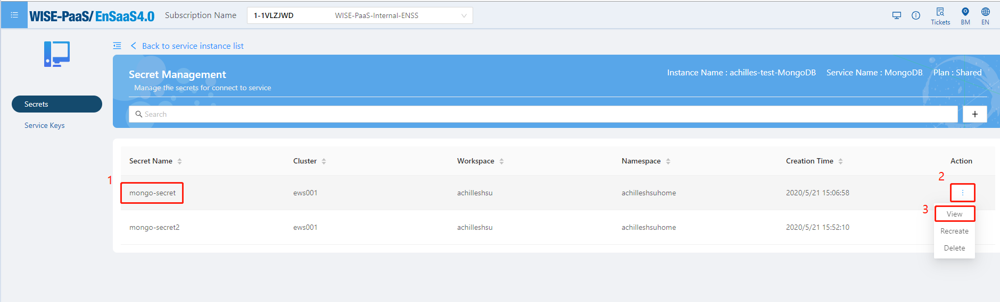
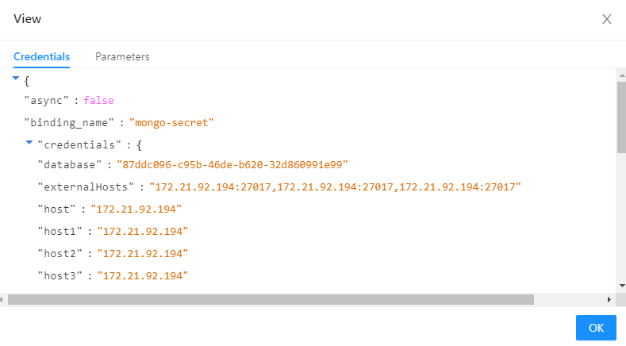
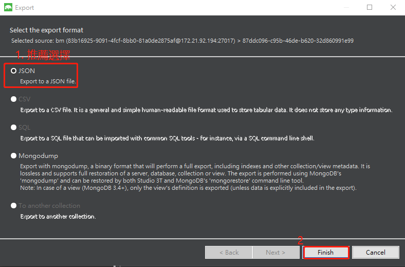
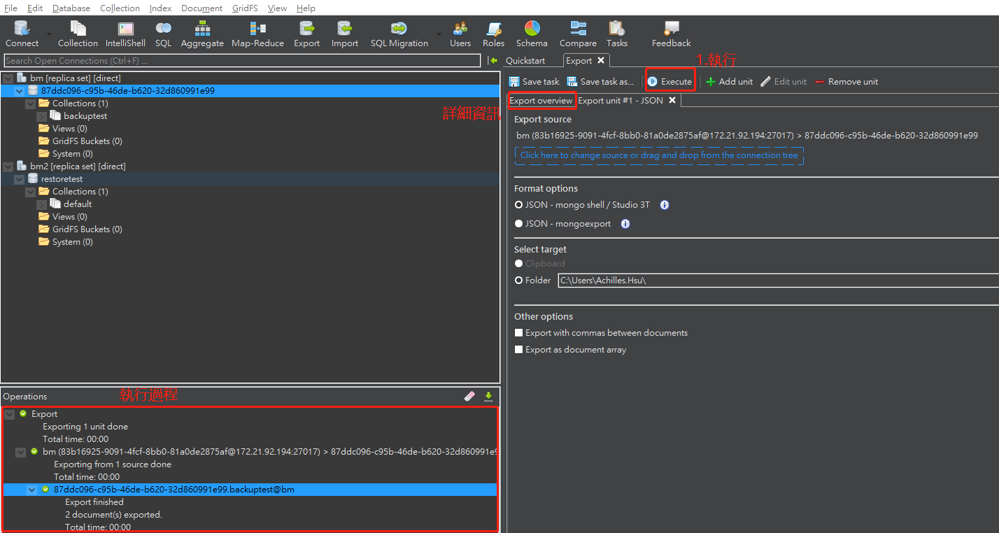
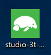
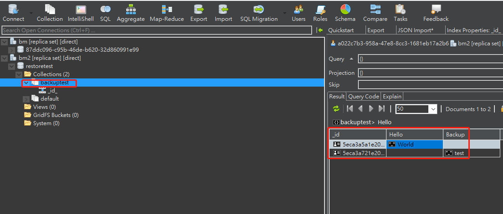
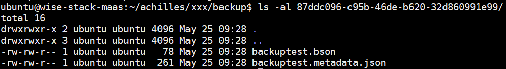

# MongoDB 数据库备份还原SOP

本文将为您介绍如何备份还原MongoDB数据。

备份与还原元件提供基本的防护措施，可保护储存于数据库中所储存的重要数据。若要将重大数据遗失的风险降至最低，您必须定期备份数据库，以定期保存您对数据所做的修改。您可以在数据库不繁忙的时间规划持续的备份策略，防止对数据库的性能影响。

## 定期备份优点

定期备份数据库，并将备份的复本储存在安全的异地位置，即可避免可能发生的重大数据遗失。**备份是保护数据的的唯一方法。**

使用有效的数据库备份，就可以从多种失败中复原数据，例如：
- 天然灾害（策略：利用不同区域的储存装置储存备份数据）
- 系统错误（例如：断电、网络问题或其他硬件或软件导致数据库服务中断）
- 使用者操作错误（例如：不小心卸除数据表）
- 储存媒体故障（例如：磁碟机损坏或服务器永久损毁）

此外，定期的数据库备份的档案，可以利用还原功能来进行数据迁移工作。

## 前提条件

- 如果备份整个数据库服务需要从管理员处获取Admin账号。
- 如果要备份单个数据库实例，可以从Service Portal上获取账号信息。

## 获取密钥方式

我们可以透过Service Portal去取得数据库的连接账密，请先登入Service Portal。

| 站点 | Url | 
| --- | --- |
| SA | https://portal-service-ensaas.sa.wise-paas.com/ |
| HZ | https://portal-service-ensaas.hz.wise-paas.com.cn/ |
| JE | https://portal-service-ensaas.jp.wise-paas.com/ |

取得密钥操作步骤

1.输入您的使用者帐号密码登入。


2.点选您的订阅号（必须是该订阅号的admin或是user才可以看得到），选择服务。


3.找到您购买的mongodb服务，点选Secret Management。


4.找到您欲查询的密钥，点选view。



5.即可看到密钥详细信息。


 

## 使用Windows操作系统备份还原SOP

### 备份

于windows中会使用到的工具为开源软件[mongo Studio 3T](https://studio3t.com/)。

1.请先至此[地址](https://studio3t.com/download-thank-you/?OS=win64)进行下载。


2.点选存盘。


3.下载完成后，对压缩档点选右键，选择解压缩至此。


4.点选studio-3t-x64.exe安装，允许APP变更您的装置（选择“是”）。


5.点选next --> next --> next --> finish


6.点选“crate a new connextion”，即可以输入您的相关密钥内容，Server地址和Port。


7.选择Authentication分页，Authentication Mode选择Basic（SCRAM-SHA-256），输入您的相关密钥内容User name、Passwrod和Authentication DB位置，点选save。


8.点选Connect。


9.选择想要进行备份动作的Database，右键Export Collections…


10.推荐选择JSON，点选Finish。



11.点选执行，可以于左边菜单字段Export Overview查看档案存放位置和详细细节。



12.备份完成。


### 还原

1.在桌面菜单执行Studio 3T。



2.点选“crate a new connextion”，即可以输入您的相关密钥内容，Server地址和Port。


3.选择Authentication分页，Authentication Mode选择Basic（SCRAM-SHA-256），输入您的相关密钥内容User name、Passwrod和Authentication DB位置，点选save。


4.点选您的新服务名称，点选Connect。


5.选择想要进行还原动作的Database，右键Import Collections…


6.选择您欲还原的档案，本示例使用的是JSON - mongo shell / Studio 3T / mongoexport。


7.选择备份步骤11显示的档案存放文件夹，点选选择文件夹内的[collection].json。


8.点选上方Execute，可以查看左下方执行结果，并且检查新的collection内容是否有误。


9.还原完成。



## 使用Linux操作系统备份还原SOP

### 备份

本篇文章中使用到 ubuntu 18.04 和 mongodb-client工具进行备份动作。

1. 透過指令安裝mongodb-client。
```
sudo apt-key adv --keyserver hkp://keyserver.ubuntu.com:80 --recv 4B7C549A058F8B6B
echo "deb [ arch=amd64 ] https://repo.mongodb.org/apt/ubuntu bionic/mongodb-org/4.2 multiverse" | sudo tee /etc/apt/sources.list.d/mongodb.list
sudo apt update
sudo apt install mongodb-clients
```


2. 确认安装完成。
```
mongodump --version
```


3. 备份数据库。
```
mongodump --forceTableScan --host $old_ip --port $old_port --username $old_root --password $old_root_password --db $old_database --authenticationDatabase $old_authdb --out ./backup
```


4. 备份完成。


### 还原

1. 还原数据库，使用如下指令。
```
mongorestore --host $new_ip --port $new_port --username $new_root --password $new_root_password --db $new_database --authenticationDatabase $new_authdb ./backup/$old_database
```


2. 使用指令连进去mongodb里。
```
mongo --host $new_ip --port $new_port --username $new_root --password $new_root_password --authenticationDatabase $new_authdb
use $new_authdb
show collections
```


3. 还原成功。


