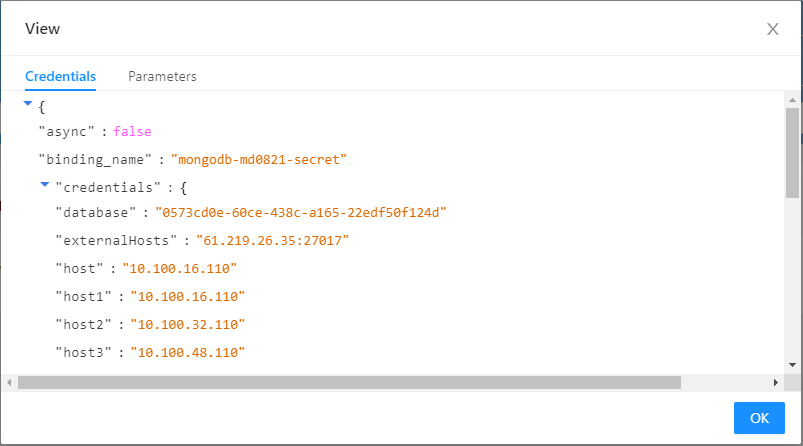
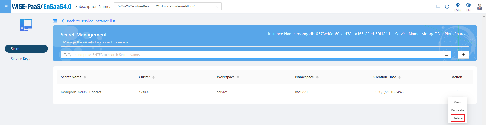

# 常见问题

**一、订阅了一个Instance，可以被多个App使用吗？可以被多个workspace使用吗？**

1. 一个Instance可以被多个App使用，但是一个Shared DB不能被两个相同的App使用，比如两个Dashboard或者两个Datahub，因为两个相同的App具有相同的Schema，数据会被覆盖；
2. 一个Instance可以被同一个订阅号下的多个workspace或者namespace使用；

**二、如何查看数据库的连接信息？**

1. 登录Service Portal，目前仅有订阅号Admin和订阅号User有权限查看订阅的Instance，不同站点的Service Portal地址如下：

| 站点代码 | 服务           | 站点地点          | 站点链接                                          |
| -------- | -------------- | ----------------- | ------------------------------------------------- |
| SA       | Service Portal | Azure Singapore   | https://portal-service-ensaas.sa.wise-paas.com    |
| HZ       | Service Portal | Alibaba  Hangzhou | https://portal-service-ensaas.hz.wise-paas.com.cn |
| JE       | Service Portal | Japan East        | https://portal-service-ensaas.jp.wise-paas.com    |

2. 在Instance页面点击Secret管理，进入Secret管理页面：

   

3. 选择App使用的Secret，点击View，查看Secret信息：	

   

4. Secret信息如下，即数据库的连接信息：

   

**三、如何获取数据库的外部连接地址？**

Dedicated DB的外部连线信息可以从Secret中获取，Secret的查看方法可以参见上面问题，Credentials中的externalHosts即为外部连接地址。

目前Shared DB暂时没有提供外部连线地址，我们正在开发DB webctl，开发好后可以通过webctl连接DB。

**四、如何升级Shared DB为Dedicated DB？** 

1. 订阅一个Dedicated MongoDB，订阅方法请参考《快速入门》；

2. 如果需要迁移数据，请先联系SRE迁移数据：WISE-PaaS.SRE@advantech.com.cn；

3. 登录Service Portal，将Shared DB Instance中创建的Secret删掉，删掉之前记录下Secret的名称；

4. 在Dedicated DB Instance中创建同名的Secret，并指定相同的参数；

5. 重启App

**五、如何将一个App从一个DB Instance迁移到另一个DB Instance？** 

用户如果订购了多个MongoDB实例，想将一个App从一个DB Instance1迁移到另一个DB Instance2，步骤如下：

1. 如果需要迁移数据，请先联系SRE迁移数据：WISE-PaaS.SRE@advantech.com.cn；

2. 登录Service Portal，将DB Instance1中创建的MongoDB Secret删掉（WISE-PaaS平台提供的App使用的Secret名称有一定规范，格式为：ServiceName-NamespaceName-secret，所以根据App名称可以找到其对应的Secret），删掉之前记录下Secret的名称；

   

3. 在DB Instance2中创建同名的Secret；

4. 重启App