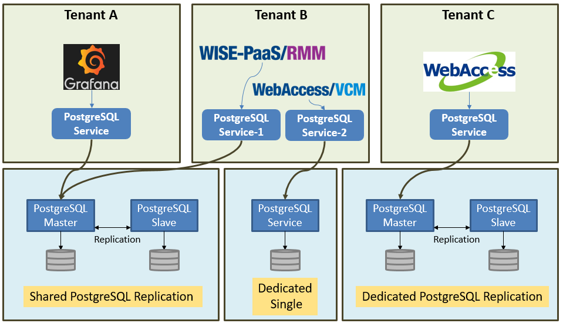
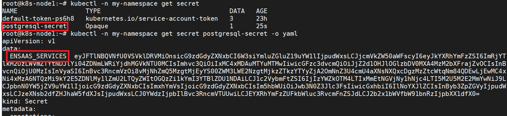
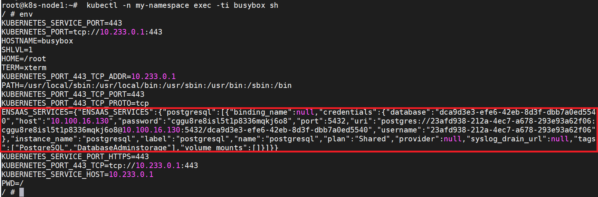

<!-- Document Revision History

2020.02.20

1. Update content for EnSaaS 4.0

-->


# WISE-PaaS 關聯式資料庫服務
WISE-PaaS關聯式資料庫服務是一種物件關聯式資料庫管理系統(Object-Relational Database Management)，結合關聯式資料庫與物件導向資料庫兩種功能，能夠儲存非結構的資料，如影像、文件等，提供使用者多元的儲存方式，當雲平台應用服務需要進行訊息儲存時，可透過關聯式資料庫服務來達成。例如由IoT Hub服務傳送到WISE-PaaS上的資訊可以用此服務儲存管理，介接平台提供的可視化工具了解資料趨勢，以及利用平台的分析服務進行進階加值應用。WISE-PaaS 上關聯式資料庫是基於[PostgreSQL][4]建構的資料儲存服務，若想更了解 PostgreSQL 詳細的相關介紹可以參考[PostgreSQL官網][3]。

WISE-PaaS 的關聯式資料庫服務主要功能包括：

1. 支援SSL加密安全傳輸連線，確保資料傳輸過程安全性
2. 提供共享型與專屬型服務，在共享型中您將與其他用戶共用服務伺服器群的運算資源，專屬型服務則提供您獨立的服務叢集的運算資源
3. 支援<span style="color:red;">多租戶管理</span>及權限控管，確保<span style="color:red;">資料隔離</span>
4. 提供多服務層級選擇，使用者可依實際使用需求選擇單節點或是雙節點複製模式確保資料高可用性
5. 透過[Group][5]機制實現多階層權限控管，即使在相同DB裡面也能區分不同的權限


<td align="center">關聯式資料庫服務 示意圖</td>

## 如何使用關聯式資料庫服務
---------------------------------------
#### 使用者可透過下列步驟使用關聯式資料庫服務
1. 購買共享型(Shared)或是專屬型(Dedicated) PostgreSQL服務
2. 建立Secret並取得連線憑證 Service Credential
3. 將Secret的資訊注入到Kubernetes Pods中
4. 程式在環境變數中獲取連線憑證，並與PostgreSQL進行連線
5. 進階管理

### 步驟一：購買共享型或是專屬型PostgreSQL服務
--------------------------------------------------
PostgreSQL提供共享型及專屬型服務，服務規格如下，如有需要，請至[研華商城](https://wise-paas.advantech.com/zh-tw/marketplace)訂閱購買

- 共享型(Shared DB)：Shared DB搭建在一套運算資源強大且具備高可用的集群上，用戶在集群上共享運算及存儲資源，效能會受到其他用戶的影響，不建議生產環境使用，僅適合開發場景使用。每個服務實例具有空間及訪問次數的限制，容量上限為10GB，超過將會停止寫入權限，僅能查詢或刪除數據，直到空間低於10GB，始能恢復寫入權限；訪問次數限制在每五分鐘1,000次，包含更新、查詢及寫入操作，超過次數將會被限制訪問權限，五分鐘後方能恢復操作。Shared DB無法透過擴容或Pay As You Go方式增加服務容量，每個服務實例容量各別計算，或訂購Dedicated DB。

- 專屬型(Dedicated DB)：Dedicated DB具有獨立的運算及存儲資源，不受其他用戶行為影響，適合生產環境使用。每種服務規格都有固定的運算和存儲資源，若存儲空間不足，用戶可依實際需求在每種規格的基本配置上加購存儲空間。

共享型和專屬型服務規格如下：

|                    | 共享型服務              | 專屬型服務                                                |
| ------------------ | ----------------------- | --------------------------------------------------------- |
| 建議用途           | 開發和測試使用          | 生產環境使用                                              |
| RAM                | 共享                    | 8GB ~ 32GB                                                |
| 存儲空間           | 10GB                    | 100GB ~ 2TB                                               |
| DB數量             | 1                       | 不限                                                      |
| 操作限制           | 每5分鐘 1,000次操作次數 | 不限                                                      |
| 連線數限制         | 100                     | 每個DB各100條連線數，<br />但不得超過各種規格的連線數上限 |
| 工單支持           | V                       | V                                                         |
| 資料備分           | V                       | V                                                         |
| 外網連線           | X                       | V                                                         |
| 高可用服務等級協議 | X                       | 99.95%                                                    |

用戶可選購的規格如下：

| 方案                 | 規格*                          | 擴容選項            |
| -------------------- | --------------------------------- | ------------------- |
| Shared               | Storage: 10GB, Operation: 1,000   | X                   |
| Single Node - Small  | 2 vCPU, 8GB RAM, 128GB SSD Disk   | 最大支持256GB Disk  |
| Single Node - Medium | 4 vCPU, 16GB RAM, 512GB SSD Disk  | 最大支持1024GB Disk |
| Single Node - Large  | 8 vCPU, 32GB RAM, 1024GB SSD Disk | 最大支持2048GB Disk |
| 3 Nodes HA - Small   | 2 vCPU, 8GB RAM, 128GB SSD Disk   | 最大支持256GB Disk  |
| 3 Nodes HA - Medium  | 4 vCPU, 16GB RAM, 512GB SSD Disk  | 最大支持1024GB Disk |
| 3 Nodes HA - Large   | 8 vCPU, 32GB RAM, 1024GB SSD Disk | 最大支持2048GB Disk |

*: 規格可能依站點而有不同，實際規格依各站點公告為主


### 步驟二：建立Secret並取得連線憑證 Service Credential
---------------------------------------
連線至PostgreSQL服務前首先確定您擁有下列資訊：

* 已成功購買PostgreSQL

* <span style="color:red;">Service Portal</span>的登入網址及登入權限

* 您的帳號擁有登入<span style="color:red;">Service Portal</span>的權限

  

各站點Service Portal連結如下

 站點代碼 | 所在地點          | Service Portal連結                             |
 | -------- | ----------------- | ---------------------------------------------- |
 | SA       | Azure Singapore   | https://portal-service-ensaas.sa.wise-paas.com |
 | HZ       | Alibaba  Hangzhou | https://portal-service-ensaas.hz.wise-paas.com |
 | JE       | Japan East        | https://portal-service-ensaas.jp.wise-paas.com |

 建立PostgreSQL的Secret步驟簡述如下，更多建立細節請參考此[Service Portal使用者操作手冊](../../ServicePortal/userguide.md):
 1. 登入Service Portal之後選擇您的PostgreSQL服務實例
 2. 點選右方操作選項，進入Secret管理頁面
 3. 點選 "+" 號，將postgresql的連線憑證以Secret的方式建立到所選的Namespace中
 4. 或是點選"檢視"，也可以查看當前建出來的連線憑證

 連線憑證是一組包含時間序列資料庫連線位址、連線帳號、連線密碼等資訊的JSON格式文檔，用來驗證使用時間序列資料庫服務對象的身分。

 

 * uri：字串型態，mongodb://\<host1\>:\<port1\>,\<host2\>:\<port2\>,\<host3\>:\<port3\>/\<UUID\>
 * username：字串型態，標準[UUID格式][9]
 * password：字串型態，由小寫英文字母與數字隨機組成，長度為25字元
 * host：字串型態，資料庫所在位址，只提供內部網路存取位址，IP格式
 * port：數值型態，資料庫通訊埠
 * database：字串型態，標準[UUID格式][9]


### 步驟三：將Secret的資訊注入到Kubernetes Pods中
-------------------------------------------------------------

完成上一步驟在Namespace創建Secret後，可以在namespace裡看到一個同名的Secret。查看Secret內容後，會看到一個Key值為ENSAAS_SERVICES的內容，從kubctl指令看到的是base64編碼後的內容，可將其base64解碼後，或是注入到環境變數後取得原本得Credential內容。

```shell
$ kubectl -n my-namespace get secret
$ kubectl -n my-namespace get secret postgresql-secret -o yaml
```



創建一個Pod(以busybox為例)，並將Secret注入到Pod環境變數中，並從環境變數中取得Credential內容

- spec.cotainers.env.name: 注入到Pod的環境變數名稱
- spec.cotainers.env.valueFrom.secretKeyRef.name: 注入的來源為同Namespace底下，名為postgresql-secret的Secret
- pec.cotainers.env.valueFrom.secretKeyRef.key: Secret中的Key值，EnSaaS創建出來的Key名稱固定為"ENSAAS_SERVICES"

```yaml
apiVersion: v1
kind: Pod
metadata:
  name: busybox
  namespace: my-namespace
spec:
  containers:
  - name: busybox
    image: busybox:latest
    env:
    - name: ENSAAS_SERVICES
      valueFrom:
        secretKeyRef:
          name: postgresql-secret
          key: ENSAAS_SERVICES
    command:
      - sleep
      - "3600"
    imagePullPolicy: IfNotPresent
  restartPolicy: Always
```

進入到Pod裡面執行env的指令，就可以取得JSON格式的postgresql credential了

```shell
$ kubectl -n my-namespace exec -ti busybox sh
$ env
```




### 步驟四：將連線憑證加入您的Client中與關聯式資料庫連線

---------------------------------------
當您有連線憑證後，您就可以搭配您所熟悉的客戶端應用來使用關聯式資料庫的服務。

### 關聯式資料庫服務連線憑證
---------------------------------------
當您有連線憑證後，您就可以搭配您所熟悉的客戶端應用來使用PostgreSQL的服務。

* <a class="false-class" href="#!documents/Database/PostgreSQL/userguide__zh-TW.md#Java開發者">Java開發者</a>

* <a class="false-class" href="#!documents/Database/PostgreSQL/userguide__zh-TW.md#Python開發者">Python開發者</a>
* <a class="false-class" href="#!documents/Database/PostgreSQL/userguide__zh-TW.md#NodeJs開發者">NodeJs開發者</a>

## Java開發者
在Java中您可以使用json來對Credential JSON進行解析，以下為使用Maven引入json lib的範例：

```
<repositories>
    <dependency>
        <groupId>org.json</groupId>
        <artifactId>json</artifactId>
        <version>20160810</version>
    </dependency>
</repositories>

```

取得PostgreSQL服務連線帳號/密碼範例如下:
```
import org.json.JSONObject;

JSONObject vcapServices = new JSONObject(System.getenv("ENSAAS_SERVICES"));

String pgUri = vcapServices.getJSONArray("postgresql").getJSONObject(0).getJSONObject("credentials").getJSONObject("uri");
String pgDatabase = vcapServices.getJSONArray("postgresql").getJSONObject(0).getJSONObject("credentials").getJSONObject("database");
String pgHost = vcapServices.getJSONArray("postgresql").getJSONObject(0).getJSONObject("credentials").getJSONObject("host");
String pgPort = vcapServices.getJSONArray("postgresql").getJSONObject(0).getJSONObject("credentials").getJSONObject("port");
String pgUser = vcapServices.getJSONArray("postgresql").getJSONObject(0).getJSONObject("credentials").getJSONObject("username");
String pgPasssword = vcapServices.getJSONArray("postgresql").getJSONObject(0).getJSONObject("credentials").getJSONObject("password");

```
## Python開發者
取得PostgreSQL服務連線帳號/密碼範例如下:

```
import os
import json

# Load 'ENSAAS_SERVICES' from enviroment variable and parse the URI 
ensaas_services = os.getenv('ENSAAS_SERVICES')
ensaas_services = json.loads(ensaas_services)
postgres_uri = ensaas_services['postgresql'][0]['credentials']['uri']
postgres_database = ensaas_services['postgresql'][0]['credentials']['database']
postgres_host = ensaas_services['postgresql'][0]['credentials']['host']
postgres_port = ensaas_services['postgresql'][0]['credentials']['port']
postgres_user = ensaas_services['postgresql'][0]['credentials']['username']
postgres_password = ensaas_services['postgresql'][0]['credentials']['password']

```
## NodeJs開發者
取得PostgreSQL服務連線帳號/密碼範例如下:

```
ensaas_services = process.env.ENSAAS_SERVICES
postgres_uri = ensaas_services.postgresql[0].credentials.uri
postgres_database = ensaas_services.postgresql[0].credentials.database
postgres_host = ensaas_services.postgresql[0].credentials.host1
postgres_port = ensaas_services.postgresql[0].credentials.port1
postgres_user = ensaas_services.postgresql[0].credentials.username
postgres_password = ensaas_services.postgresql[0].credentials.password
```

## 進階管理
-----------------------------------
#### 訂閱服務與隔離機制相關規格
以下針對使用者訂閱共用型服務，所得到或可以使用的參數做整理，讓使用者更容易了解權限和相關操作方法。
* 綁定服務前需要先訂閱一個服務
* 不同APP綁定同一個已訂閱的服務，會共用同一個資料庫
* 使用者只有讀取/寫入資料的權限，無法建立、切換、刪除資料庫
* 將APP重新綁定會取得不同的連線憑證Credential

WISE-PaaS/PostgreSQL服務加入了group的概念，依照綁定時的參數，使用者可能存在不同的group中，以下說明有用到的或特殊功能的group名稱
* Instance ID：此group與資料庫名稱同名，使用者綁定服務時，不論有無帶入group參數，都會被加入這個group中，通常使用者在資料需要分享給其他服務時綁定相同的訂閱服務。只要將schema及table的權限賦予給這個group，就可以分享給其他相同group的應用程式。
* g_ro_public：在此group的使用者，對於public schema只有讀取的權限， APP應用程式在綁定服務時，不論有無帶入group參數，都會被加入這個group中。
* g_rw_public：在此group的使用者，對於public schema具有read/write的權限， applications bind service時，帶入”g_rw_public” group參數，就可以加入這個group中。
* 客製化：使用者自行定義group名稱，通常使用在同一個APP應用程式升級不同版本時需要使用同一份資料。

### Binding參數規格
* 僅支援手動binding的方式，不支援透過manifest自動binding的方式
* 僅支援group及groups參數，綁定後使用者帳號會被加入group中
* 僅允許輸入\[A-Z\]\[a-z\]\[0-9\]以及 _ (底線)，長度限制為63個字元
* Public schema預設為所有人Read only，只有”g_rw_public” group成員才能讀寫。
Credential包含以下內容
* uri：字串型態，postgres://\<username\>:\<password\>@\<host\>:\<port\>/\<database\>
* username：字串型態，標準[UUID格式][7]
* password：字串型態，由小寫英文字母與數字隨機組成，長度為25字元
* host：字串型態，關聯式資料庫所在位址，只提供內部網路存取位址，IP格式
* port：數值型態，關聯式資料庫通訓埠
* database：字串型態，標準[UUID格式][7]

## 關聯式資料庫服務group 操作情境範例

Group機制區隔使用者的操作權限，如下圖是綁定group後對應到的Schema權限。


<td align="center">Group機制 示意圖</td>

除了能夠正常存取資料庫資料外，還有APP資料公開或是保密的情境，除了操作Service Instance 綁定的動作，還需要對DB下適當的權限指令讓另一個APP使用，以下分別為這三個情境分步驟描述。

### 情境1: 與其他APP共用資料
本情境可指定 group 也可以不指定，範例為不指定group。
1.  創建Secret時不帶入參數 (使用預設的instance id為groupName)。
2.  app 建立自己擁有的schema或表格後，將owner指定給instanceID，其語法如下:
    ```
    CREATE SCHEMA IF NOT EXISTS "testSchema";
    ALTER SCHEMA "testSchema" OWNER TO "<instanceID>";
    CREATE TABLE IF NOT EXISTS testSchema.testTable;
    ALTER TABLE testSchema.testTable OWNER to "<instanceID>";
    GRANT ALL ON ALL TABLES IN SCHEMA "testSchema" TO "<instanceID>";
    GRANT ALL ON ALL SEQUENCES IN SCHEMA "testSchema" TO "<instanceID>"; 
    ```
3.  上傳新的app2並且訂閱相同的服務但不帶參數。
4.  因使用者被創建時，兩者都擁有instanceID group，所以都可以存取testSchema中的資料。
### 情境2: 不與其他APP共用資料
本情境可指定 group 也可以不指定，範例為指定group。
1.  app 訂閱帶入自訂group參數，group名稱為g_group。
2.  建立自己擁有的表格，並將權限提供給指定的group。
    ```
    CREATE SCHEMA IF NOT EXISTS "testSchema";
    ALTER SCHEMA "testSchema" OWNER TO "g_group";
    CREATE TABLE IF NOT EXISTS testSchema.testTable;
ALTER TABLE testSchema.testTable OWNER to "g_group";
    GRANT ALL ON ALL TABLES IN SCHEMA "testSchema" TO "g_group";
    GRANT ALL ON ALL SEQUENCES IN SCHEMA "testSchema" TO "g_group"; 
    ```
    
3.  創建一個新的Secret，不帶或是帶入其他group參數，用此secret登入PostgreSQL就無法看到g_group的資料


[1]:https://www.postgresql.org/download/ "postgresql client"
[2]:https://www.pgadmin.org/ "postgresql pgAdmin"
[3]:https://www.postgresql.org/ "postgresql 官網"
[4]:https://zh.wikipedia.org/zh-tw/PostgreSQL "postgresql wiki"
[5]:https://www.postgresql.org/docs/current/static/sql-creategroup.html "postgresql group"
[6]:http://wise-paas.advantech.com/zh-tw/marketplace/detailinfo/41 "儲存空間"
[7]:https://en.wikipedia.org/wiki/Universally_unique_identifier "UUID"
