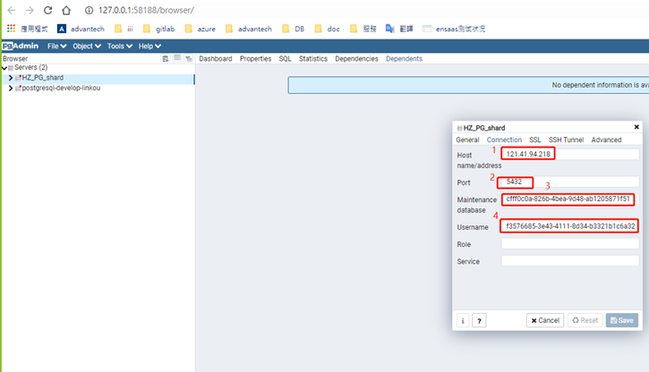
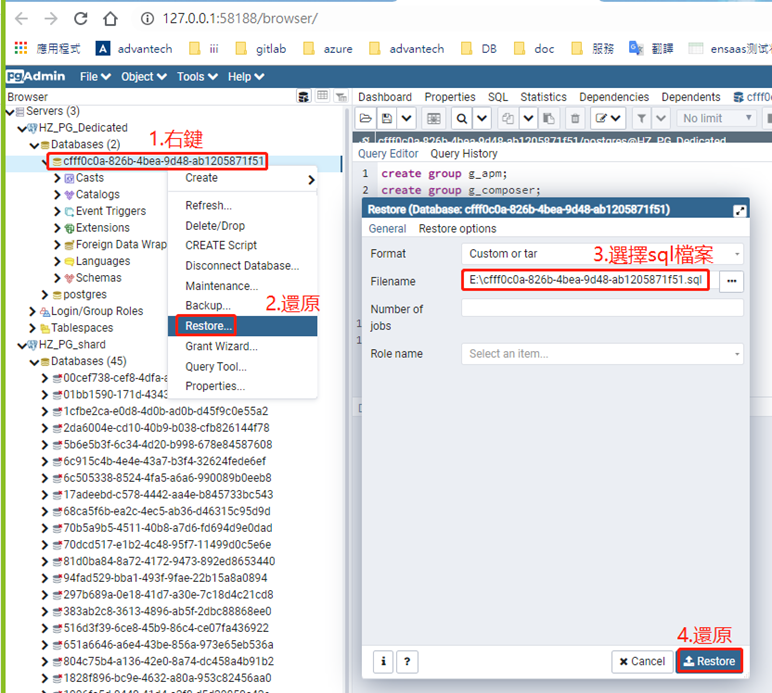

# 备份还原

本文将为您介绍如何备份还原PostgreSQL数据。

## Shared DB

目前Shared DB不提供外部连接地址，用户不能自助进行数据的备份还原，如果有需要请联系[WISE-PaaS.SRE@advantech.com](mailto:WISE-PaaS.SRE@advantech.com)。

## Dedicated DB
下面介绍如何使用pgAdmin对Dedicated PostgreSQL进行备份还原，可以为订购Dedicated PostgreSQL的用户提供Admin账号。

### BackUp

1. 使用Admin账号登录数据库




2. 备份数据

   

   

   请使用下面语句获取database中的group信息，还原的时候要先创建group，不然还原会出错：

```
select distinct rol.rolname as owner
from pg_class cls
  join pg_roles rol on rol.oid = cls.relowner
  join pg_namespace nsp on nsp.oid = cls.relnamespace
where nsp.nspname not in ('information_schema', 'pg_catalog')
  and nsp.nspname not like 'pg_toast%';
```


   ### Restore

   1. 登录需要还原的数据库，新建DB（与原DB名称相同）

   

   2. 创建Group

   

   3. 还原数据




