# 快速入门

## 使用流程

快速入门旨在介绍如何创建PostgreSQL实例，获取Secret连接实例数据库，使用户能够了解从购买PostgreSQL实例到开始使用实例的流程。

### 快速入门流程

通常，从新购实例到可以开始使用实例，您需要完成如下操作。

1. [登录EnSaaS Catalog](#step1登录ensaas-catalog)
2. [创建PostgreSQL实例](#step2创建postgresql实例)
3. [创建Secret](#step3创建secret)
4. [查看Secret](#step4查看secret)
5. [使用Secret连接PostgreSQL实例](#step5使用secret连接postgresql实例)

### 前提条件

- 已注册研华会员。
- 请确保您的账号余额大于要购买的服务价格。

### Step1：登录EnSaaS Catalog

1. 登入 [EnSaaS Portal](https://portal-catalog-ensaas.sa.wise-paas.com/)，选择 EnSaaS 数据中心。

请根据您正式订阅 WISE-PaaS 云服务时的数据中心进行选择，推荐 Global 使用者选择 Azure Singapore 数据中心，中国区域使用者选择阿里云杭州数据中心，日本区域使用者选择 Japan East 数据中心。


2. 点击 「 MyAdvantech 」，以 MyAdvantech 账号登入 EnSaaS Portal。

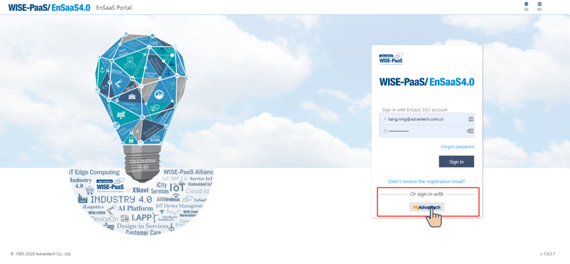


3. 填入 MyAdvantech 帐密，以 MyAdvantech 账号登入。

首次以MyAdvantech账号登入 EnSaaS Portal，会弹出提示窗提示您同意将 MyAdvantech 账号与 EnSaaS/SSO账号绑定。若您尚未开通 EnSaaS/SSO 账号，在此过程中会自动为您创建 EnSaaS/SSO 账号，并将包含预设 SSO 帐密的注册信发送到您的信箱。在后续的登入中您可以根据需要选择直接使用 EnSaaS/SSO 帐密登入，或以 MyAdvantech 帐密登入。

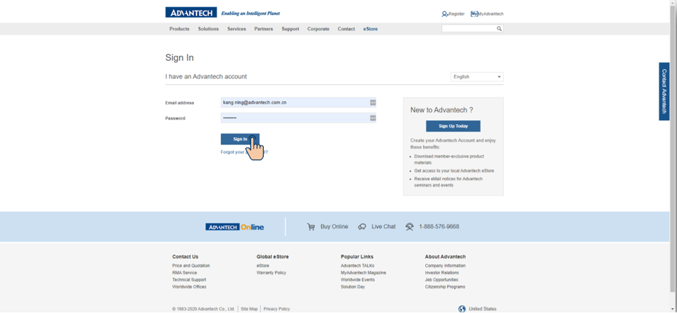

4. 登入 EnSaaS Catalog，选择和确认订阅号。

如果您有多个 EnSaaS 4.0 订阅号，登入后提醒您先选择和确认要订阅云服务的订阅号。

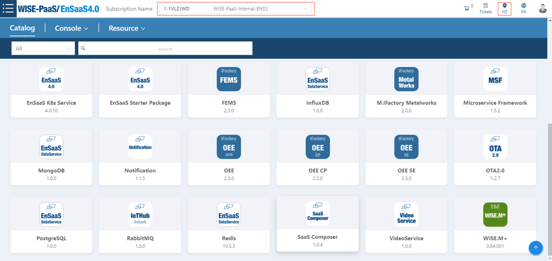


### Step2：创建PostgreSQL实例

您可以通过WISE-PaaS云服务市场或者直接登录EnSaaS Catalog订阅PostgreSQL服务，订阅成功后就会创建PostgreSQL实例。本文介绍如何通过EnSaaS Catalog订阅PostgreSQL服务。

1. 选择要购买的PostgreSQL服务，如果服务太多，也可以通过搜索框进行搜索。

   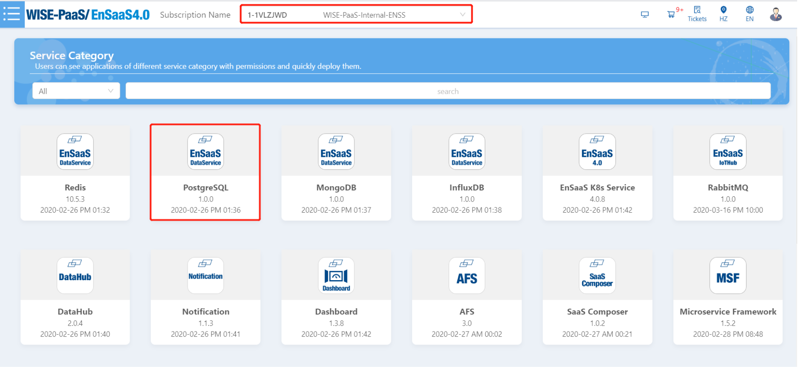

2. 点击购买的服务后，会转到服务详情页面，选择服务类型，点击「Redeem」。

   服务类型如何选择，请参考服务规格介绍。

   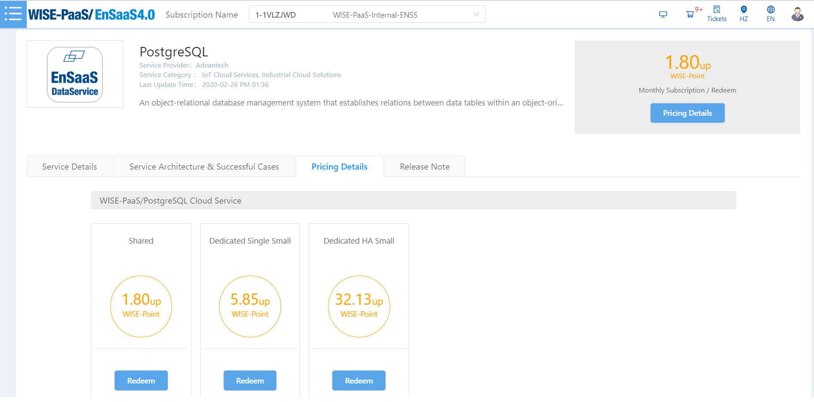

3. 在订购页面，设置如下参数，点击「Next」。

   | 参数名称               | 说明                                                         |
   | ---------------------- | ------------------------------------------------------------ |
   | Pricing Plan           | 支付方式，目前仅支持月付                                     |
   | Data Center            | 数据中心，不需要选择，仅确认数据中心是否正确                 |
   | Service to be Deployed | Plan：请参考实例规格<br>Deployment Configuration<br>- Basic：基础类型<br>- Additional：加购类型，DB服务可以加购磁盘的大小 |
   | Available Days         | 本月可用天数，根据当前日期计算本月剩余天数，即为本月可用天数 |
   | Total Price            | 月付总价格                                                   |
   | Prorated Price         | 根据本月可用天数计算本月需要支付的费用                       |


4. 确认服务信息，点击「Confirm」。

   | 参数名称            | 说明                                           |
   | ------------------- | ---------------------------------------------- |
   | App                 | 购买的产品名称                                 |
   | Plan                | 购买的产品类型                                 |
   | PN                  | 产品料号                                       |
   | Unit Listing Price  | 产品单价                                       |
   | Unit Member Price   | 根据会员类型计算单价，目前VIP是94折，PVIP是9折 |
   | Unit Prorated Price | 根据本月可用天数计算本月需要支付的费用         |
   | Quantity            | 购买产品的数量                                 |

   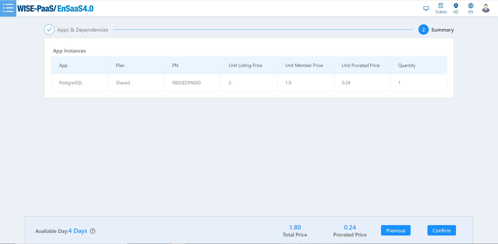

5. 点击确定，购买成功。

6. 购买成功后，可以登录Service Portal查看购买的实例（目前仅有订阅号Admin和订阅号User可以查看），Service Portal可以从Catalog进入：

   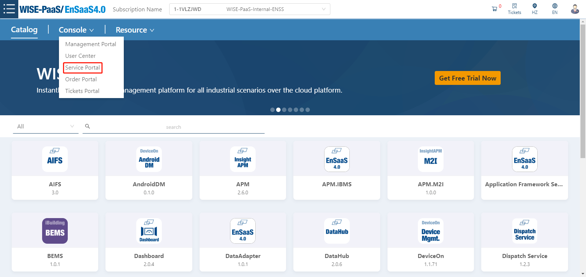
   
   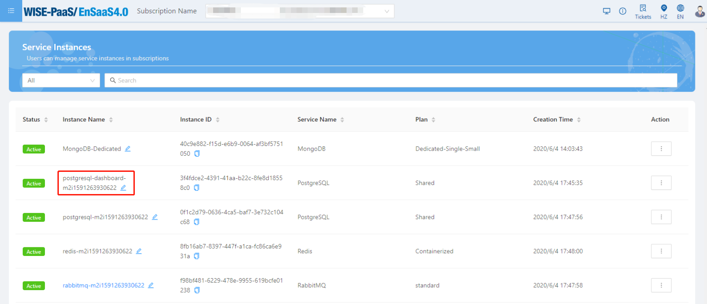

### Step3：创建Secret

成功订购PostgreSQL后，您可以通过Service 控制台（Service Portal）创建Secret，取得服务的连线信息。

*目前仅有订阅号Admin和订阅号User可以查看订阅的服务，并创建Secret。*


**建立PostgreSQL的Secret步骤简述如下，更多建立细节请参考Service Portal使用者操作手册:**

 1. 登入Service Portal之后，找到您要创建Secret的PostgreSQL服务实例，选择右方操作选项，进入Secret管理页面

    

 2. 点击 "+" 按钮，弹出创建Secret的页面

    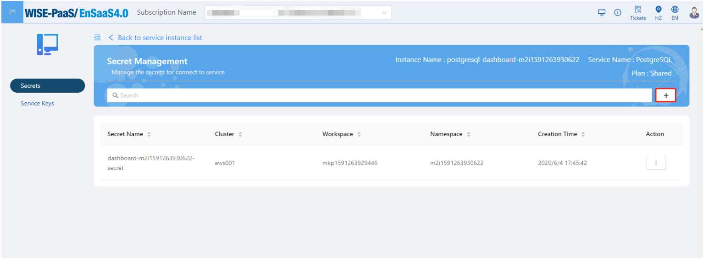

 3. 填写以下参数

    | 参数名称   | 说明                                                         |
    | ---------- | ------------------------------------------------------------ |
    | Name       | Secret的名称，WISE-PaaS平台的APP使用的Secret名称有一定规范，格式为：ServiceName-NamespaceName-secret |
    | Cluster    | 使用Secret的APP所在的集群，Secret创建后会注入到该集群下      |
    | Workspace  | 使用Secret的APP所在的Workspace，Secret创建后会注入到该Wokespace下 |
    | Namespace  | 使用Secret的APP所在的Namespace，Secret创建后会注入到该Namespace下 |
    | Parameters | 创建Secret时传入的参数，PostgreSQL在创建Secret的时候需要传入group信息，如果有多个group，参数名称填入groups，参数值填入["group1","group2"] |

    

4. 点击OK，创建成功。

### Step4：查看Secret

 Secret创建好后，您可以选择View操作来查看Secret的信息。


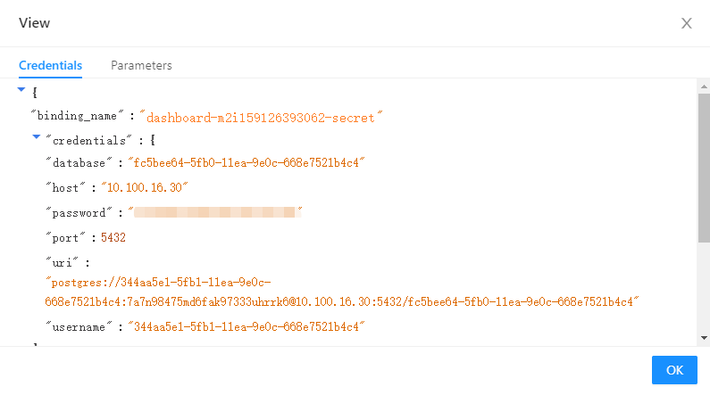

Secret是一组包含数据库连线地址、连线账号、连线密码等信息的JSON格式文档，用来验证使用数据库对象的身份

| 参数名称   | 说明                                                         |
| ---------- | ------------------------------------------------------------ |
| uri        | 字符串类型，postgres://\<username>:\<password>@\<host\>:\<port>/\<database\> |
| username   | 字符串类型，标准UUID格式      |
| password   | 字符串类型，由小写英文字母与数字随机组成，长度为25个字符 |
| host       | 字符串类型，数据库地址，Shared DB只提供內部网络地址，IP格式 |
| port       | 数值类型，数据库端口 |
| database   | 字符串类型，标准UUID格式 |


**在ServicePortal创建Secret后，Secret会被注入到k8s服务中，可以通过kubectl命令进行查看。**

1. 登录Management Portal，进入Namespaces管理页面

   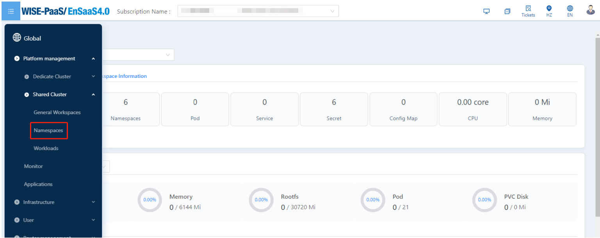

2. 在Namespace列表中选择操作选项中的Web Kubectl，打开Web Kubectl命令输入页面；

	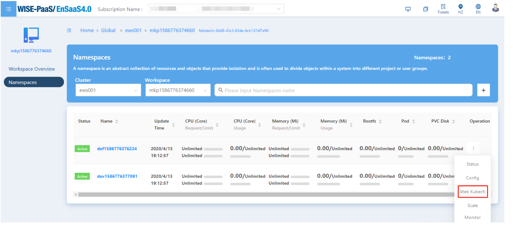

	

3. 在Web Kubectl中执行以下命令查看Secret的信息：

```
$ kubectl -n nameSpaceName get secret
$ kubectl -n nameSpaceName get secret secretName -o yaml
$ echo "" | base64 -d
```
说明：""中输入ENSAAS_SERVICES的value值，可以将secret解码出来


### Step5：使用Secret连接PostgreSQL实例

-------------------------------------------------------------

创建一个Pod(以busybox为例)，并将Secret注入到Pod环境变量中，并从环境变量中取得Credential内容

- spec.cotainers.env.name: 注入到Pod的环境变量名称
- spec.cotainers.env.valueFrom.secretKeyRef.name: 注入的来源为同Namespace底下，名为postgresql-secret的Secret
- pec.cotainers.env.valueFrom.secretKeyRef.key: Secret中的Key值，EnSaaS创建出來的Key名称固定为"ENSAAS_SERVICES"

```yaml
apiVersion: v1
kind: Pod
metadata:
  name: busybox
  namespace: my-namespace
spec:
  containers:
  - name: busybox
    image: busybox:latest
    env:
    - name: ENSAAS_SERVICES
      valueFrom:
        secretKeyRef:
          name: postgresql-secret
          key: ENSAAS_SERVICES
    command:
      - sleep
      - "3600"
    imagePullPolicy: IfNotPresent
  restartPolicy: Always
```

进入到Pod里面执行env的指令，就可以取得JSON格式的postgresql credential了

```shell
$ kubectl -n my-namespace exec -ti busybox sh
$ env
```

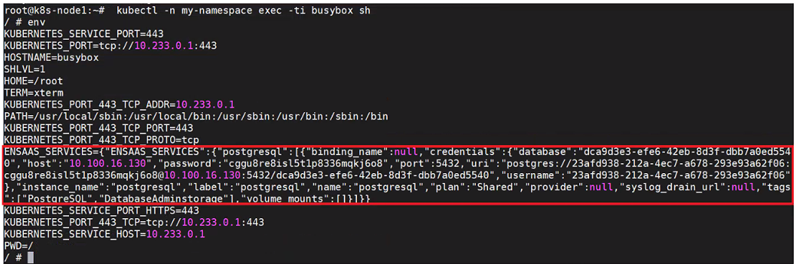

当您有连线信息后，您就可以搭配您所熟悉的客户端应用来使用PostgreSQL的服务。

* Java开发者
* Python开发者
* NodeJs开发者

#### Java开发者
在Java中您可以使用json来对Credential JSON进行解析，以下为使用Maven引入json lib的范例：

```
<repositories>
    <dependency>
        <groupId>org.json</groupId>
        <artifactId>json</artifactId>
        <version>20160810</version>
    </dependency>
</repositories>

```

取得PostgreSQL服务连线帐号/密码范例如下:
```
import org.json.JSONObject;

JSONObject vcapServices = new JSONObject(System.getenv("ENSAAS_SERVICES"));

String pgUri = vcapServices.getJSONArray("postgresql").getJSONObject(0).getJSONObject("credentials").getJSONObject("uri");
String pgDatabase = vcapServices.getJSONArray("postgresql").getJSONObject(0).getJSONObject("credentials").getJSONObject("database");
String pgHost = vcapServices.getJSONArray("postgresql").getJSONObject(0).getJSONObject("credentials").getJSONObject("host");
String pgPort = vcapServices.getJSONArray("postgresql").getJSONObject(0).getJSONObject("credentials").getJSONObject("port");
String pgUser = vcapServices.getJSONArray("postgresql").getJSONObject(0).getJSONObject("credentials").getJSONObject("username");
String pgPasssword = vcapServices.getJSONArray("postgresql").getJSONObject(0).getJSONObject("credentials").getJSONObject("password");

```
#### Python开发者
取得PostgreSQL服务连线帐号/密码范例如下:

```
import os
import json

# Load 'ENSAAS_SERVICES' from enviroment variable and parse the URI 
ensaas_services = os.getenv('ENSAAS_SERVICES')
ensaas_services = json.loads(ensaas_services)
postgres_uri = ensaas_services['postgresql'][0]['credentials']['uri']
postgres_database = ensaas_services['postgresql'][0]['credentials']['database']
postgres_host = ensaas_services['postgresql'][0]['credentials']['host']
postgres_port = ensaas_services['postgresql'][0]['credentials']['port']
postgres_user = ensaas_services['postgresql'][0]['credentials']['username']
postgres_password = ensaas_services['postgresql'][0]['credentials']['password']

```
#### NodeJs开发者
取得PostgreSQL服务连线帐号/密码范例如下:

```
ensaas_services = process.env.ENSAAS_SERVICES
postgres_uri = ensaas_services.postgresql[0].credentials.uri
postgres_database = ensaas_services.postgresql[0].credentials.database
postgres_host = ensaas_services.postgresql[0].credentials.host1
postgres_port = ensaas_services.postgresql[0].credentials.port1
postgres_user = ensaas_services.postgresql[0].credentials.username
postgres_password = ensaas_services.postgresql[0].credentials.password
```
