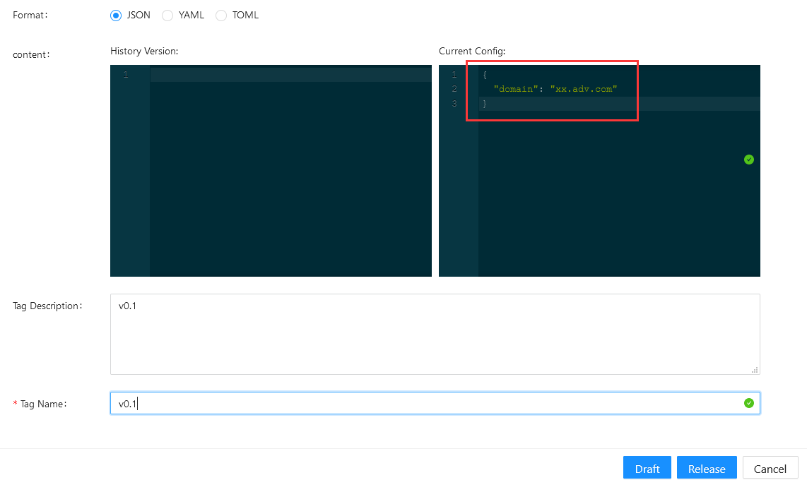
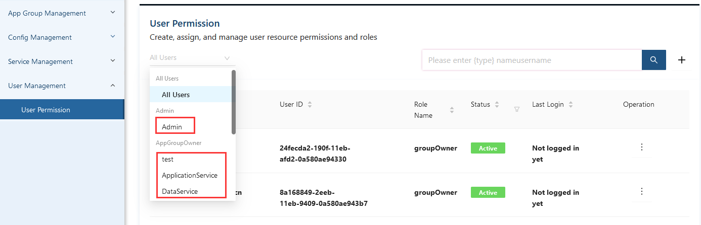

# ESM手册

## 1. 概述

### 1.1 ESM介绍

EnSaaS服务管理（EnSaaS Service Management, 简称ESM）是一个基于Golang语言开发的高可用配置中心,它使您能够集中管理应用程序配置，并在分布式环境中实现实时配置推送。

ESM在分布式系统中充当配置中心。提供了配置修改、配置推送、历史版本管理、灰色发布等一系列功能。  
通过这些特性，ESM可以帮助您集中管理每个应用程序中的配置，降低分布式系统中的配置管理成本，并降低由不正确的配置更改导致的可用性问题甚至失败的风险。使用ESM，您可以极大地减少配置管理的工作量，并增强微服务、DevOps和大数据场景中的服务能力。

ESM主要功能如下：

1. 配置变更实时响应，秒级配置自动推送
2. 历史版本管理
3. 高可靠性，多级缓存设计，保证服务中断不影响业务
4. 版本回滚
5. 基于backend的灰度发布

## 1.2 基本概念

ESM中的基本概念介绍如下：
1. **Application group（appGroup)**: appGroup为一组Application或者Service的集合，一组appGroup内可以创建多个config，并且该appGroup内的服务可以共享组内的一个或多个config；  
2. **Config:** 服务配置，服务中需要外部传入的参数可以记录在config中，由config传入服务中；
3. **Service**：服务为K8S集群的资源类型在ESM中的单独概念，相当于K8S中的deployment，daemonset；
4. **ServiceName**：使用ESM需要提前注册服务， ServiceName为注册的服务名称，整个ESM中不能有重名的ServiceName;
5. **PortService:** K8S中的每个service中对应的port，每个端口代表了一个PortService; 
6. **Backend:** backend是service对应的后端，可以是K8S中的pod，也可以是一个vm；
7. **控制面（EnSaaS Control Plane，简称CP）**: 控制服务间访问的规则，私有配置和公有配置的下发，管控制所有的服务;
8. **数据面（EnSaaS Data Plane，简称DP):** 具体的服务，每个服务中有一个initcontainer和两个container。Initcontainer的作用是修改了iptable，用以发现服务地址。两个container中有一个是作为服务的sidecar，用以获取服务注册时写入的config；另一个container中是服务提供者，即服务本身。
8. **Public Config和Private Config**:   
   Public Config为ESM的公有配置，包括config和services两部分。Private Config中只包括config部分。     
   **Public->Config：**为可修改的配置，由EnSaaS Global Admin和DataCenter Admin，或者ESM Admin去管理更新配置，拥有ESM权限的用户都可查看Public配置。  
   **public->Services**：EnSaaS平台的微服务地址信息，包括External Address, Internal Address, svc Address, Port和Target Port, services地址信息为EnSaaS Service注册时候选择暴露服务地址到public config中，ESM会将service地址信息更新到公有配置的services部分，这也是ESM服务发现的部分功能。  
   **Private->Config**：为每个Service的私有配置。每个Service可以拥有多个group ID，group ID对应的是Service一组私有配置项的集合，类似于一个配置文件的概念。每个Service在注册时候会默认创建名为“default”的group ID。每个service可以根据需求创建多个group ID，每个group ID对应一个private的配置。对于90%的service来说，“default”的group ID已经满足日常配置使用场景了。
9. **Sidecar**: 边车模式。实现了数据面（业务逻辑）和控制面的解耦。微服务架构中，给每一个微服务实例（也可以是每个宿主机host）同步部署一个sidecar proxy。该sidecar proxy将微服务架构中以前有公共库、服务发现、健康检查等功能从服务中抽离到该 proxy中。在ESM中sidecar由ensaasdp（数据面）来实现。
## 2. ESM快速入门 ##
### 2.1 被注册的服务已经被部署的场景 ###
1. 注册服务之前，首先确认登录用户拥有ESM的访问权限。可联系管理员或者自身所属的appGroup的groupOwner为登录用户分配ESM上的appGroup权限；   
  

2. 在Config Management页面，选择Private config选项，编辑自身服务所需要的配置信息；  


3. 进入Service Management页面，选择+添加按钮，会跳转到workload页面，选择需要注册的workload名字，进入创建sidecar页面（此操作需要登录用户同时拥有mp对应的资源权限）；
  

4. 完成创建sidecar动作之后，返回Service页面，点击刷新按钮，数秒之后会在Service页面看到注册的服务名称；    


5. 点击服务名称右侧的Operation->view service，可以查看服务相关的config信息。    
 

### 2.2 被注册的服务还未被部署的场景 ###
1. 仍然要确认登录用户拥有ESM权限；
2. 在appGroup页面，选中需要注册服务所在的appGroup，点击右侧Generate accesstoken；  
 

3. 编辑创建accesstoken所需的配置信息，点击生成，会在同样页面显示Token值（即accesstoken)；
 

4. 复制上一步生成的accesstoken值，填入需要部署服务的部署文件中；
部署文件deployment中accesstoken的填写方式如下：  
 

5. 服务部署好之后会自动被注册到ESM，进入Service Management可以查看到被注册进来的服务信息，参考**被注册的服务已经被部署场景**的第5步。


## 3. ESM配置
### 3.1 ESM更新原理

ESM配置更新过程：

1. Service Backend采用SDK，隔段时间主动拉取和监听配置更新；
2. 用户在配置中心对配置进行修改并发布；
3. 配置中心更新EnSaaS控制面缓存和存储中的配置，通过SDK更新本地文件中缓存配置并通知到Backend。

**（待修改）贴流程图或图片**

### 3.2 Config说明

ESM配置文件支持YAML, JSON和TOML格式。

对于一些Service来说，比较习惯使用key:value的格式，因此API中提供获取源配置文件格式和key:value两类配置方式。对于Golang SDK和sidecar方式来讲，缓存文件也会缓存源配置文件格式和Key value两种格式的配置文件。

#### 3.2.1 PublicConfig（公有配置）

公有配置为整个ESM的公有配置，所有注册的服务都可以去获取公有配置，但是服务自身不可修改公有配置，公有配置只有globalAdmin, datacenterAdmin及ESM admin等的管理员权限才可以去修改。

公有配置分为两部分：一是由管理员权限创建的自定义配置部分，二是EnSaaS内部服务的地址信息。

#### 3.2.2 公共配置发布（仅管理员可用）

GlobalAdmin和datacenterAdmin及ESM admin等管理员可以编辑公共配置。
 

修改配置时，需要指定配置格式是json, yaml还是toml，以下为json格式的配置发布。  
json格式参照：
```
{
  "version":"v1",  
  "type":"json"
}
```
yaml格式参照： 

```
version: v1
type: yaml
```
toml格式参照： 
```
[owner]
name = "Tom"
```
（待修改）等修复format拼写错误再改正图片
 


#### 3.2.3 查看公共Service地址

在Config/Public页面中，可以看到公共的service地址。如果用户在注入sidecar时

#### 3.2.4 暴露和删除Service地址

管理员（Global admin或者datacenter admin,以及ESM的admin）可以使用API手动暴露某一个service地址到public services中，前提是service必须已经注册到ESM中。

```
POST /v1/appGroups/{appGroupId}/services/{serviceName}/serviceAddress
```

（待修改）serviceName：ESM注册的服务名称，服务名称的格式为datecenter.cluster.namepsace.svcname

同样Admin可以使用API从public services中手动删除某一个service地址。

```
DELETE /v1/appGroups/{appGroupId}/services/{serviceName}/serviceAddress
```
### 3.3 PrivateConfig（私有配置）

创建application group之后，可以为这个application group中的每个application创建一个私有配置，也可以为application group中的多个application创建一个公有的配置（仍然属于application group的私有配置）

#### 3.3.1 私有配置的创建和发布

在配置页面，选择好需要创建配置的appGroup名字，再点击添加按钮，可以执行添加配置的操作。


如果配置原本不存在，则在创建配置页面，会同时做创建和发布配置的动作。  
页面中创建/编辑配置的区域可以指定配置名字，描述，以及是否要和公共配置绑定。  
发布配置的区域中需要选择配置的格式是json, yaml还是toml，然后在内容区域填入用户服务需要的配置内容，tag Name可以填写本次发布的版本信息（版本号用户可以自定义)，最后选择发布按钮。

  

## 4. AppGroup介绍

AppGroup为ESM的集中管理单元，每个被ESM监控的服务和私有配置都必定属于某个AppGroup，拥有唯一的AppGroupID。
用户权限将以AppGroup作为划分，作为某个或某几个AppGroup的owner用户只能查看和编辑属于自身群组下的配置和服务信息。

## 5. User权限管理

ESM中拥有两种用户权限：admin和groupOwner。  

**admin:** 管理员权限，可以看到ESM的所有信息，并且能够编辑包括public config在内的所有config，及service信息（操作service时需要用户同时具有该service所在的MP资源的相关权限）；  
**groupOwner：** AppGroup所有者权限，一个用户可以拥有一个或者多个AppGroup权限，对于属于自己权限内的appgroup的private config和service信息拥有查看和编辑权限。

在用户管理页面可以看到登录用户权限内可查看到的用户列表。管理员权限的用户可以看到所有加入ESM权限的用户，groupOwner用户只可以看到与自身处于同一个AppGroup内的其他groupOwner用户。
 

用户权限页面的添加按钮，可以创建用户并将其加入某个（登录者所在的）AppGroup，也可以邀请已经存在的用户加入自身群组。
 

编辑按钮可以修改列表中用户的权限，管理员可以添加或删除任意groupOwner权限，groupOwner用户只可以添加或删除同组的groupOwner权限。
 

用户信息页面可做添加和删除权限操作：
 


