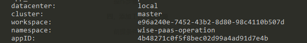
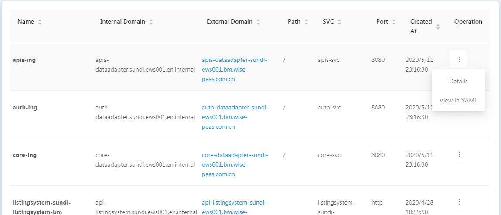
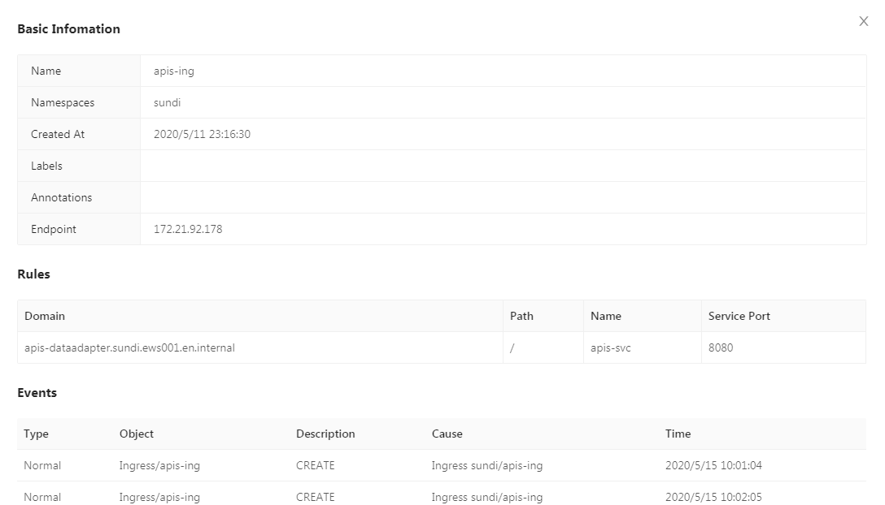
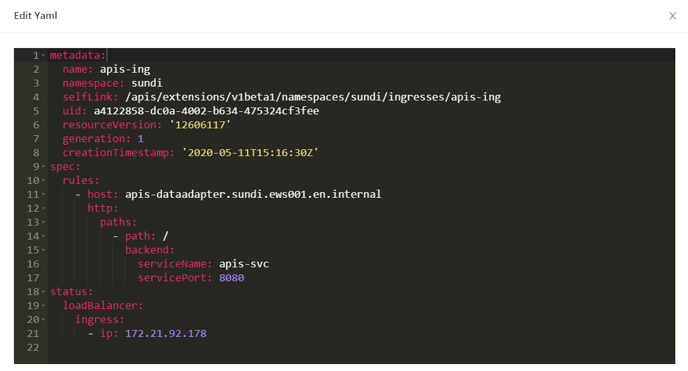
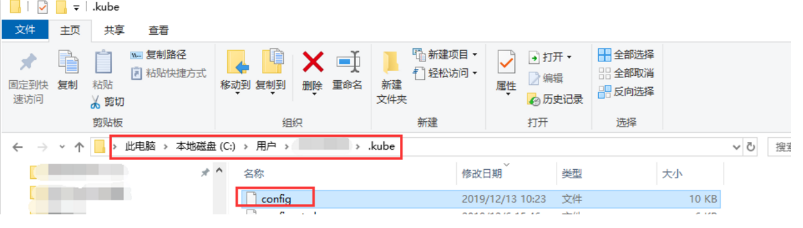
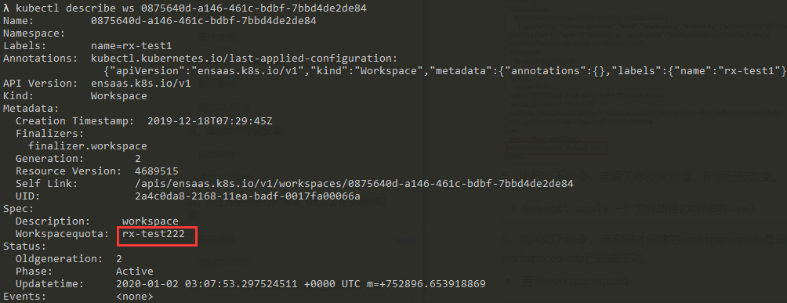
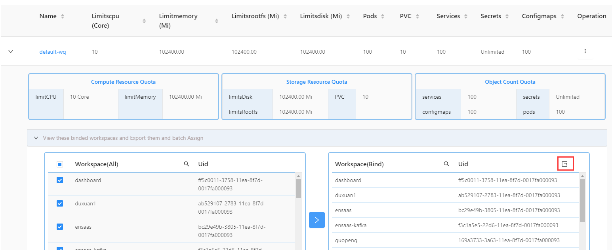
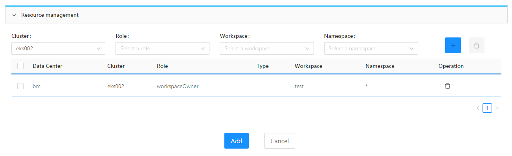
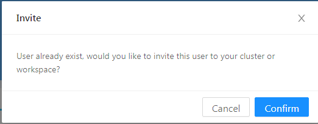
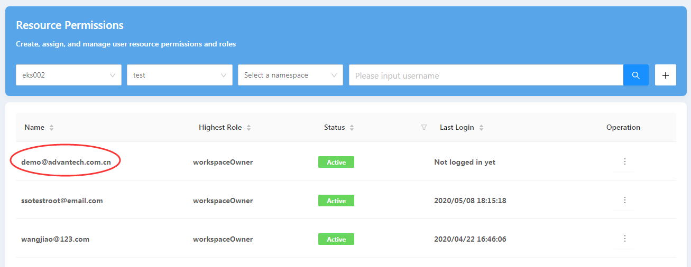

EnSaaS-K8s-Service based on Kubernetes, but not only Kubernetes. It provides users with out-of-the-box microservice framework, enterprise-level container management platform, multi-level tenant workspace and consistent infrastructure encapsulation, providing full life cycle management for applications. This manual will guide you to use EnSaaS-K8s-Service from the following aspects: Application Management, Resource Management, User Management and Permission Management.

# 1. Application Management

## 1.1 Deploy applications

### Use a Helm chart to deploy applications

Helm 3 is used in clusters. So, when you use a Helm chart for application deployment, refer to the Helm 3 doc. For example:

```
$ helm install . --name dashbord --namespace dashbord
```
Upon deploying an application, management portal 4.0 gives each pod of the application five environment variables. For example:


where

- datacenter: Name of the datacenter where the application exists.
- cluster: Name of the cluster where the application exists.
- workspace: Name of the workspace where the application exists. This name appears in the details section of the workspace; for example:

```
$ kubectl describe workspace 0875640d-a146-461c-bdbf-7bbd4de2de84
Name:         0875640d-a146-461c-bdbf-7bbd4de2de84
Namespace:
Labels:       name=rx-test1
```
* namespace: Name of the namespace where the application exists.
* appID: ID of the application. This ID is generated by management portal 4.0 and is unique.

## 1.2 Check routes

### List all routes

The page will list all the routes under a certain namespace:  

Click link on "External Domain" field, it will transfer to the corresponding service index page

### Check the route details



### Check yaml of the route



## 1.3 Check workloads

### Check workloads

1. Open a web browser, type the URL for the Management Portal in the address bar, and press the “Enter” key.
2. Enter the username and password. Then click the Login button.
3. Click the menu button in the top left-hand corner of the portal. Go to Platform Management > Dedicate Cluster > Namespaces or Platform Management > Shared Cluster > Namespaces to view a list of namespaces.
4. Click a namespace of your choice to enter the namespace’s page.
5. Select “workload” from the menu on the left side of the page to view a list of workloads.

### Check workload logs

1，Enter the workload page，find a workload, click the Operation field on the right side, .

2，a child page will pop up where you can select a pod to view the pod’s log.

3，When you need to refresh the log, click refresh button to refresh the log

### Check deployed applications

#### Check deployed applications via the Management Portal

Applications deployed through the Helm chart can be viewed on the Applications page in the Management Portal. The following steps describe how to access the Applications page:

1. Open a web browser, type the URL for the Management Portal in the address bar, and press the “Enter” key.
2. Enter the username and password. Then click the Login button.
3. Click the menu button in the top left-hand corner of the portal. Go to Platform Management > Applications to open the management page for applications.
4. Select the cluster, workspace, and namespace where the deployed application of interest exists. Then set the Type field to HelmList.

**Note**: Be sure to set the Type field to HelmList since the Management Portal only displays applications deployed through the Helm chart.

# 2. Resource Management

## 2.1 Fetch a cluster config file

1. Open a web browser, type the URL for the Management Portal in the address bar, and press the “Enter” key.
2. Enter the username and password. Then click the Login button.
3. Find a config file according to the instructions that cater for your user role (see below).

### For cluster owners or above:

1. Click the menu button on the top left-hand corner of the portal. Go to Platform Management > Dedicate Cluster > Clusters or Platform Management > Shared Cluster > Clusters to open the management page for clusters.
2. Click the Operation field on the right side of the cluster for which you are going to fetch a config file. Then click the Config button and save the config file to the local drive.

### For workspace owners

1. Click the menu button on the top left-hand corner of the portal. Go to Platform Management > Dedicate Cluster > Workspaces or Platform Management > Shared Cluster > General Workspaces to open the management page for workspaces.
2. Switch to the cluster and find the workspace for which you are going to fetch a config file.
3. Click the Operation field on the right side of the workspace. Then click the Config button and save the config file to the local drive.

### For namespace developers

1. Click the menu button on the top left-hand corner of the portal. Go to Platform Management > Dedicate Cluster > Namespaces or Platform Management > Shared Cluster >Namespaces to open the management page for namespaces.
2. Switch to the cluster and workspace. Then find the namespace for which you are going to fetch a config file.
3. Click the Operation field on the right side of the namespace. Then click the Config button and save the config file to the local drive.

**Note:**

1. Only one config file is used in a cluster, as well as all of the cluster’s namespaces and workspaces.
2. The config file is downloadable from the Dedicate Cluster menu if you have bought a Dedicate Cluster or from the Shared Cluster menu if you have bought a General Workspace.

## 2.2 Web Kubectl
we provide the web-based kubectl, you can run kubectl command on the page, without downloading config file in advance.

### For cluster owners or above:

1. Click the menu button on the top left-hand corner of the portal. Go to Platform Management > Dedicate Cluster > Clusters or Platform Management > Shared Cluster > Clusters to open the management page for clusters.
2. Click the Operation field on the right side of the cluster for which you are going to operate. Then click the "Web Kubectl"  button and popup the web kubectl terminal:


### For workspace owners

1. Click the menu button on the top left-hand corner of the portal. Go to Platform Management > Dedicate Cluster > Workspaces or Platform Management > Shared Cluster > General Workspaces to open the management page for workspaces.
2. Switch to the cluster and find the workspace for which you are going to operate.
3. Click the Operation field on the right side of the workspace. Then click the "Web Kubectl"  button and popup the web kubectl terminal and you can run kubectl command here.

### For namespace developers

1. Click the menu button on the top left-hand corner of the portal. Go to Platform Management > Dedicate Cluster > Namespaces or Platform Management > Shared Cluster >Namespaces to open the management page for namespaces.
2. Switch to the cluster and workspace. Then find the namespace for which you are going to operate.
3. Click the Operation field on the right side of the namespace.  Then click the "Web Kubectl"  button and popup the web kubectl terminal and you can run kubectl command here.

## 2.3 Add a workspace

### Prerequisites

1. You must be a cluster owner (or above) or subscription admin.
2. Buy a dedicate cluster if you want to add a workspace under a dedicate cluster.

### Add a workspace via the Management Portal

1. Open a web browser, type the URL for the Management Portal in the address bar, and press the “Enter” key.
2. Enter the username and password. Then click the Login button.
3. Click the menu button on the top left-hand corner of the portal. Go to Platform Management > Dedicate Cluster > Workspace to open the management page for workspaces.


4，Select a cluster from the drop-down Cluster box (this cluster is where you are going to create a workspace) and click “+” button to open the page for workspace setup.

5，Specify the name and quota of the new workspace. Then click the “OK” button.


6，Once you have successfully created the workspace, it will appear on the list in the Workspaces page.

### Add a workspace via the CLI

#### Prerequisites

1. The user must have the config file for a cluster. If not, obtain the file by the instructions provided in the section **Fetch a cluster config file**.
2. kubectl has been installed in the local drive.

#### Instructions

1，Move the config file (make sure the file’s name is “config” and carries no extension) to **C:\Users{username}\.kube**.



2，Create a file and name it with the extension **.yml**.

3，Specify the following fields in the file:

```
apiVersion: ensaas.k8s.io/v1
kind: Workspace
metadata:
  name: 0875640d-a146-461c-bdbf-7bbd4de2de84
  labels:
    name: rxtest1
spec:
  description: 'workspace'
  workspacequota: test-wq
```
* where:
  - The metadata name must be specified by the user as a GUID. You can generate a GUID on [UUID Online](http://www.uuid.online/).
  - The label name, which denotes the workspace name displayed on the user interface, must contain no more than 16 characters of upper-and/or lowercase letters and/or numbers.
  - If the metadata name overlaps with that of an existing workspace within the current cluster, this means you are editing that workspace.
  - workspacequota denotes the quota assigned to the workspace. To query all existing workspace quotas and details, go to Step 4.

4，Query workspace quotas and their details:

* Query workspace quotas
```
  $ kubectl get workspacequota
  NAME         AGE
  test-wq   5d6h
```
* Query the details of a workspace quota
```
  $ kubectl describe  workspacequota default-wq
```
5，Run the command prompt and enter the following command:

```
$ kubectl apply -f filepath/filename.yml
```
6，Enter the following command to display the workspace list and the accompanying details. Then check whether the new workspace (whose name is the metadata name provided in the setup example from Step 3) is on the list.

```
$ kubectl get workspace
NAME                                   AGE
0875640d-a146-461c-bdbf-7bbd4de2de84   15m
336c7021-94ed-47bf-a624-f353ce2606d7   26h
$ kubectl describe workspace 0875640d-a146-461c-bdbf-7bbd4de2de84
```
## 2.4 Add a namespace

### Prerequisites

You must be a workspace owner (or above) or subscription admin.

### Add a namespace via the Management Portal

1. Open a web browser, type the URL for the Management Portal in the address bar, and press the “Enter” key.
2. Enter the username and password. Then click the Login button.
3. Click the menu button on the top left-hand corner of the portal. Go to Platform Management > Dedicate Cluster > Namespaces or Platform Management > Shared Cluster > Namespaces to open the management page for namespaces.
4. Select a cluster and a workspace of your choice (a newly created namespace will belong to that workspace). Click the “+” button to open the page for namespace setup.


5. Specify the name and quota of the new namespace. Then click the “OK” button.


6. Once you have successfully created the namespace, it will appear on the list in the Namespaces page.

### Add a namespace via the CLI

#### Prerequisites

1. You must have the config file for a cluster. If not, obtain the file by following the instructions provided in the section **Fetch a cluster config file**.
2. Kuberctl has been installed in the local drive.

#### Instructions

1. Move the config file (make sure the file’s name is “config” and carries no extension) to **C:\Users{username}\.kube**.
2. Create a file and name it with the extension **.yml**.
3. Specify the following fields in the file:

```
apiVersion: v1
kind: Namespace
metadata:
  name: test
  labels:
    workspace: 0875640d-a146-461c-bdbf-7bbd4de2de84
    namespacequota: nsquota-1000m1core
```
where:

- The metadata name is the name of the namespace and must contain characters a to z, numbers 0 to 9, and length less than 16 .
- workspace denotes the workspace where the namespace is created. To query all existing workspaces and their details, go to Step 4.
- namespacequota denotes the quota assigned to the namespace and is an optional field. If the namespacequota is left blank, the namespace’s quota is unlimited. To query all existing namespace quotas and their details, go to Step 5.

4. Query workspaces and their details:

- On the workspace list, NAME denotes the value entered in the workspace field under “labels” > “metadata.”

```
  $ kubectl get workspace
  NAME                                   AGE
  0875640d-a146-461c-bdbf-7bbd4de2de84   20h
  336c7021-94ed-47bf-a624-f353ce2606d7   45h
```
* In the queried details of a workspace, the name in the Labels field denotes the workspace name shown on the Management Portal.
```
  $ kubectl describe workspace 0875640d-a146-461c-bdbf-7bbd4de2d
  Name:         0875640d-a146-461c-bdbf-7bbd4de2de84
  Namespace:
  Labels:       name=rx-test1
  .....
```
5. Query namespace quotas and their details:

- Query namespace quotas

```
  $ kubectl get namespacequota
```
* Query the details of a namespacequota:
```
  $ kubectl describe namespacequota {quotaName}                                               
```
6. Enter the command below:

```
$ kubectl apply -f filepath/filename.yml
```
7. Enter the following command to display the namespace list. Then check whether the new namespace (whose name is the metadata name provided in the setup example from Step 3) is on the list.

```
$ kubectl get namespace
```
## 2.5 Add a workspace quota

### Prerequisite

You must be a cluster owner or above

### Add a workspace quota via the Management Portal

1. Open a web browser, type the URL for the Management Portal in the address bar, and press the “Enter” key.
2. Enter the username and password. Then click the Login button.
3. Click the Workspace Quotas menu on the left side of the portal. Go to Infrastructure > Quotas to open the management page for workspace quotas.
4. Select a cluster of your choice (a newly created workspace quota will belong to that cluster). Click the “+” button to open a dialog box for creating a workspace quota.

### Add a workspace quota via the CLI

1. Move the config file (make sure the file’s name is “config” and carries no extension) to **C:\Users{username}\.kube**.
2. Create a file and name it with the extension **.yml**.
3. Specify the following fields in the file:

```
apiVersion: ensaas.k8s.io/v1
kind: WorkspaceQuota
metadata:
  name: wsquota-test
spec:
  quotas:
    limits.cpu: "5"
    limits.memory: "100"
    pods: "5"
    requests.storage: "100"
    persistentvolumeclaims: "1"
    limits.ephemeral-storage: "100"
    services: "5"
    secrets: "5"
    configmaps: "5"
```
* where:
  - The metadata name is the name of the workspace quota and must contain characters a to z, numbers 0 to 9, and/or the hyphen (-).
  - quotas contains all the parameters that can be specified for the workspace quota.
  - There are nine configurable parameters under quotas. You must specify at least one of these parameters. Any parameter left unspecified is set to be “unlimited” by default.
  - limits.cpu corresponds to the limit.cpu of k8s and is expressed in the unit of “core.”
  - limits.memory corresponds to the limit.memory of k8s and is expressed in the unit of “M.”
  - pods denotes the maximum number of pods allowed in the workspace.
  - requests.storage denotes the maximum number of PVC disks allowed in the workspace and is expressed in the unit of “M.”
  - persistentvolumeclaims denotes the maximum number of PVCs allowed in the workspace.
  - limits.ephemeral-storage denotes the maximum amount of temporary storage available in the workspace and is expressed in the unit of “M.”
  - services denotes the maximum number of services allowed in the workspace.
  - configmaps denotes the maximum number of config maps allowed in the workspace.
  - Existing quotas cannot be edited.

4. Run the command prompt and enter the following command:

```
$ kubectl apply -f filepath/filename.yml

```

5. Enter the following command to display the list of workspace quotas. Then check whether the new workspace quota is on the list.

- Query workspace quotas

```
  $ kubectl get workspacequota
  NAME         AGE
  test-wq   5d6h
```
* Query the details of a workspace quota:
```
  $ kubectl describe  workspacequota default-wq
```
## 2.6 Add a namespace quota

### Prerequisite

You must be a workspace owner or above.

### Add a namespace quota via the Management Portal

1. Open a web browser, type the URL for the Management Portal in the address bar, and press the “Enter” key.
2. Enter the username and password. Then click the Login button.
3. Click the menu button in the top left-hand corner of the portal. Go to Infrastructure > Quotas to open the management page for quotas.
4. Click the Namespace Quotas menu on the left side to open the management page for namespace quotas.
5. Select a cluster and a workspace of your choice (a newly created namespace quota will belong to that workspace). Click the “+” button to open a dialog box for creating a namespace quota.
6. Specify the name and quota. Click the OK button.
7. Once successfully created, the namespace quota will appear on the list in the Namespace Quotas page.

### Add a namespace quota via the CLI

1. Move the config file (make sure the file’s name is “config” and carries no extension) to **C:\Users{username}\.kube**.
2. Create a file and name it with the extension **.yml**.
3. Specify the following fields in the file:

```
apiVersion: ensaas.k8s.io/v1
kind: NamespaceQuota
metadata:
  name: nsquota-1000m1core
  labels:
    workspace: 0875640d-a146-461c-bdbf-7bbd4de2de84
spec:
  description: "namespace quota"
  quotas:
    limits.cpu: "5"
    limits.memory: "1000"
    pods: "5"
    services: "5"
    configmaps: "5"
    requests.storage: "100"
    persistentvolumeclaims: "5"
    limits.ephemeral-storage: "1000"
    secrets: "5"
```
where:

- The metadata name is the name of the namespace quota and must contain characters a to z, numbers 0 to 9, and/or the hyphen (-).
- workspace refers to the workspace where the new namespace quota belongs and must be specified. To check all existing workspaces and their details, please refer to Step 6 under “Add a workspace via the CLI.”
- quotas contains all the parameters that can be specified for the namespace quota.
- There are nine configurable parameters under quotas. You must specify at least one of these parameters. Any parameter left unspecified is set to be “unlimited” by default.
  - limits.cpu corresponds to the limit.cpu of k8s and is expressed in the unit of “core.”
  - limits.memory corresponds to the limit.memory of k8s and is expressed in the unit of “M.”
  - pods denotes the maximum number of pods allowed in the namespace.
  - requests.storage denotes the maximum number of PVC disks allowed in the namespace and is expressed in the unit of “M.”
  - persistentvolumeclaims denotes the maximum number of PVCs allowed in the namespace.
  - limits.ephemeral-storage denotes the maximum amount of temporary storage available in the namespace and is expressed in the unit of “M.”
  - services denotes the maximum number of services allowed in the namespace.
  - configmaps denotes the maximum number of config maps allowed in the namespace.
- Existing quotas cannot be edited

4. Run the command prompt and enter the following command:

```
$ kubectl apply -f 文件路径/文件名称.yml
```
5. Enter the following command to display the list of namespace quotas. Then check whether the new namespace quota is on the list.

* Query namespace quotas
```
  $ kubectl get namespacespacequota
  NAME         AGE
  test-nq   5d6h
```
* Query the details of a namespace quota
```
  $ kubectl describe  namespacequota default-nq
```
## 2.7 Change workspace quotas

### Prerequisites

1. You must be a cluster owner (or above) or subscription admin.
2. You must buy a Dedicate Cluster.

### Change workspace quotas via the Management Portal

1. Open a web browser, type the URL for the Management Portal in the address bar, and press the “Enter” key.
2. Enter the username and password. Then click the Login button.
3. Click the menu button in the top left-hand corner of the portal. Go to Platform Management > Dedicate Cluster > Workspaces to open the management page for workspaces.
4. From the workspace list, find a workspace of your choice, click the Operation field on the right side, and select “Scale” to open the page for changing the workspace’s quota.
5. In this page, you can see a list of quotas and those that have been bound. Click the button next to any of the quotas, and you can view the quota’s details.
6. Find a quota of your choice and click the “bind” button in the Operation field on the right side to pop up a dialog box for confirming whether to change the quota. Click “Confirm” to complete the change.
7. Now you can see the value shown in the Current Quota in the top right-hand corner has been changed. The operation field for a bound quota is highlighted in blue.
8. Click the workspace name in the Current Workspace list on the top to return to the workspace list. On the list, you can see the workspace’s quota has been changed.

### Change workspace quotas via the CLI

1. Move the config file (make sure the file’s name is “config” and carries no extension) to **C:\Users{username}\.kube**.
2. Run the following command to find the workspace whose quota you are going to change: (In this command, “name” corresponds to the name field under labels > metadata for workspace creation, and it appears on the user interface.)

```
$ kubectl get ws -l name=test1
NAME                                   AGE
0875640d-a146-461c-bdbf-7bbd4de2de84   14d
```
3. Run the following command to find the name of the workspace quota you’re going to change:

```
$ kubectl get wq
$ kubectl describe wq {workspacequotaName}
```
4. Run the following command to edit the workspace quota:

```
$ kubectl edit ws 0875640d-a146-461c-bdbf-7bbd4de2de84
```
5. Edit the string in the workspacequota field under spec according to your needs. (If the edited string contains numerals, add a pair of quotation marks to them; for example, “111.”) Press CTRL + S to save.


6. Run the following command to check whether the workspace’s quota has been successfully changed.

```
$ kubectl describe ws 0875640d-a146-461c-bdbf-7bbd4de2de84
```



## 2.8 Change namespace quotas

### Prerequisite

You must be a workspace owner or above.

### Change namespace quotas via the Management Portal

1. Open a web browser, type the URL for the Management Portal in the address bar, and press the “Enter” key.
2. Enter the username and password. Then click the Login button.
3. Click the menu button in the top left-hand corner of the portal. Go to Platform Management > Dedicate Cluster > Namespaces or Platform Management > Shared Cluster > Namespaces to open the management page for namespaces.
4. From the namespace list, find a namespace of your choice, click the Operation field on the right side, and select “Scale” to open the page for changing the namespace’s quota.
5. In this page, you can see a list of quotas and those that have been bound. Click the button next to any of the quotas, and you can view the quota’s details.
6. Find a quota of your choice and click the “bind” button in the Operation field on the right side to pop up a dialog box for confirming whether to change the quota. Click “Confirm” to complete the change.
7. Now you can see the value shown in the Current Quota has been changed. The operation field for a bound quota is highlighted in blue.
8. Click the namespace name in the Current Namespace list on the top to return to the namespace list. On the list, you can see the namespace’s quota has been changed.

### Change namespace quotas via the CLI

1. Move the config file (make sure the file’s name is “config” and carries no extension) to **C:\Users{username}\.kube**.
2. Run the following commands to find the namespace whose quota you are going to change, and query its details for the current quota name.

- Query the namespace list by running the command below, where “workspace” refers to the workspace to which “ns” belongs:

```
$ kubectl get ns -l workspace=0875640d-a146-461c-bdbf-7bbd4de2de84
```
* Query the namespace’s details by running the command below, in which “namespacequota” under Labels refers to the quota of the namespace (if namespacequota is left blank, the quota is unlimited):
```
$ kubectl describe ns {namespaceName}
```
3. Run the following command to find the name of the namespace quota you’re going to change. In the command, “workspace” refers to the workspace to which the specified namespace belongs.

```
$ kubectl get nq -l workspace=0875640d-a146-461c-bdbf-7bbd4de2de84
$ kubectl describe nq {namespacequotaName}
```
**Note**: A namespace and its quota both belong to the same workspace. So, if the namespace exists within workspace A, then its quota must be in that same workspace. So, you should add “-l workspace” in your quota query.

4. Run the following command to edit the namespace quota:

```
$ kubectl edit ns {namespaceName}
```
5. Edit the string in the namespacequota field under labels according to your needs. (If the edited string contains numerals, add a pair of quotation marks to them; for example, “111.”) Press CTRL + S to save.
6. Run the following command to check whether the namespace’s quota has been successfully changed.

```
$ kubectl describe ns {namespaceName}
```

## 2.9 Check workspace quotas

### Prerequisite

You must be a cluster owner or above.

### Check workspace quotas via the Management Portal

1. Open a web browser, type the URL for the Management Portal in the address bar, and press the “Enter” key.
2. Enter the username and password. Then click the Login button.
3. Click the menu button in the top left-hand corner of the portal. Go to Infrastructure > Quotas to open the management page for quotas.
4. Click the Workspace Quotas menu on the left side to open the management page for workspace quotas.

- In the Workspace Quotas section, you can find your target workspace quota by selecting its cluster from the “Cluster” drop-down box.
- You can use the query box next to the drop-down box to search for the workspace quota you want.
- To add a workspace quota, click the “+” button next to the query box.
- Click “>” on the left side of a workspace quota, and you can expand the details section for that quota.

#### Check the usage status of workspace quotas

1. Find a workspace quota of your choice and click “>” on the left side of the quota to expand the details area.
2. Then click “>” on the bar that starts with “View these…”
3. Now you can see two tables: Workspace(All), which lists all workspaces, and Workspace(Bind), which lists all the workpaces bound with the quota queried.
4. Click the Export button on the far right-hand side of the Workspace(Bind) table to export an Excel spreadsheet of all workspaces bound with the quota.




## 2.10 Check namespace quotas

### Prerequisite

You must be a workspace owner or above.

### Check namespace quotas via the Management Portal

1. Open a web browser, type the URL for the Management Portal in the address bar, and press the “Enter” key.
2. Enter the username and password. Then click the Login button.
3. Click the menu button in the top left-hand corner of the portal. Go to Infrastructure > Quotas to open the management page for quotas.
4. Click the Namespace Quotas menu on the left side to open the management page for namespace quotas.

- In the Namespace Quotas section, you can find your target namespace quota by selecting its cluster from the “Cluster” drop-down box and its workspace from the Workspace drop-down box.
- You can use the query box next to the drop-down box to search for the namespace quota you want.
- To add a namespace quota, click the “+” button next to the query box.
- Click “>” on the left side of a namespace quota, and you can expand the details section for that quota.

#### Check the usage status of namespace quotas

1. Find a namespace quota of your choice and click “>” on the left side of the quota to expand the details area.
2. Then click “>” on the bar that starts with “View these…”
3. Now you can see two tables: Namespace(All), which lists all namespaces, and Namespace(Bind), which lists all the namepaces bound with the quota queried.
4. Click the Export button on the far right-hand side of the Namespace(Bind) table to export an Excel spreadsheet of all namespaces bound with the quota.


# 3. User management

## Prerequisites

From EnSaaS-K8s-Service 4.0.6, user and resource management are mirgrated from SSO to MP4.0

## 3.1 Create user

1. Click the menu button on the top left-hand corner of the portal. Go to User->Resource Permissions. Click the "+" icon on the right:


2. You can create new user while binding resource permission for him: 

 

**Note** If you don't bind resource permission for the new created user, you can refer "Bind resource permission for the new user" chapter

## 3.2 Bind resource permission for the new user

1. Click the menu button on the top left-hand corner of the portal. Go to User->Resource Permissions. Click the "+" icon on the right. At the new page, enter username in "Username" field, then move to "First name" field, then a dialog will popup: 



2. Choose "Confirm", then you can bind resource permission for this user. You can refer "Bind resource permission for some user" chapter 

# 4. Resource permission management

## Prerequisites

people's resource permission originate from two source:
- bind on the resource management page by other people, known as rolebinding permission
- inherited from the subscription, known as subscription permision

## 4.1 List user's resource permission

1. Click the menu button on the top left-hand corner of the portal. Go to User->Resource Permissions

2. On this page, we can search user by resource, such as cluster, workspace, namespace or by username

3. After you find the right user, move to  the three-point icon at the right and click. Now, the "Edit" icon is popup, click it, then you can see the resouce permission list at the bottom.

**Note**: The login user can only see the some-level and lower-level permission of the operated user.

## 4.2 Bind resource permission for some user 

1. Click the menu button on the top left-hand corner of the portal. Go to User->Resource Permissions

2. After you find the right user, move to  the three-point icon at the right and click. Now, the "Edit" icon is popup, cli
ck it

3. Now you can operate to bind resource permission for some user


4. Click "+", then click "Add" button at the bottom. Now the permission is added.

5. Go back to Resource Permissions page, select "ews002" on cluster filed and select "test" on workspace filed, then you can see the permission



**Note**
- for rolebinding permission, lower-level permissions are permit
- for subscription permission, some-level and lower-level permissions are permit

## 4.3 Unbind resource permission for some user

1. Click the menu button on the top left-hand corner of the portal. Go to User->Resource Permissions

2. After you find the right user, move to  the three-point icon at the right and click. Now, the "Edit" icon is popup, cli
ck it

3. Now you can see the resource permissions for this user. You can delete some permission here.

**Note**:
- for resource permission, lower-level permissions can be deleted
- for subscription permission, same-level and lower-level permissions can be deleted
- for permisson  inherited from subscription, can not be delete

# 5. The life cycle of clusters and workspaces

## 5.1 Life cycle of cluster

### Status of the cluster

Clusters have the following states:

- Active：Cluster can be used normally
- Inactive：The cluster is not available, the cluster data is reserved, and can be recovered within the validity period
- Stop：The cluster is not available, the cluster data is reserved, and can be recovered within the validity period

### What can be done to the cluster

- Subscribe cluster: after subscribing to a cluster successfully , the cluster status is active
- Unsubscribe cluster: after the cluster unsubscribes, the cluster status will change to inactive
  - After the cluster unsubscribes, if there is no renewal within 7 days, the cluster will be released automatically. Resources and data are not recoverable
  - After the cluster unsubscribes, the data and resources are reserved within 7 days, and can be restored to active after renewal.
- Renew cluster: after the cluster is unsubscribed and before it is released, you can renew the unsubscribed cluster. After the renewal, the status of the cluster is active
- Release cluster: after a cluster is released, all resources of the cluster will be released and the cluster data will be cleared.
- Upgrade cluster: you can upgrade the subscribed cluster, such as adding nodes to the cluster. The status of the cluster after upgrade is active

## 5.2 Life cycle of workspace

### State of the workspace

The workspace has the following states:

- Active：Workspace can be used normally
- Inactive：The workspace is not available, the workspace data is reserved, and can be recovered within the validity period
- Stop：The workspace is not available, the workspace data is reserved, and can be recovered within the validity period

### What can be done to the workspace

- Subscribe workspace : after subscribing to a workspace successfully , the workspace  status is active
- Unsubscribe workspace : after the workspace unsubscribes, the workspace status will change to inactive
  - After the workspace unsubscribes, if there is no renewal within 7 days, the workspace will be released automatically. Resources and data are not recoverable
  - After the workspace  unsubscribes, the data and resources are reserved within 7 days, and can be restored to active after renewal.
- Renew workspace : after the workspace  is unsubscribed and before it is released, you can renew the unsubscribed workspace . After the renewal, the status of the workspace is active
- Release workspace : after a workspace  is released, all resources of the workspace will be released and the workspace data will be cleared.
- Upgrade workspace : you can upgrade the subscribed workspace , The status of the workspace  after upgrade is active

- Stop workspace: after the workspace is stopped, the data of the workspace is reserved, and the status of the workspace is stop. After the workspace is stopped, it will not be operable, and all applications in the workspace will be stopped.
- Resume workspace: after resume a stopped workspace, the status of the workspace is active. Permissions and data for the workspace will return to normal.

Note: only for the dedicate cluster, the workspace created in the dedicate cluster supports stop and resume.

# Appendix

## Commonly used commands

1. Query all workspaces and their details

```
$ kubectl get workspace
NAME                                   AGE
0875640d-a146-461c-bdbf-7bbd4de2de84   5d23h
1267c64f-e427-454f-b496-930530dc90da   27h
$ kubectl describe workspace {workspaceName}
```
2，Query all namespaces and their details

```
$ kubectl get ns -l  workspace={worksapceName} 
$ kubectl describe ns {namespaceName}
```
3，Query all workspace quotas and their details

```
$ kubectl get workspacequota
$ kubectl describe workspacequota {workspacequotaName}
```
4，Query all namespace quotas and their details

```
$ kubectl get namespacequota  -l  workspace={worksapceName} 


$ kubectl describe namespacequota {namespacequotaName}
```
5，Use the Helm chart to deploy applications

```
$ helm install . --name dashbord --namespace dashbord
```
6，Get and query the secret of a namespace

```
$ kubectl get secret  -n {namespaceName}
$ kubectl get secret {secretName} -o yaml -n {secretName}
```
## User roles and their permissions

User roles in management portal 4.0 fall under the following categories:

Resources

- cluster owner
- workspace owner
- namespace developer

Subscriptions

- Subscription admin
- Subscription user

Operations

- datacenter admin
- cluster admin

1, Users with different resource permissions have the following roles for the Kubernetes native resources:

| **Resource**                        | **Method** | **cluster owner**                      | **workspace-owner**   | **namespace-developer** |
| :---------------------------------- | :--------- | :------------------------------------- | :--------------------- | :---------------------- |
| **Service**                         | Create     | O                                      | O                      | O                       |
|                                     | Delete     | O                                      | O                      | O                       |
|                                     | Update     | O                                      | O                      | O                       |
|                                     | List       | O                                      | O                      | O                       |
| **Pod**                             | Create     | O                                      | O                      | O                       |
|                                     | Delete     | O                                      | O                      | O                       |
|                                     | Update     | O                                      | O                      | O                       |
|                                     | List       | O                                      | O                      | O                       |
| **Deployment**                      | Create     | O                                      | O                      | O                       |
|                                     | Delete     | O                                      | O                      | O                       |
|                                     | Update     | O                                      | O                      | O                       |
|                                     | List       | O                                      | O                      | O                       |
| **Daemonset**                       | Create     | O                                      | O                      | O                       |
|                                     | Delete     | O                                      | O                      | O                       |
|                                     | Update     | O                                      | O                      | O                       |
|                                     | List       | O                                      | O                      | O                       |
| **Job**                             | Create     | O                                      | O                      | O                       |
|                                     | Delete     | O                                      | O                      | O                       |
|                                     | Update     | O                                      | O                      | O                       |
|                                     | List       | O                                      | O                      | O                       |
| **CronJob**                         | Create     | O                                      | O                      | O                       |
|                                     | Delete     | O                                      | O                      | O                       |
|                                     | Update     | O                                      | O                      | O                       |
|                                     | List       | O                                      | O                      | O                       |
| **StatefulSet**                     | Create     | O                                      | O                      | O                       |
|                                     | Delete     | O                                      | O                      | O                       |
|                                     | Update     | O                                      | O                      | O                       |
|                                     | List       | O                                      | O                      | O                       |
| **Ingress**                         | Create     | O                                      | O                      | O                       |
|                                     | Delete     | O                                      | O                      | O                       |
|                                     | Update     | O                                      | O                      | O                       |
|                                     | List       | O                                      | O                      | O                       |
| **ConfigMap**                       | Create     | O                                      | O                      | O                       |
|                                     | Delete     | O                                      | O                      | O                       |
|                                     | Update     | O                                      | O                      | O                       |
|                                     | List       | O                                      | O                      | O                       |
| **Secret**                          | Create     | O                                      | O                      | O                       |
|                                     | Delete     | O                                      | O                      | O                       |
|                                     | Update     | O                                      | O                      | O                       |
|                                     | List       | O                                      | O                      | O                       |
| **PV**                              | Create     | X                                      | X                      | X                       |
|                                     | Delete     | X                                      | X                      | X                       |
|                                     | Update     | X                                      | X                      | X                       |
|                                     | List       | X                                      | X                      | X                       |
| **PVC**                             | Create     | X                                      | X                      | X                       |
|                                     | Delete     | X                                      | X                      | X                       |
|                                     | Update     | X                                      | X                      | X                       |
|                                     | List       | X                                      | X                      | X                       |
| **ClusterRole**                     | Create     | X                                      | X                      | X                       |
|                                     | Delete     | X                                      | X                      | X                       |
|                                     | Update     | X                                      | X                      | X                       |
|                                     | List       | O                                      | X                      | X                       |
| **ClusterRoleBinding**              | Create     | X                                      | X                      | X                       |
|                                     | Delete     | X                                      | X                      | X                       |
|                                     | Update     | X                                      | X                      | X                       |
|                                     | List       | O                                      | X                      | X                       |
| **CRD**                             | Create     | X                                      | X                      | X                       |
|                                     | Delete     | X                                      | X                      | X                       |
|                                     | Update     | X                                      | X                      | X                       |
|                                     | List       | X                                      | X                      | X                       |

2, Users with different resource permissions have the following roles to the services and functions provided by Ensaa-K8S-Service:

| **Service/Function**                | **Method** | **cluster owner**                      | **workspace-owner**   | **namespace-developer** |
| :---------------------------------- | :--------- | :------------------------------------- | :--------------------- | :---------------------- |
| **Cluster Management**              | Create     | X                                      | X                      | X                       |
|                                     | Delete     | X                                      | X                      | X                       |
|                                     | Update     | X                                      | X                      | X                       |
|                                     | List       | X                                      | X                      | X                       |
| **Workspace Management**            | Create     | O                                      | X                      | X                       |
|                                     | Delete     | O                                      | X                      | X                       |
|                                     | Update     | O                                      | X                      | X                       |
|                                     | List       | O                                      | O                      | O                       |
| **Namespace Management**            | Create     | O                                      | O                      | X                       |
|                                     | Delete     | O                                      | O                      | X                       |
|                                     | Update     | O                                      | O                      | X                       |
|                                     | List       | O                                      | O                      | O                       |
| **WorkspaceQuota Configuration**    | Create     | O                                      | X                      | X                       |
|                                     | Delete     | O                                      | X                      | X                       |
|                                     | Update     | X                                      | X                      | X                       |
|                                     | List       | O                                      | O                      | X                       |
| **NamespaceQuota Configuration**    | Create     | O                                      | O                      | X                       |
|                                     | Delete     | O                                      | O                      | X                       |
|                                     | Update     | X                                      | X                      | X                       |
|                                     | List       | O                                      | O                      | O                       |
| **Application Management**          | Create     | O                                      | O                      | O                       |
|                                     | Delete     | O                                      | O                      | O                       |
|                                     | Update     | O                                      | O                      | O                       |
|                                     | List       | O                                      | O                      | O                       |
|                                     | Log        | O                                      | O                      | O                       |
|                                     | Route      | O                                      | O                      | O                       |
| **Monitor Management**              | List       | O                                      | O                      | O                       |
| **Logging Management**              | List       | O                                      | O                      | O                       |
| **Node Management**                 | Create     | X                                      | X                      | X                       |
|                                     | Delete     | X                                      | X                      | X                       |
|                                     | Update     | X                                      | X                      | X                       |
|                                     | List       | O                                      | X                      | X                       |
| **User Management**                 | Create     | O                                      | O                      | X                       |
|                                     | Update     | O                                      | O                      | O                       |
|                                     | List       | O                                      | O                      | O                       |
| **Permission Management**           | Create     | X                                      | X                      | X                       |
|                                     | Delete     | X                                      | X                      | X                       |
|                                     | List       | O                                      | O                      | O                       |
| **Storage Management**              | Create     | X                                      | X                      | X                       |
|                                     | Delete     | X                                      | X                      | X                       |
|                                     | Update     | X                                      | X                      | X                       |
|                                     | List       | X                                      | X                      | X                       |
