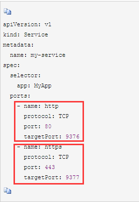
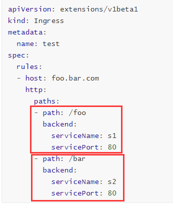
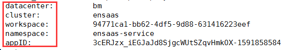

####  如果pod里面要设置两个端口，那svc和ingress该如何设定？

答：如果一个app想要开放两个端口，有两种方法，一种是起两个service，各对应一个端口（这种比较常见，不做解释）；另外一种是同一个servce，起两个端口，service.ymal中要为每个port设定name，类似的service.yaml如下图：
    
    
   若对应ingress也同时想暴露两个端口，可参照如下图（ingress暴露一个端口比较常见，不做解释）：
    
    
#### 同一namespace，如果一个pod要访问另一个pod不对外的port，该如何访问？

答：可以使用svc访问，svc访问规则为<servicename>.<namespace-name>.svc.cluster.local。其中，.svc.cluster.local是固定的。

#### 如果pod一直处于pending状态或imagepullbackoff，该如何查看原因？

答：当pod一直处于pending状态时，一般都是由于资源不足（比如Cpu、Memory、ephemeral storage不足导致），此时需要对namespace或workspace扩容，或者停用一些其他pod；当pod一直处于imagepullbackoff时，一般是因为image拉不下来，原因有多种，拉取image超时或拉取image时没有权限或image不存在等。上述两种情况均可使用命令kubectl describe pod <pod name> -n <namespace>或kubectl logs -f <podname> -n <namespace>查看确切原因

#### mp注入pod的环境变量key是什么？

答：mp主要会给pod的环境变量中注入datacenter、cluster、workspaceid、namespacename、appid，对应的key如下图：
     
