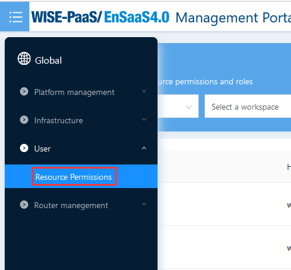
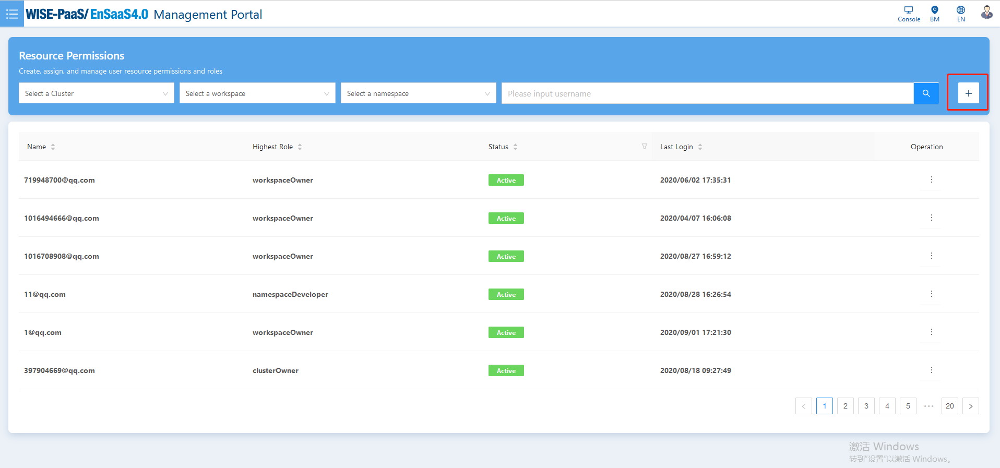
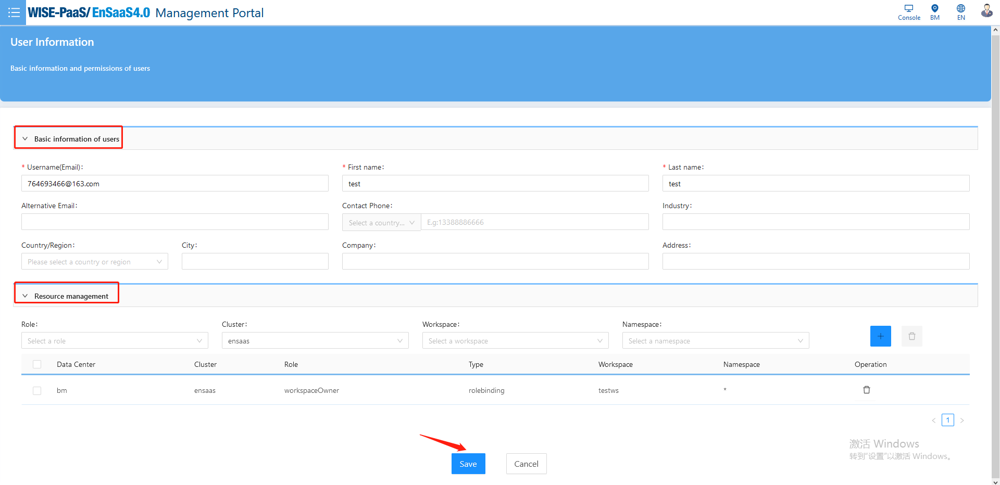
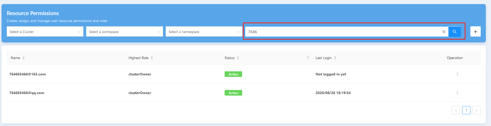
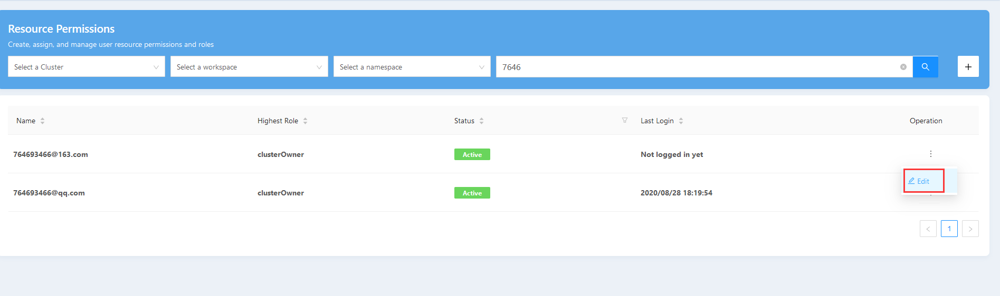
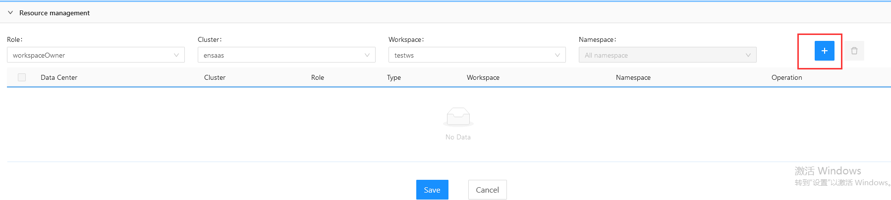
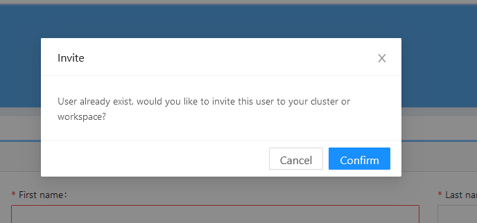

####  如何新建用户并分配权限？

答：如果您需要新建用户并分配权限，按照下述步骤操作可以帮助您快速解决问题：

1. 点选侧边栏的“Resource Permission”选项

   

2. 在“Resource Permission”页面点击添加“+”按钮

   

3. 输入用户基本信息，注意，其中username、first name、last name是必填项

   ![edituserinfo].(/imgs/edituserinfo.png)

4. 选择好待分配的资源和权限后，点击右侧“+”添加到资源权限列表

   

5. 确认账户基本信息和资源权限正确后，点击save完成创建

   

6. 创建完成后，页面跳转到Resource Permission页面并提示“success_insert”则表示新建成功

#### 如何查找指定user并分配权限？

答：如果您想要查找用户并分配资源权限，按照以下步骤操作可以：

1. 选择侧边栏“Resource Permission”

   

2. 在搜索框中输入待查找用户的关键词

   

3. 在搜索后的用户列表里找到目标用户并点击"Operation->Edit"

   

4. 在User Information下方的"Resource Management"部分编辑用户的资源权限

   

5. 点击save按钮，页面跳转并提示“Saved successfully”则表示修改成功

#### 如何邀请其他用户到自己的工作空间？

答：如果您想要邀请其他用户到自己的工作空间，根据下述步骤操作可以帮助您快速解决问题：

1. 选择侧边栏“Resource Permission”

   

2. 点击Resource Permission页面的新建“+”按钮

   

3. 在User Information页面输入username并点击页面空白处，弹出Invite确认框

   

4. 确认弹出框信息后选择confirm同意邀请当前用户到自己的工作空间

5. 编辑好用户资源权限后，点击Save完成邀请

