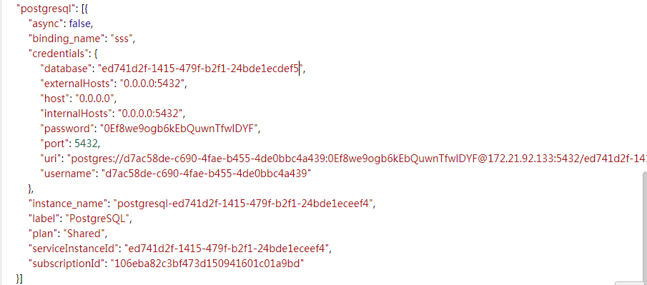

####  关于helmchart中使用DB Secret这个key会在环境变量中拿到什么信息？

答：订阅部署App时，会将App使用到的PostgreSQL、MongoDB、RabbitMQ、InfluxDB、Redis等数据库的连接信息存入DB Secret里面，将secret中ENSAAS_SERVICES对应的内容解码后，会得到下图类似的DB连接信息：
    

#### catalog订阅时，helmchart中ns-secret所有的DB连线咨询是怎么自动建立的？  

答：用户订阅Common Apps时，会在Catalog UI上勾选需要的DB instance，部署Common Apps时，appbuy会根据选择的DB instance调用相关API自动创建DB Secret，并替换helmchart中DB secret名称，最后部署App；对于Package类型服务，Pipeline中会先创建DB instance，再去部署app，并传入建好的DB instance，然后创建DB secret，部署app，流程与Common apps相同

