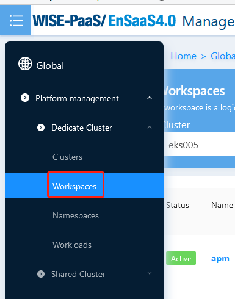

#### 如何查看workload的日志？

答：按照以下步骤操作，即可查看workload下不同pod的container logs:
1. 进入workload页面，点击Operation->Log

   

2. 在弹出窗口查看worload下面的各个pod和container的logs

   

3. 切换Pod或Container查看logs

   

4. 刷新后，获取最新的logs记录

   

   

#### 如何查看一段时间内pod的资源使用状况？

答：如果您想要查看workspace下的资源使用状况，根据以下步骤可以帮助您快速解决问题：

1. 选择侧边栏的”Workspaces"或者"General Workspaces“

   

   

2. 进入workspace页面，查看到workspace的部分资源使用状况

   

3. 选定workspace，点击后进入workspace overview页面

4. 查看选定workspace的更多资源使用状况以及部分资源的变化曲线

   

[注]：目前可供查看资源使用状况的包括Namespace数量、CPU/Memory Usage、CPU/Memory Quota、Limit CPU/Memory、Request CPU/Memory、Rootfs、Pod、PVC Disk、Service、Secret、ConfigMap.

