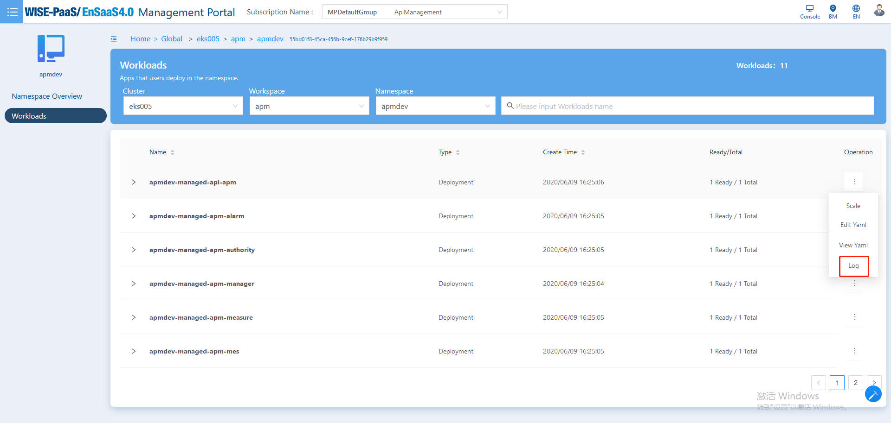
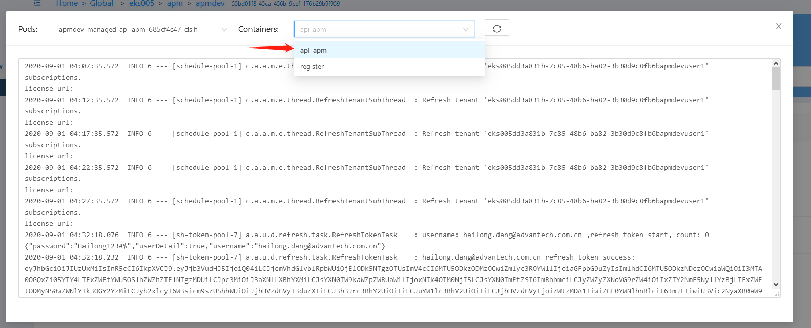
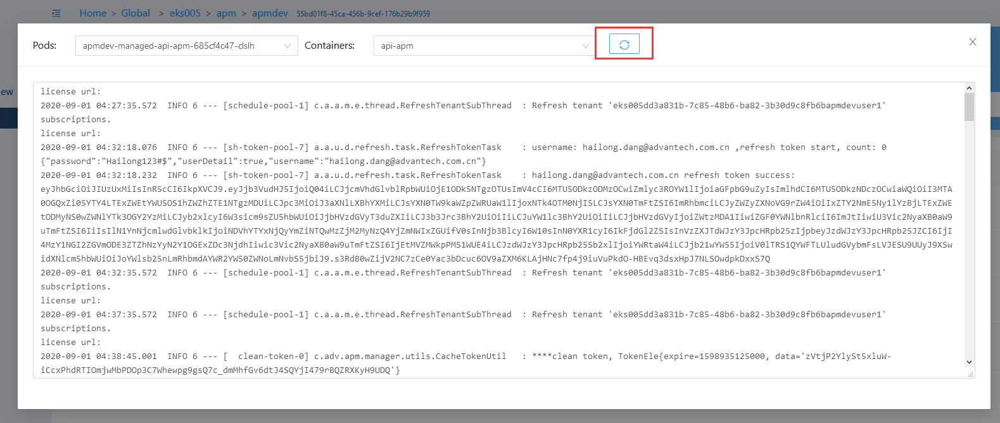

#### 如何查看workload的日志？

答：按照以下步骤操作，即可查看workload下不同pod的container logs:
1. 进入workload页面，点击Operation->Log

   

2. 在弹出窗口查看worload下面的各个pod和container的logs

   

3. 切换Pod或Container查看logs

   

4. 刷新后，获取最新的logs记录

   

   

#### 如何查看选定时间范围内pod/container的资源使用状况？

答：如果您想要查看选定时间范围内pod/container的资源使用状况，以下几种方法可以帮助您快速解决问题：

1. 选择侧边栏“Monitor”

   

2. 在monitor页面选定cluster、workspace、namespace

   

3. 切换页签至pod一栏，并在下拉列表中选择目标pod

   

4. 点击监控面板右上角的时间选项，选择目标时间范围或者自定义时间范围

   

5. 待监控面板更新完成后即可查看指定时间范围内pod的资源使用状况

   

6. 在container下拉列表中切换不同选项，分别查看各container的资源使用状况

   
