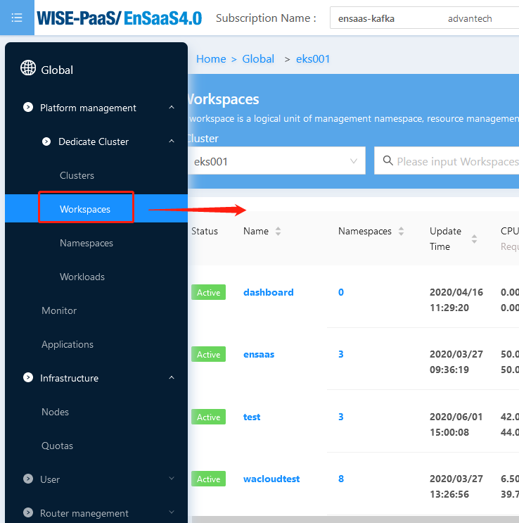
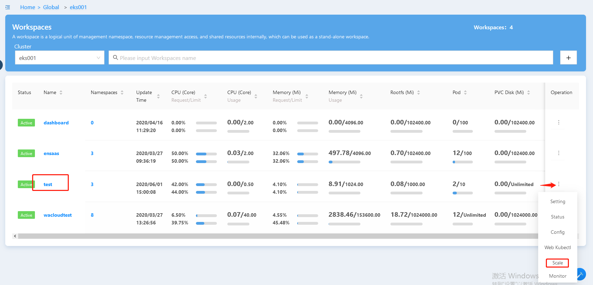
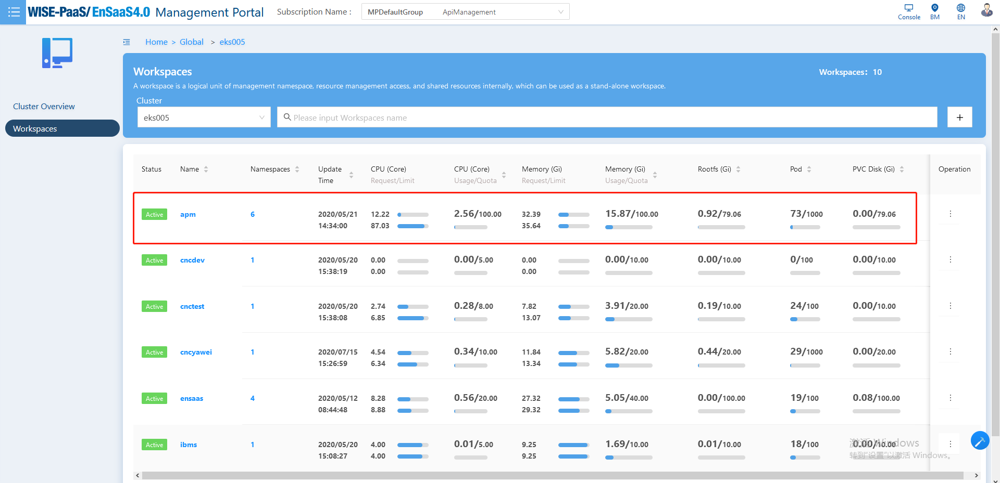

#### 如何扩容Dedicated Cluster 的工作空间？

答：如果您想要扩容workspace，下述两种方法可以帮助您快速解决问题：

- 在Workspaces页面直接扩容

  1. 选择侧边栏Dedicate Cluster->Workspaces

     

  2. 选定"workspace"，点击右侧Operation->Scale

     

  3. 选定“目标quota”，点击右侧”回形针“。注意：当前绑定的Quota回形针按钮显示蓝色

     

  4. 确认“弹出框”信息，点击OK完成扩容

     

- 在Workspace Quota页面进行扩容

  1. 选择侧边栏Infrastructure->Quotas

     

  2. 选定”目标quota“，确认待扩容workspace尚未绑定该quota

     

  3. 在Unbind列表“勾选待扩容workspace”，点击">"进行扩容

     

  4. 确认“弹出框”信息，点击OK完成扩容

     

#### 如何查看Workspace下的资源使用状况？

答：如果您想要查看workspace下的资源使用状况，根据以下步骤可以帮助您快速解决问题：

1. 选择侧边栏的”Workspaces"或者"General Workspaces“

   

   

2. 进入workspace页面，查看到workspace的部分资源使用状况

   

3. 选定workspace，点击后进入workspace overview页面

4. 查看选定workspace的更多资源使用状况以及部分资源的变化曲线

   

[注]：目前可供查看资源使用状况的包括Namespace数量、CPU/Memory Usage、CPU/Memory Quota、Limit CPU/Memory、Request CPU/Memory、Rootfs、Pod、PVC Disk、Service、Secret、ConfigMap.

#### Ensaas K8S Service资源分配(limit/request)说明

答：关于Ensaas K8S Service资源分配的说明主要从两个不同角度进行了解释，您可以根据自己的实际情况选取对应的角度去查看说明。

如果您关注的是整个cluster的资源使用状况，您需要从以下角度去理解。

**Request**

- 容器使用的最小资源需求, 作为容器调度时资源分配的判断依赖。
- requests用于schedule阶段，在调度pod保证集群下所有pod的requests之和 <= node能提供的计算能力
- 只有当前节点上可分配的剩余资源量 >= request 时才允许将容器调度到该节点。
- request参数不限制容器的最大可使用资源

**Limit**

- 容器能使用资源的最大值
- 设置为0表示对使用的资源不做限制, 可无限的使用

如果您关注的是单个workspace的资源使用状况，您需要从以下角度去理解。

**Request**

- 容器使用的最小资源需求, 作为容器调度时资源分配的判断依赖。
- request参数不限制容器的最大可使用资源

**Limit**

- 容器能使用资源的最大值
- 设置为0表示对使用的资源不做限制, 可无限的使用

**Request/Limit关系**

0 <= request <= limit = quota
