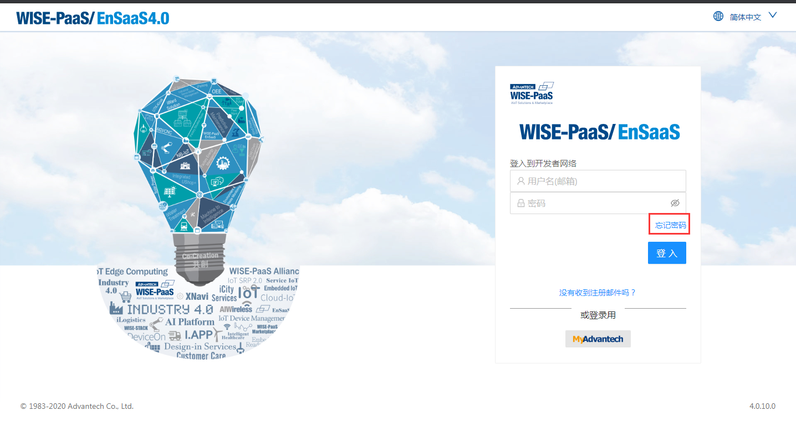
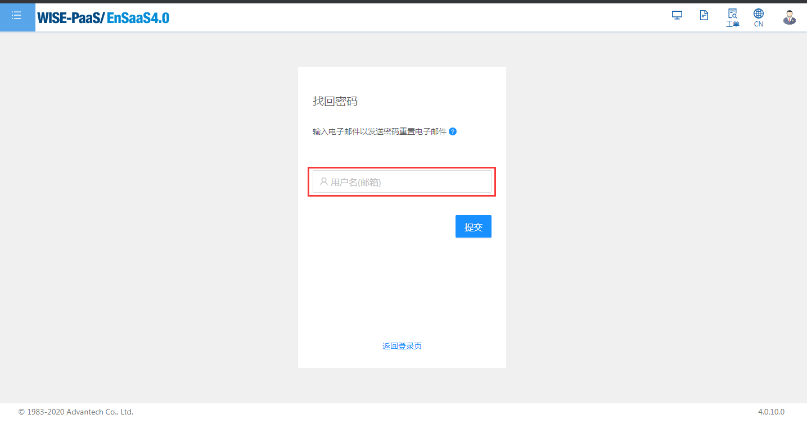
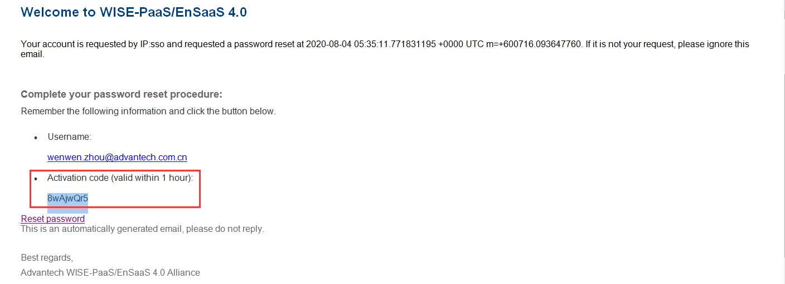
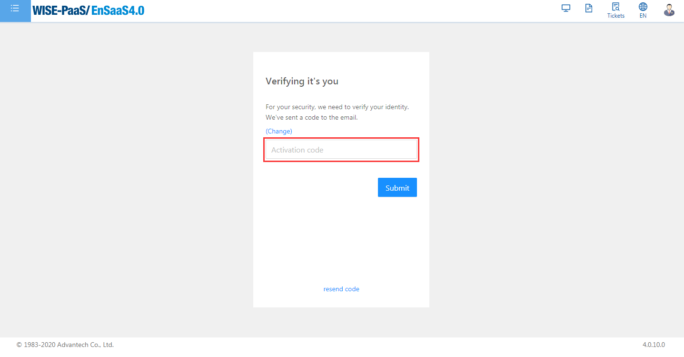
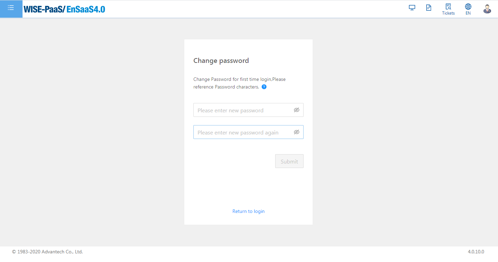
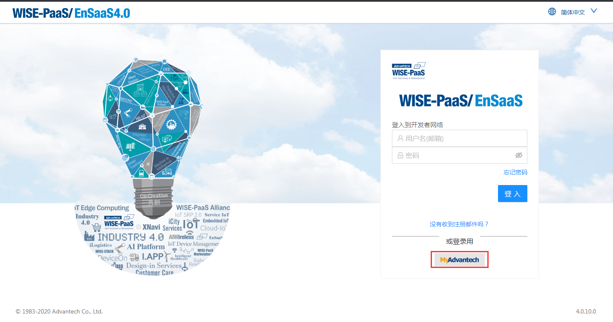
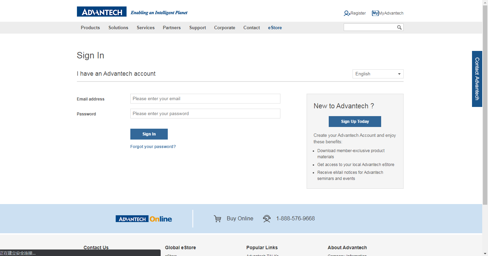

### 忘记密码
如果您忘记密码，下述两种方法可以帮助您快速解决问题：
- 重置密码
   1. 登录页面点击“忘记密码”
   
      
   
   2. “找回密码”输入电子邮件以发送密码重置电子邮件
   
      
   
   3. 收到的电子邮件中，复制“Activation code”。注意：激活码有效期为一个小时
   
      
   
   4. 回到2的页面，在“激活码”输入框中输入“Activation code”
   
      
   
   5. “更改密码”页面，进行更改密码
   
      
- MyAdvantech登录
   1. 登录页面点击“或登录用”MyAdvantech，页面导向Advantech官网
   
       
   
   2. 用在MarketPlace注册公司账号的MyAdvantech账户登录EnSaaS4.0
   
       
