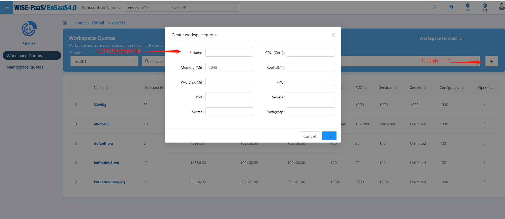
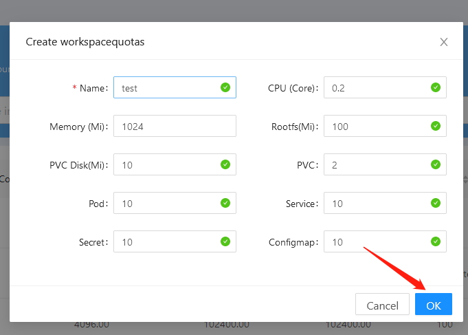

## 如何在Dedicate Cluster下创建自定义Workspace Quota？
如果没有更多可用的Quota或者已有Quota配额值不满足您的需求时，根据下述步骤创建自定义Workspace Quota可以帮助您快速解决问题：
1. 选择侧边栏Infrastructure->Quotas

   

2. 点击Quotas列表右上角的“+”，在弹出框中首先指定Quota名称。注意：同一个集群下Quota name是唯一的

   

3. 继续自定义配额值，同时建议自定义配额值不要超过集群自身规格

   

4. 点击OK键完成自定义Quota的创建

   

