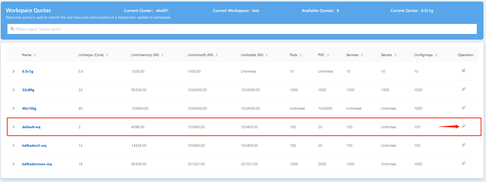
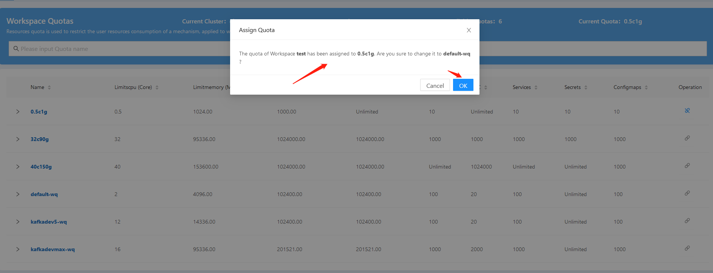
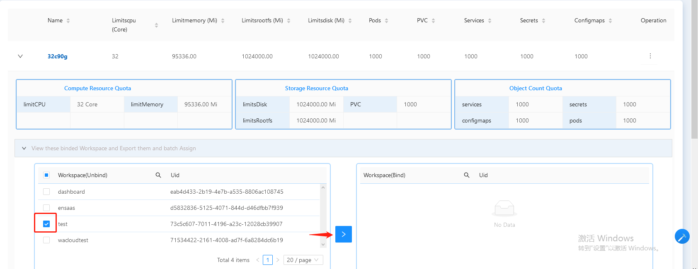
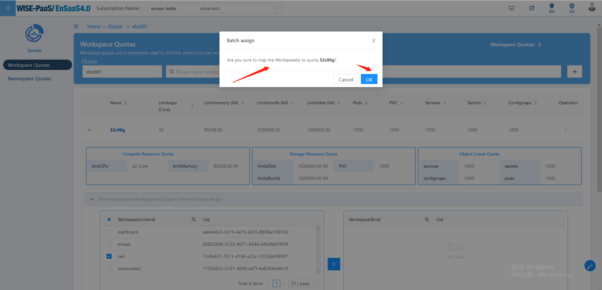

## 如何扩容Dedicated Cluster 的工作空间  
如果您想要扩容workspace，下述两种方法可以帮助您快速解决问题：

- 在Workspaces页面直接扩容
   1. 选择侧边栏Dedicate Cluster->Workspaces
   
      
   
   2. 选定"workspace"，点击右侧Operation->Scale
   
      
   
   3. 选定“目标quota”，点击右侧”回形针“。注意：当前绑定的Quota回形针按钮显示蓝色
   
      
   
   4. 确认“弹出框”信息，点击OK完成扩容
   
      
   
- 在Workspace Quota页面进行扩容
  
   1. 选择侧边栏Infrastructure->Quotas
   
      
   
   2. 选定”目标quota“，确认待扩容workspace尚未绑定该quota
   
      
   
   3. 在Unbind列表“勾选待扩容workspace”，点击">"进行扩容
   
      
   
   4. 确认“弹出框”信息，点击OK完成扩容
   
      
   
   
   
   

