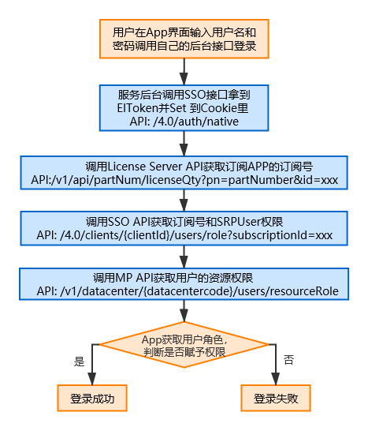
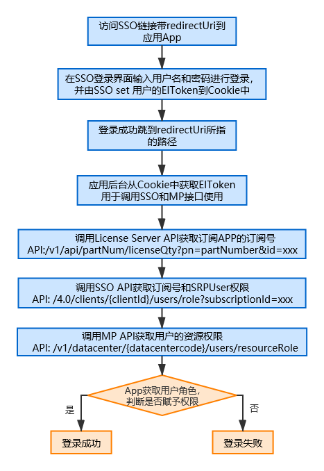
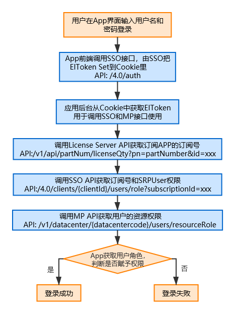
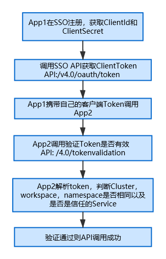

#SSO 介绍#
WISE-PaaS平台提供了单点登录（SSO）服务，作为平台的认证授权中心，具有统一的帐号管理、身份认证、用户授权等基础能力，并且跨系统的单点登录功能，用户使用单个用户名和密码就可以登录访问平台上有权限的多个系统，为平台上的多个整合系统的快速登入提供便利。同时SSO在4.0 新增企业账户管理的功能，企业账号下可以管理数个订阅号，各个订阅号彼此隔离，便于企业为下属不同组织或客户订阅服务和云资源空间，并透过订阅号统一管理费用。便于DFSI扮演二房东角色，管理自己的客户顺势拓展代销或销售业务。

#单点登录

应用程序可支持从某一个服务中登录SSO账号后，其他整合SSO的服务通过读取Cookie中的token可实现自动登录。cookie中的key为EIToken，值为user的token，然后用EIToken获取用户的权限进行验证登录。

#整合方式介绍#
WISE-PaaS平台的可订阅服务均已整合SSO，方便平台租户可以集中管理用户，分配用户管理权限与可访问的云资源权限。对于上架WISE-PaaS的服务我们推荐整合平台的SSO服务，下面我们介绍下几种整合方式以及适合的场景和优缺点
<table>
                   <tr>
                       <th>方式</th>
                       <th>适用场景</th>
                       <th>特点</th>
                       <th>单点登录</th>
                   </tr>
                   <tr>
                       <th>后端Native整合</th>
                       <th>
                          
1. 只有API Server的服务

                          
2. App已有自己的前端，调用自己的后台

                       </th>
                       <th>由后端API整合并封装对SSO的调用</th>
                       <th>Y</th>
                   </tr>
                   <tr>
                       <th>使用SSO界面登录重定向</th>
                       <th>
                          
没有登录界面和用户管理的App

                       </th>
                       <th>不用自己开发登录界面，到SSO登录后，重定向回自己的页面，检查token赋予权限</th>
                       <th>Y</th>
                   </tr>
                   <tr>
                       <th>前后端整合SSO</th>
                       <th>
                          
服务要自己开发登录界面

                       </th>
                       <th>前台整合SSO登录接口，后端整合权限验证部分</th>
                       <th>Y</th>
                   </tr>
                   <tr>
                   <th>OAuth整合</th>
                       <th>
                          
不部署在平台空间上的服务，SSO作为第三方认证中心

                       </th>
                       <th>标准的OAuth接口整合，整合完不支持单点登录</th>
                       <th>N</th>
                   </tr>
                   <th>Client Token整合</th>
                       <th>
                          
用户无关的服务间调用鉴权的需求

                       </th>
                       <th>在SSO注册的有效服务，SSO可颁发服务间可信任的客户端Token</th>
                       <th>N</th>
                   </tr>
</table>
#整合角色说明#
WISE-PaaS平台上的用户角色有：

- 订阅号角色：SubscriptionAdmin 和SubscriptionUser； 
- 资源角色有：ClusterOwner， WorkspaceOwner， NamespaceDeveloper； 
- App角色有：srpUser。 

不同服务整合的角色如下：  
**1. 对于托管服务，并不部署在平台空间上，建议整合订阅号的角色。SubscriptionAdmin 和SubscriptionUser有所订阅服务的最高访问权限。**   
**2. 对于非托管服务，部署在平台空间上，建议整合订阅号角色，资源角色和App角色。各种角色的权限说明如下：**     

-  SubscriptionAdmin 和SubscriptionUser有所订阅服务的最高访问权限。
-  ClusterOwner， WorkspaceOwner有自己空间下部署的服务的最高访问权限。
-  NamespaceDeveloper对有权限的namespace下部署的应用有访问权限，一般推荐是viewer的权限。
-  App 角色srpUser由应用服务管理自己的终端客户，并由应用服务管理客户的各种角色。
# 整合流程
##服务注册
不管用那种整合方式，首先服务需要在SSO上进行注册。 注册之后会被作为一个可信任的客户端，颁发一个ClientId 和Client Secret。在SSO上管理的srpUser角色的用户就是记录的clientId以及角色。

###流程
 1. 可通过API接口进行注册，记录返回的ClientId和ClientSecret，程序在初次启动的时候需要注册，注册成功之后需要记录client id 和client Secret，下次启动可使用 GET /clients/{clientIdOrName}查询，如果存在不用重复注册。
 2. 如果是OAuth整合，可在SSO 界面的Client节点下的创建页面注册一个Client，获取ClientId和ClientSecret

###API概览
<table>
    <tr>
       <th>API</th>
       <th>描述</th>
    </tr>
    <tr>
       <th>/v4.0/clients</th>
       <th>注册SSO客户端</th>
    </tr>
</table>
###API详情  
#### POST  /v4.0/clients
- 应用程序部署在ensaas上，mp会自动为应用启动的pod中注入env,包括appID,datacenter，cluster,workspace,namespace.
- srp调用sso api  认证方式使用sso v2.0时的srpToken
- srp注册成功之后应该保存clientId以及clientSecret，以便之后调用sso api需要。
#####请求参数  
<table>
                   <tr>
                       <th>名称</th>
                       <th>类型</th>
                       <th>是否必选</th>
                       <th>示例</th>
                       <th>描述</th>
                   </tr>
                   <tr>
                       <th>appName</th>
                       <th>string</th>
                       <th>是</th>
                       <th>Dashboard</th>
                        <th>client的名称，建议和serviceName一致</th>
                   </tr>
                   <tr>
                       <th>appId</th>
                       <th>string</th>
                       <th>是</th>
                       <th>dsadamdmsadsajdsijwqenmzxsd-1234567789</th>
                       <th>从pod env appID取得</th>
                   </tr>
                   <tr>
                       <th>serviceName</th>
                        <th>string</th>
                        <th>是</th>
                        <th>Dashboard</th>
                        <th>服务上架的名称</th>
                   </tr>
                    <tr>
                        <th>cluster</th>
                         <th>string</th>
                         <th>是</th>
                         <th>eks001</th>
                         <th>从pod env cluster取得</th>
                    </tr>
                    <tr>
                        <th>workspace</th>
                         <th>string</th>
                         <th>是</th>
                         <th>498797-wesadsadsa-454ds6d-dsads</th>
                         <th>从pod env workspace取得</th>
                    </tr>
                    <tr>
                        <th>namespace</th>
                         <th>string</th>
                         <th>是</th>
                         <th>test1</th>
                         <th>从pod env namespace取得</th>
                    </tr>
                    <tr>
                        <th>datacenter</th>
                         <th>string</th>
                         <th>是</th>
                         <th>hz</th>
                         <th>从pod env datacenter取得</th>
                    </tr>
                    <tr>
                        <th>redirectUrl</th>
                         <th>string</th>
                         <th>否</th>
                         <th></th>
                         <th>做oauth的校验用</th>
                    </tr>
                    <tr>
                         <th>scopes</th>
                         <th>[]string</th>
                         <th>否</th>
                         <th>["admin","user"]</th>
                         <th>srp的权限合集，如果不传则在添加srpUser的时候，不会对传入的字符串做限制</th>
                     </tr>                                                                                 
               </table>
               
#####响应参数            
   <table>
                   <tr>
                       <th>名称</th>
                       <th>类型</th>
                       <th>示例</th>
                       <th>描述</th>
                   </tr>
				    <tr>
                       <th>clientId</th>
                       <th>string</th>
                       <th>dashboard-1234567890</th>
                       <th>client id</th>
                   </tr>
				    <tr>
                       <th>creationTime</th>
                       <th>integer</th>
                       <th>1589528337</th>
                       <th>创建时间</th>
                   </tr>
				    <tr>
                       <th>lastModifiedTime</th>
                       <th>integer</th>
                       <th>1589528337</th>
                       <th>最后一次修改时间</th>
                   </tr>
				    <tr>
                       <th>serviceName</th>
                       <th>string</th>
                       <th>Dashboard</th>
                       <th>serviceName</th>
                   </tr>
				    <tr>
                       <th>workspace</th>
                       <th>string</th>
                       <th>498797-wesadsadsa-454ds6d-dsads</th>
                       <th>workspace id</th>
                   </tr>
				    <tr>
                       <th>namespace</th>
                       <th>string</th>
                       <th>test1</th>
                       <th>namespace name</th>
                   </tr>
				   <tr>
                       <th>datacenter</th>
                       <th>string</th>
                       <th>hz</th>
                       <th>datacenter code</th>
                   </tr>
				   <tr>
                       <th>cluster</th>
                       <th>string</th>
                       <th>eks001</th>
                       <th>cluster name</th>
                   </tr>
				   <tr>
                       <th>scopes</th>
                       <th>[]string</th>
                       <th>["admin","user"]</th>
                       <th>scopes</th>
                   </tr>
				   				   <tr>
                       <th>clientSecret</th>
                       <th>string</th>
                       <th>asdaseiweosdksaodisamcskajdwqjdksndsap</th>
                       <th>client secret</th>
                   </tr>
				    <tr>
                       <th>appId</th>
                       <th>string</th>
                       <th>dsadamdmsadsajdsijwqenmzxsd-1234567789</th>
                       <th>appId</th>
                   </tr>	     
				    <tr>
                       <th>redirectUrl</th>
                       <th>string</th>
                       <th></th>
                       <th>redirectUrl</th>
                   </tr>
            </table>
#####srpToken生成方式如下：  
        
        
        ● base64Url_encode(AES_encode(timestamp-srpName)) (tmestamp为当前10位时间戳)  
        
        ● AES_encode        
               ■ AES/ECB/PKCS5Padding 
            ○ Secret key: ssoisno12345678987654321
            ○ Golden unit test 
               ■ Source of plain text: 1234567890-SCADA 
               ■ base64Encode(AES encode(src)): (可利用 Online Crypto Tool 验证) 
                 ● h9mmu4CIc+YwBWDamtMKMA9tdDQNzz/RLTFfsfGoQhg= 
               ■ base64UrlEncode(AES encode(src)): (实际带在 header里请用 base64UrlEncode) 
                 ● h9mmu4CIc-YwBWDamtMKMA9tdDQNzz_RLTFfsfGoQhg= ○ Online Crypto Tool (base64Encode)
               ■ https://goo.gl/6ig1No ○ Java Sample code 
               ■ https://drive.google.com/open?id=0B0k7G85XKxSrVGRiNFNGa1c5b1k 
            ○ Java Cryptography Extension issue: 
               ■ http://www.oracle.com/technetwork/java/javase/downloads/
##后端Native整合
由服务后台API接口整合SSO的接口实现用户认证和鉴权
###流程 

 
 
###API概览
<table>
    <tr>
       <th>API</th>
       <th>描述</th>
    </tr>
    <tr>
       <th>/v4.0/auth/native</th>
       <th>使用用户名和密码获取SSO token</th>
    </tr>
    <tr>
       <th>/v1/api/partNum/licenseQty</th>
       <th>获取部署在某个平台空间下的服务的License信息</th>
    </tr>
    <tr>
       <th>/v4.0/clients/{clientId}/users/role</th>
       <th>获取User对Client的ClientRole以及User在传入的订阅号下的权限</th>
    </tr>
    <tr>
       <th>/v1/datacenter/{datacentercode}/users/resourceRole</th>
       <th>获取客户在某个指定集群，workspace和NameSpace下的最高权限</th>
    </tr>
</table>
###API详情

#### POST /v4.0/auth/native
在用户输入账号密码之后，应用后端拿到用户账号密码，然后调用此接口即可拿到用户的EIToken
#####请求参数  
 <table>
                           <tr>
                               <th>名称</th>
                               <th>类型</th>
                               <th>是否必选</th>
                               <th>示例</th>
                               <th>描述</th>
                           </tr>
        				    <tr>
                               <th>username</th>
                               <th>string</th>
                               <th>是</th>
                               <th>abdctest@test.com</th>
                               <th>username</th>
                           </tr>
        				    <tr>
                               <th>password</th>
                               <th>string</th>
                               <th>是</th>
                               <th>12334432132</th>
                               <th>password</th>
                           </tr>		   
  </table>
#####响应参数  
  <table>
                    <tr>
                        <th>名称</th>
                        <th>类型</th>
                        <th>示例</th>
                        <th>描述</th>
                    </tr>
 				    <tr>
                        <th>tokenType</th>
                        <th>string</th>
                        <th>Bearer</th>
                        <th>token type</th>
                    </tr>
 				    <tr>
                        <th>accessToken</th>
                        <th>string</th>
                        <th>{token}</th>
                        <th>user token</th>
                    </tr>
 				    <tr>
                        <th>expiresIn</th>
                        <th>integer</th>
                        <th>1589528337</th>
                        <th>到期时间</th>
                    </tr>
 				    <tr>
                        <th>refreshToken</th>
                        <th>string</th>
                        <th>{refreshToken}</th>
                        <th>刷新token的令牌</th>
                    </tr>
  </table>

#### GET /v1/api/partNum/licenseQty
给定应用的料号和应用部署的空间，查询此应用的License信息。在license的返回值中，可以拿到当前App是被哪个订阅号所订阅，即subscriptionId，订阅号id建议应用保存下来（这个一但订阅不会随便变化）
#####请求参数   
<table>
                           <tr>
                               <th>名称</th>
                               <th>类型</th>
                               <th>是否必选</th>
                               <th>示例</th>
                               <th>描述</th>
                           </tr>
        				    <tr>
                               <th>pn</th>
                               <th>string</th>
                               <th>是</th>
                               <th>9806xxxxx</th>
                               <th>产品的料号</th>
                           </tr>
        				    <tr>
                               <th>id</th>
                               <th>string</th>
                               <th>是</th>
                               <th>slave0420a957f4-0bf9-4faf-90cd-694919cd4b68dashboard</th>
                               <th>应用部署的空间唯一标识，由clustername+workspaceId+namespaceName 直接拼接组成</th>
                           </tr>		   
  </table>
#####响应参数  
  <table>
                    <tr>
                        <th>名称</th>
                        <th>类型</th>
                        <th>示例</th>
                        <th>描述</th>
                    </tr>
 				    <tr>
                        <th>id</th>
                        <th>string</th>
                        <th>slave0420a957f4-0bf9-4faf-90cd-694919cd4b68dashboard</th>
                        <th>应用部署的空间唯一标识</th>
                    </tr>
 				    <tr>
                        <th>subscriptionId</th>
                        <th>string</th>
                        <th>22ec5794-dcdc-43a1-ab88-xxxxxx</th>
                        <th>订阅应用的订阅号Id</th>
                    </tr>
 				    <tr>
                        <th>isValidTransaction</th>
                        <th>bool</th>
                        <th>true</th>
                        <th></th>
                    </tr>
 				    <tr>
                        <th>number</th>
                        <th>integer</th>
                        <th>1</th>
                        <th>订阅的个数</th>
                    </tr>
 				    <tr>
                        <th>authcode</th>
                        <th>string</th>
                        <th>5785-xxxx-xxx</th>
                        <th>由料号和空间标识以及number加密生成，可进行验证并获取number</th>
                    </tr>
 				    <tr>
                        <th>activeInfo</th>
                        <th>string</th>
                        <th>“”</th>
                        <th></th>
                    </tr>
  </table>  

#### GET /v4.0/clients/{clientId}/users/role
获取用户的clientRole以及subscriptionRole，同时会验证token的有效性，App调用成功获取用户对于client以及App所属订阅号的权限。如果用户的订阅号权限不为空，或者用户的clientRole已经为srp的最高权限了，则App按照最高权限赋予用户
#####请求参数   
<table>
                           <tr>
                               <th>名称</th>
                               <th>类型</th>
                               <th>是否必选</th>
                               <th>示例</th>
                               <th>描述</th>
                           </tr>
        				    <tr>
                               <th>clientId</th>
                               <th>string</th>
                               <th>是</th>
                               <th>Dashboard-1586781837</th>
                               <th>App注册的之后返回的ClientId</th>
                           </tr>
        				    <tr>
                               <th>subscriptionId</th>
                               <th>string</th>
                               <th>是</th>
                               <th>22ec5794-dcdc-43a1-ab88-xxxxxx</th>
                               <th>从上一步License获取到的订阅App的订阅号Id</th>
                           </tr>		   
  </table>
#####响应参数
    
   <table>
                   <tr>
                       <th>名称</th>
                       <th>类型</th>
                       <th>示例</th>
                       <th>描述</th>
                   </tr>
				    <tr>
                       <th>subscriptionRole</th>
                       <th>string</th>
                       <th>admin</th>
                       <th>用户在所选订阅号下的权限</th>
                   </tr>
				    <tr>
                       <th>clientRole</th>
                       <th>string</th>
                       <th>dashboard-1234573832.admin</th>
                       <th>用户对于所选client的scope</th>
                   </tr>
            </table>
#### GET /v1/datacenter/{datacentercode}/users/resourceRole
获取用户在给定资源条件下的最高资源权限，整合服务按照最高权限给用户分配权限即可。调用接口需要的datacentercode， clustername， workspaceId， namespaceName都可以通过服务自己的环境变量获取，部署的时候由平台注入，对应的环境变量的key分别是datacenter，cluster，workspace，namespace

#####请求参数
  <table>
                   <tr>
                       <th>名称</th>
                       <th>类型</th>
                       <th>是否必选</th>
                       <th>示例</th>
                       <th>描述</th>
                   </tr>
				    <tr>
                       <th>cluser</th>
                       <th>string</th>
                       <th>是</th>
                       <th>eks001</th>
                       <th>要查询的cluster name</th>
                   </tr>
				    <tr>
                       <th>workspace</th>
                       <th>string</th>
                       <th>是</th>
                       <th>bc7b7397-9e73-47c2-8349-09def78ed868</th>
                       <th>要查询的workspace id</th>
                   </tr>
					<tr>
                       <th>namespace</th>
                       <th>string</th>
                       <th>是</th>
                       <th>test1</th>
                       <th>namespace name</th>
                   </tr>   				   
            </table>
 
#####响应参数
 <table>
                       <tr>
                           <th>名称</th>
                           <th>类型</th>
                           <th>示例</th>
                           <th>描述</th>
                       </tr>
    				    <tr>
                           <th>HighestRole</th>
                           <th>string</th>
                           <th>clusterOwner</th>
                           <th>用户在对应空间下的最高权限</th>
                       </tr>
 </table>

##使用SSO界面登录重定向
如果用户的App没有登录界面和用户管理，不想自己开发登录界面，但要整合SSO，可跳转到SSO登录页面，登录之后重定向回自己的页面，检查token赋予权限
### 流程
 
### API概述
从App跳转到sso 的登录页，添加redirectUri的参数，表示登录成功之后要重定向回的url，登录成功跳转回去之后，由App的后台从cookie中获取EIToken，cookie中的key为EIToken，获取之后进行接口调用验证权
**https://portal-sso-ensaas.{domain}/home/sign-in?redirectUri=xxx**
<table>
    <tr>
       <th>API</th>
       <th>描述</th>
    </tr>
    <tr>
       <th>/v1/api/partNum/licenseQty</th>
       <th>获取部署在某个平台空间下的服务的License信息</th>
    </tr>
    <tr>
       <th>/v4.0/clients/{clientId}/users/role</th>
       <th>获取User对Client的ClientRole以及User在传入的订阅号下的权限</th>
    </tr>
    <tr>
       <th>/v1/datacenter/{datacentercode}/users/resourceRole</th>
       <th>获取客户在某个指定集群，workspace和NameSpace下的最高权限</th>
    </tr>
</table>
### API详情
/v1/api/partNum/licenseQty, /clients/{clientId}/users/role, /v1/datacenter/{datacentercode}/users/resourceRole参考后端Native整合部分的以上三个API详情。

##前后端整合SSO
服务要自己开发登录界面，前台整合SSO登录接口，后端整合权限验证部分，登录成功SSO会把用户Token写入浏览器cookie, 前端请求后台时会带入Cookie，由后端进行权限校验。
### 流程

### API概述
<table>
    <tr>
       <th>API</th>
       <th>描述</th>
    </tr>
    <tr>
       <th>/v4.0/auth</th>
       <th>SSO提供前端整合的登录接口</th>
    </tr>
    <tr>
       <th>/v1/api/partNum/licenseQty</th>
       <th>获取部署在某个平台空间下的服务的License信息</th>
    </tr>
    <tr>
       <th>/v4.0/clients/{clientId}/users/role</th>
       <th>获取User对Client的ClientRole以及User在传入的订阅号下的权限</th>
    </tr>
    <tr>
       <th>/v1/datacenter/{datacentercode}/users/resourceRole</th>
       <th>获取客户在某个指定集群，workspace和NameSpace下的最高权限</th>
    </tr>
</table>
### API详情
##### POST /v4.0/auth
* 请求参数
  <table>
                   <tr>
                       <th>名称</th>
                       <th>类型</th>
                       <th>是否必选</th>
                       <th>示例</th>
                       <th>描述</th>
                   </tr>
				    <tr>
                       <th>username</th>
                       <th>string</th>
                       <th>是</th>
                       <th>abdctest@test.com</th>
                       <th>username</th>
                   </tr>
				    <tr>
                       <th>password</th>
                       <th>string</th>
                       <th>是</th>
                       <th>12334432132</th>
                       <th>password</th>
                   </tr>
  </table>
##### /v1/api/partNum/licenseQty, /clients/{clientId}/users/role, /v1/datacenter/{datacentercode}/users/resourceRole参考后端Native整合部分的以上三个API详情。

##OAuth整合

### 流程

### API概述
<table>
    <tr>
       <th>API</th>
       <th>描述</th>
    </tr>
    <tr>
       <th>/v4.0/oauth/authorize</th>
       <th>获取授权码</th>
    </tr>
    <tr>
       <th>/v4.0/oauth/token</th>
       <th>获取用户token</th>
    </tr>
</table>
### API详情
####GET /v4.0/oauth/authorize 获得授权码

#####请求参数
 <table>
                       <tr>
                           <th>名称</th>
    					   <th>参数携带位置</th>
                           <th>类型</th>
                           <th>是否必选</th>
                           <th>示例</th>
                           <th>描述</th>
                       </tr>
    				    <tr>
                           <th>response_type</th>
    					   <th>query</th>
                           <th>string</th>
                           <th>是</th>
                           <th>code</th>
                           <th>resopnse type</th>
                       </tr>
    				    <tr>
                           <th>client_id</th>
    					    <th>query</th>
                           <th>string</th>
                           <th>是</th>
                           <th>dashboard-1234567894</th>
                           <th>在sso注册过的client对应的id</th>
                       </tr>
    					<tr>
                           <th>redirect_uri</th>
    					   <th>query</th>
                           <th>string</th>
                           <th>否</th>
                           <th>http://tsxt.com</th>
                           <th>授权成功之后重定向的地址，即接受授权码的程序</th>
                       </tr>	
     </table>

####POST /v4.0/oauth/token
应用程序后端获取到授权码后，再调用POST /v4.0/oauth/token 既可获取到用户token进行授权 
 
#####请求参数
 <table>
                    <tr>
                        <th>名称</th>
 					   <th>参数携带位置</th>
                        <th>类型</th>
                        <th>是否必选</th>
                        <th>示例</th>
                        <th>描述</th>
                    </tr>
 				    <tr>
                        <th>grant_type</th>
 					   <th>query</th>
                        <th>string</th>
                        <th>是</th>
                        <th>authorization_code</th>
                        <th>grant_type</th>
                    </tr>
 				    <tr>
                        <th>client_id</th>
 					    <th>query</th>
                        <th>string</th>
                        <th>是</th>
                        <th>23dodsadspdjweujkdnsdn</th>
                        <th>client id</th>
                    </tr>
 					<tr>
                        <th>code</th>
 					   <th>query</th>
                        <th>string</th>
                        <th>是</th>
                        <th>djsadjsadasjkdpwqjdspdjsdpiwjdksdjspajdaisdjwdsajk</th>
                        <th>oauth返回的授权码</th>
                    </tr>	
 					<tr>
                        <th>redirect_uri</th>
 					   <th>query</th>
                        <th>string</th>
                        <th>是</th>
                        <th>http://tsxt.com</th>
                        <th>需要于client_id注册时传入的redirect_uri匹配</th>
                    </tr>	   
 </table>
 
#####响应参数
 <table>
                          <tr>
                              <th>名称</th>
                              <th>类型</th>
                              <th>示例</th>
                              <th>描述</th>
                          </tr>
       				    <tr>
                              <th>tokenType</th>
                              <th>string</th>
                              <th>Bearer</th>
                              <th>token type</th>
                          </tr>
       				    <tr>
                              <th>accessToken</th>
                              <th>string</th>
                              <th>{token}</th>
                              <th>user token</th>
                          </tr>
       				    <tr>
                              <th>expiresIn</th>
                              <th>integer</th>
                              <th>1589528337</th>
                              <th>到期时间</th>
                          </tr>
       				    <tr>
                              <th>refreshToken</th>
                              <th>string</th>
                              <th>{refreshToken}</th>
                              <th>刷新token的令牌</th>
                          </tr>
        </table> 

##Client Token整合

### 流程

### API概述
<table>
    <tr>
       <th>API</th>
       <th>描述</th>
    </tr>
    <tr>
       <th>/v4.0/oauth/token</th>
       <th>获取clientToken</th>
    </tr>
</table>
### API详情
####POST /v4.0/oauth/token
应用注册成功即可调用POST /v4.0/oauth/token 获取clientToken，对于已经支持ClientToken的服务可携带此ClientToken进行调用，对方即可解析Token进行验证，通过则赋予权限

#####请求参数
  <table>
                   <tr>
                       <th>名称</th>
					   <th>参数携带位置</th>
                       <th>类型</th>
                       <th>是否必选</th>
                       <th>示例</th>
                       <th>描述</th>
                   </tr>
				    <tr>
                       <th>grant_type</th>
					   <th>query</th>
                       <th>string</th>
                       <th>是</th>
                       <th>client_credentials</th>
                       <th>grant_type</th>
                   </tr>
				    <tr>
                       <th>client_id</th>
					    <th>query</th>
                       <th>string</th>
                       <th>是</th>
                       <th>23dodsadspdjweujkdnsdn</th>
                       <th>client id</th>
                   </tr>
					<tr>
                       <th>client_secret</th>
					   <th>query</th>
                       <th>string</th>
                       <th>是</th>
                       <th>djsadjsadasjkdpwqjdspdjsdpiwjdksdjspajdaisdjwdsajk</th>
                       <th>client secret</th>
                   </tr>	
					<tr>
                       <th>duration</th>
					   <th>query</th>
                       <th>string</th>
                       <th>否</th>
                       <th>eternal</th>
                       <th>是否获取永久的token,eternal=永久，不带为临时</th>
                   </tr>	   
            </table>

            
#####响应参数
 <table>
                         <tr>
                             <th>名称</th>
                             <th>类型</th>
                             <th>示例</th>
                             <th>描述</th>
                         </tr>
      				    <tr>
                             <th>tokenType</th>
                             <th>string</th>
                             <th>Bearer</th>
                             <th>token type</th>
                         </tr>
      				    <tr>
                             <th>accessToken</th>
                             <th>string</th>
                             <th>{token}</th>
                             <th>user token</th>
                         </tr>
      				    <tr>
                             <th>expiresIn</th>
                             <th>integer</th>
                             <th>1589528337</th>
                             <th>到期时间</th>
                         </tr>
      				    <tr>
                             <th>refreshToken</th>
                             <th>string</th>
                             <th>{refreshToken}</th>
                             <th>刷新token的令牌</th>
                         </tr>
       </table>           
* clientToken作为srp自身的标识，代表srp自己的身份，也可以使用clientToken调用sso api或者其他支持clientToken的srp的api。（类似于user EIToken，就是一个身份标识）

## App管理srpUser用户
### 流程
- App注册成功取得clientId和clientSecert。
- 可通过PATCH /users/{username}/scopes接口创建用户并分配App权限，或修改，移除用户对App的权限

### API概述
<table>
    <tr>
       <th>API</th>
       <th>描述</th>
    </tr>
    <tr>
       <th>/v4.0/users/{username}/scopes</th>
       <th>创建用户并分配App权限，或修改，移除用户对App的权限</th>
    </tr>
</table>
### API详情
####PATCH /users/{username}/scopes
#####请求参数
  <table>
                       <tr>
                           <th>名称</th>
    					   <th>参数携带位置</th>
                           <th>类型</th>
                           <th>是否必选</th>
                           <th>示例</th>
                           <th>描述</th>
                       </tr>
    				    <tr>
                           <th>username</th>
    					   <th>url</th>
                           <th>string</th>
                           <th>是</th>
                           <th>test@test.com</th>
                           <th>username</th>
                       </tr>
    				    <tr>
                           <th>clientId</th>
    					    <th>body</th>
                           <th>string</th>
                           <th>否</th>
                           <th>dashboard-1234567894</th>
                           <th>当使用client token调用时可以不传</th>
                       </tr>
    					<tr>
                           <th>clientSecret</th>
    					   <th>body</th>
                           <th>string</th>
                           <th>否</th>
                           <th>djsadjsadasjkdpwqjdspdjsdpiwjdksdjspajdaisdjwdsajk</th>
                           <th>client secret当使用clientToken 时可以不传</th>
                       </tr>	
    					<tr>
                           <th>action</th>
    					   <th>body</th>
                           <th>string</th>
                           <th>是</th>
                           <th>append</th>
                           <th>append remove mix 其中一种，append代表追加权限，remove代表移除权限，mix代表取权限的并集</th>
                       </tr>
    				   <tr>
                           <th>scopes</th>
    					   <th>body</th>
                           <th>[]string</th>
                           <th>是</th>
                           <th>["admin"]</th>
                           <th>本次需要操作的权限，比如action=append,scopes=["admin"]，则意味着，这次需要给user添加一条当前srp的admin的权限</th>
                       </tr>
</table>
