# SSO简介 #

WISE-PaaS平台提供了单点登录（SSO）服务，作为平台的认证授权中心，具有统一的帐号管理、身份认证、用户授权等基础能力，并且跨系统的单点登录功能，用户使用单个用户名和密码就可以登录访问平台上有权限的多个系统，为平台上的多个整合系统的快速登入提供便利。

WISE-PaaS平台的可订阅服务均已整合SSO，方便平台租户可以集中管理用户，分配用户管理权限与可访问的云资源权限

当用户使用用户名和密码登录时，将返回该用户的令牌（token）并将其存储在浏览器Cookie中； 这省去了传统的身份验证过程，后者涉及在服务器中创建会话并返回cookie的操作。
WISE-PaaS SSO以JSON Web令牌（JWT）的格式提供令牌，JWT是一种开放标准（RFC 7519），它定义了一种紧凑且自包含的方式来安全地将用户信息作为JSON对象传输。  

WISE-PaaS SSO还支持了标准的OAuth 2.0整合，是您值得信任的用户身份认证和授权中心。

# 用户权限 #
SSO管理的用户角色有二种类型，分别订阅号角色和应用角色。

## 订阅号角色 
 - **Global Admin - 全球数据中心管理员:** EnSaaS全球数据中心的管理者，负责全球所有数据中心的管理；在SSO中有所有订阅号管理权限，可以管理订阅号和分配订阅号用户，可以设置用户状态。 
 - **Subscription Admin - 订阅号管理员：**	某个订阅号的管理者，EnSaaS 订阅号与MyAdvantech企业帐号相对应。订阅号管理员有在EnSaaS云平台上订阅、升级、降级、退订产品/服务/资源(统称为云服务)的权限，订阅后默认拥有云服务的管理权限和访问权限；订阅号管理员有管理云服务订单、账单等商务功能的权限。    
 - **Subscription User - 订阅号用户：**	某个订阅号下的一般用户，拥有订阅号所订阅的云服务的管理和访问权限，没有服务订阅、退订权限，没有订单、账单等商务功能的管理权限。
## 应用角色
 - **SRPUser - 应用用户：**	某个应用类云服务的用户，有应用的访问权限，应用访问者具体所拥有的应用角色由应用最高权限访问者分配；SRPUser 没有EnSaaS 租户空间的访问权限。

# 用户管理 #
## 用户登录##
 - **登录**  
 打开SSO的访问链接（http://portal-sso-ensaas.{datacenterCode}.{domain}）， dataCenterCode和domain 替换为对应站点的信息。到登录页面后输入用户名和密码点击“登入”按钮登录。 用户名输入不区分大小写，SSO统一存储小写的用户名。右上角可切换不同的语言。

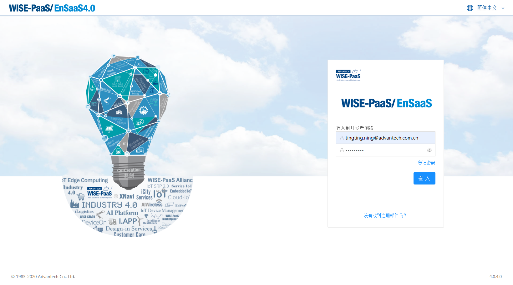  
图1 - 登录页面

 - **重发注册信**  
 如果新添加的用户没有收到注册信，可在登录页面重发一封，再到邮箱查收。邮箱的格式如下：*@wise-paas.com.cn，如果没有收到，请检查一下是否收到垃圾邮箱，并可设置为信任邮箱。

**Step1**: 点击登录页面的“没有收到注册邮件吗”
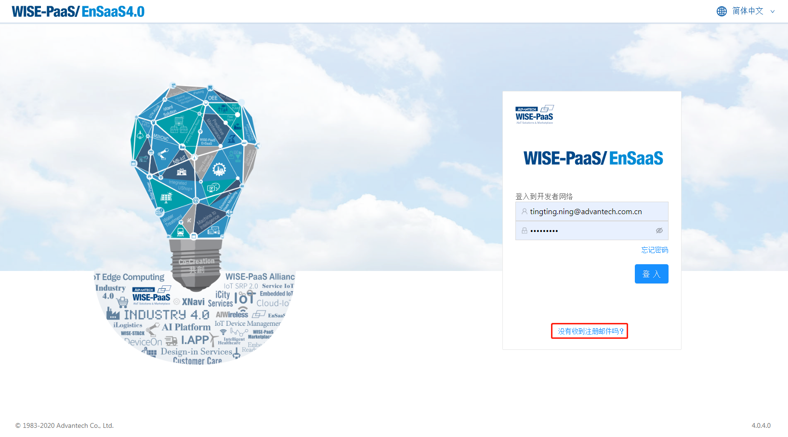 
图2 - 登录页面

**Step2**: 在注册信重发页面输入自己的邮箱，点击提交即会重新发送
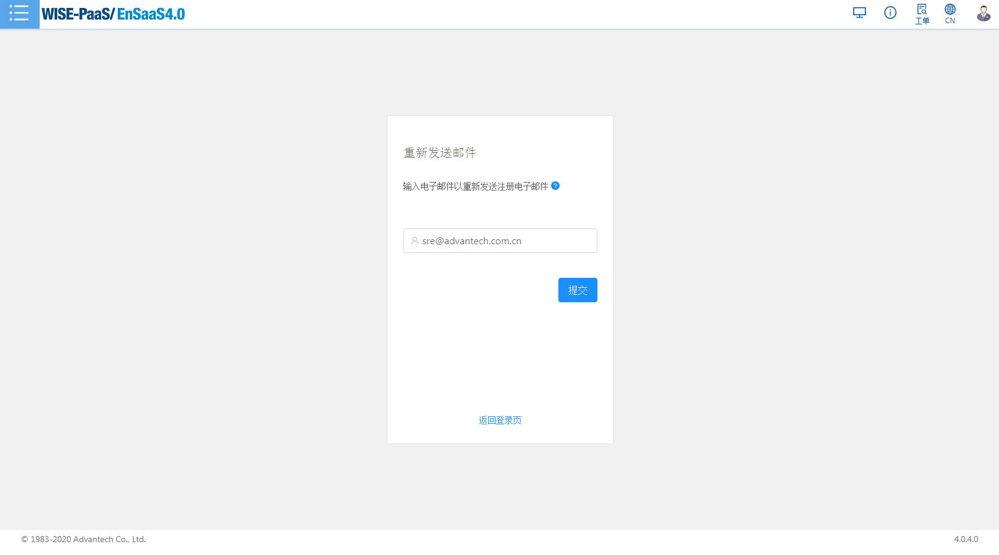 
图3 - 重发邮件页面

 - **新用户登录修改密码**  
 新添加的SSO用户会收到一封注册信，信中包含初始的SSO密码，建议用户登录SSO进行密码的修改。  

**Step1**: 登录SSO的portal，使用邮件中的password进行登录，如果第一次登录会提示用户修改密码
 
图4 - 注册信

**Step2**: 如果第一次登录会提示用户修改密码
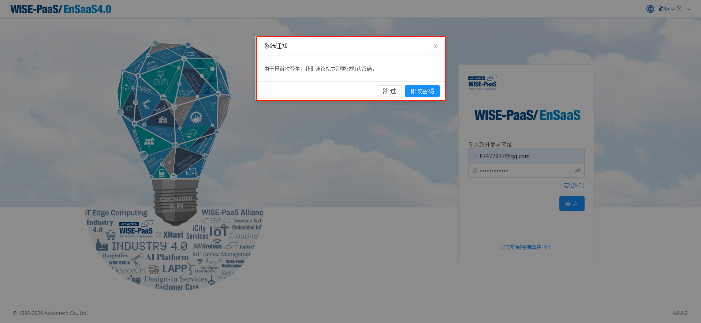 
图5 - 修改密码提示

**Step3**: 在此页面修改密码，注意提示的密码规则
 
图6 - 修改密码页面

## 创建用户 ##
用户创建分为四个场景：Marketplace创建订阅号和用户，添加订阅号成员，创建用户并分配订阅号权限和创建SRP用户。

### 场景1 - Marketplace创建订阅号和用户 ###
在Marketplace上创建的用户和企业账户，将由marketplace自动在SSO上创建一个与该用户公司账号所对应的订阅号并将用户绑定到这个订阅号下，默认设置为订阅号管理员，该用户可以从SSO的“我的个人资料”中查看。 此订阅号管理员即可去Catalog订阅购买资源或服务， 购买成功就拥有了该资源的相关权限。 用户可以通过登录Management Portal来查看已购买的ensaas的租户空间资源。
### 场景2 - 添加订阅号成员 - 添加拥有订阅号购买的所有资源的用户 ###
订阅号管理员可以添加一个新用户作为订阅号用户，添加的用户自动拥有该订阅号购买的所有资源。
   

- **如果被邀请的用户已存在，则订阅号管理员可以邀请现有用户加入订阅号。 现有用户将直接被添加到订阅号中。**   

**Step1**: 点击左侧的订阅号节点，出现有权限的订阅号列表，点击某个订阅号的名称这一行，则进入订阅号的成员管理界面如图1
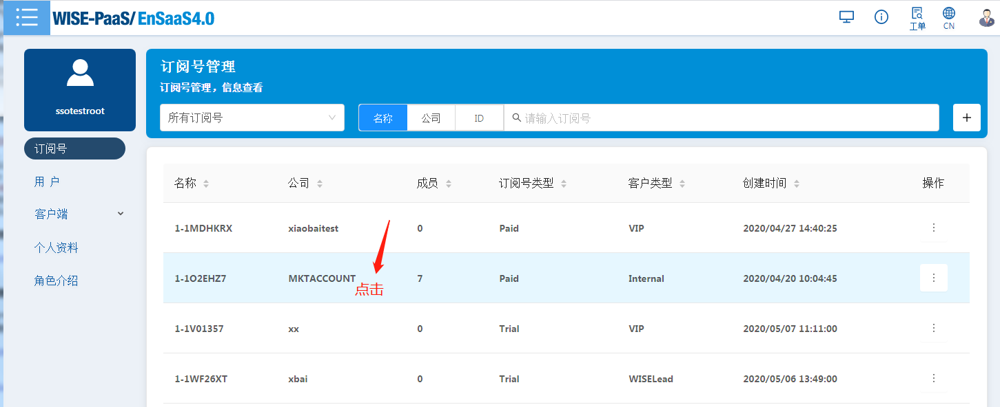  
图7 - 订阅号列表

**Step2**: 点击菜单右侧的“+”按钮，将弹出“添加团队成员”对话框。 输入邀请的用户邮箱，然后点击“添加至订阅号”按钮将用户添加为订阅号成员，默认是订阅号admin可以添加订阅号user权限的用户。 
  
图8 - 邀请已存在的用户到订阅号中  

- **如果被邀请的用户不存在，则订阅号管理员可以创建一个新的用户，并将新用户添加到订阅号中。**

**Step1**:同场景1的步骤1

**Step2**:同场景1的步骤2，只是第二步输入的用户是一个在SSO不存在的新用户，输入邮箱后，点击“添加至订阅号”按钮将跳至用户创建页面。

**Step3**:填写用户基本信息，从那个订阅号点进来添加用户的，下面的订阅号信息就有默认的这一条权限，点击“添加至订阅号”按钮即可。
 
 
图9 - 编辑新用户的基本信息

### 场景3- 创建用户并分配订阅号权限 ###
可以在用户管理的菜单中添加用户并分配当前登录用户拥有的一个或多个订阅号的权限。  
**Step1**: 点击左侧的用户节点，出现用户管理的列表，点击菜单右侧的“+”按钮，到添加用户界面

图10 - 用户列表

**Step2**: 在新建用户界面，填写用户邮箱和基本信息，带*的是必填项。在订阅号信息下面选择你要分配的订阅号并选择权限，点击“+”按钮在下面列表中添加一行订阅号的信息，可重复添加多条，要删除可点击列表后面的垃圾桶图标。下面的列表展示此用户的所有订阅号权限。
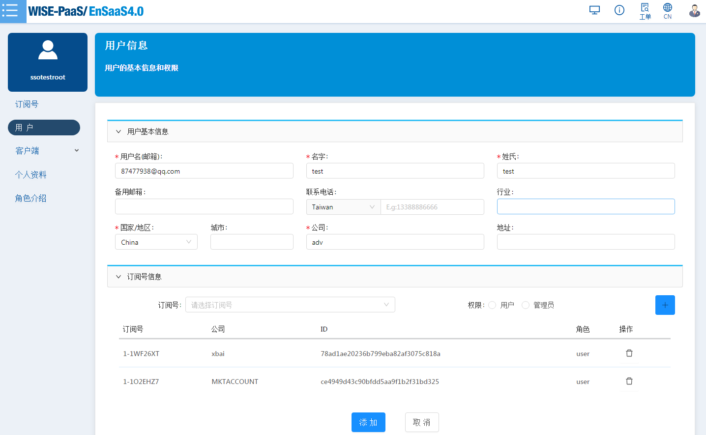
图11 - 编辑新用户的基本信息

**Step3**: 点击“添加”按钮即可添加一个有权限的用户，也支持只添加用户不分配订阅号权限之后再添加，这种用户的权限会是unassigned。
 

### 场景4 - 添加App用户 ###
从应用程序添加用户将自动创建一个SSO帐户，该用户身份为SRPUser，由I.App负责其管理。

## 用户权限编辑 ##
用户信息编辑有两种入口：
1. 在“用户管理”页面中 选中某个用户点击操作中的编辑菜单可编辑这个用户的订阅号权限

图12 - 编辑用户信息  
2. 在“我的个人资料”右上角点击编辑按钮来编辑自己的信息，可以修改基本信息和订阅号权限。

图13 - 个人信息  

用户资料包含以下内容：

   - **基本信息：** 显示基本用户信息, 用户基本信息只有自己可以修改，例如用户名，电子邮件，电话，国家/地区，城市，公司等。其中用户ID是唯一的。    
   - **订阅号信息：** 显示用户的订阅号信息，可以编辑修改用户的订阅号权限。 该信息包含订阅号的名称，公司，ID和角色。  

用户信息编辑页面：

图14 - 编辑用户信息  

## 用户的禁用/激活/删除
在用户列表菜单可以展开操作按钮，选择删除，禁用/激活操作。只有全球数据中心管理员(Global Admin)可以删除，禁用/激活。

  - **删除：** 删除一个SSO用户。  
  - **禁用/激活：** 正常用户状态为激活状态，如果将其禁用，禁用期间该用户无法登录SSO，除非再次激活。

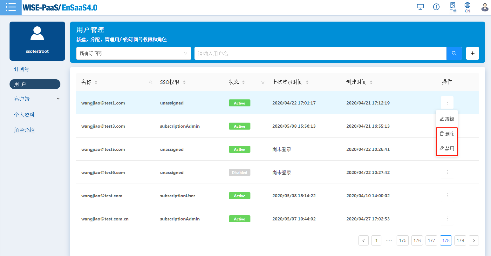
图15 - 用户操作
## 用户筛选 ##
点击“用户”菜单，可列出登录用户所属订阅号下的用户，支持按照订阅号类型、订阅号名称筛选，用户名称筛选。

1> 订阅号admin 可以看到所属订阅号下的订阅号admin、订阅号user、自己添加的unsigned的用户。

2> 订阅号user只能看到所属订阅号下的其他订阅号user和自己添加的unsigned的用户。

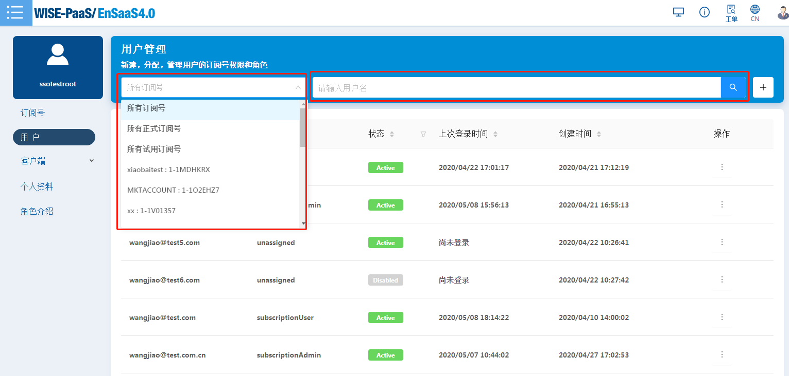
图16 - 用户列表筛选

# 订阅号管理
点击“订阅号”菜单，可列出了登录用户所属的所有订阅号列表。 从列表中可以查看到订阅号的基本信息包括：名称、公司、成员、订阅号类型、客户类型、创建时间。
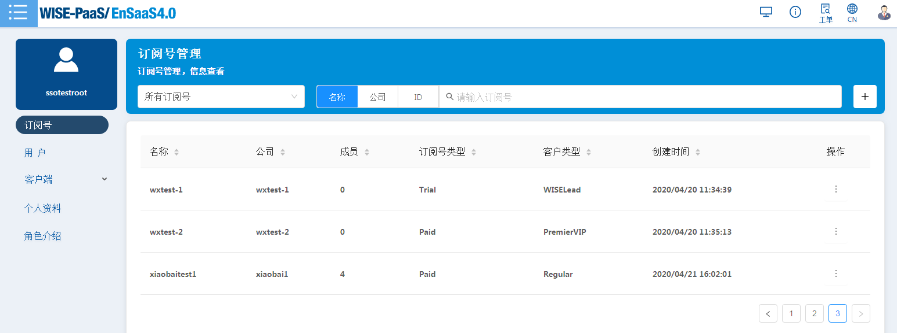
图17 - 订阅号列表
## 订阅号详情查看
在订阅号列表菜单可以点击展开某个订阅号后的操作按钮，选择详情可查看订阅号的详细信息，详情页面多了可用点数，账户所有者，ID信息。
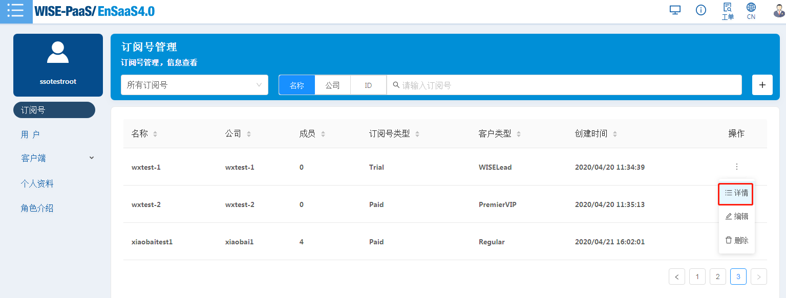
图18 - 订阅号列表详情菜单

图19 - 订阅号详情

## 创建订阅号
Markectplace的用户和企业账户会由Markectplace调用SSO接口来自动创建，每个订阅号均对应每个公司的帐户。 如果想为非市场（Marketplace)用户创建订阅号，请联系EnSaaS管理员。

## 订阅号用户管理 
可以点击订阅号列表中的订阅号进入订阅号成员页面进行管理，或者 用户菜单列表中选择用户进行订阅号的权限管理。
订阅号相关用户管理的行为包括：  

 - 订阅号管理员可以选择向订阅号中添加或者从订阅号中移除普通用户。
 - 订阅号普通用户只有查看权限，无权做添加或移除用户操作。 
 - 用户列表中可以按照订阅号筛选用户
 
## 订阅号用户添加 ##
订阅号用户的添加，可参考前面用户管理里的场景2和3。

## 订阅号用户移除 ##
订阅号管理员用户或Global Admin用户可以从订阅号中移除订阅号普通用户，但此用户并没有删除，只是不属于此订阅号。 从订阅号中移除用户后，该用户将不再具有订阅下资源的权限。
**Step1**: 点击左侧的订阅号节点，出现有权限的订阅号列表，点击某个订阅号的名称这一行，则进入订阅号的成员管理界面
**Step2**: 选中用户列表中的某个用户，展开最右侧的操作菜单，点击其中的remove，如下图

图20 - 从订阅号中移除用户

# 客户端管理 #
## 客户端管理 ##
用户可查看到自己有权限的资源空间下的所有客户端的注册信息。包括通过API或是在SSO界面上注册的客户端。  客户端“管理”页面默认显示用户有权限的第一个数据中心，第一个集群和第一个工作空间下的客户端。

  - 用户可以通过页面标题上的搜索字段找到特定的客户端。  
  - 用户可以按下“编辑”按钮来编辑客户端信息。

 
图21 - 客户端管理

## 客户端注册 ##

如果用户使用标准的OAuth集成方法，则需要在SSO界面上向SSO进行注册以获取有效的ClientId，此ID可以在OAuth集成后做后续使用。 用户可以通过SSO界面上的“客户端/创建”选项手动进行注册。
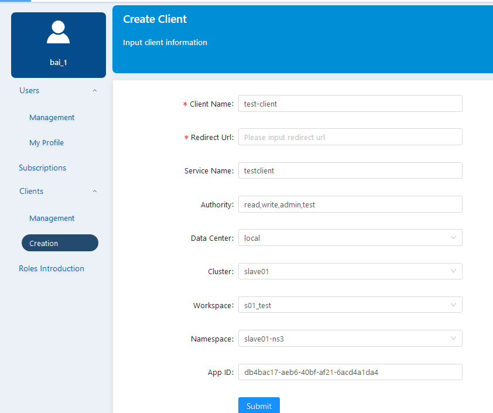 
图22 - 客户端注册