# SSO简介 #

WISE-PaaS平台提供了单点登录（SSO）服务，作为平台的认证授权中心，具有统一的帐号管理、身份认证、用户授权等基础能力，并且跨系统的单点登录功能，用户使用单个用户名和密码就可以登录访问平台上有权限的多个系统，为平台上的多个整合系统的快速登入提供便利。

WISE-PaaS平台的可订阅服务均已整合SSO，方便平台租户可以集中管理用户，分配用户管理权限与可访问的云资源权限

当用户使用用户名和密码登录时，将返回该用户的令牌（token）并将其存储在浏览器Cookie中； 这省去了传统的身份验证过程，后者涉及在服务器中创建会话并返回cookie的操作。
WISE-PaaS SSO以JSON Web令牌（JWT）的格式提供令牌，JWT是一种开放标准（RFC 7519），它定义了一种紧凑且自包含的方式来安全地将用户信息作为JSON对象传输。  

WISE-PaaS SSO还支持了标准的OAuth 2.0整合，是您值得信任的用户身份认证和授权中心。

# 用户权限 #
SSO管理的用户角色有三种类型，分别是租户空间资源角色，订阅号角色和应用角色。
## 租户空间资源角色

 - **Global Admin - 全球数据中心管理员:** EnSaaS全球数据中心的管理者，负责全球所有数据中心的管理，有所有数据中心的最高管理权限；可以分配数据中心管理员、集群管理员及租户空间角色；有订阅号管理权限，可以创建订阅号和分配订阅号用户。  
 - **DataCenter Admin - 数据中心管理员:**  某个数据中心的管理者，负责本数据中心的管理，有本数据中心所有集群的最高管理权限；可以管理所有集群的资源，可以分配集群管理员及租户空间角色；有订阅号管理权限，可以创建订阅号和分配订阅号用户。  
 - **Cluster Admin - 集群管理员:** 某个Kubernetes集群的管理者，负责本集群的管理；有本集群的所有权限，包括所有工作空间和所有命名空间的管理权限，以及集群中所有部署的应用的管理权限，拥有本集群全部Kubernetes资源的管理权限；可以分配租户空间角色；没有订阅号管理权限。   
 - **Cluster Owner - 集群所有者:** 某个独享规格集群的所有者，负责本集群级别租户空间的管理；有本集群的访问权限，包括所有工作空间和所有命名空间的管理权限，以及租户在此集群中所部署的应用的管理权限，拥有本集群中部分Kubernetes资源的管理权限；可以分配工作空间和命名空间角色。没有本集群的订阅、升级、降级和退订等商务功能的操作权限。   
 - **Workspace Owner - 工作空间所有者:** 某个通用规格工作空间的所有者或某个独享规格集群中建立的某个工作空间的所有者，负责本工作空间级别租户空间的管理，有本工作空间的访问权限，有本工作空间下的所有命名空间的管理权限，以及租户在此工作空间中所部署的应用的管理权限，拥有本工作空间中部分Kubernetes资源的管理和访问权限；可以分配命名空间角色。没有本工作空间的订阅、升级、降级和退订等商务功能的操作权限。  
 - **Namespace Developer - 命名空间开发者:** 某个命名空间的开发者，有本命名空间的访问权限，包括本命名空间中所部署的应用的管理，拥有本命名空间中部分Kubernetes资源的管理权限。
## 订阅号角色 
 - **Subscription Admin - 订阅号管理员：**	某个订阅号的管理者，EnSaaS 订阅号与MyAdvantech企业帐号相对应。订阅号管理员有在EnSaaS云平台上订阅、升级、降级、退订产品/服务/资源(统称为云服务)的权限，订阅后默认拥有云服务的管理权限和访问权限；订阅号管理员有管理云服务订单、账单等商务功能的权限。    
 - **Subscription User - 订阅号用户：**	某个订阅号下的一般用户，拥有订阅号所订阅的云服务的管理和访问权限，没有服务订阅、退订权限，没有订单、账单等商务功能的管理权限。
## 应用角色
 - **SRPUser - 应用用户：**	某个应用类云服务的用户，有应用的访问权限，应用访问者具体所拥有的应用角色由应用最高权限访问者分配；SRPUser 没有EnSaaS 租户空间的访问权限。
# 用户管理 #
## 创建用户 ##
用户创建分为四个场景：Marketplace创建订阅号和用户，添加订阅号用户，分配订阅号的部分资源权限和创建SRP用户。

### 场景1 - Marketplace创建订阅号和用户 ###
在Marketplace上创建的用户和企业账户，将由marketplace自动在SSO上创建一个与该用户公司账号所对应的订阅号并将用户绑定到这个订阅号下，默认设置为订阅号管理员，该用户可以从SSO的“我的个人资料”中查看。 此订阅号管理员即可订阅购买资源或服务， 购买成功就拥有了该资源的相关权限。 用户可以通过登录Management Portal（MP）来查看已购买的ensaas的租户空间资源。
### 场景2 - 添加订阅号用户 - 添加订阅号购买的所有资源 ###
订阅号管理员可以添加一个新用户作为订阅号用户，添加的用户自动拥有该订阅号购买的所有资源。
按下标题左侧的“+”按钮，将弹出“添加团队成员”对话框。 输入邀请的用户帐户，然后通过单击“添加至订阅号”按钮将用户添加到订阅号中。    

- **如果被邀请的用户已存在，则订阅号管理员可以邀请现有用户加入订阅号。 现有用户将直接被添加到订阅号中。**   

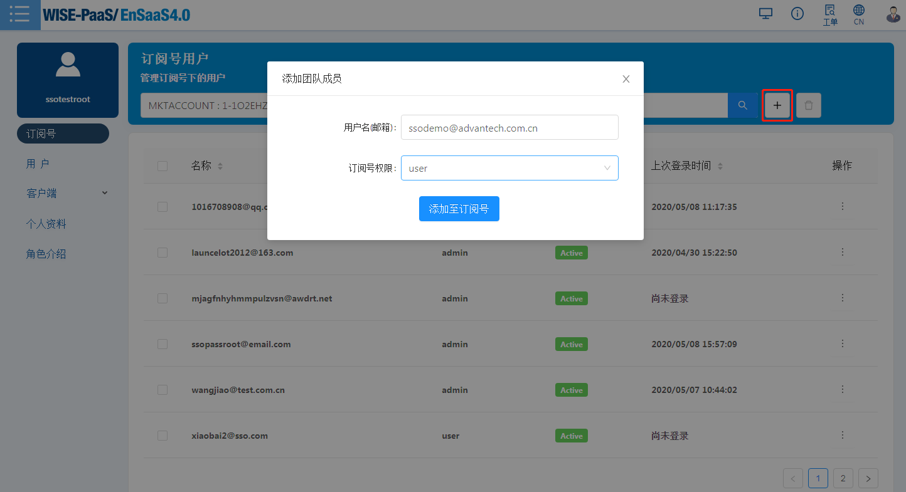  
图1 - 邀请已存在的用户到订阅号中  

- **如果被邀请的用户不存在，则订阅号管理员可以创建一个新的用户，并将新用户添加到订阅号中。**

如果输入的用户名不存在，“添加至订阅号”按钮将跳至用户创建页面。 设置基本信息并按下“添加至订阅号”后，将跳转至创建新用户页面。  
因为订阅号用户具有对该订阅号资源的所有权限，所以不需要填写“资源管理”部分。
 
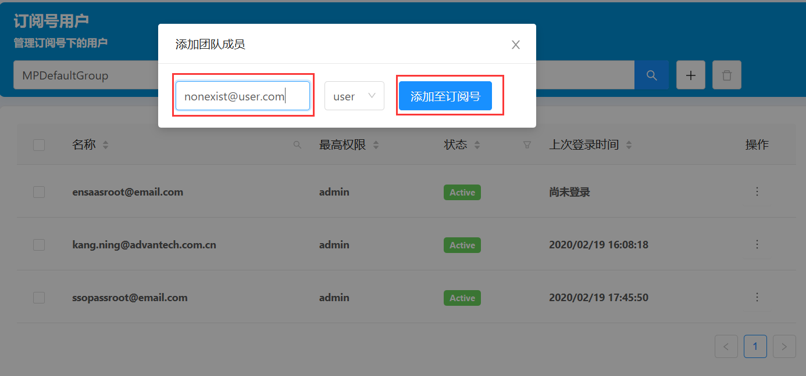 
图2 - 邀请不存在的用户

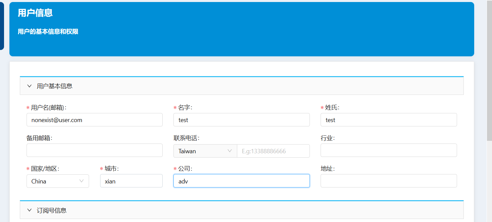 
图3 - 编辑新用户的基本信息

### 场景3- 分配订阅号的部分资源权限 - 添加拥有订阅号购买的部分资源的用户 ###
如果某订阅号管理员只想为新用户分配订阅号购买的部分资源，则管理者可以在SSO的“资源权限”页面下添加用户，并把自己拥有资源的部分权限源分配给这个新用户，这种情况下不需要将新用户添加到订阅中。   

 - **新建用户：**按下“资源权限”页面左上角的“+”按钮，它将跳至“用户信息”页面以创建新的用户帐户，基本信息是必填项，资源绑定信息是可选的，可以添加完用户之后再分配权限。

 - **编辑用户：**在“资源权限”页面上选中特定用户，点开操作下面的图标，选择“编辑”菜单，进入用户信息编辑页面，可在此页面删除或者添加资源权限。

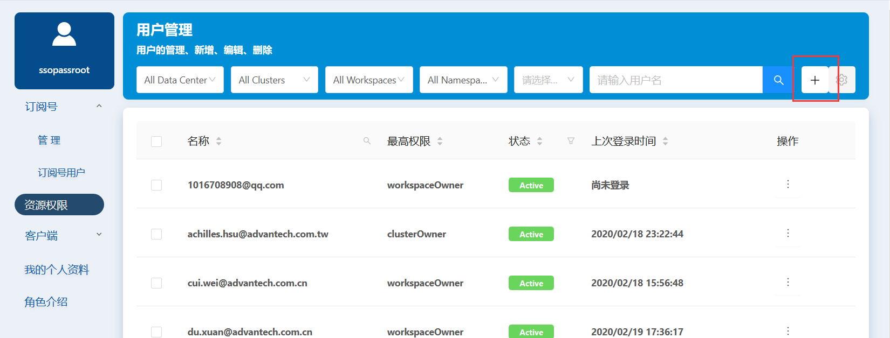
图4 - 添加用户  

**为用户分配资源权限**

用户分配资源权限被称作权限绑定（rolebinding)，分三个步骤：

1. 选择资源权限，选择数据中心（Data Center)和集群(Cluster)，然后选择角色（Role），根据分配者的角色不同分三种情况：
  
  - 如果登录的用户是**clusterOwner**，则它可以分配的权限是workspaceOwner和namespaceDeveloper。  
    如果选择了workspaceOwner，则必须选择一个工作空间(workspace)，而无需选择命名空间（namespace)，因为workspaceOwner对工作空间中的所有命名空间拥有全部权限。    
    如果选择了namespaceDevelper，则需要选择命名空间所属的群集（cluster），工作空间（workspace）及命名空间（namespace）    
  - 如果登录的用户是**workspaceOwner**，则可以分配的权限只有namespaceDeveloper。   
  - 如果登录的用户是**namespaceDeveloper**，则不能分配资源。  
  
2. 按下“+”按钮添加资源权限绑定。如果需要删除某项资源权限，请单击相应权限后面的垃圾桶图标。

3. 按下“保存”按钮（在创建用户页面上为“添加”）以保存更改。

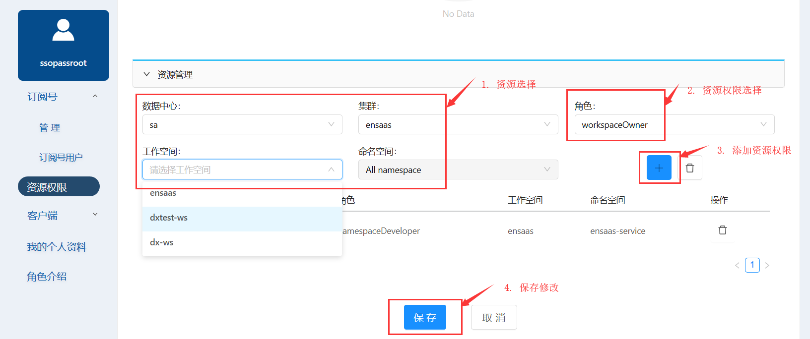
图5 - 编辑用户资源权限信息

### 场景4 - 添加SRP用户 ###
从应用程序添加用户将自动创建一个SSO帐户，该用户身份为SRPUser，由I.App负责其管理。

## 用户信息编辑 ##
用户在“资源权限”页面中 选中某个用户点击操作中的编辑菜单可编辑其它用户的信息，请参考图5-编辑用户资源权限信息。 在“我的个人资料”右上角点击编辑按钮来编辑自己的信息，可以修改基本信息和资源权限。
用户资料包含以下内容：

   - **基本信息：**列出基本用户信息，例如用户名，电子邮件，电话，国家/地区，城市，公司等。其中用户ID是唯一的。    
   - **订阅号信息：**显示用户的订阅号信息。 该信息包含订阅号的名称，ID，公司和用户在订阅号中的角色。  
   - **资源权限：**列出用户的资源权限信息。 例如用户在哪些数据中心，集群，工作空间和命名空间中拥有什么权限。
    

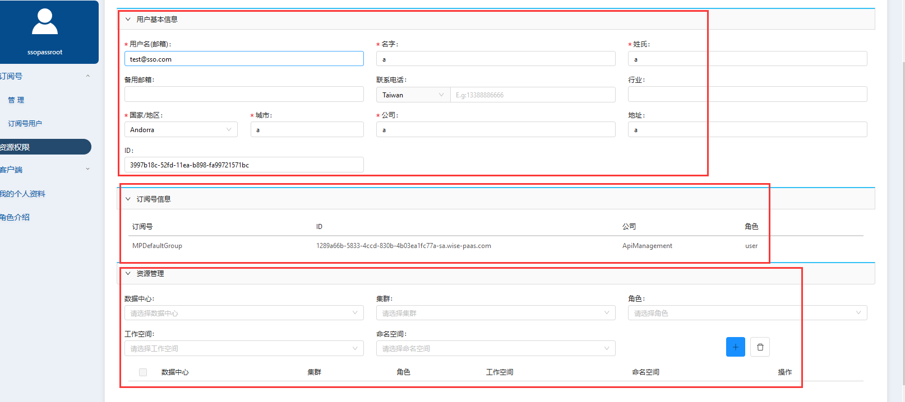
图6 - 编辑用户信息  

## 用户的禁用/激活/删除
在资源权限的用户可以展开操作按钮，选择编辑，删除，禁用/删除操作。

  - **编辑：**为其他用户添加或删除属于登录用户的资源权限，该部分已在前面的章节中介绍过。  
  - **删除：**只有数据中心管理员(datacenterAdmin)可以删除用户。  
  - **禁用/激活：**正常用户状态为激活状态，可以选择将其禁用，禁用期间该用户无法登录SSO，除非再次激活。

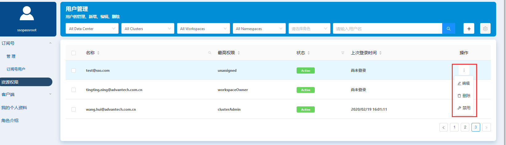
图7 - 用户操作

# 订阅号管理
订阅号“管理”页面列出了登录用户所属的所有订阅号列表。 通常情况下，一个用户仅会属于一个订阅号。

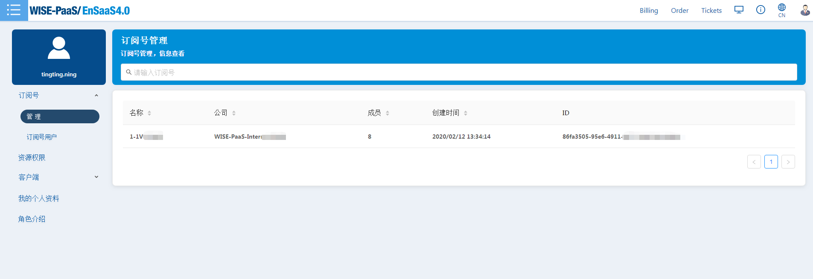
图8 - 订阅号列表

## 创建订阅号
Markectplace的用户和企业账户会由Markectplace调用SSO接口来自动创建，每个订阅号均对应每个公司的帐户。 如果想为非市场（Marketplace)用户创建订阅号，请联系EnSaaS管理员。

# 订阅号用户管理 
“订阅号用户”页面列出了登录用户所属订阅号中的其他用户及其在订阅号中的权限。  

 - 订阅号管理员可以选择向订阅号中添加或者从订阅号中移除普通用户。
 - 订阅号普通用户只有查看权限，无权做添加或移除用户操作。 
 - 订阅号用户列表中可以按照订阅号筛选用户
 
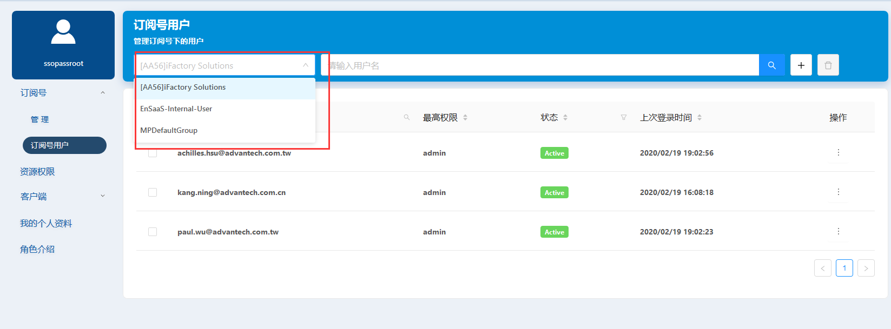
图9 - 筛选订阅号下的用户

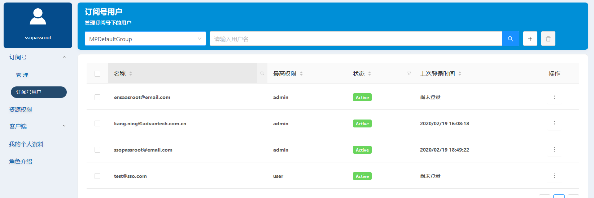
 图10 - 订阅号中的用户列表  

## 邀请用户成为订阅号成员 ##
订阅号管理员输入被邀请用户的完整账号，则可以邀请其他用户加入其订阅号。  
操作步骤可参考前面场景2和3。

## 从订阅号中移除用户 ##
订阅号管理员用户可以从订阅号中移除普通用户，但此用户并没有删除，只是不属于此订阅号。 无权移除其他订阅号管理员。  
从订阅号中移除用户后，该用户将不再具有订阅下资源的默认权限，只有单独分配给该用户的资源权限可以保留。
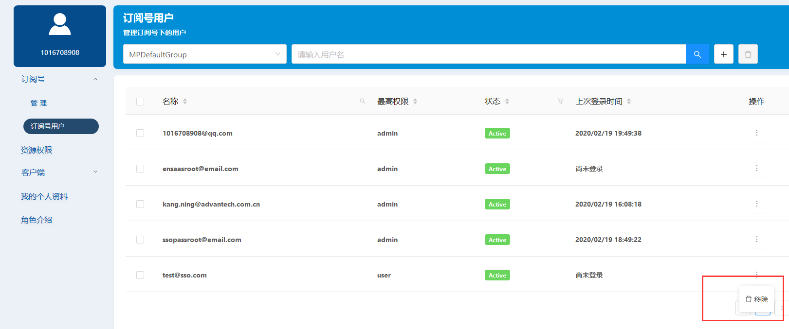
图11 - 从订阅号中移除用户

# 客户端管理 #
## 客户端管理 ##
只有workspaceOwner及更高权限的用户才能查看客户端管理。 无论是通过API注册还是在SSO界面上注册的用户都可以查看其在资源空间中部署的应用程序的注册信息。  客户端“管理”页面默认显示用户权限内的第一个数据中心，第一个集群和第一个工作空间下的客户端。

  - 用户可以通过页面标题上的搜索字段找到特定的客户端。  
  - 用户可以按下“编辑”按钮来编辑客户端信息。

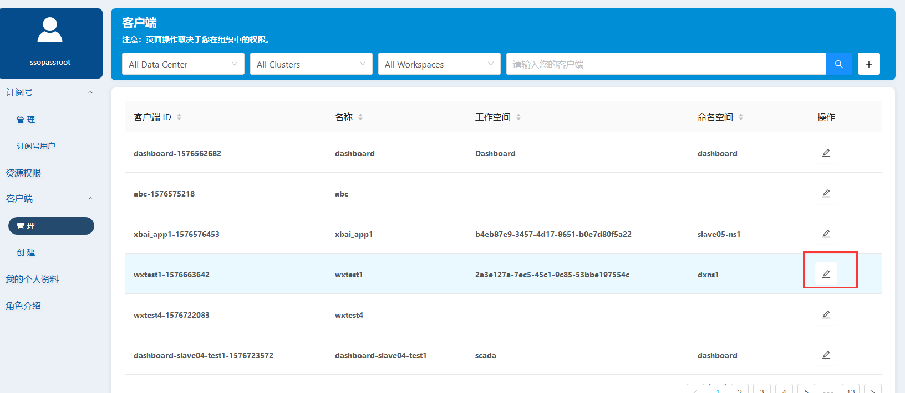 
图12 - 客户端管理

## 客户端注册 ##

如果用户使用标准的OAuth集成方法，则需要向SSO进行注册以获取有效的ClientId。用户可以通过SSO界面上的“客户端/创建”选项手动进行注册，从而获得在SSO注册中心注册的有效ID，此ID可以在OAuth集成后做后续使用。
