# SSO Introduction #

WISE-PaaS provides SSO, a property of access control over multiple inter-related yet independent software systems.  
With this property, users can log in with a single username and password to access all systems, and it allows developers to authenticate and manage the identity of users.  
When a user logs in with a username and password during authentication, the user’s token is returned to and stored in browser cookies;  this dispenses with the traditional authentication, which involves creating a session in the server and returning a cookie.  
WISE-PaaS SSO provides tokens in the format of JSON Web Token (JWT), an open standard (RFC 7519) that defines a compact and self-contained way for securely transmitting user information as a JSON object.  
WISE-PaaS SSO also provides standard OAuth 2.0 integration, and is a trusted user authentication and authorization center.

# User Roles #
There are two types of the user roles, namely Subscription Management role and App Management role.

## Subscription Role ##
**-Global Admin** The manager of EnSaaS global data center is responsible for the management of all data centers in the world; all subscription management rights are available in SSO, which can manage subscription and assign subscription users, and can set user status.   
**-Subscription Admin**	The admin of an EnSaaS subscription. An EnSaaS subscription is bound to a MyAdvantech account. The admin can subscribe to, upgrade or downgrade, and unsubscribe from a product, service, or resource (all of which are referred to cloud services) on the EnSaaS platform. The admin can manage or access a cloud service on the EnSaaS platform they have subscribed to. The admin can also manage orders and bills for cloud services.  
**-Subscription User**	A user of a subscription. The user can manage and access the cloud services covered in the subscription but cannot subscribe to any cloud service, unsubscribe from the service, or manage an order or bill for the service. 
## App Role ##
**-SRP User**	The user of a cloud-based application. They can access the application, and their role is assigned by the visitor to the application who has the highest privilege. They cannot access any EnSaaS tenant space. 
# User Management #
## User Login##
 - **login**  
Replace dataCenterCode and domain with the information of the corresponding site. After entering the login page, enter the user name and password and click the "Login" button to log in. User name input is not case sensitive, and SSO stores the user name in lower case. You can switch between different languages in the upper right corner.

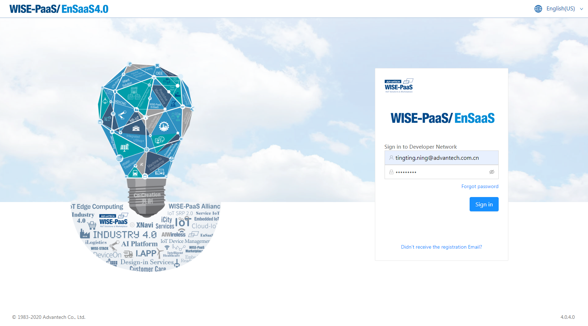  
Picture1 - login page

 - **Resend registration letter**  
If the newly added user does not receive the registration letter, you can resend it on the login page, and then check it in the mailbox. The format of the mailbox is as follows: *@wise-paas.com.cn, if it is not received, please check whether you have received a spam mailbox, and it can be set as a trusted mailbox.

**Step1**: Click the prompt on the login page “Didn't receive the registration Email?”

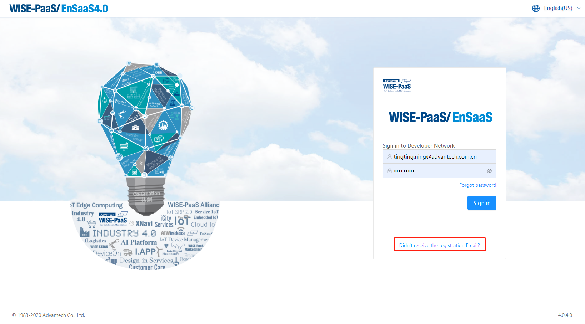 
Picture2 - login page

**Step2**: Enter your email in the registration letter resend page, click submit and it will be resent

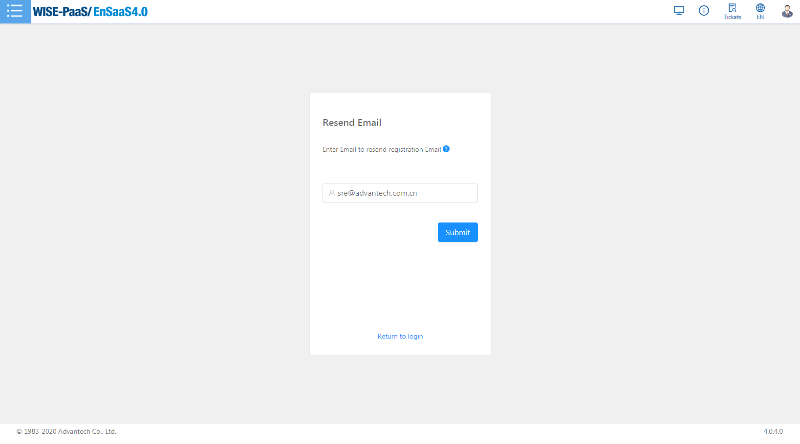 
Picture3 - Resend mail page

 - **New user login to change password**  
New SSO users will receive a registration letter containing the initial SSO password. It is recommended that users log in to SSO to change their passwords.

**Step1**: Log in to the SSO portal and log in using the password in the email. If you log in for the first time, you will be prompted to change the password

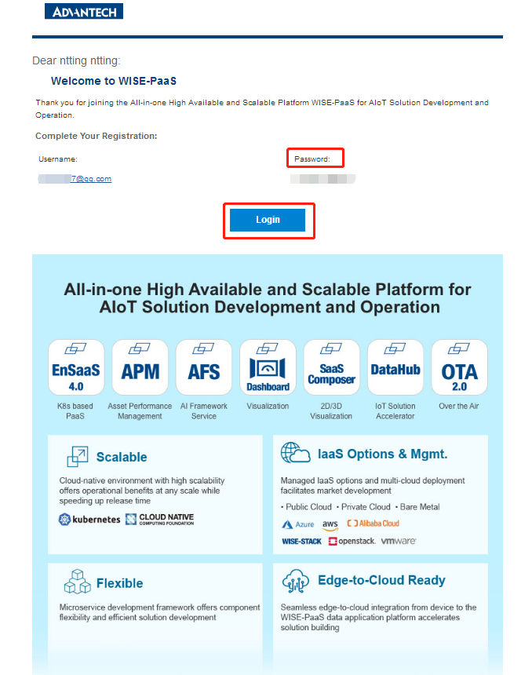  
Picture4 - Registration letter

**Step2**: The user will be prompted to change the password if logging in for the first time

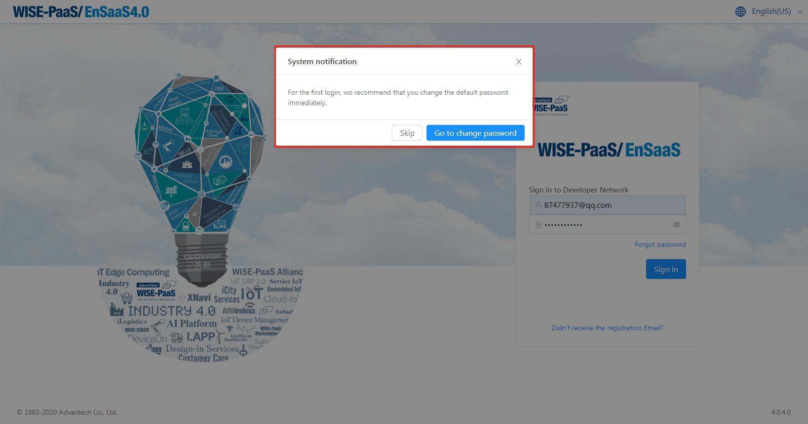 
Picture5 - Change password prompt

**Step3**: Change the password on this page, pay attention to the suggested password rules

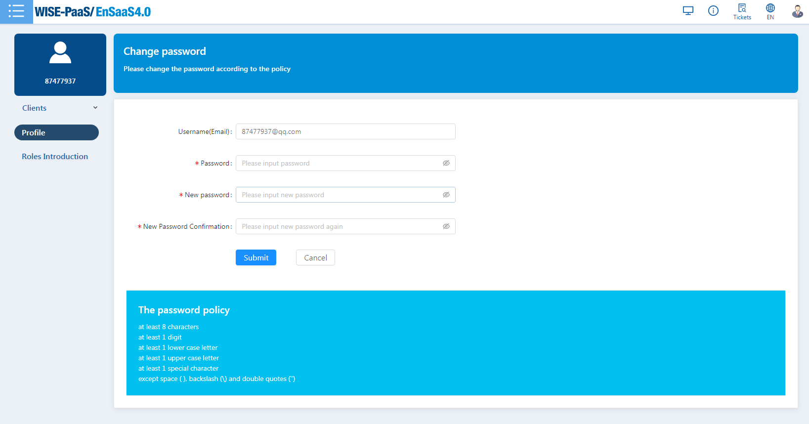 
Picture6 - Change password page

## User Creation ##
User Creation is divided into four scenarios: marketplace creates subscription and user, add Subscription Member, create user and assign subscription permission and SRP users.

### scenario 1 - Marketplace creates subscription and user ###
The user created on the marketplace will automatically create a subscription which corresponding to the user's company on SSO. This user is the subscription admin and  belongs to this subscription by default, which can be viewed from the My Profile of SSO.   
Subscription admin can subscribe to the resource or service in the Catalog, and the relevant authority of the resource is obtained after the purchase is successful. Users can log in to the Management Portal to view the purchased ensaas tenant space resources.
### scenario 2 - Add Subscription Member-add users who have all resources purchased by subscription ###
The subscription admin could add a new user as the subscription user, then the added user automatically owns all of the resources purchased by the subscription.   

- **If the added user is existed, the subscription admin can invite existing users to join in the subscription. The existing user will be added into the subscription directly.** 

**Step1**: Click on the subscription node on the left, a list of authorized subscription appears. Click on the line of a subscription to enter the membership management interface of the subscription， as shown in Figure 1：

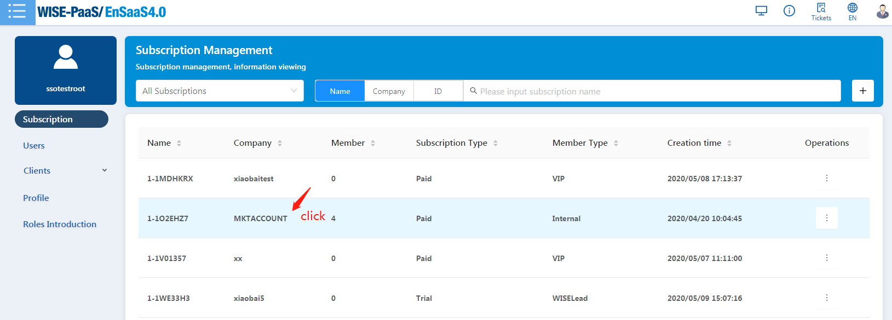  
Picture7 - Subscription list

**Step2**: Press the "+" button on the right of header, then it will pop up "Add a team member" dialog box. Enter the invited user account, and the user will be added into the subscription by pressing "Add to subscription" button，The default is a user with subscription admin who can add subscription user rights。 

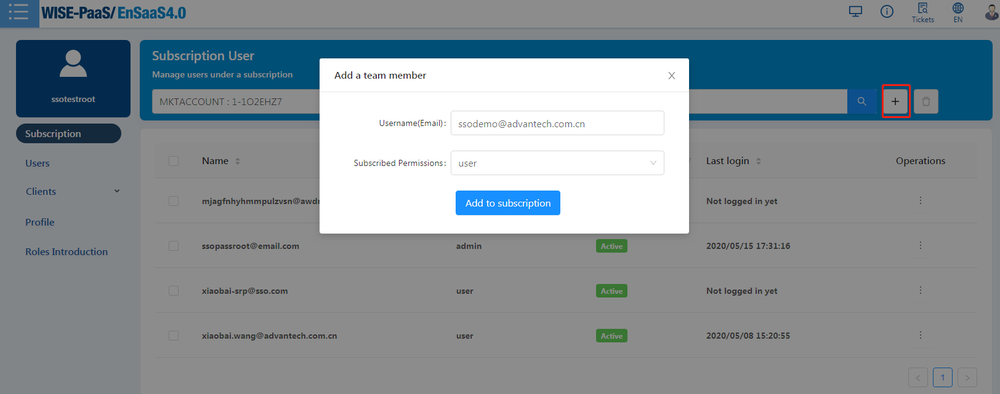  
Picture8 - Invite existing users to the subscription 

- **If the invited user doesn't exist, the subscription admin user can create a new user account and add the new user to the subscription.**

**Step1**:It is the same as step 1 of scene 1

**Step2**:It is the same as Step 2 in Scenario 1, except that the user entered in the second step is a new user who does not exist in SSO. After entering the mailbox, click the "Add to Subscription" button to jump to the user creation page.

**Step3**:Fill in the basic user information. The following subscription permission displays the information of the subscription clicked in by default. Click the "Add to subscription" button.
 
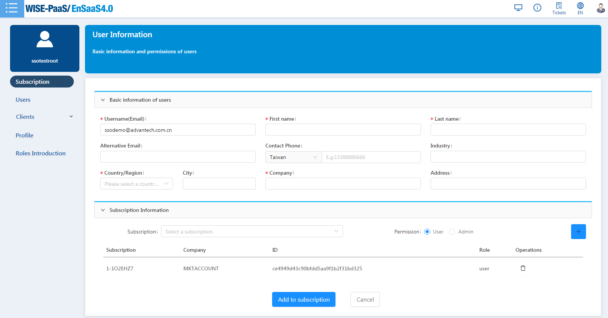 
Picture9 - Edit basic information for new users

### scenario 3 - Create user and assign subscription permission ###
You can add users in the menu of user management and assign the permission of one or more subscription owned by the currently logged in user.  
**Step1**: Click the user node on the left, a list of user management appears, click the "+" button on the right of the menu, to add user interface.

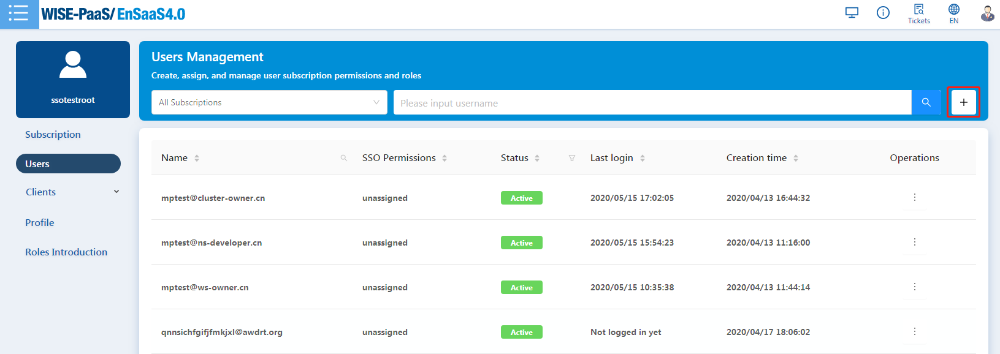
Picture10 - user list

**Step2**: In the new user interface, fill in the user's mailbox and basic information, with * is required. Under the subscription information, select the subscription you want to assign and select the permissions. Click the "+" button to add a line of subscription information in the following list. You can add multiple items repeatedly. To delete, click the trash can icon behind the list. The list shows all the user's subscription permissions.

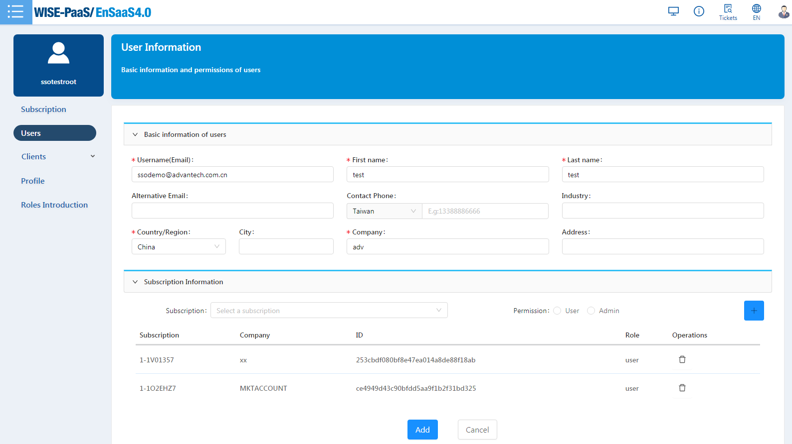
Picture11 - Edit basic information for new users

**Step3**: Click the "Add" button to add a user with permissions. It is also supported to add only users without assigning subscription permissions. The permissions of such users will be unassigned.

### scenario 4 - Add App Users ###
Adding a user from the application will automatically create an SSO account, but the user is in the role of AppUser, and I.App is responsible for user management.

## User Privilege Editing ##
There are two entrances for user information editing:  
1. In the "User Management" page, select a user and click the edit menu in the operation to edit the user's subscription permissions

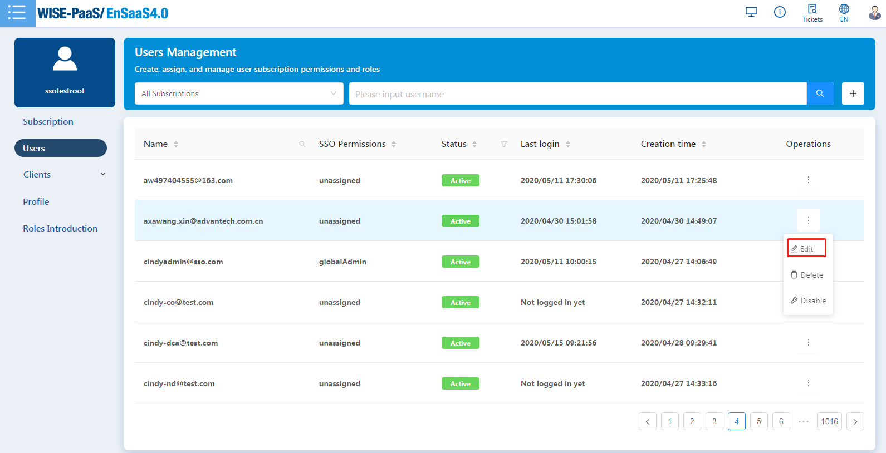
Picture12 - Edit user information  
2. Click the edit button in the upper right corner of "My Profile" to edit your information, you can modify the basic information and subscription permissions.

Picture13 - Personal information 

User profile contains the following informations:  

- **Basic Infomation**: Display basic user information, user basic information can only be modified by yourself, such as user name, email, phone, country / region, city, company, etc. The user ID is unique.   
- **Subscription Information**: Display the user's subscription information, you can edit and modify the user's subscription permissions. The information includes the name, company, ID and role of the subscription.

User information editing page：

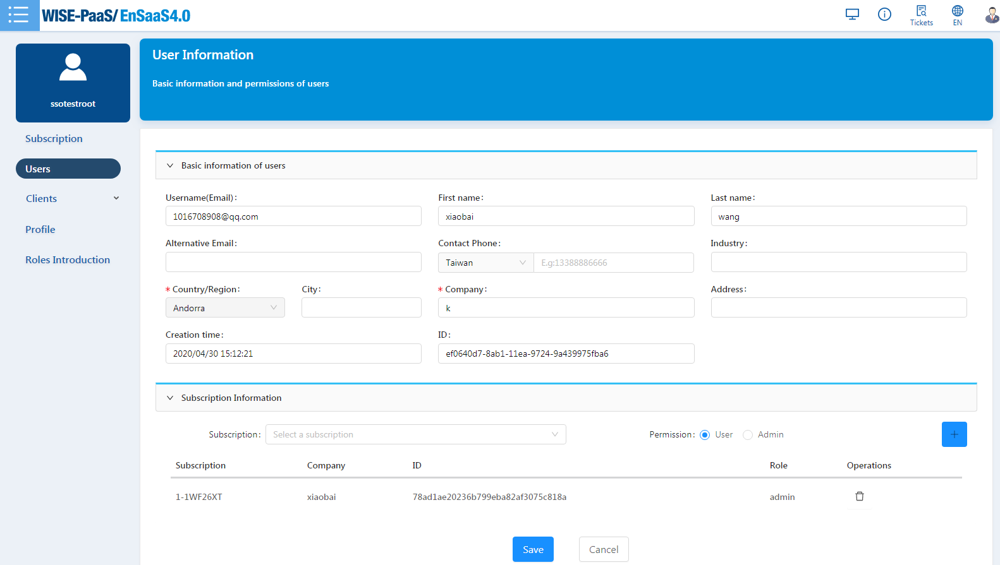
Picture14 - Edit user information   

## User Enable/Disable/Delete ##
In the user list menu, you can expand the operation button, select delete, disable / activate operation. Only the Global Data Admin can delete, disable / activate.
  
**Delete:** Delete an SSO user.  
**Disable/Active:** The normal user status is Active, and it can be disabled for which the user will be forbidden to login unless it is activated again.

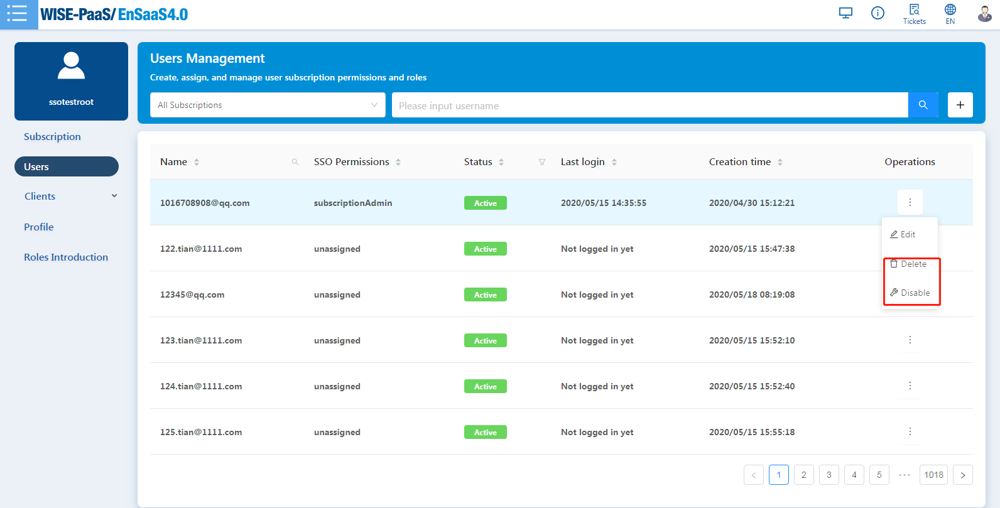
Picture 15 - User Operations

## User Filtering ##
Click the "User" menu to list the users under the subscription to which the logged-in user belongs. It supports filtering by subscription type, subscription name, and user filtering.

1> Subscription admin users can see the subscription admin, subscription user under the subscription to which he belong, unsigned users added by the current logged-in user.

2> Subscription user can only see other subscription users under the subscription to which he belong and unsigned users added by the current logged-in user.

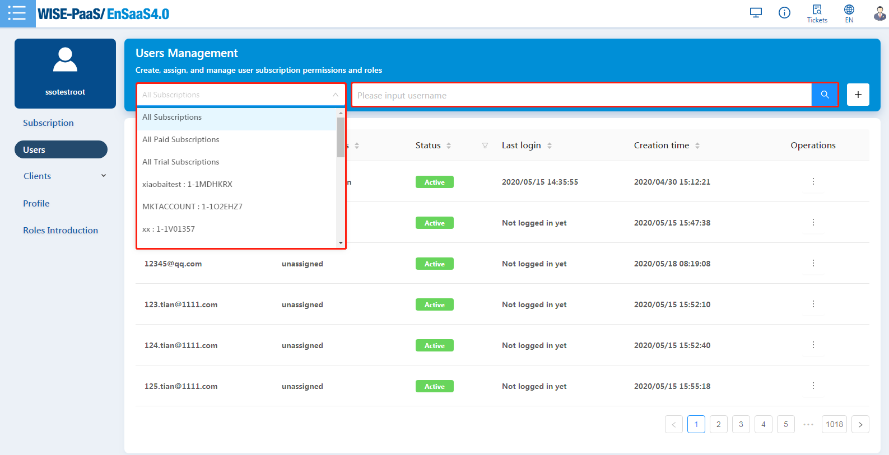
Picture16 - User list filtering

# Subscription Management #
Click the "Subscription" menu to display a list of all subscription to which the logged-in user belongs. From the list, you can view the basic information of the subscription including: name, company, member, subscription type, customer type, creation time.

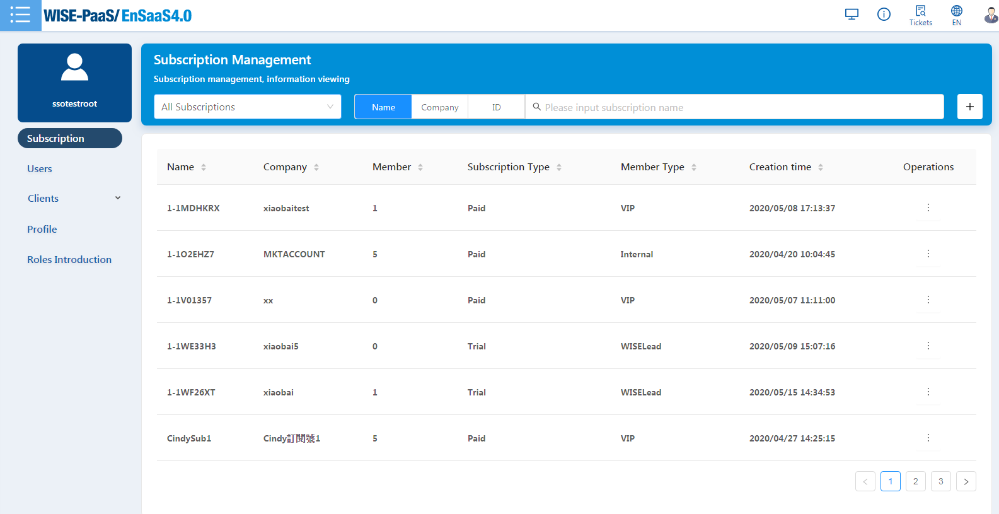
Picture17 - subscription list

## Subscription Details
In the subscription list menu, you can click the operation button to expand a subscription, select details to view the details of the subscription, more points than the basic information in the list, available points, account owner, ID information.

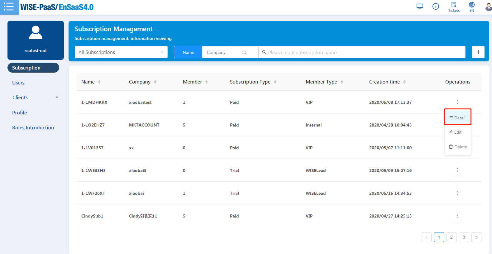
Picture18 - Subscription list details menu

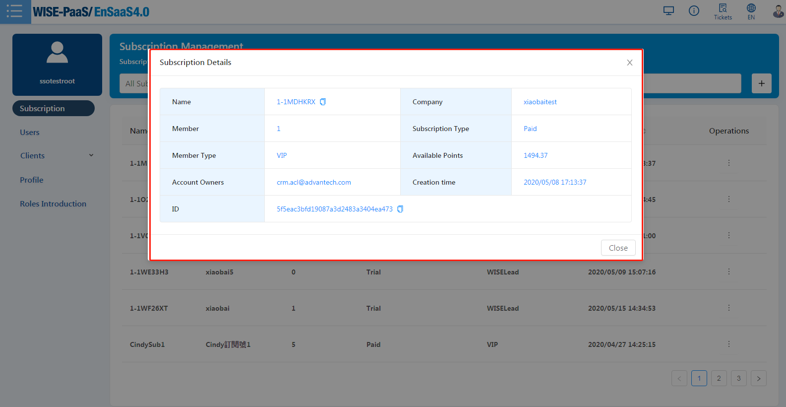
Picture19 - Subscription details

## Subscription Creation ##
The subscription is created by the SSO interface called by the Marketplace. Each subscription corresponds to the account of each company. For non-marketplace users to create a subscription, please contact the EnSaaS administrator.

## Subscription Users Management ##
You can click the subscription in the subscription list to enter the subscription member page for management, or select the user in the user menu list to manage the rights of the subscription.

Subscription related user management behaviors include：  

 - Subscription administrators can choose to add or remove ordinary users from the subscription.
 - Subscription user only have viewing rights, and no right to add or remove users.
 - Users can be filtered by subscription in the user list.

## Invite Users to Subscription ##
Here you can refer to the previous scenario 2 and 3.  

## Remove Users from Subscription ##
Subscription Admin or Global Admin users can remove subscription user of subscription numbers from the subscription number, but this user has not been deleted, but it does not belong to this subscription number. After the user is removed from the subscription number, the user will no longer have permission to subscribe to resources.

**Step1**: Click on the subscription node on the left, a list of authorized subscription appears, and click on the line of the name of a subscription to enter the member management interface of the subscription.  
**Step2**: Select a user in the user list, expand the operation menu on the far right, and click remove, as shown below

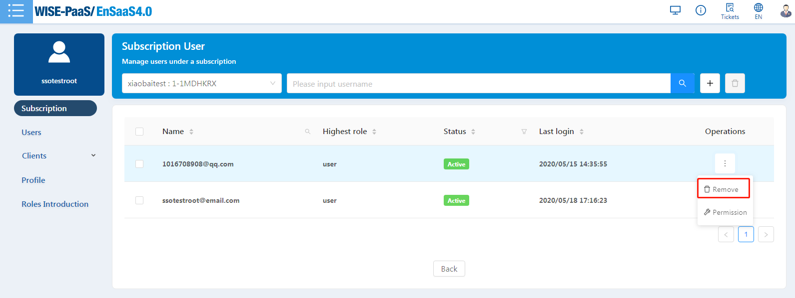
Picture20 - Remove user from subscription

# Client Management #
## Client Management ##
The user can view the registration information of all clients under the resource space that he has permission. Including clients registered via API or SSO interface

The Management page default shows the clients of the first datacenter, the first cluster and the first namespace within the user's permission. 
  
  - Users can find specific clients through the search field on the page title. 
  - User can press "Edit" button to edit client information.

 
Picture21 - Client management

## Client registration ##
If users use the standard OAuth integration method, they need to register with SSO on the SSO interface to obtain a valid ClientId. This ID can be used after OAuth integration. Users can manually register through the "Client / Create" option on the SSO interface

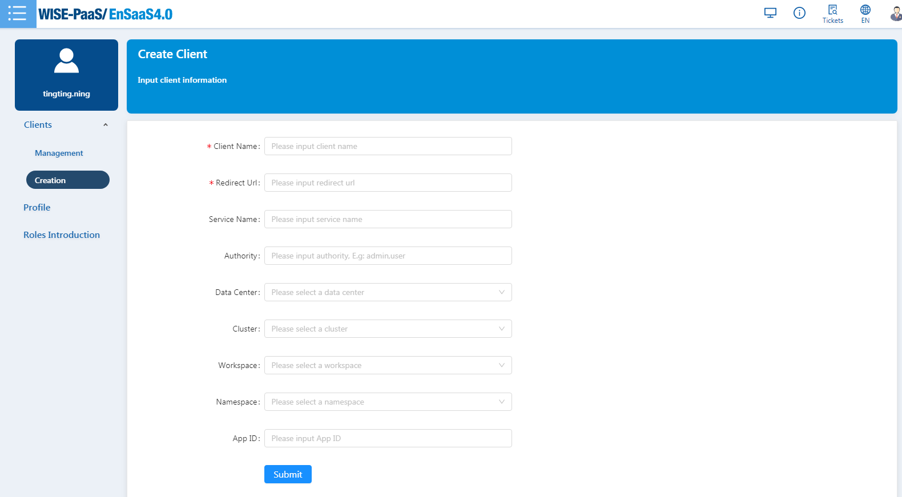 
Picture22 - Client registration
