# SSO Introduction #

WISE-PaaS provides SSO, a property of access control over multiple inter-related yet independent software systems.  
With this property, users can log in with a single username and password to access all systems, and it allows developers to authenticate and manage the identity of users.  
When a user logs in with a username and password during authentication, the user’s token is returned to and stored in browser cookies;  this dispenses with the traditional authentication, which involves creating a session in the server and returning a cookie.  
WISE-PaaS SSO provides tokens in the format of JSON Web Token (JWT), an open standard (RFC 7519) that defines a compact and self-contained way for securely transmitting user information as a JSON object.  
WISE-PaaS SSO also provides standard OAuth 2.0 integration, and is a trusted user authentication and authorization center.

# User Roles #
There are three types of the user roles, namely Platform Management role, Subscription Management role and App Management role.
## Tenant Space Role ##

**-Global Admin** An admin who oversees EnSaaS data centers worldwide with the highest privilege level that permits them to designate admins for data centers, admins for clusters, and roles for tenant spaces. The admin is allowed to manage EnSaaS subscriptions by creating such subscriptions and binding a user to any of the subscriptions.  
**-DataCenter Admin** An admin who oversees a data center with the highest privilege level that permits them to manage resources within all clusters for the data center, designate admins for clusters and roles for tenant spaces. The admin is allowed to manage EnSaaS subscription by creating such subscriptions and binding a user to any of the subscriptions.  
**-Cluster Admin** An admin who oversees a Kubernetes cluster with the highest privilege level that permits them to manage all workspaces and namespaces, all applications deployed in the cluster, and all Kubernetes resources within the cluster. The admin can designate roles for tenant spaces but cannot manage EnSaaS subscriptions.   
**-Cluster Owner** The owner of a dedicated cluster who manages the tenant spaces within the cluster. They can access the cluster, managing all the workspaces and namespaces of the cluster, the applications deployed by tenants within the cluster, certain Kubernetes resources within the cluster, and designate roles for the workspaces and namespaces. They cannot subscribe to, upgrade, downgrade, or unsubscribe from the cluster.   
**-Workspace Owner** The owner of a general workspace or a workspace built within a dedicated cluster. They are in charge of the tenant spaces within a workspace and can access the workspace and manage all namespaces within the workspace, all tenant-deployed applications within the workspace, and certain Kubernetes resources (and have access to these resources). They can designate roles for namespaces but cannot subscribe to, upgrade, downgrade, or unsubscribe from the workspace.   
**-Namespace Developer** The developer of a namespace. They can access the namespace and all applications deployed within the namespace and manage certain Kubernetes within the namespace.
## Subscription Role ##
**-Subscription Admin**	The admin of an EnSaaS subscription. An EnSaaS subscription is bound to a MyAdvantech account. The admin can subscribe to, upgrade or downgrade, and unsubscribe from a product, service, or resource (all of which are referred to cloud services) on the EnSaaS platform. The admin can manage or access a cloud service on the EnSaaS platform they have subscribed to. The admin can also manage orders and bills for cloud services.  
**-Subscription User**	A user of a subscription. The user can manage and access the cloud services covered in the subscription but cannot subscribe to any cloud service, unsubscribe from the service, or manage an order or bill for the service. 
## App Role ##
**-SRP User**	The user of a cloud-based application. They can access the application, and their role is assigned by the visitor to the application who has the highest privilege. They cannot access any EnSaaS tenant space. 
# User Management #
## User Creation ##
User Creation is divided into four scenarios: marketplace created users, users with subscriptions, users without subscriptions and Appusers.

### scenario 1 - Marketplace add users and company ###
The user created on the marketplace will automatically create a subscription which corresponding to the user's company on SSO. This user is the subscription admin and  belongs to this subscription by default, which can be viewed from the Users/My Profile of SSO.   
After a user subscribes and purchases the corresponding resource, he/she has permission to the resource. The tenant space resources of the purchased ensaas can be viewed by logging in the Mangement Portal.
### scenario 2 - Add a user who has all the resources purchased by the subscription - Add subscription users ###
The subscription admin could add a new user as the subscription user, then the added user automatically owns all of the resources purchased by the subscription.   
Press the "+" button on the left of header, then it will pop up "Add a team member" dialog box. Enter the invited user account, and the user will be added into the subscription by pressing "Add to subscription" button.   

- **If the added user is existed, the subscription admin can invite existing users to join in the subscription. The existing user will be added into the subscription directly.** 

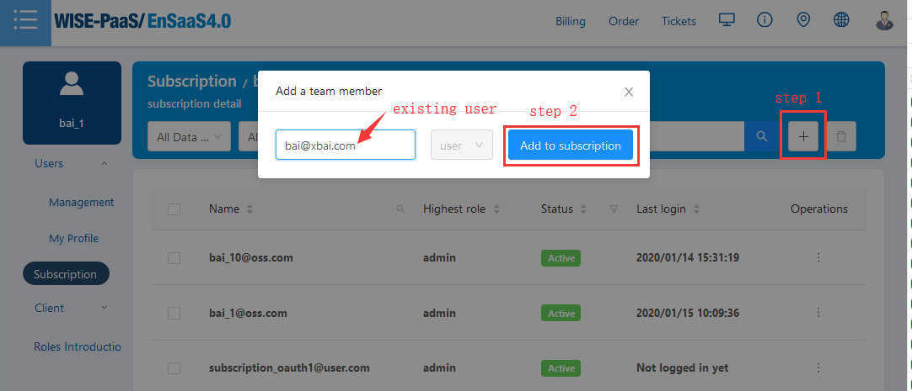  

Picture 1 - Invite Existing User

- **If the invited user doesn't exist, the subscription admin user can create a new user account and add the new user to the subscription.**

The "Add to subscription" button will jump to the user creation page if the entered username doesn't exists. After setting the basic information and press "Add to subscription", the new user will be created.  
Because the subscription user has all of the permissions to the resources of this subscription, the part of "Resource management" is not required to fill.  
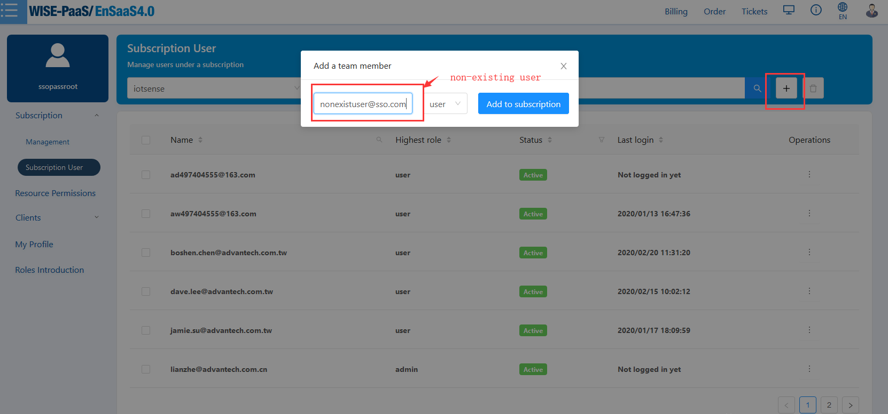 
Picture 2 - Invite Non_Existing User

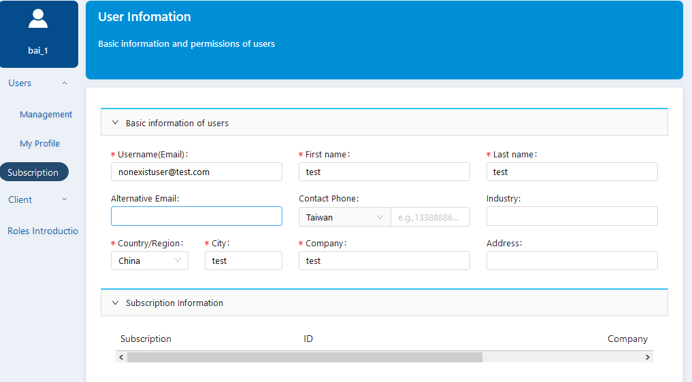 
Picture 3 - Edit Basic Information of New Added User

### scenario 3 - Add a user who has parts of resources purchased by subscription number - Adding a user without assigning a subscription ###
If the subscription user just only wants to assign new users parts of subscription space resources purchased by the subscription, the manager could add users under Users/Management/Add page of SSO, and assign the user's own authorized space resources to the created new user with related resource roles.   
This situation does not require new users to be added into the subscription.  
Press the "+" button on the header of content part, it will jump to the User Information page to create a new user account.   
Like in Scenario 3, to create a new user, the basic information is mandatory to be filled. The resource binding information is optional. The user can choose to add or delete resources role binding on the Management/Edit page.   
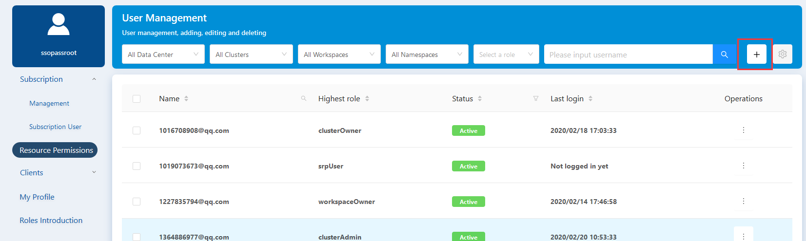
Picture 4 - Added User  

#### Make User Resource Role Binding ####
There are thress steps to assign resource permissions to users, which called rolebinding.  
1. Select the data center and cluster, then the role information.   
If the logged-in user is a **clusterOwner**, the permissions it can assign are workspaceOwner and namespaceDeveloper.   
- If workspaceOwner is selected, it is necessary to select a workspace while doesn't need to select the namespace, because the workspaceOwner has full permissions to all the namespaces in the workspace.   
- And if namespaceDevelper is selected, which is the least privilege, it needs to assign the specific cluster, workspace and namespace information.  
If the logged-in user is a **workspaceOwner**, the permissions it can assign is only namespaceDeveloper.  
If the logged-in user is a **namespaceDeveloper**, it is forbidden to assign resource bindings.    
2. Press the "+" button to make the resource role binding effective. If it needs to delete certain roles, please click the trash can icon behind the corresponding roles.  
3. Press the "Save" button(which is "Add" on the create user page) to save the changes.
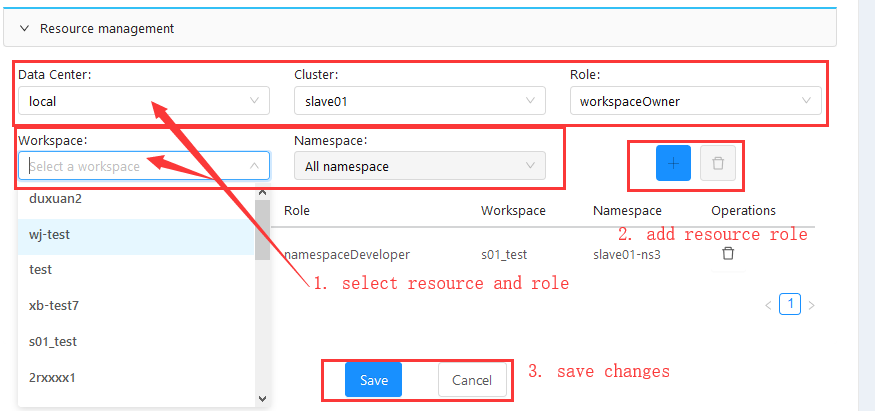
Picture 5 - Edit Resource Role Binding

### scenario 4 - Add App Users ###
Adding a user from the application will automatically create an SSO account, but the user is in the role of AppUser, and I.App is responsible for user management.

## User Information Edit ##
The users have several choices to edit information on User Management, My Profile, or Subscription Management pages.  
User profile contains the following informations:  
- **Basic Infomation**: Lists basic user information, such as Username, Email, Phone, Country, City, Company, etc. And the user ID is unique.   
- **Resource Permissions**: Describes the resource role of the user. It also shows the resource detail information, like which datacenter, cluster, workspace and namespace that the user belongs to.  
- **Subscription Information**: Displays the subscription information of the logged-in user. The information contains the name, id, company and user role of the subscription.  
The users could edit the basic information and resource privileges on the information edit page. Please note that subscription information can't be modified here.
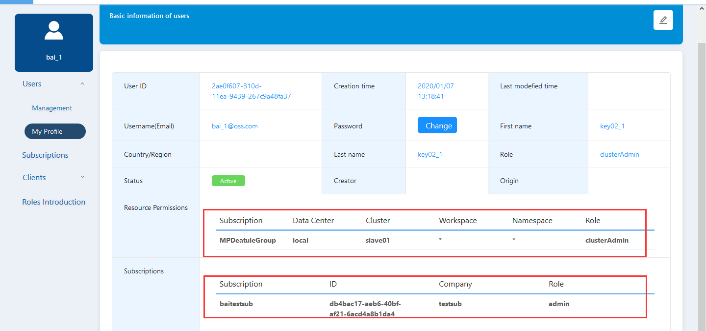
Picture 6 - Edit User Profile  

The Edit option of the managed user leads to the User Infomation page, which also contains basic information, subscription role and resource privileges.  
Only the resource permission option is allowed to edit by logged-in user. Please refer to Picture 5 - Edit Resource Role Binding.

## User Enable/Disable/Delete ##
By Expanding operation button, the user could be edited, deleted and disabled/activated.
**Edit:** Add or Delete the resource role which belongs to the logged-in user， which has been introduced in the previous chapters.  
**Delete:** Only Datacenter Admin could delete users.
**Disable/Active:** The normal user status is Active, and it can be disabled for which the user will be forbidden to login unless it is activated again.

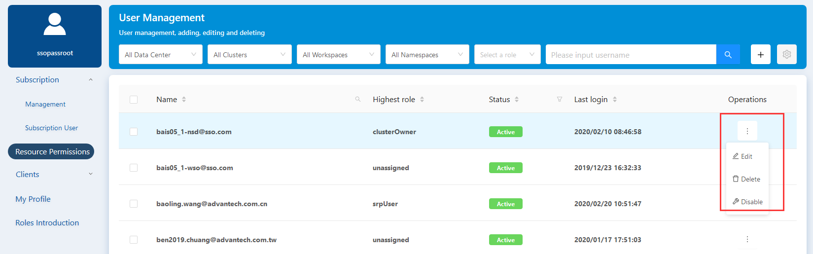
Picture 7 - User Operations

# Subscription Management #
Subscription page lists all the subscriptions that the logged-in user belongs to. Usually a user just attaches to only one subscription.  
Note: Only subscription admins have permission to see this option.

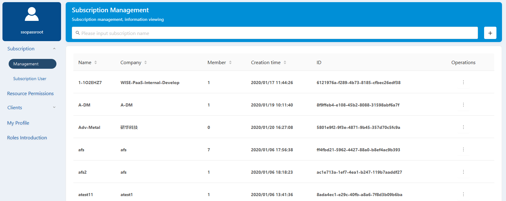
Picture 8 - Subscription Management

## Subscription Creation ##
The subscription is created by the SSO interface called by the Marketplace. Each subscription corresponds to the account of each company. For non-marketplace users to create a subscription, please contact the EnSaaS administrator.

## Subscription Users Management ##
Only the subscription admin can view and manage the users in the subscription. 

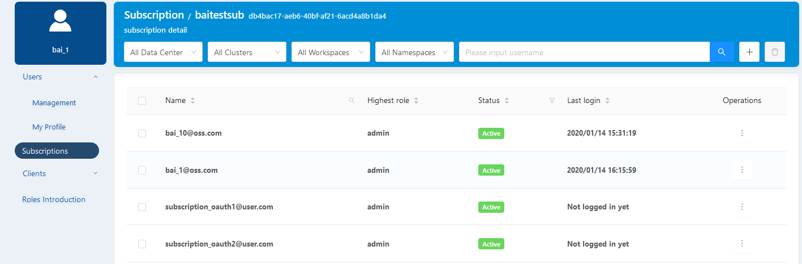
Picture 9 - Users in the Subscription  

To select the Operations/Edit option can manage the subscription user's resource roles as on the user management page. Refer to Picture 5 - Edit Resource Role Binding.

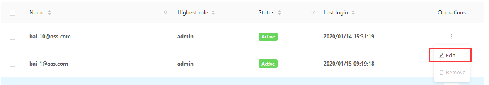
Picture 10 - Edit User in Subscription

## Invite Users to Subscription ##
Subscription admin users can invite other user into their subscriptions if they know the invited user's full account.   
Here you can refer to the previous scenario 2 and 3.  

## Remove Users from Subscription ##
The subscription admin user could remove the user from the subscription, but he/she has no permission to remove another subscription admin.   
After the user is removed from the subscription, the user no longer has the default permissions for the resources under the subscription. Only the resource permissions are assigned separately could be retained.
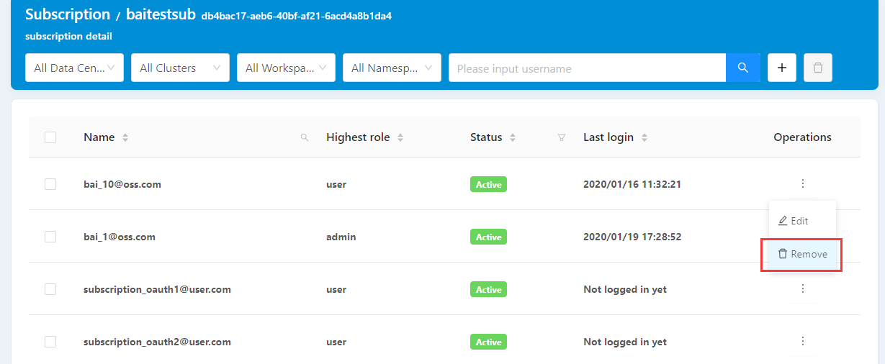
Picture 11 - Remove User from Subscription

# Client Management #
## Client Management ##
Client management can only be seen by the above roles of workspaceOwner. Users can view the registration information of applications deployed in the resource space, whether it is registered through API integration or registered on the SSO portal.  
The Management page default shows the clients of the first datacenter, the first cluster and the first namespace within the user's permission.   
Users can find the certain client by the search field on the page header.
The client information could be edited by pressing the "Edit" button.

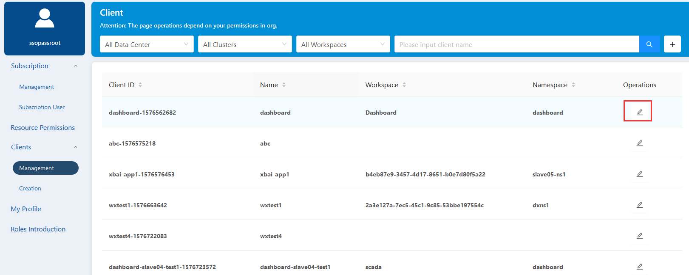 

## Client registration ##

If the user uses the standard OAuth integration method, the ClientId will be required. Then the user can manually register by the Client/Creation option on the SSO portal, so as to obtain a valid ID registered in the SSO registration center for subsequent use according to OAuth integration.
