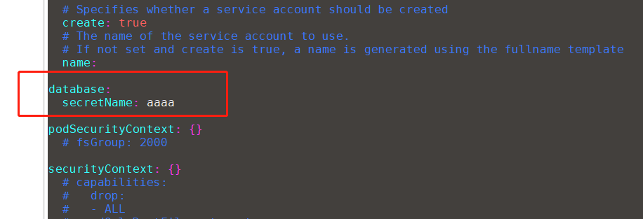
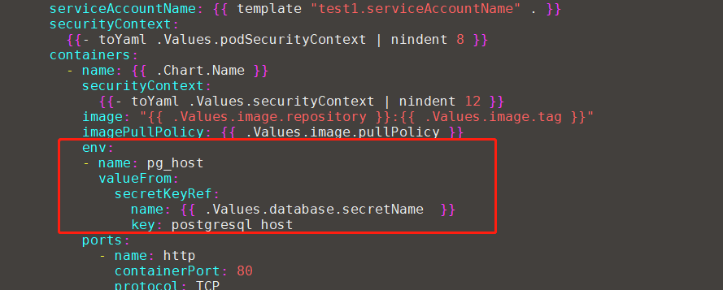
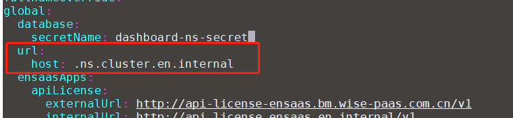
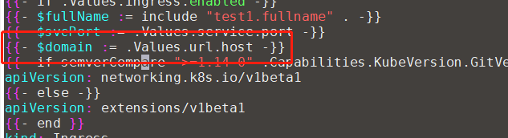
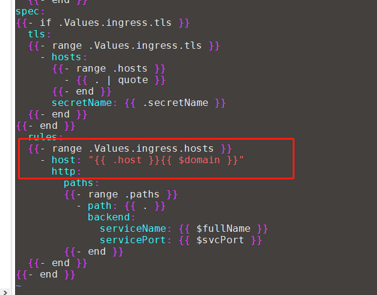
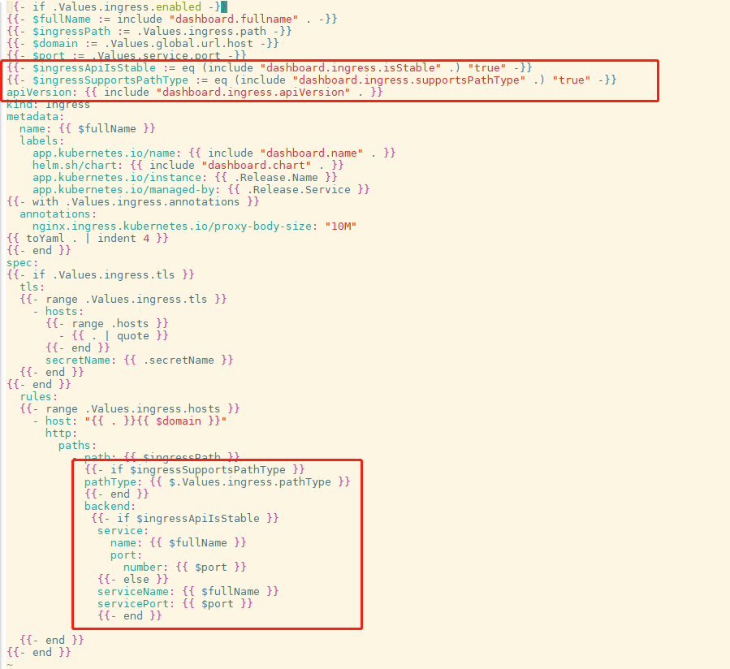

# 项目前瞻
appBuy是基于helm3的app生命周期管理应用。主要模块有app仓库管理（公有，私有，marketplace），app订阅、升配、升级、退订、删除管理等。在appBuy中，用户能够添加私有的app仓库进行app部署；也可以订阅我们EnSaaS提供的SRP solutions。

# Helm 范式
在appBuy中上架的helm chart必须满足如下要求：

* appBuy必要参数

	1. **global.database.secretName**

		此处的secretName为 $chartname-$ns-secret，如dashboard-ns1-secret
		
		在app上架到被订阅部署时，根据上架的信息，appbuy会自动为每个app生成一个db secret   信息（无论此app依赖多少db都只会生成一个secret）。在app的chart中需要获取这个secret的名称
		
		values.yaml
		
		
		
		template/deployment.yaml
		
		

	2. **global.url.host**

		此处的url.host为ingress的host后缀。例如：**.$ns.$cluster.en.internal**
		
		values.yaml
		
		
		
		 Ingress.enable上架时需要开启。
		
		Ingress.hosts[0].host只需写上该服务想要暴露的url前缀即可
		
		ingress.yaml
		
		
		
		
		
		先定义一个变量获取values.yaml中的url.host参数
		
		再修改ingress.hosts[0].host为拼接自定url前缀+平台覆盖url后缀
     
     3. **global.ensaasApps** 
     
          部署时，会在此处填入api-sso、api-mp、api-mg、api-dccs、api-license、api-listingsystem、api-service等服务及ensaas的externalUrl和internalUrl。values.yaml中请按如下格式填写（部署时，会根据所要部署的站点，替换各个key对应的value）：  
	  
```
 global:
   ensaasApps:
     apiSso:
       internalUrl: http://api.sso.ensaas.en.internal/v4.0
       externalUrl: http://api-sso-ensaas.sa.wise-paas.com/v4.0
     apiMp:
       internalUrl: http://api.mp.ensaas.en.internal/v1
       externalUrl: http://api-mp-ensaas.sa.wise-paas.com/v1
     apiMg:
       internalUrl: http://api.mg.ensaas.en.internal/v2
       externalUrl: http://api-mg-ensaas.sa.wise-paas.com/v2
     apiDccs:
       internalUrl: http://api.dccs.ensaas.en.internal/v1
       externalUrl: http://api-dccs-ensaas.sa.wise-paas.com/v1  
     apiLicense:
       internalUrl: http://api.license.ensaas.en.internal/v1
       externalUrl: http://api-license-ensaas.sa.wise-paas.com/v1
     apiListingsystem:
       internalUrl: http://api.listingsystem.ensaas.en.internal/v1
       externalUrl: http://api-listingsystem-ensaas.sa.wise-paas.com/v1	  
     apiService:
       internalUrl: http://api.service.ensaas.en.internal/v2
       externalUrl: http://api-service-ensaas.sa.wise-paas.com/v2	  
     ensaas:
       datacenterCode: sa
       internalUrl: en.internal
       externalUrl: sa.wise-paas.com
```	    
   4. **Ingress兼容旧版k8s和新版k8s**  
   	**_helpers.tpl**文件中请添加如下内容：
	
```
      {{/*
       Return the appropriate apiVersion for ingress.
      */}}
      {{- define "bi.ingress.apiVersion" -}}
        {{- if and (.Capabilities.APIVersions.Has "networking.k8s.io/v1") (semverCompare ">= 1.19-0" .Capabilities.KubeVersion.Version) -}}
        {{- print "networking.k8s.io/v1" -}}
       {{- else if .Capabilities.APIVersions.Has "networking.k8s.io/v1beta1" -}}
       {{- print "networking.k8s.io/v1beta1" -}}
      {{- else -}}
       {{- print "extensions/v1beta1" -}}
      {{- end -}}
     {{- end -}}

     {{/*
       Return if ingress is stable.
     */}}
     {{- define "bi.ingress.isStable" -}}
        {{- eq (include "bi.ingress.apiVersion" .) "networking.k8s.io/v1" -}}
     {{- end -}}

     {{/*
        Return if ingress supports pathType.
     */}}
      {{- define "bi.ingress.supportsPathType" -}}
         {{- or (eq (include "bi.ingress.isStable" .) "true") (and (eq (include "bi.ingress.apiVersion" .) "networking.k8s.io/v1beta1") (semverCompare ">= 1.18-0"   .Capabilities.KubeVersion.Version)) -}}
     {{- end -}}
      
 ```
     
     **ingress.yaml** 中请按红框中格式：
     
     
 ```
     {{- if .Values.ingress.enabled -}}
{{- $fullName := include "dashboard.fullname" . -}}
{{- $ingressPath := .Values.ingress.path -}}
{{- $domain := .Values.global.url.host -}}
{{- $port := .Values.service.port -}}
{{- $ingressApiIsStable := eq (include "dashboard.ingress.isStable" .) "true" -}}
{{- $ingressSupportsPathType := eq (include "dashboard.ingress.supportsPathType" .) "true" -}}
apiVersion: {{ include "dashboard.ingress.apiVersion" . }}
kind: Ingress
metadata:
  name: {{ $fullName }}
  labels:
    app.kubernetes.io/name: {{ include "dashboard.name" . }}
    helm.sh/chart: {{ include "dashboard.chart" . }}
    app.kubernetes.io/instance: {{ .Release.Name }}
    app.kubernetes.io/managed-by: {{ .Release.Service }}
{{- with .Values.ingress.annotations }}
  annotations:
    nginx.ingress.kubernetes.io/proxy-body-size: "10M"
{{ toYaml . | indent 4 }}
{{- end }}
spec:
{{- if .Values.ingress.tls }}
  tls:
  {{- range .Values.ingress.tls }}
    - hosts:
      {{- range .hosts }}
        - {{ . | quote }}
      {{- end }}
      secretName: {{ .secretName }}
  {{- end }}
{{- end }}
  rules:
  {{- range .Values.ingress.hosts }}
    - host: "{{ . }}{{ $domain }}"
      http:
        paths:
          - path: {{ $ingressPath }}
            {{- if $ingressSupportsPathType }}
            pathType: {{ $.Values.ingress.pathType }}
            {{- end }}
            backend:
             {{- if $ingressApiIsStable }}
              service:
                name: {{ $fullName }}
                port:
                  number: {{ $port }}
              {{- else }}
              serviceName: {{ $fullName }}
              servicePort: {{ $port }}
              {{- end }}

  {{- end }}
{{- end }}

     
```
 5、**Deployment.yaml请去掉imagepullsecret读取**
     
	
* 平台必要参数

	平台必须要在helm chart里定义sources，内容如下：
	
	
	
	 每个container必须定义配额，否则helm安装会失败，pod无法建立。
	
	 建议大家把resources.requests填写的尽可能的低，提高平台资源利用率。


