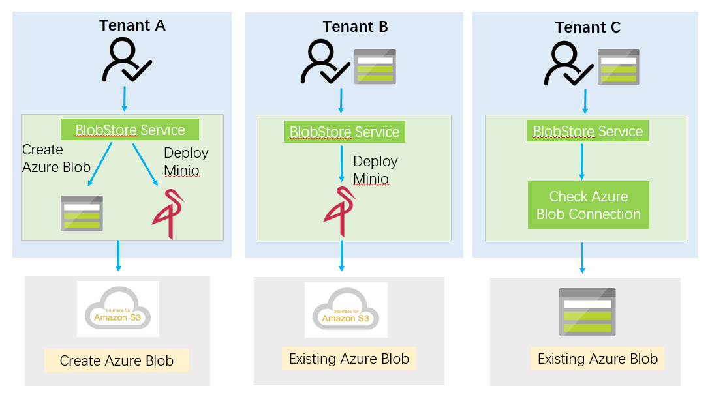
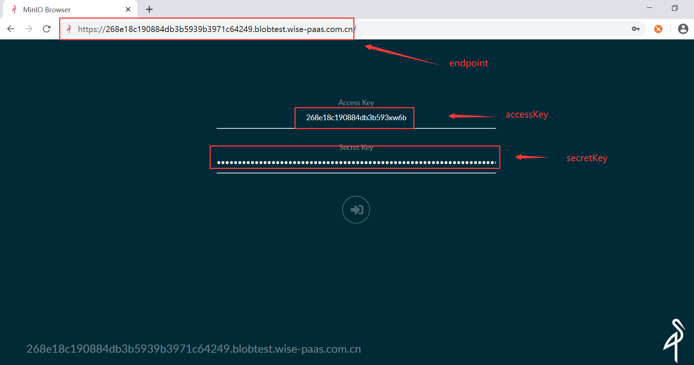
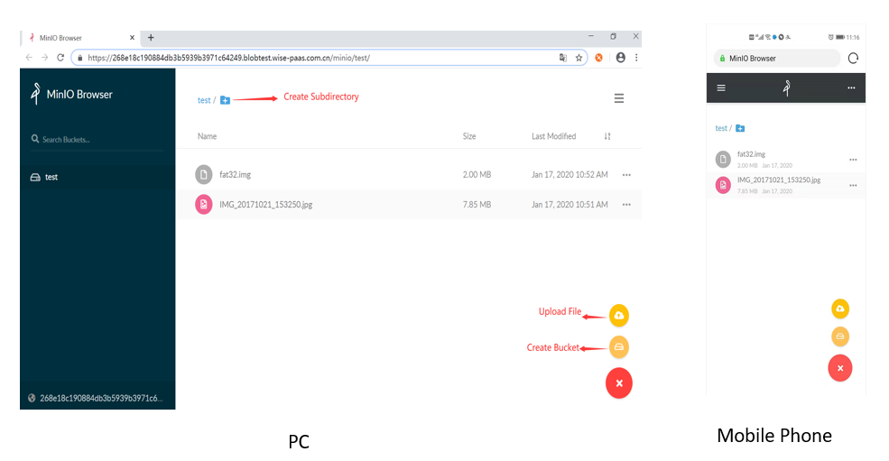
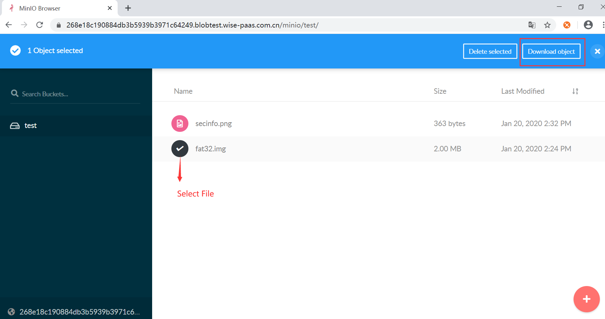
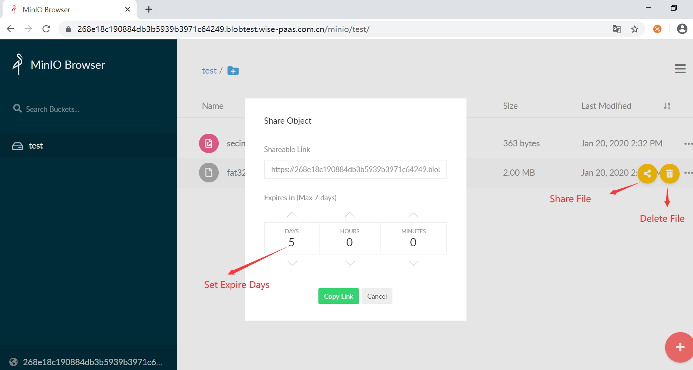

<!-- Document Revision History

2020.01.20

1. First version of this document.

-->


# WISE-PaaS BlobStore服务简介

WISE-PaaS/Blobstore提供统一的Amazon Simple Storage Service（简称S3 https://docs.aws.amazon.com/AmazonS3/latest/dev/Welcome.html ）标准接口，可以使用它存储数字资产，包括图片，视频，音乐和文档等。WISE-PaaS Private Cloud WISE-Stack 上OpenStack直接提供了S3的接口（https://docs.openstack.org/mitaka/config-reference/object-storage/configure-s3.html ），在基于Azure的WISE-PaaS Public Cloud上有另外的对象存储服务Blob Storage，为了保证WISE-PaaS公有云和私有云对SRP可以提供可迁移性（一致性接口），因此我们提供BlobStore服务，将Azure Blob API 转接为S3 API 的方案，使用户在公有云上也可以使用S3 接口。BlobStore对象存储服务的使用场景例如存储OTA的更新包；存储AI 模型，再通过OTA部署到本地；将DB中数据从DB迁移到Blob中，因为Blob的费用更低。

## BlobStore 主要特点如下：

1. 提供标准Amazon S3接口，所有针对S3操作的API和工具都可用

2. 依托Azure Blob对象存储，数据持久化存储

3. 支持SSL确保数据可靠传输

4. 数据有效隔离，各租户之间数据是相互隔离的，安全可靠

5. 单个文件最大支持为4G，用户容量最高可为500T

6. 支持移动设备上传下载图片，音频，视频文件等

7. 可查看实时用量，日用量，月用量等

8. 支持三种订阅服务，BlobStore创建Azure Blob，租户自带Azure Blob，租户Azure Blob合法性检查

9. 提供BlobStore S3 Portal上传下载文件，方便易用，当然也可采用S3 browser工具


## 订阅Blobstore服务实例

-------------------------------------------------------------

1. 购买Standard Plan的BlobStore服务
2. 创建一个BlobStore服务实例
3. 绑定BlobStore服务实例
4. 将服务实例绑定在用户APP中

### Step 1:  购买Standard Plan的BlobStore服务

-------------------------------------------------------------

WISE-PaaS BlobStore服务提供Standard Plan的服务实例。支持创建三种服务实例：

1. 新建Azure Blob服务实例，将azure对象存储服务转为Amazon S3接口

2. 租户自带Azure Blob服务实例，租户自行购买Azure Blob，BlobStore服务将Azure Blob转为Amazon S3接口

3. 租户自带Azure Blob服务实例，BlobStore检查Azure Blob的合法性

   

### Step 2: 创建一个BlobStore服务实例

-------------------------------------------------------------

BlobStore创建服务实例的过程是异步的，用户需要隔段时间去查看服务实例是否成功建立。

1. 新建Azure Blob服务实例

   不需要带任何参数，默认创建的就是新建Azure Blob的服务实例。

2. 租户自带Azure Blob服务实例

   1） 租户自带 Azure Blob，需要输入四个参数，分别为type, provider, accessKey, secretKey。如下表所示

   | **Key**   | **Value**           |
   | --------- | ------------------- |
   | type      | s3                  |
   | provider  | azure               |
   | accessKey | \<Azure Blob Name\> |
   | secretKey | \<Azure Blob Key\>  |

   2） 租户自带 Azure China Blob，同1）需要输入四个参数，分别为type, provider, accessKey, secretKey。如下表所示

   | **Key**   | **Value**           |
   | --------- | ------------------- |
   | type      | s3                  |
   | provider  | azurecn             |
   | accessKey | \<Azure Blob Name\> |
   | secretKey | \<Azure Blob Key\>  |

3. 租户自带Azure Blob服务实例, BlobStore服务负责检查Azure Blob的合法性

   1） 检查Azure Blob，需要输入三个参数，分别为type, accessKey, secretKey。如下表所示：

   | **Key**   | **Value**           |
   | --------- | ------------------- |
   | type      | azure               |
   | accessKey | \<Azure Blob Name\> |
   | secretKey | \<Azure Blob Key\>  |

   2） 检查Azure China Blob，同1）需要输入三个参数分别为type, accessKey, secretKey。如下表所示：

   | **Key**   | **Value**           |
   | --------- | ------------------- |
   | type      | azurecn             |
   | accessKey | \<Azure Blob Name\> |
   | secretKey | \<Azure Blob Key\>  |

### Step 3: 生成BlobStore Credential

-------------------------------------------------------------

绑定BlobStore服务实例后会生成一组credential，credential是一组以**ENSAAS_SERVICES**开头的JSON文件，其中包含用于连接到blobstore服务实例的type、endpoint、accessKey和secretKey。

~~~
{
  "ENSAAS_SERVICES":{
    "blobstore": [
      {
	    "credentials": {
	      "accessKey": "268e18c190884db3b593xw6b",
		  "endpoint": "https://268e18c190884db3b5939b3971c64249.blobtest.wise-paas.com.cn/",
		  "secretKey": "i/ClmY663ksoPYdMuH6qH66pzgleHrdT9lw500RAaMSaIjCE4IbZXTAIdgoyC5F4/tir2qV52CwXJ9sYR93NSQ==",
		  "type": "s3-compatible"
	    },
	    "binding_name": "blobstore-instance_credenitals",
	    "instance_name": "blobstore-instance",
	    "label": "blobstore",
	    "plan": "Standard"
      }
    ]
  }
}
~~~

* endpoint: 一组字符串组成的https地址，如 **https://<binding_id>.blob.wise-paas.com**
* accessKey: Azure Blob Name，由小写字母和数字组成的介于 3 到 24 个字符之间的字符串
* secretKey:  Azure Blob Key，有随机数和字母组成的一组字符串
* type: s3-compatible, azure或者是azurecn

### Step 4: 将服务实例绑定在用户APP中

-------------------------------------------------------------

租户可以将credential绑定在用户的APP中，假如生成的secret name为blobstore-instance_credenitals，将 APP deployment.yaml文件的spec->template->spec->envFrom->secretRef->name中填入secret的名字。示例方法如下：


## 使用Credential

-------------------------------------------------------------

将服务实例绑定在APP中之后，从WISE-PaaS中的ENSAAS_SERVICES环境变量中检索凭据。以下是可用于获取ENSAAS_SERVICES的典型编程语言:

## 各种编程语言解析Credential

---------------------------------------

* <a class="false-class" href="#!./userguide.md#Java">Java</a>
* <a class="false-class" href="#!./userguide.md#Python">Python</a>
* <a class="false-class" href="#!./userguide.md#NodeJs">NodeJs</a>

## Java

用户可以使用Java json库解析credential。下面是java中用Maven导入json库的例子：

```
<repositories>
    <dependency>
        <groupId>org.json</groupId>
        <artifactId>json</artifactId>
        <version>20180813</version>
    </dependency>
</repositories>

```

下面是APP Java解析BlobStore服务实例credential中endpoint, a accessKey and a secretKey的示例代码：

```
import org.json.JSONObject;

JSONObject ensaasServices = new JSONObject(System.getenv("ENSAAS_SERVICES"));

String endpoint = ensaasServices.getJSONArray("blobstore-develop").getJSONObject(0).getJSONObject("credentials").getString("endpoint");
String accessKey = ensaasServices.getJSONArray("blobstore-develop").getJSONObject(0).getJSONObject("credentials").getString("accessKey");
String secretKey = ensaasServices.getJSONArray("blobstore-develop").getJSONObject(0).getJSONObject("credentials").getString("secretKey");
```

---------------------------------------

## Python

下面是APP Python解析BlobStore服务实例credential中endpoint, a accessKey and a secretKey的示例代码：

```
import os
import json

#Load 'ENSAAS_SERVICES' from enviroment variable and parse the credentials of Blobstore service
ensaas_services = os.getenv('ENSAAS_SERVICES')
ensaas_services = json.loads(ensaas_services)
endpoint = ensaas_services['blobstore-develop'][0]['credentials']['endpoint']
access_key = ensaas_services['blobstore-develop'][0]['credentials']['accessKey']
secret_key = ensaas_services['blobstore-develop'][0]['credentials']['secretKey']
```

---------------------------------------

## NodeJs

下面是APP NodeJs解析BlobStore服务实例credential中endpoint, a accessKey and a secretKey的示例代码：

```
ensaas_services = process.env.ENSAAS_SERVICES
endpoint = ensaas_services['blobstore-develop'][0].credentials.endpoint
access_key = ensaas_services['blobstore-develop'][0].credentials.accessKey
secret_key = ensaas_services['blobstore-develop'][0].credentials.secretKey
```

## BlobStore Portal

### Step1: 登录BlobStore Portal



### Step2: 创建bucket，上传文件



###  Step3: 下载文件



### Step4: 分享文件

