# License 手册

## 目录

- [1. License 概述](#1-License-概述)
- [2. 流程](#2-流程)
  - [2.1. 云服务流程](#2.1.-云服务流程)
  - [2.2. 边缘服务流程](#2.2-边缘服务流程)
- [3. License 验证](#3-License-验证)
  - [3.1. 通过服务料号获取](#3.1-通过服务料号获取)
  - [3.2. 通过服务名称获取](#3.2-通过服务名称获取)


## 1. License 概述

License 为 WISE-PaaS 云服务提供有效的license以及期限，分为两部分，server端和agent端，server运行在云端，为云上服务生成和维护服务的license，agent端运行在边缘端，为边缘端服务提供license，agent端license是通过 server端激活生成后通过License File添加至agent端。server端和agent端提供相同的校验方式和RESTful API，兼容服务在云端和边缘端license的校验，服务不需要进行任何适配修改。  
主要功能特性：  

- 云端统一维护生成 license
- 多层加密校验，安全可靠：以加固的方式加密生成不可逆的 AuthCode
- 离线激活，不依赖网络环境
- 边缘端与固件绑定，安全校验
- 云边校验一致，应用自动适配
- 流程简单，安全可控  

## 2. 流程

### 2.1. 云服务流程


#### Step1: 用户订购或更新服务后，Catalog生成订阅信息，通知各个buy生成服务实例，同时将订阅信息同步给License Server。
#### Step2: License Server获得订阅信息后，生成license信息
#### Step3: 服务实例启动后通过API向License Server获取license
#### Step4: 服务实例获取到license后，拿自身信息根据规则与license中的信息对比，验证通过成功激活，反之，激活失败

### 2.2. 边缘服务流程


####   Step1: 在公有云catalog下单硬件对应的 Infrastructure （需要提前上架）
- 选择 Infrastructure 类型
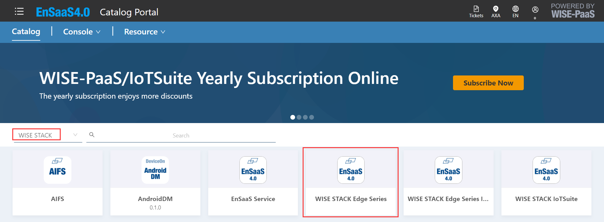
-  选择 Infrastructure 的方案
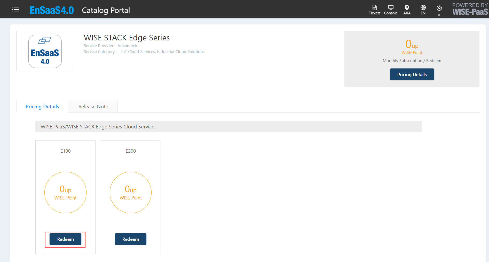
-  选择下单的订阅号和订阅付费方式
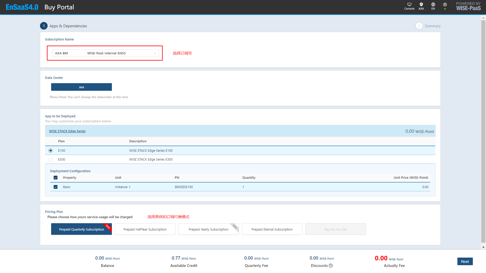
-  确认下单信息
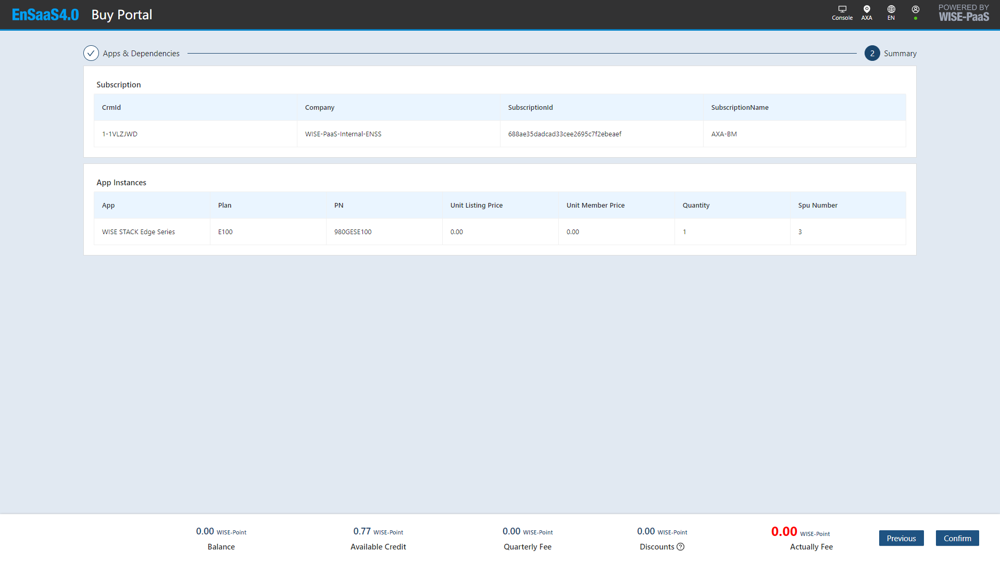
-  确认下单
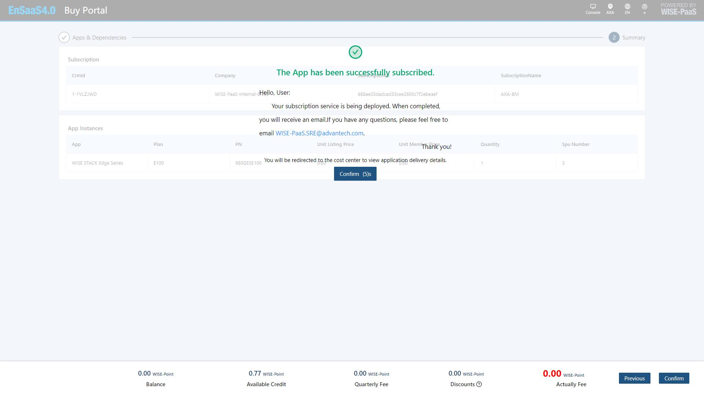
-  下单成功后进入订单系统
	> 查看订单状态，`Processinf`：正在处理；`Completed` ：下单完成   
	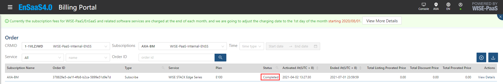
#### Step2: 在公有云license service portal 激活 Infrastructure，激活后生成 InfraLicenseKey
-  进入 license 页面
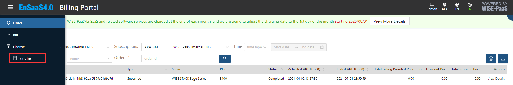
-  激活 Infrastructure
	- 点击激活
	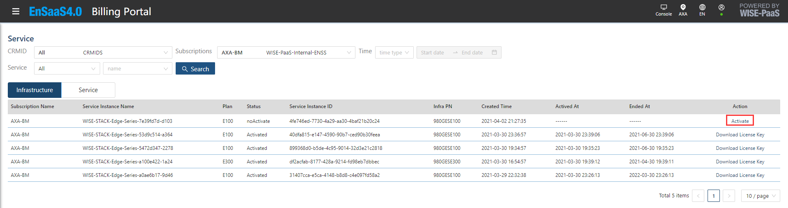
    - 输入MAC Address
	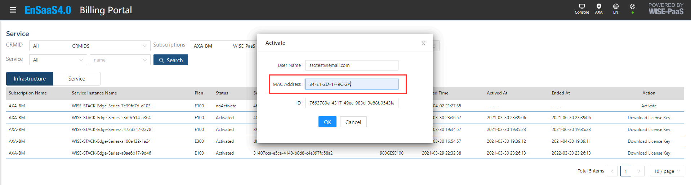
	
#### Step3: 在 AutoIotSuite 中将 InfraLicenseKey 输入验证，通过后进行自动部署
-  激活成功后下载 InfraLicenseKey
	> 将下载后的 InfraLicenseKey 导入AutoIotSuite 系统进行基础设施的部署
	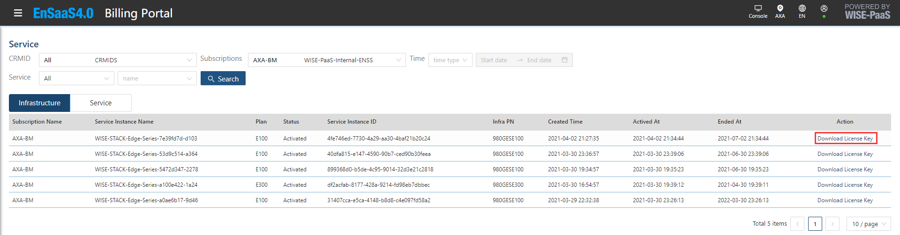

#### Step4: 在公有云 catalog 下单 service & package
- 选择 service & package
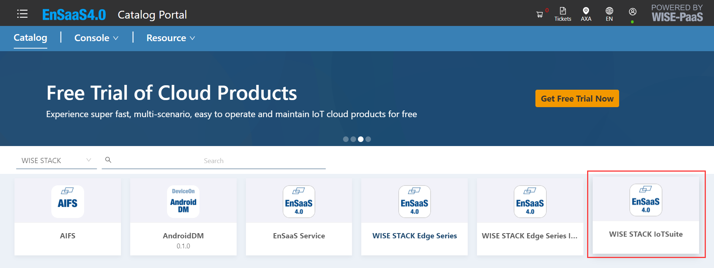
-  选择  service & package 的方案
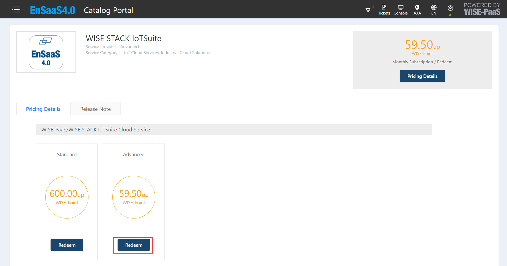
-  选择下单的订阅号和订阅付费方式
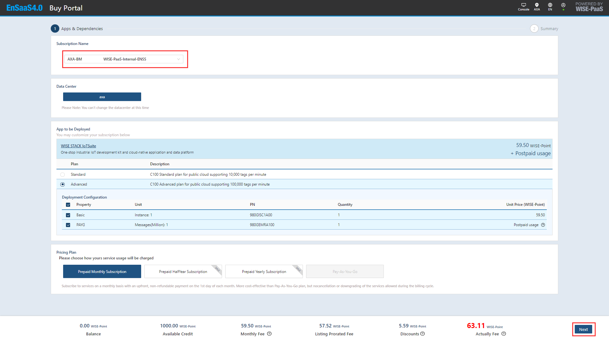
-  选择 service & package 所依赖的激活 Infrastructure (若没有Infrastructure,请参考 Step1: 在公有云catalog下单硬件对应的 Infrastructure 进行下单)
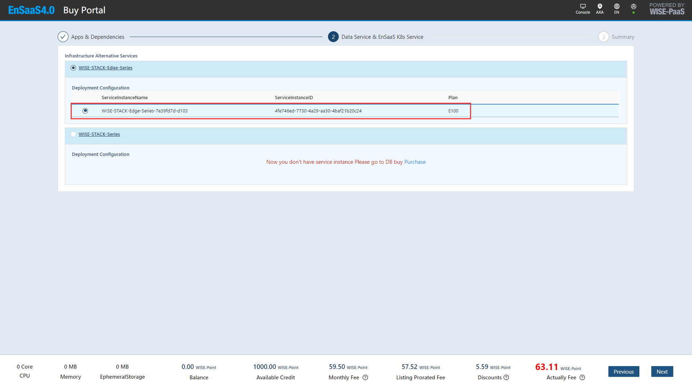
-  确认下单信息
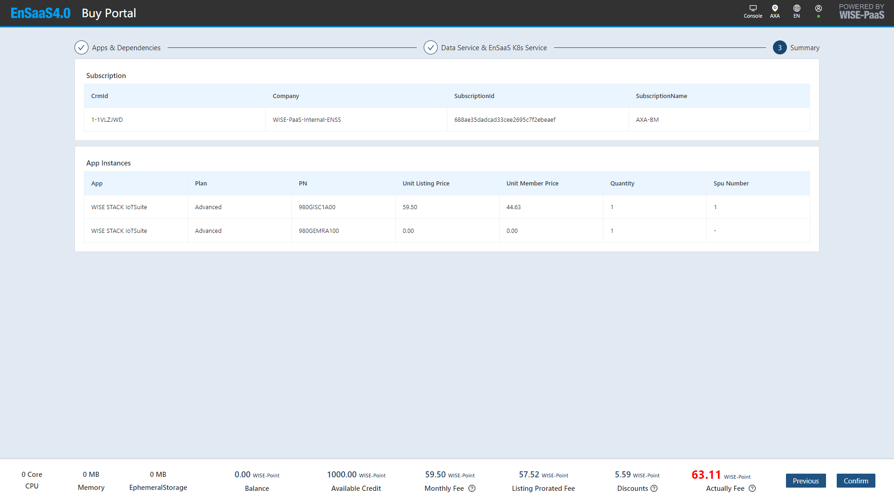
-  确认下单
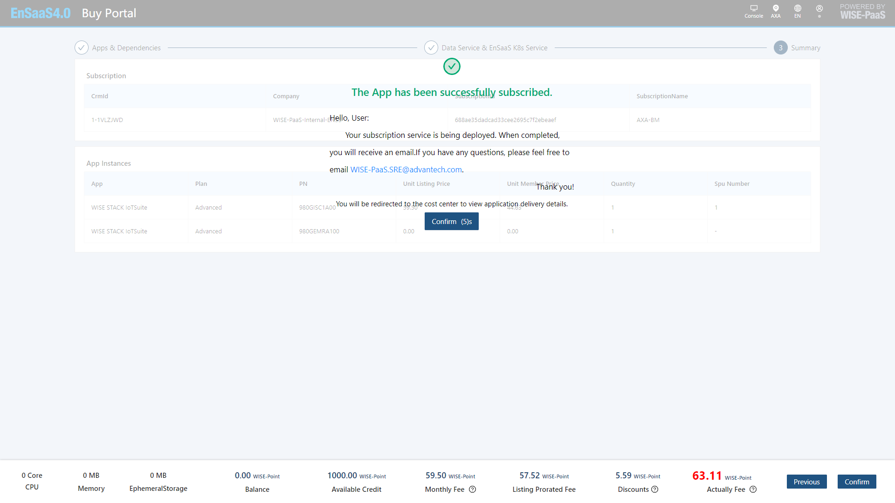
-  下单成功后进入订单系统
	> 查看订单状态，`Processinf`：正在处理；`Completed` ：下单完成   
	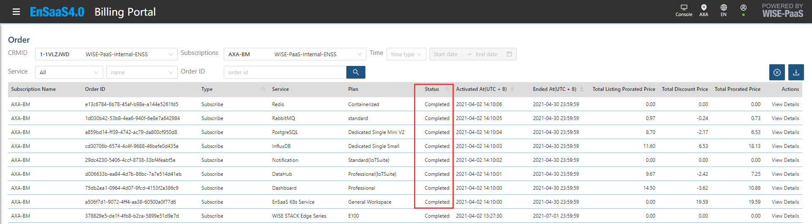
#### Step5: 在公有云license service portal 激活 service & package，激活后生成 LicenseFile
- 进入 license 页面
  

-  激活 service & package
	- 点击激活
	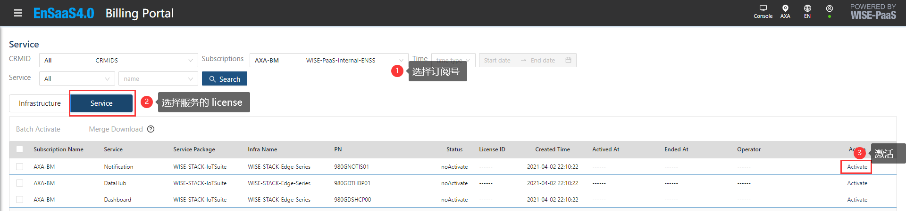
    - 输入 WorkSpace ID
	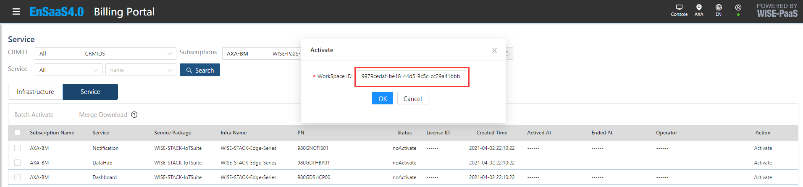
	- 下载 LicenseFile
	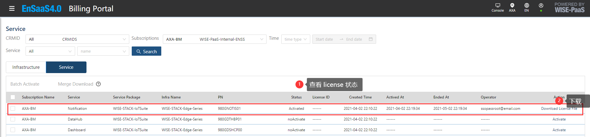
	
- 批量激活 service & package
  - 选择多个服务进行批量激活
    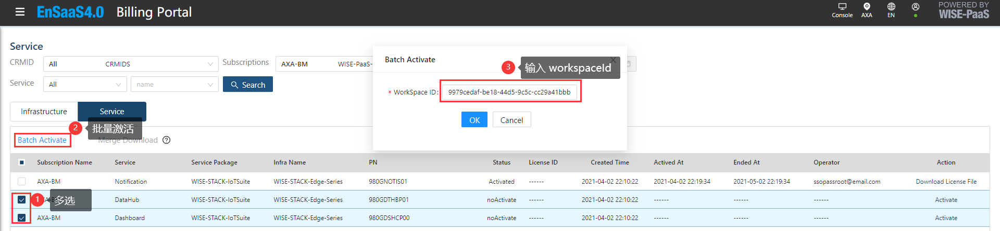
   - 输入 选择多个服务进行多个 LicenseFile 合并下载
      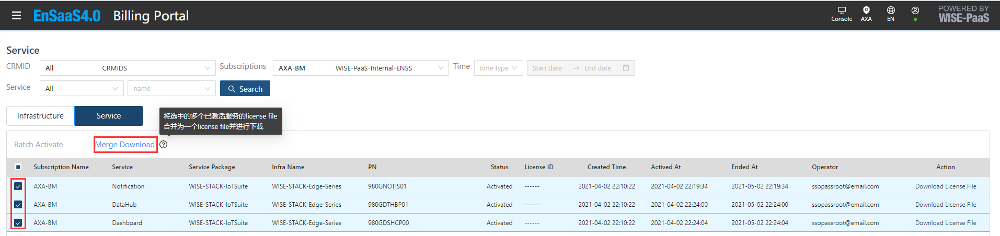
#### Step6: 在license agent portal中添加 License File 进行service & package 的离线激活
- 上传 LicenseFile
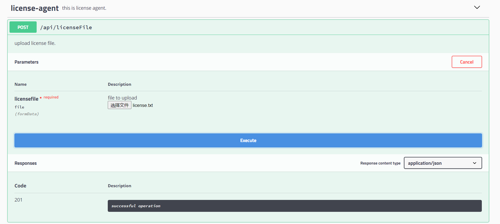


## 3. License 验证

> licese server 端和 agent 端提供相同的校验方式和RESTful API

| API                                                                       | 描述           |
| ------------------------------------------------------------------------- | ------------ |
| /v1/api/partNum/licenseQty                                                | 通过服务料号获取     |
| /v1/api/serviceName/ [serviceName]/serviceInstanceId/ [serviceInstanceId] | 通过服务名称获取     |
| /v1/api/licenses/serviceName/[serviceName]/username/[username]            | 通过用户名和服务名称获取 |

### 3.1. 通过服务料号获取  

- GET /v1/api/partNum/licenseQty
> pn：服务的料号
> id：服务 licenseid；由 `cluster` + `workspaceId` + `namespace` 组合而成
```bash
curl -X GET "http://api-licenseagent-ews.axa.wise-paas.com.cn/v1/api/partNum/licenseQty?pn=980GDSHCP00&id=ews123456sundi" -H "accept: application/json"
```
- Response body  
```
{
    "id": "ews123456sundi",
    "pn": "980GDSHCP00",
    "authcode": "cf45-0f71-0001",
    "number": 1,
    "isValidTransaction": true,
    "company": "WISE-PaaS-Internal-ENSS",
    "subscriptionId": "123",
    "datacenterCode": "axa"
}
```

### 3.2. 通过服务名称获取
- GET /v1/api/serviceName/ [serviceName]/serviceInstanceId/ [serviceInstanceId]
> serviceName：服务上架的名称
> serviceInstanceId：服务 licenseid；由 `cluster` + `workspaceId` + `namespace` 组合而成
```bash
curl -X GET "http://api-licenseagent-ews.axa.wise-paas.com.cn/v1/api/serviceName/Dashboard/serviceInstanceId/ews123456sundi?page=1&pageSize=10" -H "accept: application/json"
```
- Response body  
```
{
  "resources": [
    {
      "id": "ews123456sundi",
      "pn": "980GDSHCP00",
      "authcode": "cf45-0f71-0001",
      "number": 1,
      "isValidTransaction": true,
      "company": "WISE-PaaS-Internal-ENSS",
      "subscriptionId": "123",
      "datacenterCode": "axa"
    }
  ],
  "total": 1
}
```

