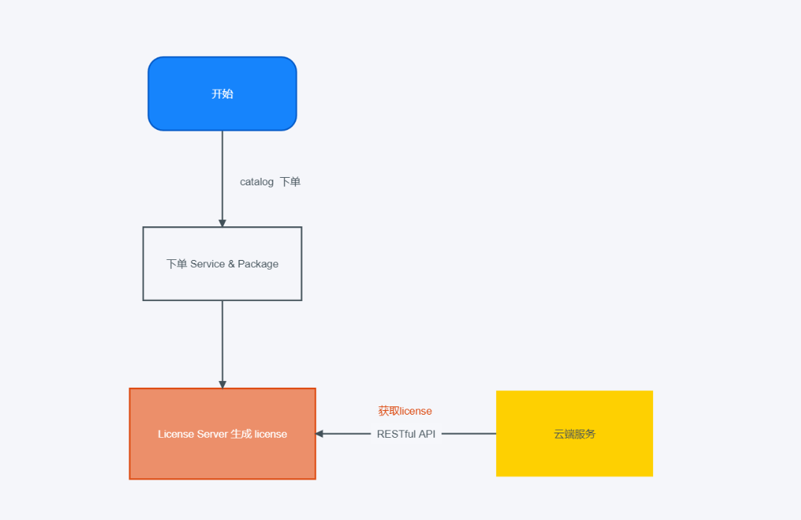
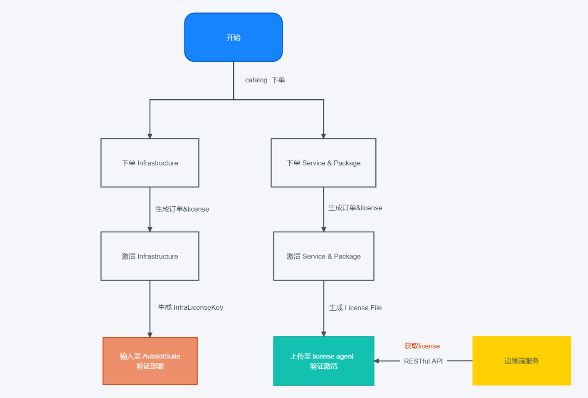
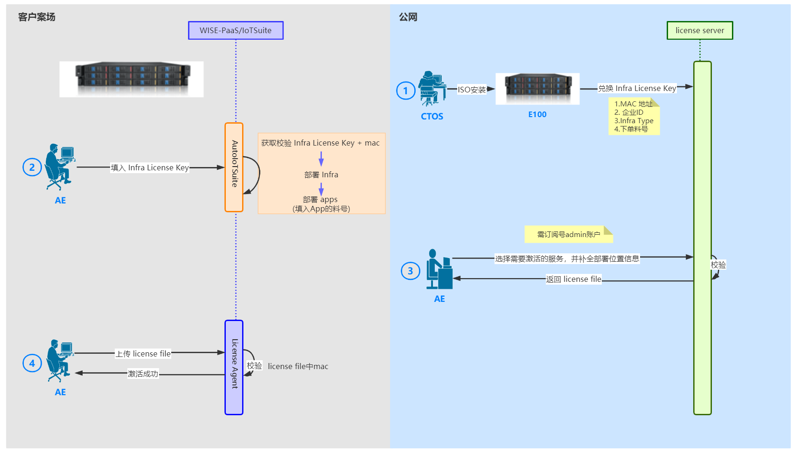

# License 手册

## 1. License 概述

License 为 WISE-PaaS 云服务提供有效的license以及期限，分为两部分，server端和agent端，server运行在云端，为云上服务生成和维护服务的license，agent端运行在边缘端，为边缘端服务提供license，agent端license是通过 server端激活生成后通过License File添加至agent端。server端和agent端提供相同的校验方式和RESTful API，兼容服务在云端和边缘端license的校验，服务不需要进行任何适配修改。  
主要功能特性：  

- 云端统一维护生成 license
- 多层加密校验，安全可靠：以加固的方式加密生成不可逆的 AuthCode
- 离线激活，不依赖网络环境
- 边缘端与固件绑定，安全校验
- 云边校验一致，应用自动适配
- 流程简单，安全可控  

## 2. 流程

### 2.1. 云服务

- Step1: 用户订购或更新服务后，Catalog生成订阅信息，通知各个buy生成服务实例，同时将订阅信息同步给License Server。
- Step2: License Server获得订阅信息后，生成license信息。
- Step3: 服务实例启动后通过API向License Server获取license。
- Step4: 服务实例获取到license后，拿自身信息根据规则与license中的信息对比，验证通过成功激活，反之，激活失败。

### 2.2. 边缘服务

- Step1: 在公有云catalog下单硬件对应的 Infrastructure （需要提前上架）
- Step2: 在公有云license service portal 激活Infrastructure，激活后生成 InfraLicenseKey
- Step3: 在AutoIotSuite 中将InfraLicenseKey 输入验证，通过后进行自动部署
- Step4: 在公有云catalog下单 service & package
- Step5: 在公有云license service portal 激活service & package，激活后生成 License File
- Step6: 在license agent portal中添加 License File 进行service & package 的离线激活

## 3. License 验证

> licese server 端和 agent 端提供相同的校验方式和RESTful API

| API                                                                       | 描述           |
| ------------------------------------------------------------------------- | ------------ |
| /v1/api/partNum/licenseQty                                                | 通过服务料号获取     |
| /v1/api/serviceName/ [serviceName]/serviceInstanceId/ [serviceInstanceId] | 通过服务名称获取     |
| /v1/api/licenses/serviceName/[serviceName]/username/[username]            | 通过用户名和服务名称获取 |
