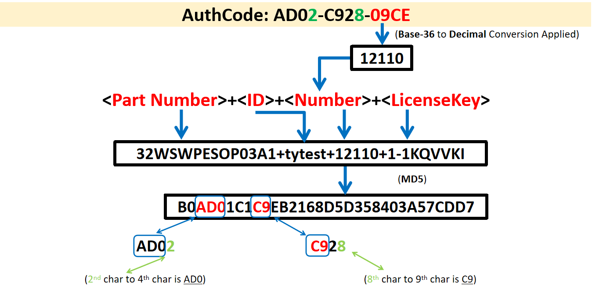

# License Server整合说明

License Server提供验证授权服务，通过整合License Server可以检查用户订阅的云服务实例规格，料号数量等信息，以便管理服务实例的授权。

##  验证步骤

下面是验证激活的流程图


Step1:  用户订阅服务后，Catalog产生订阅信息，将PN，serviceInstanceId和pnQuantity信息加密成licenseKey，通过message同步给License Server。

Step2: License Server拿到订单信息后，解码licenseKey，获取PN，serviceinstanceId，pnQuantity信息，生成authcode。

Step3:  服务实例ServiceInstance通过PN和serviceInstanceId向License Server 获取authcode进行激活。License Server查询到license信息后通过response向服务实例返回subscriptionId，authcode等信息，若未查询到license信息则会通过API向Catalog获取用户订阅信息，若获取到订阅信息会立即解码licensekey并生成authcode并通过response返回给服务实例。

Step4: 服务实例按照规则生成authcode，并与从License Server获取到的authcode进行比对，若一致则激活，反之，不一致则激活失败。


## 激活API

当APP需要验证激活时，可调用License Server提供的Api接口获取license info信息进行验证，License Server提供的接口及返回参数说明如下：

Method

```
GET /v1/api/partNum/licenseQty?pn=<string>&id=<string>
```

参数说明如下：

| Name | Value                                                        |
| ---- | ------------------------------------------------------------ |
| pn   | 服务上架时提供的服务料号，即PN                               |
| id   | 服务实例id，即serviceInstanceId。若为App，生成规则为clustername+workspaceId+namespaceName（不含+）；若为其他服务，则为订阅时由Managed Service生成。 |

返回参数json格式如下：

```
{
	"id": "<string>",
	"subscriptionId": "<string>",
	"isValidTransaction": <bool>,
	"number": <integer>,
	"authcode": "<string>",
	"activeInfo": "<string>"
}
```

参数说明如下：

| Name               | Value                                                     |
| ------------------ | --------------------------------------------------------- |
| id                 | 服务实例id，即serviceInstanceId                           |
| subscriptionId     | 订阅号id                                                  |
| isValidTransaction | 用户订阅状态，true=有效，false=无效，若为无效时，激活失败 |
| number             | 订阅的料号数量，即pnQuantity                              |
| authcode           | 激活码                                                    |
| activeInfo         | 服务上架时自定义的激活信息                                |

举例：

* Request Example:
  http://api-license-master.internal/v1/api/partNum/licenseQty?pn=9806WPAFS0&id=9ca0b70f-3357-11ea-beb1-76a42f50fd69

* Response Example:

  ```
  {
  	id: "9ca0b70f-3357-11ea-beb1-76a42f50fd69", //服务实例id
  	subscriptionId: "ff4fbd21-5962-4427-88a0-b8ef4ac9b393", //订阅号id
  	isValidTransaction: true,  //用户订阅状态，true=有效，false=无效
  	number: 120,   // 订阅的料号数量
  	authcode: "3080-e825-003c",  
  	activeInfo: ""  //服务上架时自定义的激活信息
  }
  
  ```


## AuthCode生成规则



1）   将Part Number（PN）、ID（serviceInstanceId ）、Number（pnQuantity）以及LicenseKey拼接成字符串，中间用+进行连接，记为str1，然后对str1进行MD5算法加密，记为str2。

注意： 在线验证时，LicenseKey为空。

2）  authcode分为前、中、后各四码，共12码组成，取后四码进行base64解码为10进制数，以上图为例，第四码为09ce，进行base64解码为10进制数可得到12110，即为Number的值。authcode前四码中的第四码指出由MD5产生的字串（str2）第几码开始，以上图为例，第四码为2，表示由MD5字串第二码开始取三码，MD5字串的位置起始为0，因为可以取得AD0,填入Authcode的前三码，因此可以得到第一部分的四码为AD02。中间四码的前两码同样由第四码决定，与前四码不同为，这里只取2码，第三码为任意值，同以上图为例，第四码为8，即为由MD5字串中第8码开始取2码填入，可以得到C9X8,其中X可以为任意值。后四码则是以10进制的数量进行base36的编码，得出的结果若不满四码，则于前面补0，以上图为例，数量为12110，进行base36编码后可得9CE，不足四码前面补0，因此可得出结果为09CE。

以上为authcode的生成规则，请参考。

此处提供验证authcode的方法，可参考此方法对authcode进行验证

```go
//validate authcode
func ValidateAuthcode(authcode string, partnum, spaceId, licenseKey string, number int) (bool, error) {
	ch1 := fmt.Sprintf("%s", authcode[0:4])
	ch1First := ch1[3:4]
	ch1Start := BHex2Num(ch1First, 10)

	ch2 := fmt.Sprintf("%s", authcode[5:9])
	ch2First := ch2[3:4]
	ch2Start := BHex2Num(ch2First, 10)
	str := fmt.Sprintf("%s+%s+%d+%s", partnum, spaceId, number, licenseKey)
	fmt.Println(str)
	md5StrEncode, err := Md5SumString(str)
	if err != nil {
		return false, err
	}

	ch1new := md5StrEncode[ch1Start : ch1Start+3]
	ch1new = ch1new + strconv.Itoa(ch1Start)

	ch2new := md5StrEncode[ch2Start : ch2Start+2]
	ch2new = ch2new + ch2[2:3] + strconv.Itoa(ch2Start)

	ch3new := Num2BHex(number, 36)
	ch3new = lpad(ch3new, 4, '0')

	authcodenew := fmt.Sprintf("%s-%s-%s", ch1new, ch2new, ch3new)

	if strings.EqualFold(authcode, authcodenew) {
		return true, nil
	} else {
		return false, nil
	}
}

func Num2BHex(number int, n int) string {
	if number < 36 {
		return num2char[number : number+1]
	}

	var merchant, remainder = number / n, number % n
	base36Encode := num2char[remainder : remainder+1]
	for {
		if merchant != 0 {
			merchant, remainder = merchant/n, merchant%n
			base36Encode = num2char[remainder:remainder+1] + base36Encode

		} else {
			return base36Encode
		}

	}
}

func lpad(str string, totallen int, char byte) string {
	length := len(str)
	if totallen < length {
		return str
	}
	result := str
	for i := 0; i < totallen-length; i++ {
		result = string(char) + result
	}
	return result

}
```
## 附录
### 相关术语说明

| Item                     | Description                    |
| ------------------------ | ------------------------------ |
| Part Number（PN）        | 服务料号                       |
| serviceInstanceId （ID） | 服务实例id                     |
| authcode                 | 激活码                         |
| subscriptionId           | 订阅号id                       |
| number                   | 即pnQuantity，服务料号订阅数量 |

