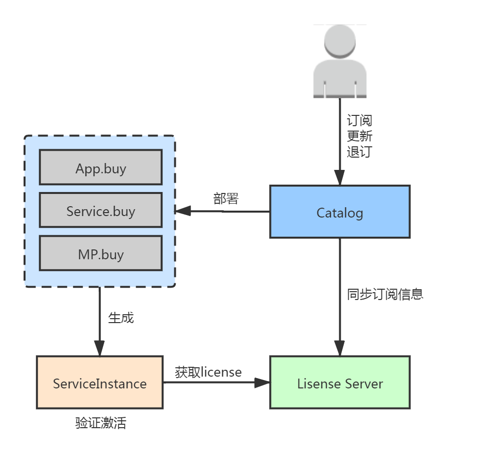

## 服务激活流程



Step1:  用户订购或更新服务后，Catalog生成订阅信息，通知各个buy生成服务实例，同时将订阅信息同步给License Server。

Step2:  License Server获得订阅信息后，生成license信息。

Step3:  服务实例启动后通过API向License Server获取license。

Step4:  服务实例获取到license后，拿自身信息根据规则与license中的信息对比，验证通过成功激活，反之，激活失败。

## API 概览

### 授权码获取接口

| API                                                          | 描述                   |
| ------------------------------------------------------------ | ---------------------- |
| /v1/api/partNum/licenseQty                                   | 通过服务料号获取授权码 |
| /v1/api/serviceName/ [serviceName]/serviceInstanceId/ [serviceInstanceId] | 通过服务名称获取授权码 |


## API 接口
### 授权码获取接口
#### 通过服务料号获取授权码

调用/v1/api/partNum/licenseQty可以通过服务料号（pn）和服务实例id（id）获取激活码

#### 请求参数

| 名称 | 类型   | 是否必选 | 示例                                                | 描述                                                         |
| ---- | ------ | -------- | --------------------------------------------------- | ------------------------------------------------------------ |
| pn   | Stirng | 是       | 9806WPDASH                                          | 服务上架时提供的服务料号，即PN                               |
| id   | String | 是       | eks00120a957f4-0bf9-4faf-90cd-694919cd4b68Dashboard | 服务实例id，即serviceInstanceId。若为App，生成规则为clustername+workspaceId+namespaceName（不含+）；若为其他服务，则为订阅时由Managed Service生成。 |

#### 返回数据

| 名称               | 类型    | 示例值                                              | 描述                                                      |
| ------------------ | ------- | --------------------------------------------------- | --------------------------------------------------------- |
| id                 | String  | eks00120a957f4-0bf9-4faf-90cd-694919cd4b68Dashboard | 服务实例id，即serviceInstanceId                           |
| subscriptionId     | String  | ff4fbd21-5962-4427-88a0-b8ef4ac9b393                | 订阅号id                                                  |
| isValidTransaction | Boolean | true                                                | 用户订阅状态，true=有效，false=无效，若为无效时，激活失败 |
| number             | Int     | 1                                                   | 订阅的料号数量，即pnQuantity                              |
| authcode           | String  | 3080-e825-003c                                      | 激活码                                                    |
| datacenterCode     | String  | sa                                                  | 数据中心编号，如sa，hz，je                                |
| activeInfo         | String  | “ ”                                                 | 服务上架时自定义的激活信息，保留项                        |
| company            | String  | Advantech                                           | 订阅号所属公司信息                                        |
| subscriptionType   | String  | paid                                                | 订阅类型（付费/试用），值为：paid/on trial                |

#### 示例

**请求示例**

```
http(s)://api.license.ensaas.en.internal/v1/api/partNum/licenseQty?pn=9806WPDASH&id=eks00120a957f4-0bf9-4faf-90cd-694919cd4b68Dashboard
```

**正常返回示例**

```
{
	id: "eks00120a957f4-0bf9-4faf-90cd-694919cd4b68Dashboard", //服务实例id
	subscriptionId: "ff4fbd21-5962-4427-88a0-b8ef4ac9b393", //订阅号id
	isValidTransaction: true,  //用户订阅状态，true=有效，false=无效
	number: 120,   // 订阅的料号数量
	authcode: "3080-e825-003c", //激活码
	datacenterCode："sa", //站点信息
	activeInfo: ""  //服务上架时自定义的激活信息
}
```

#### 返回码

| Http Code | 描述                                                         |
| --------- | ------------------------------------------------------------ |
| 200       | successful operation，返回的json数据格式如上Response Example中所述 |
| 204       | *no content*，未查询到lic信息                                |


#### 通过服务名称获取授权码

调用/v1/api/serviceName/<serviceName>/serviceInstanceId/<serviceInstanceId>可以通过服务名称（serviceName）和服务实例id（serviceInstanceId）获取激活码

#### 请求参数

| 名称              | 类型   | 是否必选 | 示例值                                            | 描述                               |
| ----------------- | ------ | -------- | ------------------------------------------------- | ---------------------------------- |
| serviceName       | String | 是       | Dashboard                                         | 服务上架时提供的服务名称           |
| serviceInstanceId | String | 是       | eks00145b957f4-0bf9-4faf-90cd-694200cd4b74Datahub | 服务实例id                         |
| page              | Int    | 否       | 1                                                 | 查询结果的第几页，默认是1          |
| pageSize          | Int    | 否       | 10                                                | 查询结果每页显示的结果数，默认是10 |

#### 返回数据

| 名称               | 类型    | 示例值                                        | 描述                                                      |
| ------------------ | ------- | --------------------------------------------- | --------------------------------------------------------- |
| total              | Int     | 3                                             | 查询到的激活码总数                                        |
| id                 | String  | eks00145b957f4-0bf9-4faf-90cd-694200cd4b74apm | 服务实例id，即serviceInstanceId                           |
| pn                 | String  | 9806WPDASH                                    | 服务上架时提供的服务料号，即PN                            |
| subscriptionId     | String  | 2e687325-2f50-43c8-b221-771ea517c40b          | 订阅号id                                                  |
| isValidTransaction | Boolean | true                                          | 用户订阅状态，true=有效，false=无效，若为无效时，激活失败 |
| number             | Int     | 1                                             | 订阅的料号数量，即pnQuantity                              |
| authcode           | String  | a7d7-7d48-0001                                | 激活码                                                    |
| datacenterCode     | String  | sa                                            | 数据中心编号，如sa，hz，je                                |
| activeInfo         | String  | “ ”                                           | 服务上架时自定义的激活信息，保留项                        |
| company            | String  | Advantech                                           | 订阅号所属公司信息                                        |
| subscriptionType   | String  | paid                                                | 订阅类型（付费/试用），值为：paid/on trial                |

#### 示例

**请求示例**

```
http(s)://api.license.ensaas.en.internal/v1/api/serviceName/APM/serviceInstanceId/eks00145b957f4-0bf9-4faf-90cd-694200cd4b74apm?page=1&pageSize=100
```

**正常返回示例**

```
{
    "total":2,
    "resources":[
        {
            "id":"eks00145b957f4-0bf9-4faf-90cd-694200cd4b74apm",
            "pn":"9806WPAPM1",
            "subscriptionId":"2e687325-2f50-43c8-b221-771ea517c40b",
            "datacenterCode":"sa",
            "isValidTransaction":true,
            "number":1,
            "authcode":"a7d7-7d48-0001",
            "activeInfo":""
        },
        {
            "id":"eks00145b957f4-0bf9-4faf-90cd-694200cd4b74apm",
            "pn":"9806WPAPM4",
            "subscriptionId":"2e687325-2f50-43c8-b221-771ea517c40b",
            "datacenterCode":"sa",
            "isValidTransaction":true,
            "number":1,
            "authcode":"c3b5-e711-0001",
            "activeInfo":""
        }
    ]
}
```
#### 返回码
| Http Code | 描述                                                  |
| ------------- | ------------------------------------------------------------ |
| 200           | *successful operation*，返回的json数据格式如上Response Example中所述。 |
