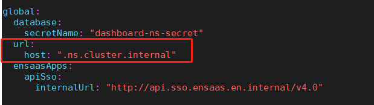
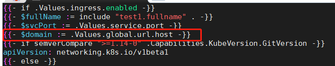
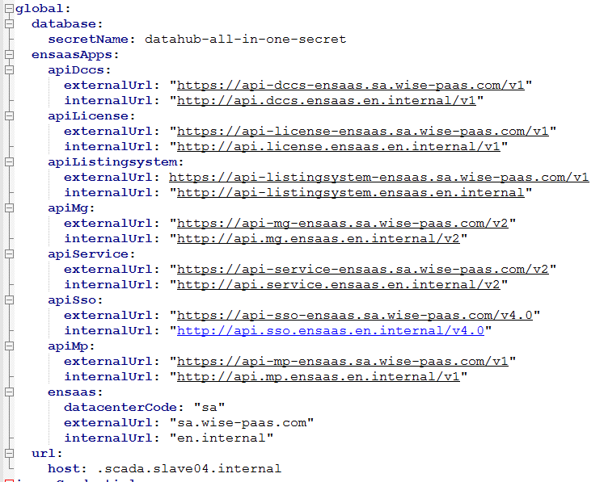
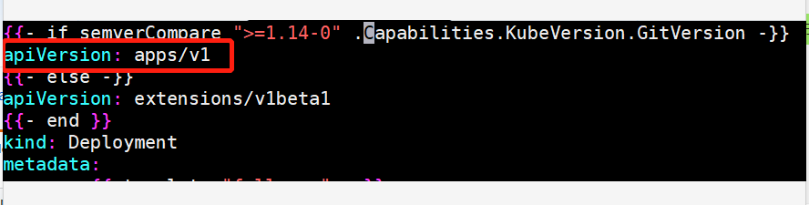
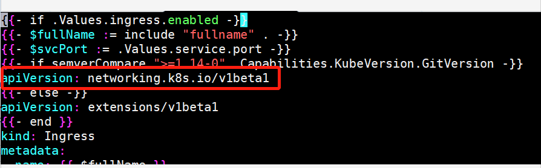
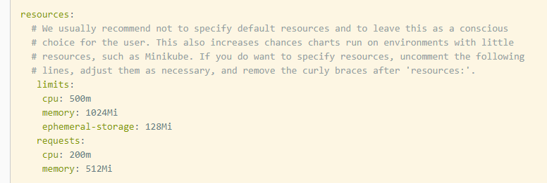

# 项目前瞻
appBuy是基于helm3的app生命周期管理应用。主要模块有app仓库管理（公有，私有，marketplace），app订阅、升配、升级、退订、删除管理等。在appBuy中，用户能够添加私有的app仓库进行app部署；也可以订阅我们EnSaaS提供的SRP solutions。

# Helm 范式
在appBuy中上架的helm chart必须满足如下要求：

* appBuy必要参数

	1. **global.database.secretName**

		此处的secretName为 $chartname-$ns-secret，如dashboard-ns1-secret
		
		在app上架到被订阅部署时，根据上架的信息，appbuy会自动为每个app生成一个db secret   信息（无论此app依赖多少db都只会生成一个secret）。在app的chart中需要获取这个secret的名称
		
		values.yaml
		
		
		
		template/deployment.yaml
		
		

	2. **global.url.host**

		此处的url.host为ingress的host后缀。例如：**.$ns.$cluster.internal**
		
		values.yaml
		
		
		
		 Ingress.enable上架时需要开启。
		
		Ingress.hosts[0].host只需写上该服务想要暴露的url前缀即可
		
		ingress.yaml
		
		
		
		
		
		先定义一个变量获取values.yaml中的url.host参数
		
		再修改ingress.hosts[0].host为拼接自定url前缀+平台覆盖url后缀
     
     3. **global.ensaasApps** 
     
          部署时，会在此处填入api-sso、api-mg、api-dccs、api-license、api-listingsystem、api-service等服务及ensaas的externalUrl和internalUrl。values.yaml中请按如下格式填写（部署时，会根据所要部署的站点，替换各个key对应的value）：  
	  
     4. **兼容k8s 1.14, 1.16的API**  
     
     	 	deployment.yaml按照如下方式改写：  
	   	   
	 		ingress.yaml按照如下方式改写：  
	   	   
	 		另外注意：image拉取策略须写为IfNotPresent  
	 
* 平台必要参数

	平台必须要在helm chart里定义sources，内容如下：
	
	
	
	 每个container必须定义配额，否则helm安装会失败，pod无法建立。
	
	 建议大家把resources.requests填写的尽可能的低，提高平台资源利用率。

