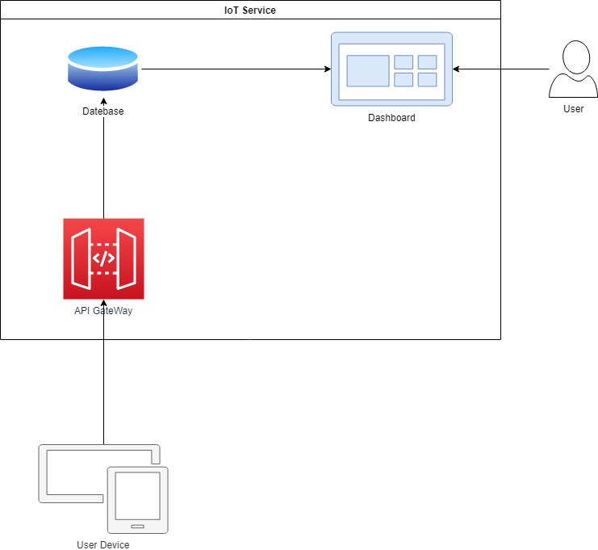

整合範例
=== 

情境
---
這裡將以下圖的IoT服務為例，來說明如何整合計量服務。



IoT服務提供以下功能，使用者可以將物端的資料，傳送至API Gateway，API Gateway收到此用量後，會將此筆用量寫入DB，使用者可以透過查詢介面來查詢已上傳的資料。

以下將一步一步說明如何將此IoT服務整合計量服務。

定義服務類型
---
IoT服務所關心的量測項目有以下三個：

- 使用者傳送到API Gateway的訊息數
- 資料所耗用的DB儲存空間
- 用量查詢次數

根據以上需求可以出服務的類型如下：

|名稱|值|
|---|---|
|pn|IoT|
|**Metric-1**||
|name|Messages|
|type|messages|
|unit|EA|
|**Metric-2**||
|name|Storage|
|type|storage|
|unit|MB|
|**Metric-3**||
|name|Tranaction|
|type|tranaction|
|unit|EA|

接下來根據量測值，來決定計算方式。

計算方式
---
首先，先看到使用者傳送至API Gateway的次數，此量測值可以藉由使用者每次呼叫API Gateway統計得來，因此將procedure設為NATIVE。

接著看到DB的儲存空間，DB的儲存空間可以透過DB的管理指令來取得，因此將procedure設為NATIVE。

最後Transaction也是透過DB管理指令取得，但取得的值是該DB由建立迄今的用量，並非是量測區間的用量，因此在傳送給計量服務前，必需先計算好差值，其procedure同樣設為NATIVE。

統計方式
---
接著來決定日、月用量的統計方式，API Gateway與Transaction皆是以總量來計算，因此將statistic設為SUM。

而Storage感趣的則是區間內的最大用量，因此將statistic設定為MAX。

服務類型至此皆已設定完成，IoT服務完整的服務類型如下表所示：

|名稱|值|
|---|---|
|pn|IoT|
|**Metric-1**||
|name|Messages|
|type|messages|
|unit|EA|
|procedure|NATIVE|
|statistic|SUM|
|**Metric-2**||
|name|Storage|
|type|storage|
|unit|MB|
|procedure|NATIVE|
|statistic|MAX|
|**Metric-3**||
|name|Tranaction|
|type|tranaction|
|unit|EA|
|procedure|NATIVE|
|statistic|SUM|

將上表整理成如下Json：

```
{
    "pn": "IoT",
    "metrics": [{
            "name": "Messages",
            "type": "messages",
            "unit": "EA",
            "procedure": "NATIVE",
            "statistic": "SUM"
        },{
            "name": "Storage",
            "type": "storage",
            "unit": "MB",
            "procedure": "NATIVE",
            "statistic": "MAX"
        },{
            "name": "Tranaction",
            "type": "tranaction",
            "unit": "EA",
            "procedure": "NATIVE",
            "statistic": "SUM"
        }
    ]
}
```

接著把此Json填入Listing System即完成服務類型的定義。

用量傳送
---
最後進行量測用量的傳送。

用量傳送的格定義如下：

```
{
"pn": "<string>",
"time": ms,
 "usages": [{
  "consumerId": "<string>",
  "measuredUsage": [{
   "measure": "<string>",
   "quantity": double
  }...]
 }]
}
```

假如於219/7/8 11:00量測到了10:55~11:00的用量，messages數為20、storage當前為10MB、Transaction為3000，則量測的內容如下表所示：

|欄位|說明      |
| ------- | ---- |
| time | 1562554500000 |
| pn | IoT |
| consumerId | fa78a46b-027c-4dd3-bd1a-4ab116c39e89 |
| measuredUsage |  |
| measure | messages |
| quantity | 20 |
| measure | storage |
| quantity | 10 |
| measure | transaction |
| quantity | 3000 |

其Json格式如下：

```
{
    "time":  1562554500000 ,
    "pn": "IoT",
    "usages": [{
            "consumerId": "fa78a46b-027c-4dd3-bd1a-4ab116c39e89",
            "measuredUsage": [{
                    "measure": "messages",
                    "quantity":  20
                }, {
                    "measure": "storage",
                    "quantity":  10
                }, {
                    "measure": "transaction",
                    "quantity":  3000
                }
            ]
        }
    ]
}
```

將此Json內容傳送至

```
POST /v2/collection/usages
```

## WISEPaaS 3.0 與 4.0 差異

相較於3.0，4.0的Request Json比照k8s，由原先的底線命名方式改為駝峰式的命名方式。

量測上由原先服務為單位改以料號為單位，並且取消了註冊程序。

量測的時間取消了start_time與end_time，改以單一time取代，並且將time移至外層，同一批量測的用量只需要帶一次時間即可。

|項目|3.0|4.0|
|---|---|---|
|Request Body Json命名方式|底線|駝峰式|
|註冊|需要|無|
|**用量**||
|End Point|/v1/collection/usagelist|/v2/collection/usages|
|時間|start_time, end_time|time|
|服務名稱|service_name|pn|
|服務類型|service_type|無|
