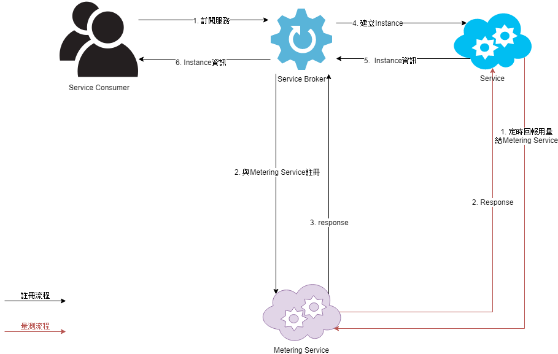

計量服務簡介
===

計量服務介紹  
---
計量服務提供即時、日、月用量的統計給服務提供者，用以統計該服務的用量，其架構圖如下所示：




服務類別
---
首次使用計量服務時，要先建立料號、量測項目與量測計算方式。  
服務需定義以下項目： 

| 名稱   | 說明     |
| ------ | -------- |
| pn     | 料號     |
| metric | 量測項目 |

量測項目需包含以下項目：

|名稱|說明|
| ---- | ---- |
|name|量測項目顯示於UI上的名稱|
|type|量測項目傳送給Metering Service的名稱|
|unit|顯示於UI上的單位名稱|
|procedure|計算方式，詳情請見[計算方式](#計算方式)|
|statistic|統計方式，詳情請見[統計方式](#統計方式)|

其Json格下如下：

```
{
    "pn": "<string>",
    "metrics": [{
            "name": "<string>",
            "type": "<string>",
            "unit": "<string>",
            "procedure": "<string>",
            "statistic": "<string>"
        }
    ]
}
```

完成後將此Json填入Listing System中即可。

####  計算方式


計量服務提供以下計算方式：

| 計算方式 | 說明         |
| -------- | ------------ |
| NATIVE   | 不做任何計算 |


#### 統計方式

計量服務提供日月用量的統計功能，根據量測特性，Metering Service提供以下三種統計方式：

| 統計方式 | 說明             |
| -------- | ---------------- |
| MAX      | 區間用量的最大值 |
|SUM|區間用量的加總|
|MEAN|平均值|

用量傳送
---
建立完Instance後，服務必需定時的將用量傳送給計量服務，其API如下：

```
POST /v2/collection/usages
```

其格式如下：

```
{
"pn": "<string>",
"time": ms,
 "usages": [{
  "consumerId": "<string>",
  "measuredUsage": [{
   "measure": "<string>",
   "quantity": double
  }...]
 }]
}
```

其欄位格式說明如下：

|欄位|說明      |
| ------- | ---- |
| time | EPOCH Time ms格式 |
| pn | 料號 |
| consumerId | Instance唯一的識別ID |
| measuredUsage | 量測的用量值 |
| measure | 量測值的名稱，對應到metric |
| quantity | 量測的用量 |