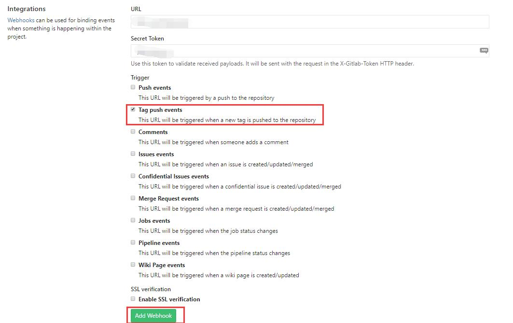
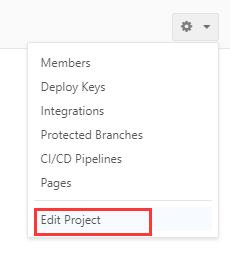
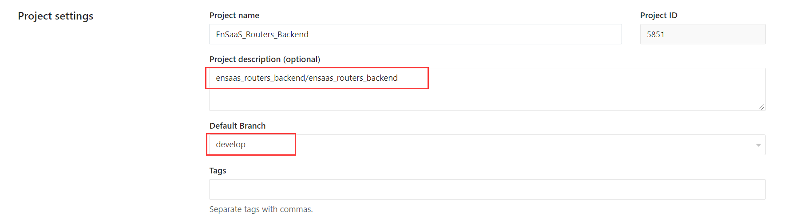
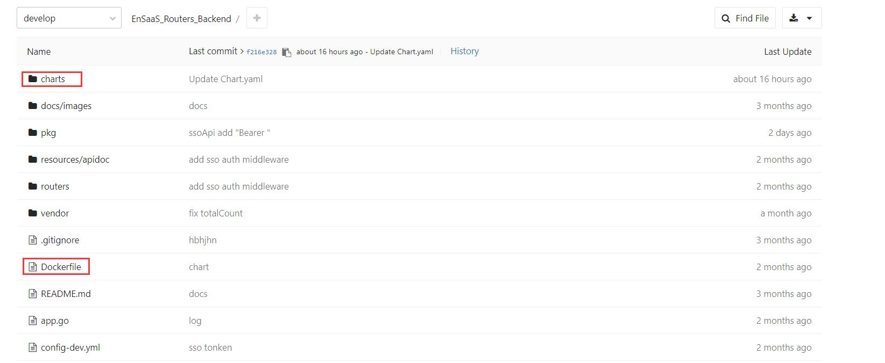
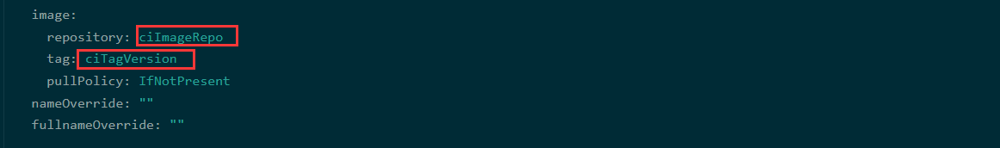
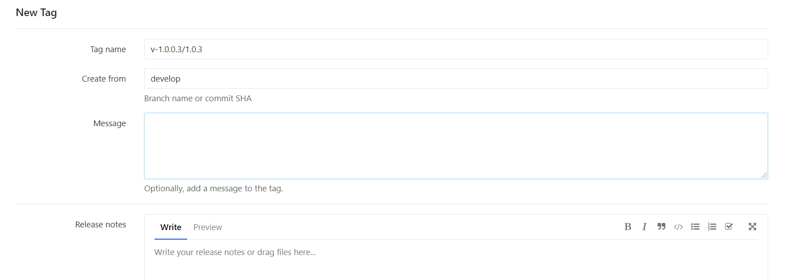

# gitlab ci 文档

## 痛点 
- image和chart打包麻烦出错, 浪费大量开发时间
- 版本混乱  
  > 相同image版本，代码却不一致  
  > chart 版本无法和image版本对应

## 1. 在 gitlab 项目中创建 webHook 触发器  
    settings --> integrations  
 - 配置 URL
 - 配置 Secret Token
 - 配置 Trigger   
 
    
  

## 2. 配置项目 default_branch  
    settings --> Edit Project   
- pipeline 会根据 default_branch 的分支进行构建   
- pipeline 会根据 description 的路去构建image ("/"之前为harbor的项目名称，"/"之后为image的名称)  
    
  
  
    
## 3. 项目规范  
- Dockerfile 放在项目根目录下
- helm chart 放在项目charts目录下  chart 的名称需要与上面 description 中image的名称保持一致
- helm chart 中的 Chart.yaml 中的 `appVersion`、`version` 的值设置为 `ciTagVersion`
- helm chart 中的values.yaml 中的 `image.repository` 的值设置为 `ciImageRepo`,`image.tag` 的值设置为 `ciTagVersion`

## 4. 触发 CI
    Create New Tag   
    Tag name 填写版本号(格式：v-1.0.0.3/1.0.3)  
    构建后的 image 使用"/"之前的版本号；  
    helm chart 使用"/"之后的版本号  helm chart 版本号必须符合 [SemVer 2]
    建议版本号为三位 如：1.0.3
[SemVer 2](https://semver.org/)      

