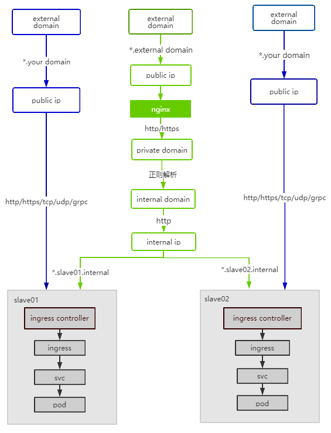

# 路由服务设计和整合说明   
  :clap: :fire:

- [x] 共享路由
- [x] 专属路由

## 整体转发图



## 1. 名称命名规范  
| **名称**   | **长度**   | **规则**   |
|:----:|:----:|:----:|
| clustername | <= 8字符 | 字母、数字，不允许其他字符 |
| workspace | <= 16字符 | 字母、数字，不允许其他字符 |
| namespacename  | <= 16字符 | 字母、数字，不允许其他字符 |
| appname | <= 24字符 | 字母、数字、"-" ，不允许其他字符 |

## 2. 整合路由
### 共享路由
路由规则：
- Internal Domain：`<appname>.<namespacename>.<clustername>.en.internal`
- Extenal Domain: `https://<appname>-<namespacename>-<clustername>.<externaldomain>`
  > 注意：<appname>字符串可包含 "-",<namespacename>字符串不能含有 "-"
  
### 专属路由
路由规则：
建议Dedicated Cluster的用户在正式运营场景中使用专属路由服务，EnSaaS 4.0 在 Dedicated Cluster 提供了Public IP，专属路由用户自行配置Domain和凭证(可用工具自签)

## 3. 查询 Intetnal Domain 方式：
### HTTP Request  
- SA 站点：
```
GET https://api-router-ensaas.sa.wise-paas.com/v1/routers/domain?serviceType=shared&networkType=internal
```
- HZ 站点：
```
GET https://api-router-ensaas.hz.wise-paas.com.cn/v1/routers/domain?serviceType=shared&networkType=internal
```
### HTTP Response
```
{
"data": [
{
"id": 1,
"domain": "en.internal",
"serviceType": "shared",
"networkType": "internal",
"createdAt": "2020-02-05T02:06:29.779442Z",
"updatedAt": "2020-02-21T03:30:52.497321Z"
}
],
"error": null,
"path": "/v1/routers/domain?serviceType=shared&networkType=internal",
"status": 200,
"timestamp": "2020-03-23T06:52:00Z",
"totalCount": 1
}
```
## 4. 查询 External Domain 方式：
### HTTP Request  
- SA 站点：
```
GET https://api-router-ensaas.sa.wise-paas.com/v1/routers/domain?serviceType=shared&networkType=external
```
- HZ 站点：
```
GET https://api-router-ensaas.hz.wise-paas.com.cn/v1/routers/domain?serviceType=shared&networkType=external
```
### HTTP Response
```
{
"data": [
{
"id": 2,
"domain": "sa.wise-paas.com",
"serviceType": "shared",
"networkType": "external",
"createdAt": "2020-02-05T02:06:56.648898Z",
"updatedAt": "2020-02-05T02:06:56.648898Z"
}
],
"error": null,
"path": "/v1/routers/domain?serviceType=shared&networkType=external",
"status": 200,
"timestamp": "2020-03-23T06:56:17Z",
"totalCount": 1
}
```
## 5. 查询 Internal Domain 的 Extenal Domain：
### HTTP Request  
- SA 站点：
```
GET https://api-router-ensaas.sa.wise-paas.com/v1/routers/domain/<your internal domain>/external
```
- HZ 站点：
```
GET https://api-router-ensaas.hz.wise-paas.com.cn/v1/routers/domain/<your internal domain>/external
```
### HTTP Response
```
{
"data": "api-router-ensaas.sa.wise-paas.com",
"error": null,
"path": "/v1/routers/domain/api.router.ensaas.en.internal/external",
"status": 200,
"timestamp": "2020-03-23T06:59:00Z",
"totalCount": 0
}
```


