# Service Portal 简介 #

Service Portal 简介

# 导航栏 #
 - **左侧菜单栏开关**  
 通过点击下图中的按钮（1）可实现左侧菜单栏的展开与收起；也可通过点击左侧菜单栏以外的区域来收起左侧菜单栏。
   
 - **Wise-Paas图标（2）**  
 点击此图标可打开Service Catalog。
 
 - **订阅号下拉选框（3）**  
 可用来选择需要查看的订阅号。
 
 - **Management Portal 图标（4）**  
 点击此图标可打开Management Portal。
 
 - **帮助（5）**  
 点击文档可打开WISE-PaaS 文档网站，可以帮助您寻找用户指南、开发者指南、API文件及相关资源
 
 - **工单（6）**  
 如果您遇到技术支持问题，可以发送邮件寻求帮助。
 
 - **站点（7）**  
 显示当前所在站点。

 - **多语言（8）**  
 支持简体中文、正體中文和English三种语言的切换。
 
 - **用户（9）**   
 点击用户中心可打开SSO；点击退出登录可退出Service Portal返回至登录页面。

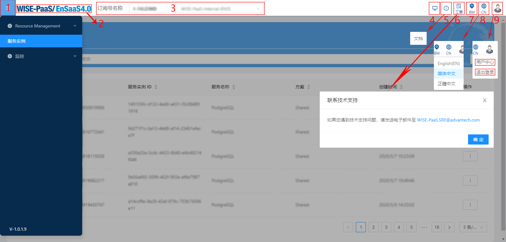    
图1 - 导航栏

# 服务实例页面 #
用户可以管理订阅中的服务。

## 基本功能 ##

 - **服务（1）**  
 可选择需要查看的服务。
 
 - **搜索（2）**  
 可根据实例名称搜索需要查看的实例。
 
 - **建立专用实例（3）**  
 点击此按钮来打开建立专用实例模态框，完成新建动作。
 
 - **列表排序**  
 通过点击带有排序图标（4）的表头，实现升序排序，降序排序和取消排序功能。
 
 - **操作实例**  
 通过点击操作按钮（5）展开操作下拉列表。
 
   - **密钥管理（6）**  
   点击跳转至密钥管理页面。

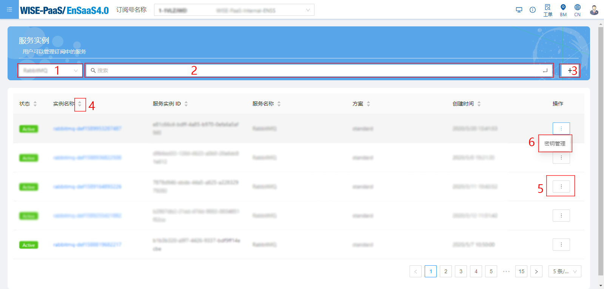  
图2 - 服务实例页面

## 建立专用实例 ##
 
 - **必填项**  
 所有标*的项目均为必填。

 - **ServiceInstanceID**  
 点击自动生成会自动生成一组ServiceInstanceID。  
 仅允许 [0-9a-f-]，格式为xxxxxxxx-xxxx-xxxx-xxxx-xxxxxxxxxxxx。
 
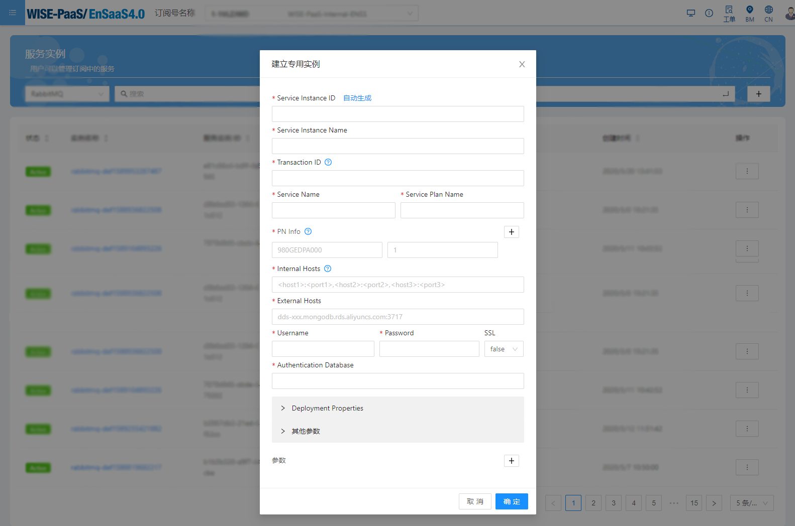  
图3 - 建立专用实例页面

# 密钥管理页面 #
管理连线至服务需要的密钥。

## 基本功能 ##

 - **左侧菜单栏（1）**  
 切换密钥列表和服务密钥列表。
 
 - **左侧菜单开关（2）**  
 点击收起或展开左侧菜单栏。
 
 - **返回服务实例页面（3）**    
 点击返回服务实例列表页面。
 
 - **服务实例（4）**  
 显示该服务实例的名称、服务名称和方案。
 
 - **搜索（5）**  
 可根据密钥名称搜索需要查看的密钥。
 
 - **添加密钥/服务密钥按钮（6）**  
 点击此按钮来打开新建密钥/服务密钥模态框，完成新建动作。
 
 - **列表排序**  
 通过点击带有排序图标（7）的表头，实现升序排序，降序排序和取消排序功能。
 
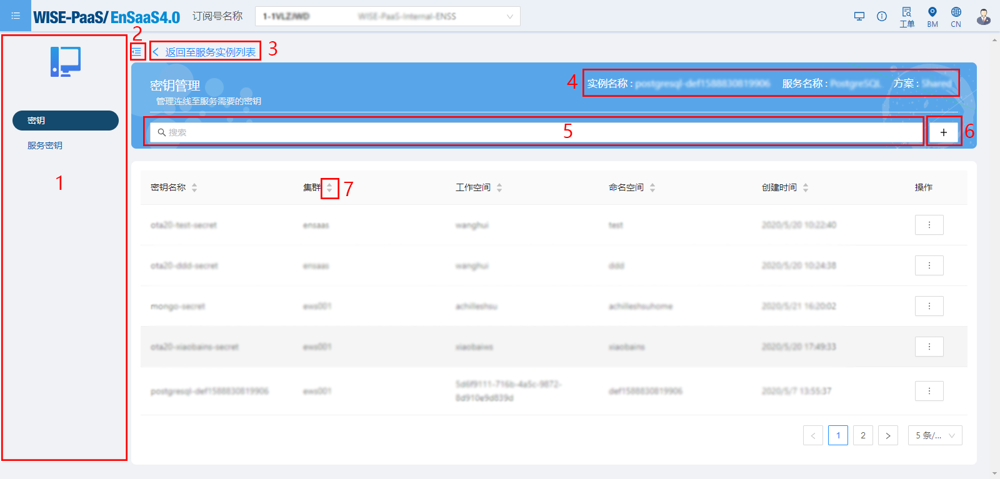  
图4 - 密钥管理页面

## 密钥页面 ##
您可以添加新的密钥，查看密钥列表，也可以操作某一个密钥。  
操作：查看（1）、重建（2）和删除（3）。  
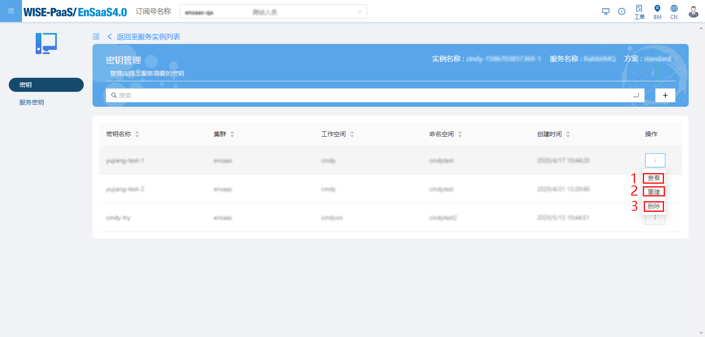  
图5 - 密钥页面

### 新建密钥 ### 
 
 - **必填项**  
 所有标*的项目均为必填
    
 - **参数**  
 参数为非必填项；可以点击添加按钮（1）添加一组参数；也可点击删除按钮（2）删除一组参数。  
 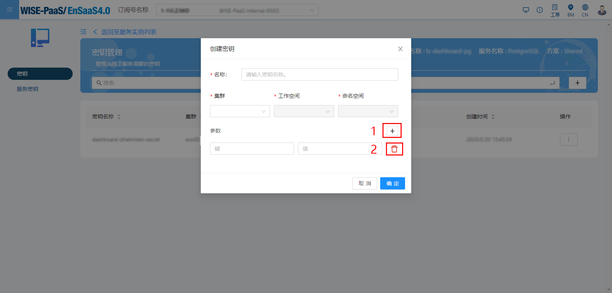  
 图6 - 新建密钥-1
   
 - **其他参数**  
 当服务名称为RabbitMQ，您可以选择是否填写其他参数项。  
   
 - **Vhost名称**   
 当服务名称为RabbitMQ，且服务方案不为standard时, 您可以选择是否填写Vhost名称项。  
 此项为下拉选框，您可以搜索下拉选项的中需要的选项，也可以输入其它名称。  
 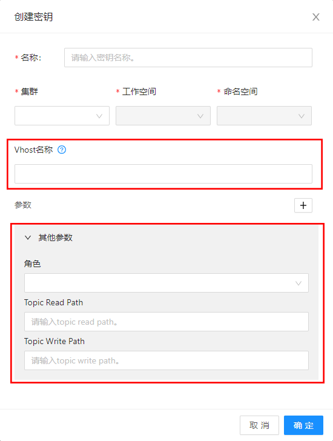  
 图7 - 新建密钥-2
   
 - **数据库名称**  
 当服务名称为MongoDB、PostgreSQL和InfluxDB且服务方案不为shared时，您可以选择是否填写数据库名称项。  
 此项为下拉选框，您可以搜索下拉选项的中需要的选项，也可以输入其他名称。  
 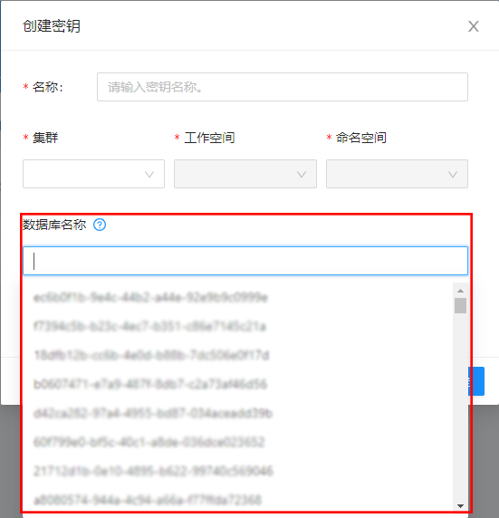  
 图8 - 新建密钥-3
 
### 查看 ###  
 您可以查看某一个密钥的证书和参数。  
 我们还为您提供了复制功能，点击复制图标（1）可以完成复制。  
 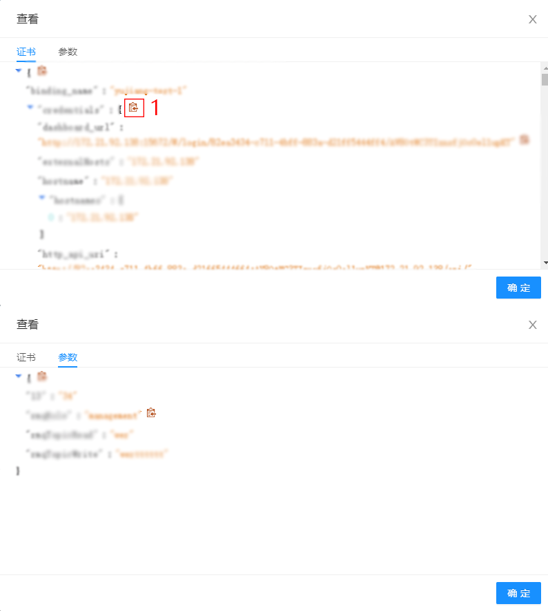  
 图9 - 查看
   
### 重建 ###  
 此操作将会在指定的命名空间中建立名为密钥 (Secret)，若命名空间中已经存在同名的密钥，将会被覆盖。  
 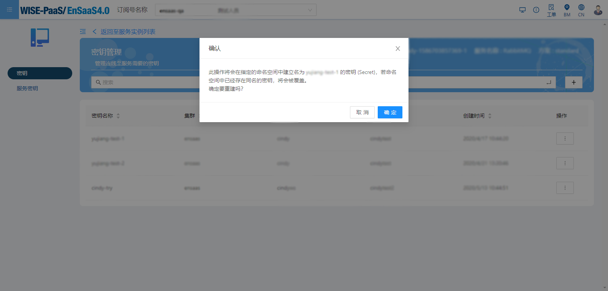  
 图10 - 重建
 
### 删除 ###
 此操作会删除所当前操作的密钥，删除后无法恢复。   
 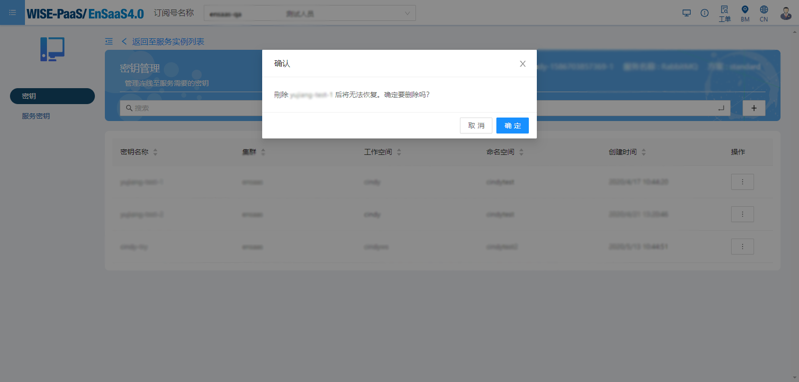  
 图11 - 查看

## 服务密钥页面 ##
您可以添加新的服务密钥，查看服务密钥列表，也可以操作某一个服务密钥。  
操作：查看（）、编辑、停用、启用和删除。   
 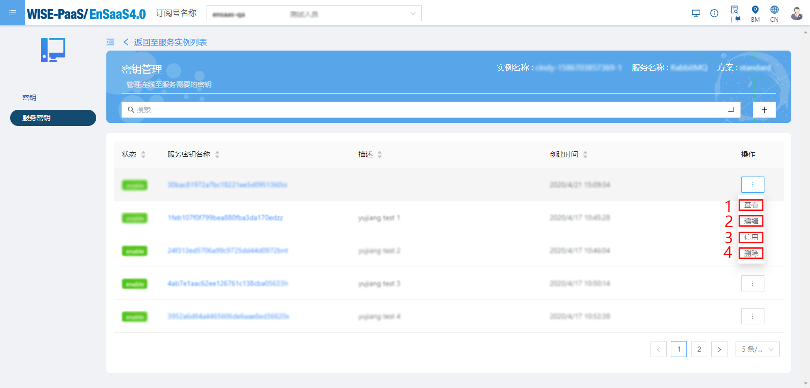  
 图12 - 服务密钥

### 新建服务密钥 ###
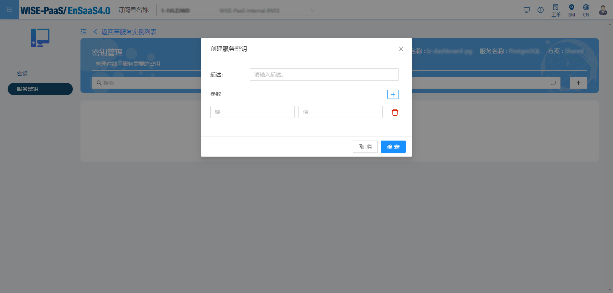  
图13 - 新建服务密钥-1

 - **其他参数**  
 当服务名称为RabbitMQ，您可以选择是否填写其他参数项。  
   
 - **Vhost名称**   
 当服务名称为RabbitMQ，且服务方案不为standard时, 您可以选择是否填写Vhost名称项。此项为下拉选框，您可以搜索下拉选项的中需要的选项，也可以输入其它名称。  
 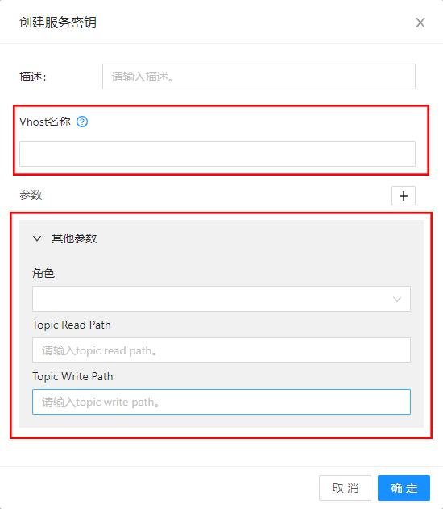  
 图14 - 新建服务密钥-2
   
 - **数据库名称**  
 当服务名称为MongoDB、PostgreSQL和InfluxDB且服务方案不为shared时，您可以选择是否填写数据库名称项。  
 此项为下拉选框，您可以搜索下拉选项的中需要的选项，也可以输入其他名称。  
 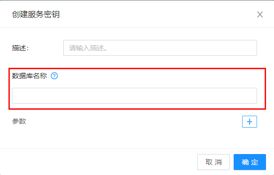  
 图15 - 新建服务密钥-3
 
### 查看 ###  
您可以查看某一个密钥的证书和参数。  
我们还为您提供了复制功能，点击复制图标（1）可以完成复制。  
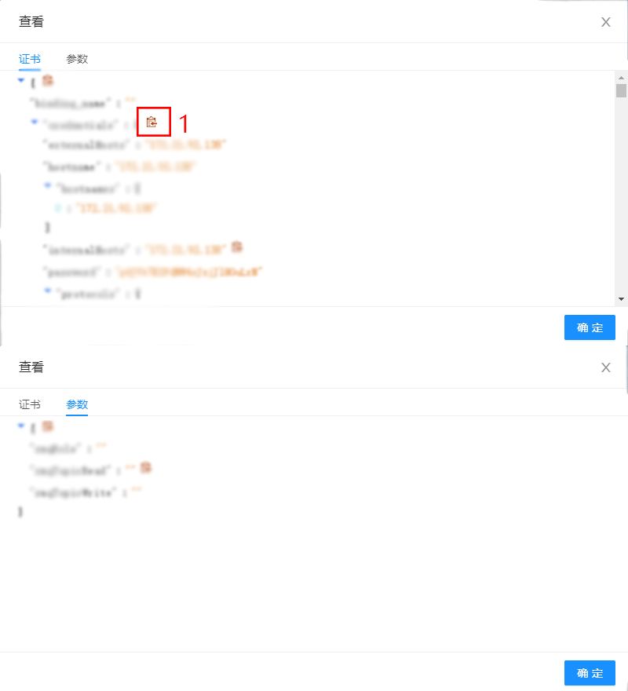  
图16 - 查看

### 编辑 ###
您可以通过编辑来修改某一服务密钥的描述。  
修改描述时，该项为必填项。  
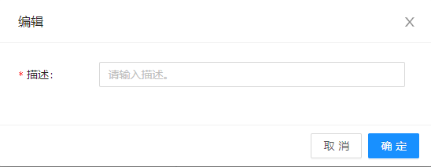  
图17 - 编辑

### 停用/启用 ###

### 删除 ###
此操作会删除当前所操作的服务密钥，删除后无法恢复。    
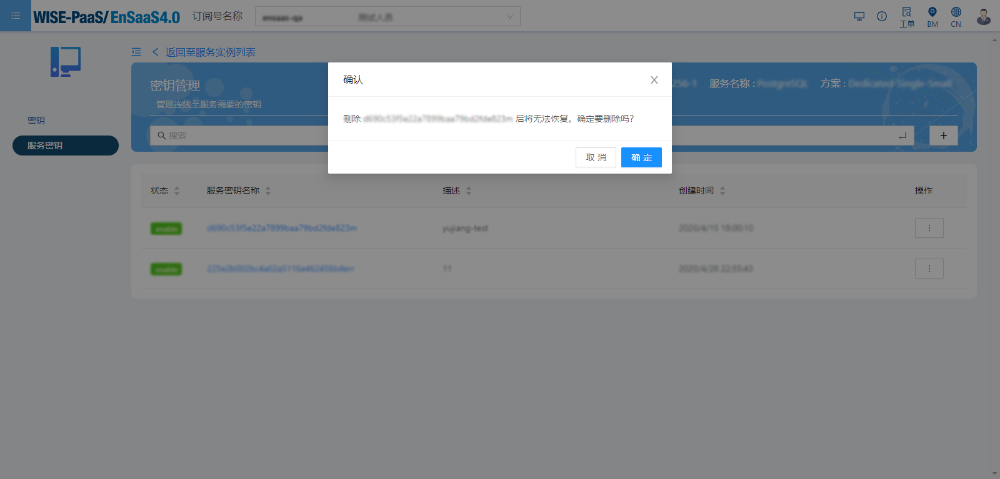  
图18 - 删除

# 服务用量 #  
您可以通过选择不同的订阅号、服务、实例或料号来查看其所对应的Dashboard   
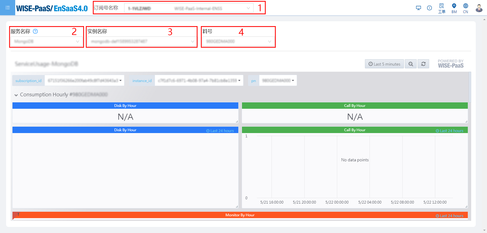  
图19 - 服务用量

